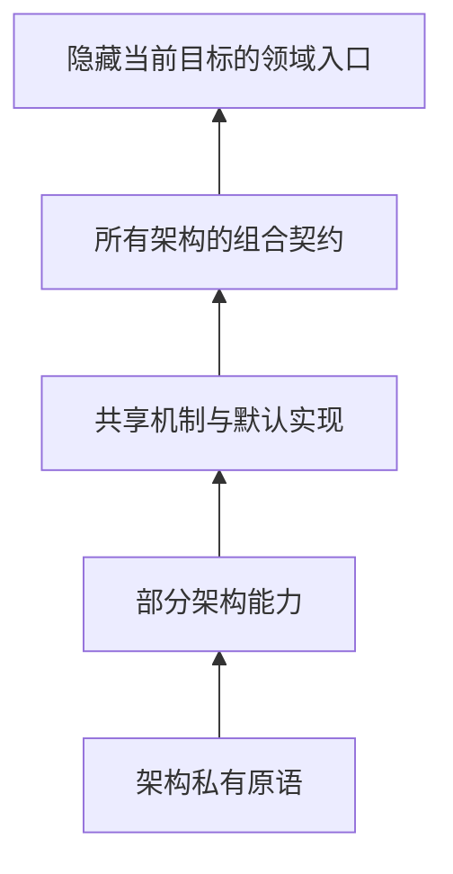

# 多架构分层抽象

本技能使用“分层共同性上提模式”收敛多架构设计。该模式从现有调用语义和真实实现归纳共同性，逐层提取可复用机制，同时让寄存器、页表、陷阱、中断控制器、固件和 ABI 等真实差异继续由对应架构拥有。

## 1. 适用方式

任务涉及两个或更多架构的共同机制、能力子集、目标后端选择或分层重构时使用本技能。如果任务只修改一个架构的具体实现，且不改变跨架构边界，继续使用对应领域技能，不为将来可能的复用提前加入本模式。

本技能只负责共同性、可变性与架构选择边界。下列语义出现时还要读取对应技能：

- 所有 Rust 实现、重构和审查：`rust-code-quality`；
- 公共或共享 trait、类型、软件包、模块、依赖或条件编译边界：`rust-api-design`；
- 新增或扩展架构、平台、硬件能力或高风险机制：`feature-development`；
- 启动、陷阱、页表、对称多处理、固件、目标描述和 QEMU 路径：`arch-platform-porting`；
- 可移植驱动核心、能力层、操作系统适配、内存映射输入输出、直接内存访问或中断：`cross-kernel-driver`；
- 锁、原子操作、中断上下文、跨核通知或共享生命周期：`rust-concurrency-safety`；
- `unsafe`、裸指针、ABI、外部函数接口、目标指令、内存映射输入输出或直接内存访问：`rust-unsafe-safety`；
- 测试必要性、层级、多目标验证与确定性回归：`test-quality`。

用户要求方法论、书籍或论文依据，或需要比较 Linux、Rust 标准库等先例时，完整阅读[方法依据与项目先例](references/evidence.md)。涉及 AxVM 的设计、重构或审查时，还要完整阅读[分层能力接口设计](../../../docs/design/axvm-capability-layering.md)。

## 2. 事实矩阵

抽象前先遍历每个受影响架构的真实调用链。矩阵的作用是区分“语义相同”、“只有实现相似”和“完全不同”，不是为文件目录或函数名称寻找对称形状。

| 证据维度 | 必须核对的事实 |
| --- | --- |
| 消费者 | 谁调用该动作，为什么需要它，哪个层级应当知道它 |
| 领域语义 | 前置条件、成功结果、失败、“不支持”与无动作的真实含义 |
| 所有权 | 状态由谁建立、修改、回滚和销毁，能否跨处理器或中断边界 |
| 顺序与并发 | 内存顺序、中断状态、可抢占性、阻塞规则和生命周期顺序 |
| 数据与 ABI | 寄存器、页表、陷阱帧、中断编码、固件对象和调用约定是否真正等价 |
| 已有共同性 | 是共同算法、共同原语、共同接口，还是仅有重复拼写 |
| 构建选择 | 目标架构、功能开关、依赖和模块在什么位置被互斥选中 |

当函数名和参数形状相同，但错误、状态所有权、安全前置条件或调用顺序不同时，继续当作不同能力。结论重要时给出源码路径、符号和行号，不用类型名或寄存器布局替代完整语义核对。

## 3. 分层共同性

共同性从架构私有原语向上归纳，不从预先设计的顶层大接口向下填空。五层是放置判断，不要机械地建立五个模块或五个 trait。



架构子集可能交叉，因此概念上是能力格，不是必须用 trait 继承表达的单根分类树。代码中优先使用少量正交能力和组合契约，避免为每个架构组合建立新 trait。

### 3.1 私有与部分能力

架构私有原语直接保留硬件和 ABI 语义。寄存器访问、陷阱帧、页表层级、中断控制器和固件传输机制没有稳定共同语义时，不向上层暴露伪统一操作。

只有部分架构拥有、但可以用领域名称准确描述的能力，使用独立窄 trait 表达。没有该能力的架构不提供空实现或恒定返回“不支持”的伪实现；只有“不需要执行任何动作”本身就满足契约时，空默认方法才是合法语义。

### 3.2 共享与组合契约

两个或更多源码实现已经具有相同算法且契约一致时，把算法上提到共享辅助函数或 trait 默认方法，底层只保留必要原语。不需要通过泛型消费的纯算法优先使用辅助函数，不为了复用一段代码而制造能力 trait。

所有受支持架构最终满足一个组合契约，但该契约应组合按职责分开的基础 trait，不把全部方法重新声明为过宽的“架构大 trait”。上层领域入口依赖这个组合契约或当前目标别名，不向调用方暴露架构目录、后端注册表或目标名称判断。

## 4. 抽象门禁

新建或扩大 trait 前必须通过消费者、多实现、契约与选择方式门禁。没有通过时保持具体类型、固有方法或模块自由函数，不以“可能有新架构”为理由预留方法、参数和状态。

### 4.1 trait 成立条件

trait 必须有当前通用消费者，或者用于约束由条件编译选中的多个源码后端。“全仓只有一个实现和一个消费者”不足以建立 trait；“每次构建只编译一个当前后端”则是多架构静态绑定的预期结果，两者不能混淆。

方法必须命名稳定的领域能力，并来自现有调用所需的最小表面。架构特异类型使用关联类型传递；不为获得形状一致而把虚拟处理器、页表、退出原因、固件对象或中断标识压成无类型整数或跨架构大枚举。

仅供软件包内部后端实现的 trait 默认保持私有；需要在公共接口中暴露、但不允许下游增加实现时使用 sealed trait。只有真实需要第三方实现时才开放 trait，并同步设计版本兼容性。

### 4.2 默认与覆盖

默认方法是已有共同算法的唯一实现来源，不是对未来架构的猜测。上提前核对所有实现的前置条件、可观察结果、错误、内存顺序和生命周期；只有这些契约一致时才提取默认实现。

架构覆盖只用于硬件语义、状态所有权、调用顺序、内存顺序或有实际价值的目标优化。覆盖的注释或设计说明应记录差异原因，并用共同契约测试核对结果；优化覆盖不得弱化错误、安全、顺序或资源回收语义。同一架构内的处理器功能检测是另一层可变性，不与 `target_arch` 后端选择混合。

## 5. 编译期装配

目标架构在构建时已经确定，因此架构后端使用泛型、关联类型和单态化静态分派。没有运行时替换、异构集合或代码体积约束时，不引入 `dyn Trait`、虚表、后端注册表或架构枚举分派。

Rust 1.95 已稳定 `cfg_select!`，仓库锁定的 `nightly-2026-09-04` 可以在 `no_std` 代码中直接使用，不需要 `#![feature(cfg_select)]`。当装配点需要从一组候选中只发出一个后端时，优先用它表达编译期 `match`：

```rust
cfg_select! {
    target_arch = "aarch64" => {
        mod aarch64;
        pub(crate) use aarch64::Arch as CurrentArch;
    }
    target_arch = "riscv64" => {
        mod riscv64;
        pub(crate) use riscv64::Arch as CurrentArch;
    }
    target_arch = "loongarch64" => {
        mod loongarch64;
        pub(crate) use loongarch64::Arch as CurrentArch;
    }
    target_arch = "x86_64" => {
        mod x86_64;
        pub(crate) use x86_64::Arch as CurrentArch;
    }
}
```

`cfg_select!` 按书写顺序只发出第一个为真的分支。`target_arch` 值天然互斥，适合上述写法；功能开关等谓词可能同时成立时，只有优先级本身就是设计语义才依赖分支顺序，否则应增加显式重叠检查或改用互斥谓词。架构集合封闭时省略 `_`，让无匹配目标直接产生编译错误；只有 `_` 确实代表合法后端或回退语义时才提供通配分支。

条件编译应集中在构建产物物理组成的边界：

- 用 `cfg_select!` 选择唯一模块、类型或表达式后端；独立能力可以并存、需要附着属性或工具链最低版本早于 Rust 1.95 时，继续使用 `#[cfg(...)]`；
- 在一个“当前目标”命名空间导出 `CurrentArch` 及必要关联类型，并用编译期约束确认它满足顶层契约；
- 目标专有寄存器、指令、页表和依赖只在对应模块中进入编译；
- 不用 `if cfg!(...)` 包裹其他目标根本无法通过类型检查的代码；`cfg!` 只产生布尔值，不会移除未选分支；
- 软件包宣称架构集合封闭时，对遗漏、可能重叠或不支持目标提供清晰的编译失败；
- 领域调用方只看到虚拟机、启动、设备、时钟或中断等领域动作，不传入架构名称并不穿透访问当前后端。

当不同架构的对象模型、安全条件或成本模型不能形成可守住的公共语义时，保留显式架构专用入口。“所有架构都有接口”的目标只适用于确实共同的上层领域契约，不要向下压平不等价的机器操作。

## 6. 重构顺序

重构以保持可观察行为为前提，每次只上提一层共同机制。不先建立完整 trait 体系再迫使现有实现填入，也不用一次性大量移动文件掩盖语义改变。

1. 固定现有行为、公共调用、失败语义、目标组合和真实验证基线。
2. 建立事实矩阵，把共同算法、共同能力、架构私有操作与表面重复分开。
3. 先移动无关架构的纯计算、状态机或共同调用骨架，让它依赖最小原语。
4. 只在通用消费者或多源码后端需要约束时建立窄 trait，再把已证实的共同算法放入默认方法。
5. 在单一装配点绑定当前后端，删除消费者中的架构名称判断、旧转发和重复实现。
6. 验证受影响的每个目标，并用真实运行环境覆盖只有目标执行才能证明的硬件语义。
7. 再查找上一层共同性；如果前置条件、结果、所有权或错误已不一致，在当前层停止。

每一步都应保持可审查和可验证。涉及错误修复时仍遵守项目的确定性红绿回归要求；行为保持型重构则先用现有契约和真实多目标路径固定基线，不为形式完整新增没有缺陷敏感度的测试。

## 7. 输出与验证

设计、重构计划或审查结论必须让实现者知道哪些内容要上提、哪些差异要保留、目标如何选择以及怎样证明语义未被压平。至少交付下列内容：

- 带源码锚点的共同性与可变性矩阵；
- 五层放置关系或等价的能力格说明；
- 最小 trait、关联类型、默认方法和组合契约草案；
- 唯一编译期选择点及每个目标选中的具体后端；
- 特意保留的架构差异、拒绝抽象的理由和停止上提的层级；
- 按层迁移、删除旧路径和受影响调用方的顺序；
- 覆盖所有受支持目标、纯共同机制和真实硬件语义的验证矩阵。

纯计算、解析、状态机和默认算法使用最小充分的宿主测试；可以用记录型假后端核对默认方法与覆盖的公共契约，但不声称这已经证明寄存器、中断、缓存、页表或多处理器行为。每个被选后端至少通过项目任务工具的目标编译门禁，硬件或完整运行期语义使用对应 QEMU 或板卡路径。不读取源码文本并搜索关键字来证明类型或能力边界。

## 8. 审查信号

审查时应把过度抽象、边界泄漏和伪共同性作为架构问题，不被代码行数减少或目录对称所说服。下表给出可直接触发追问的信号。

| 现象 | 审查方向 |
| --- | --- |
| 通用路径散落架构名称或 `cfg` | 收回唯一装配点，核对是否泄漏能力所有者 |
| 一个 trait 同时包含启动、页表、缓存、中断和固件 | 按消费者和生命周期拆分职责，顶层只组合契约 |
| 默认方法普遍返回 `Unsupported`、`None`、`false` 或空操作 | 区分真实默认语义与缺失能力，后者改为无实现 |
| 只有一个源码实现和一个消费者 | 删除提前 trait，保持具体路径 |
| 为静态目标引入 `dyn Trait` 或后端注册表 | 改为单一编译期绑定，除非能证明真实运行时选择需求 |
| 同名方法的安全、错误或对象模型不同 | 拒绝伪统一低层接口，继续向上寻找等价领域动作 |
| 关联类型被替换为无类型整数或大枚举 | 恢复架构对象的类型和所有权语义 |
| 多层各自保留同一标识、常量表或映射表 | 确立单一所有者，其他层只转发或重新导出 |

绿色编译或单一架构运行不能证明分层正确。结论必须同时说明通用消费者不再知道架构名称、缺失能力不会静默成功、共同行为只有一个实现来源，以及架构专有前置条件仍然可以被定位和验证。
