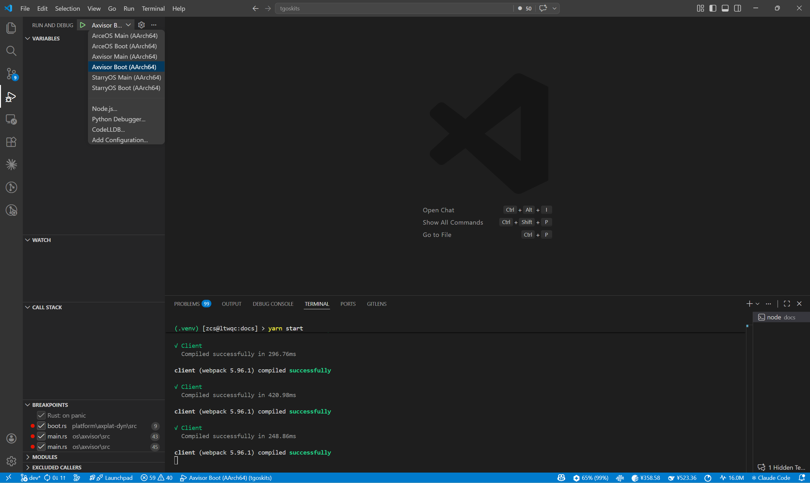

<h1 align="center">TGOSKits</h1>

<p align="center">一个面向操作系统与虚拟化开发的集成仓库</p>

<div align="center">

[](https://github.com/rcore-os/tgoskits/actions/workflows/ci.yml)
[](https://www.rust-lang.org/)
[](./LICENSE)

</div>

[English](README.md) | 中文

TGOSKits 是一个面向操作系统与虚拟化开发的集成仓库。它使用 Git Subtree 管理 60 多个独立组件仓库，将 ArceOS、StarryOS、Axvisor 以及相关平台 crate 整合在同一工作区中，支持组件级开发、跨系统联调和统一测试。

## 1. 快速导航

当前仓库包含多个系统和几十个独立组件，不同开发目标对应不同的文档和命令入口。下面的表格帮助你根据当前任务快速定位到最合适的文档和最短可用命令。

| 你的目标 | 建议先看 | 最短命令 |
| --- | --- | --- |
| 第一次跑起来 | [docs/docs/quickstart/overview.md](docs/docs/quickstart/overview.md) | `cargo xtask arceos qemu --package ax-helloworld --arch aarch64` |
| ArceOS 快速上手 | [docs/docs/quickstart/arceos.md](docs/docs/quickstart/arceos.md) | `cargo xtask arceos qemu --package ax-helloworld --arch aarch64` |
| StarryOS 快速上手 | [docs/docs/quickstart/starryos.md](docs/docs/quickstart/starryos.md) | `cargo xtask starry qemu --arch aarch64` |
| Axvisor 快速上手 | [docs/docs/quickstart/axvisor.md](docs/docs/quickstart/axvisor.md) | `cargo xtask axvisor qemu --arch aarch64` |
| 完整开发示例 | [docs/docs/design/reference/demo.md](docs/docs/design/reference/demo.md) | 从零新增一个组件或者修改组件的完整开发流程示例 |
| 组件开发说明 | [docs/docs/design/reference/components.md](docs/docs/design/reference/components.md) | 从 `components/` 或 `os/arceos/modules/` 开始 |
| 开发 ArceOS | [docs/docs/design/systems/arceos-guide.md](docs/docs/design/systems/arceos-guide.md) | `cargo xtask arceos qemu --package ax-helloworld --arch aarch64` |
| 开发 StarryOS | [docs/docs/design/systems/starryos-guide.md](docs/docs/design/systems/starryos-guide.md) | `cargo xtask starry qemu --arch aarch64` |
| 开发 Axvisor | [docs/docs/design/systems/axvisor-guide.md](docs/docs/design/systems/axvisor-guide.md) | `cargo xtask axvisor qemu --arch aarch64` |
| 理解命令构建和测试矩阵 | [docs/docs/design/build/flow.md](docs/docs/design/build/flow.md) | `cargo xtask test` |
| 理解仓库如何组织众多独立组件 | [docs/docs/design/reference/repo.md](docs/docs/design/reference/repo.md) | `python3 scripts/repo/repo.py list` |

## 2. 仓库结构

仓库按职责将代码划分为顶层目录：`components/` 存放独立的可复用组件，`os/` 存放三个目标系统的源码，`platform/` 存放平台相关 crate，`docs/` 集中管理开发者文档。`scripts/repo/` 提供 subtree 管理工具。

```text
tgoskits/
├── components/                # subtree 管理的独立组件 crate
├── os/
│   ├── arceos/                # ArceOS: modules / api / ulib / examples
│   ├── StarryOS/              # StarryOS: kernel / starryos / make
│   └── axvisor/               # Axvisor: src / configs / local xtask
├── platform/                  # 平台相关 crate
├── test-suit/                 # ArceOS / StarryOS 系统测试
├── xtask/                     # 根目录 tg-xtask
├── scripts/
│   └── repo/                  # subtree 管理脚本与 repos.csv
└── docs/                      # 开发者文档
```

仓库采用 `main` / `dev` / 功能分支三层策略。`main` 作为稳定基线，`dev` 作为集成分支汇聚开发和 CI 验证，开发者基于 `dev` 创建功能分支并通过 PR 合入（禁止直发 `main`）。

| 分支 | 职责 | 规则 |
| --- | --- | --- |
| `main` | 稳定发布分支，每周从 `dev` 合并 | 禁止直接 push |
| `dev` | 集成分支，汇聚开发功能，执行 CI | 通过 PR 合并 |
| 功能分支 | 开发者个人开发 | 完成后向 `dev` 提交 PR（禁止直发 `main`） |

```text
feature/* ──PR──► dev
                   │
                定期合并
                   ▼
                 main
```

与组件仓库之间如需同步，请由维护者显式执行 `scripts/repo/repo.py pull/push`。详见 [docs/docs/design/reference/repo.md](docs/docs/design/reference/repo.md)。

## 3. 快速体验

以下命令提供了三个系统的最小运行路径，帮助你快速验证环境是否就绪。三套系统统一使用 `cargo xtask <os> <subcommand>` 入口；`cargo arceos`、`cargo starry`、`cargo axvisor` 只是等价别名。ArceOS 可直接运行，StarryOS 需要先准备 rootfs，Axvisor 需要先使用 setup 脚本准备 Guest 镜像和配置。

```bash
git clone https://github.com/rcore-os/tgoskits.git
cd tgoskits

# ArceOS: 最快的 Hello World 路径
cargo xtask arceos qemu --package ax-helloworld --arch aarch64
# 如下命令等效
cargo arceos qemu --package ax-helloworld --arch aarch64

# StarryOS: 首次运行前先准备 rootfs
cargo xtask starry qemu --arch aarch64
# 如下命令等效
cargo starry qemu --arch aarch64

# Axvisor: 推荐使用官方 setup 脚本准备 Guest 和 rootfs
cargo xtask axvisor qemu --arch aarch64
# 如下命令等效
cargo axvisor qemu --arch aarch64
```

Axvisor 不能只靠 `build/qemu` 两条命令直接跑起来，因为运行前仍需要 Guest 镜像、VM 配置和 rootfs。推荐先用 `os/axvisor/scripts/setup_qemu.sh` 自动准备这些运行时资源，再执行 `cargo xtask axvisor qemu --arch <arch>`。完整说明见 [docs/docs/manual/deploy/qemu.md](docs/docs/manual/deploy/qemu.md) 和 [docs/docs/design/systems/axvisor-guide.md](docs/docs/design/systems/axvisor-guide.md)。

## 4. 快速开发

仓库已内置 `.vscode/launch.json` 和 `.vscode/tasks.json`，用 VS Code 打开工作区后按 `F5` 即可一键进入调试——自动完成 debug 构建、启动 QEMU（带 GDB stub）、LLDB 附加并命中断点。每个系统提供 **Main**（停在主路径应用入口）和 **Boot**（在平台引导 / runtime 初始化多处设断点）两类入口，覆盖从早期引导到业务逻辑的不同调试需求。



首次使用前请确保已安装 [CodeLLDB](https://marketplace.visualstudio.com/items?itemName=vadimcn.vscode-lldb) 扩展、执行 `rustup target add aarch64-unknown-none-softfloat`、以及宿主机 `PATH` 中有 `qemu-system-aarch64`。完整说明见 [调试设计文档](docs/docs/design/debug/overview.md)。

如果不需断点调试，可直接在终端运行；改动稳定后再执行回归命令确认未引入回归：

```bash
# ArceOS（无需额外准备）
cargo xtask arceos qemu --package ax-helloworld --arch aarch64

# StarryOS（首次需先准备 rootfs）
cargo xtask starry rootfs --arch aarch64    # 仅首次需要
cargo xtask starry qemu --arch aarch64

# Axvisor（setup 脚本会自动检查 Guest 镜像等依赖）
cargo xtask axvisor qemu --arch aarch64

# 回归测试
cargo xtask arceos test qemu --target aarch64      # ArceOS 回归
cargo xtask starry test qemu --target aarch64       # StarryOS 回归
cargo xtask axvisor test qemu --target aarch64      # Axvisor 回归
cargo xtask test                                    # 全量回归
```

## 5. 许可证

仓库整体采用 `Apache-2.0` 许可证。各组件可能带有自己的 LICENSE 文件，具体以各组件目录下的为准。
