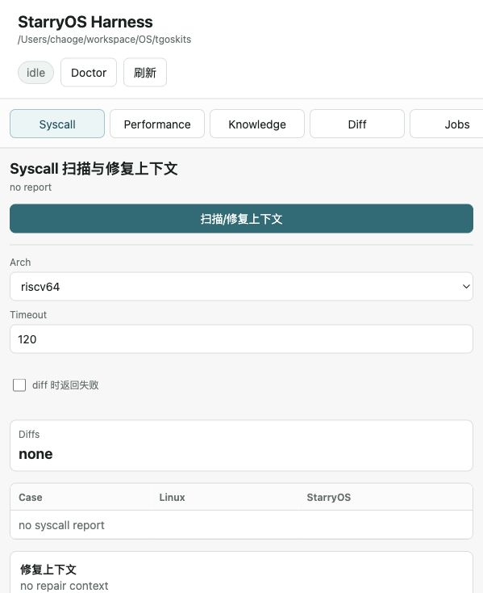
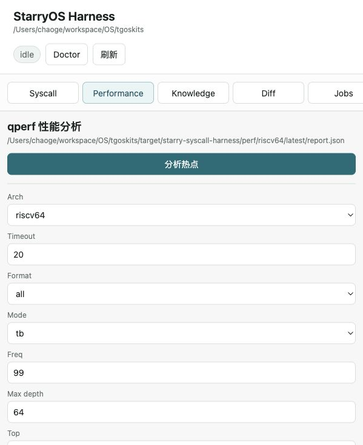
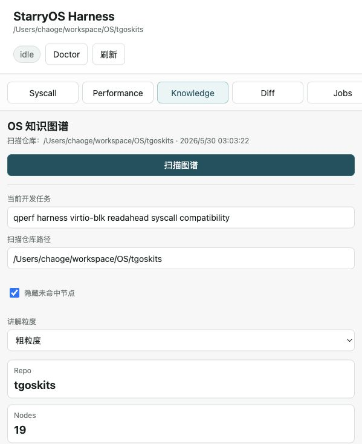
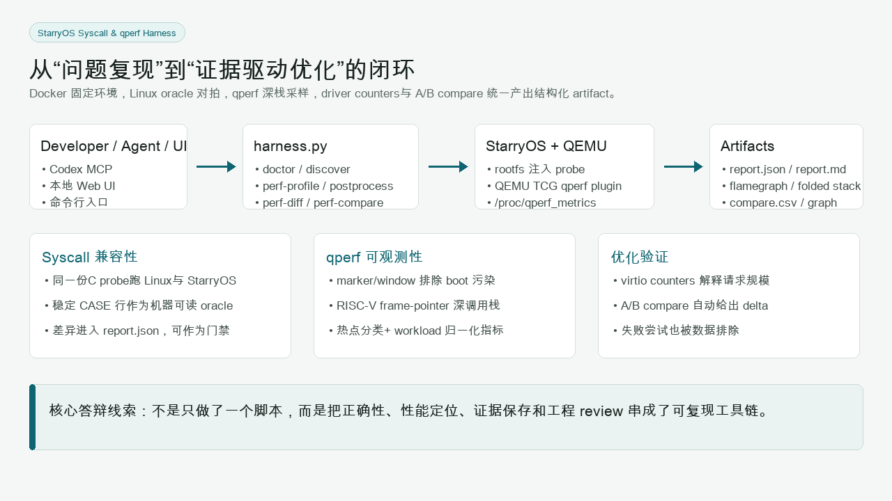
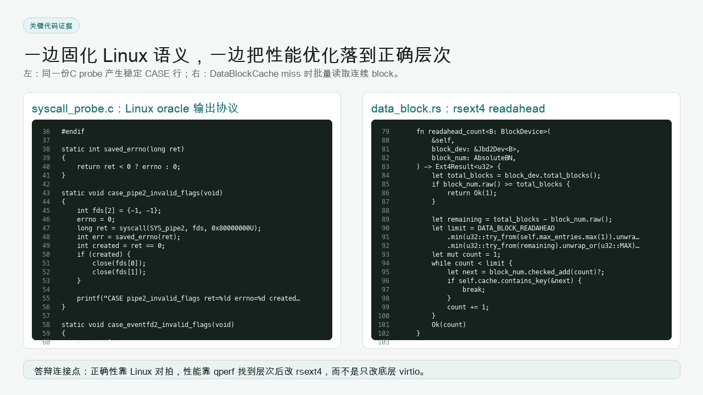

# OScope-harness

`OScope-harness` is a local StarryOS observability harness. It combines syscall behavior checks, qperf profiling, qperf A/B comparisons, a browser UI, and an MCP server for agent workflows.

The harness is packaged under `apps/OScope-harness` and uses `apps/qperf` as the qperf tool package. It defaults to local execution with `--no-docker`; Docker remains a compatibility path only when explicitly requested.

## Visual Preview

Syscall compatibility UI:



qperf performance UI:



Knowledge graph:



Architecture overview:



A/B compare metrics:


Implementation snippets:



## Requirements

- Python 3.11 or newer.
- Rust toolchain and StarryOS build dependencies for this repository.
- QEMU with plugin support for qperf profiling.
- `debugfs`, `mkimage`, `wget`, and the target cross compiler for syscall probe injection.
- Linux host for `discover --no-docker`, because Linux is used as the syscall oracle. On macOS, `discover --no-docker` writes an `unsupported-host` report instead of trying to compile Linux-only probe headers.

## CLI

From the repository root:

```bash
python3 apps/OScope-harness/harness.py doctor --no-docker
python3 apps/OScope-harness/harness.py discover --no-docker --arch riscv64
python3 apps/OScope-harness/harness.py perf-profile --no-docker --arch riscv64 --timeout 20 --format all
python3 apps/OScope-harness/harness.py perf-diff \
  --baseline target/OScope-harness/perf/riscv64/latest \
  --compare target/OScope-harness/perf/riscv64/latest
```

Reports are written under `target/OScope-harness` by default.

Useful qperf profiling options:

```bash
python3 apps/OScope-harness/harness.py perf-profile \
  --no-docker \
  --arch riscv64 \
  --timeout 20 \
  --format folded \
  --mode tb \
  --host-time \
  --host-perf \
  --shell-init-cmd 'echo workload; sleep 1' \
  --qemu-arg=-m \
  --qemu-arg=768M
```

## Local UI

```bash
python3 apps/OScope-harness/harness.py ui --no-docker --host 127.0.0.1 --port 8765 --open
```

The UI can launch Doctor checks, syscall scans, qperf profiles, qperf diffs, and knowledge-graph scans. It reads JSON reports and flamegraphs from `target/OScope-harness`.

## MCP

`mcp_server.py` exposes these tools:

- `starry_syscall_doctor`
- `starry_syscall_discover`
- `starry_perf_profile`
- `starry_perf_diff`
- `starry_harness_ui_command`

Example MCP server configuration:

```json
{
  "mcpServers": {
    "OScope-harness": {
      "command": "python3",
      "args": [
        "/path/to/tgoskits/apps/OScope-harness/mcp_server.py",
        "--repo",
        "/path/to/tgoskits"
      ]
    }
  }
}
```

## qperf Model

qperf is a QEMU TCG plugin, not host `perf`. It observes guest PCs and guest frame-pointer stacks through QEMU callbacks, writes `qperf.bin`, and resolves that data against the StarryOS kernel ELF into `stack.folded`, `flamegraph.svg`, `report.json`, and `report.md`.

The plugin summary includes `samples`, `dropped_samples`, `sample_failures`, `translated_blocks`, `translated_instructions`, `executed_blocks`, `executed_instructions`, and `execute_callbacks`.

`executed_instructions` is a QEMU guest-instruction count for the instrumented scope. In TB mode it is calculated as translated-block instruction count times block executions. It is not a hardware retired-instruction PMU counter.

Host `perf stat` counters, when available, measure the host QEMU process, TCG, device emulation, and plugin overhead. Treat them as host-side context, not guest PMU data.

## Smoke Commands

```bash
apps/OScope-harness/scripts/qperf-smoke.sh boot
apps/OScope-harness/scripts/qperf-smoke.sh blk-read
apps/OScope-harness/scripts/qperf-smoke.sh compare-self
```

The smoke script uses the repository's Starry qperf entrypoint and the app-packaged harness comparison command.
