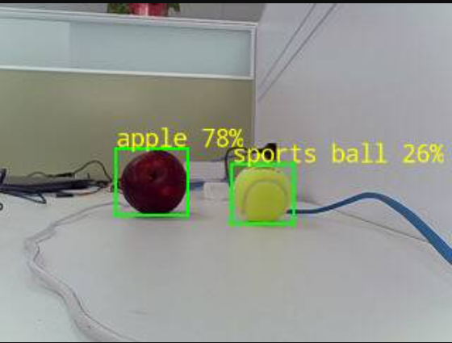

# OrangePi 5 Plus UVC + RKNN Demo 使用说明

## 功能概述

该示例用于在 OrangePi 5 Plus 上运行 UVC 摄像头采集、RKNN YOLOv8 目标检测、网页实时预览，以及 60 秒无网页服务的采集加推理 benchmark。

主要功能：

1. 通过 UVC 摄像头持续采集 MJPEG 图像帧。
2. 使用 RKNN YOLOv8 模型对采集图像进行目标检测。
3. 在串口输出 `YOLO_INFER` 和 `YOLO_RESULT`，包含推理耗时、类别、置信度和检测框。
4. 在图像上绘制检测框，并由 StarryOS 自己发布 HTTP MJPEG 网页。
5. 在同一局域网电脑上通过浏览器查看实时画面和识别结果。
6. 使用 `rknn_yolov8_bench` 跑 60 秒摄像头采集和 RKNN 推理，最后输出帧率、推理延迟和内存占用。

## Linux 根文件系统部署

先在开发机上构建运行文件：

```bash
apps/starry/orangepi-5-plus-uvc-rknn/build-image-runner.sh
```

构建完成后的产物目录为：

```text
apps/starry/orangepi-5-plus-uvc-rknn/rknn-yolov8-image/install/rk3588_linux_aarch64/rknn_yolov8_image/
```

需要把该目录同步到板子 Linux 根文件系统中的：

```text
/rknn_yolov8_image
```

部署后，Linux 根文件系统中应包含：

```text
/rknn_yolov8_image/rknn_yolov8_stream
/rknn_yolov8_image/rknn_yolov8_image
/rknn_yolov8_image/rknn_yolov8_bench
/rknn_yolov8_image/lib/librknnrt.so
/rknn_yolov8_image/lib/librga.so
/rknn_yolov8_image/model/yolov8.rknn
/rknn_yolov8_image/model/coco_80_labels_list.txt
```

## StarryOS 网络地址

网页服务由 StarryOS 上的 `rknn_yolov8_stream` 直接发布，默认监听端口为 `8080`。

网页地址格式为：

```text
http://<StarryOS-IP>:8080/
```

MJPEG 视频流地址为：

```text
http://<StarryOS-IP>:8080/stream.mjpg
```

单帧快照地址为：

```text
http://<StarryOS-IP>:8080/snapshot.jpg
```

其中 `<StarryOS-IP>` 需要根据当前启动方式确定。

### 静态 IP 配置

如果构建配置文件中显式设置了 `AX_IP` 和 `AX_GW`：

```toml
env = { AX_IP = "10.30.12.53", AX_GW = "10.30.12.254" }
```

则 StarryOS 会使用静态 IP。此时浏览器打开：

```text
http://10.30.12.53:8080/
```

这种方式适合固定使用同一块板，或者给每块板分配不同固定 IP。例如：

```toml
env = { AX_IP = "10.30.12.54", AX_GW = "10.30.12.254" }
```

则对应网页地址为：

```text
http://10.30.12.54:8080/
```

注意：多块板不能共用同一个静态 IP，否则网络会冲突，表现为网页偶尔打不开、连接到错误设备，或 ARP 表混乱。

### DHCP 配置

如果不希望为每块板手动分配静态 IP，可以使用 DHCP 配置：

```toml
env = {}
```

或者至少不要同时设置 `AX_IP` 和 `AX_GW`。StarryOS 网络初始化逻辑是：

- `AX_IP` 和 `AX_GW` 都非空：使用静态 IP。
- 只要 `AX_IP` 或 `AX_GW` 有一个为空：使用 DHCP。

DHCP 模式适合多块板轮换使用。启动后需要从串口日志中确认本次分配到的 IP，然后打开：

```text
http://<DHCP分配到的IP>:8080/
```

### U-Boot 阶段的 DHCP 日志

运行 `cargo starry board ...` 时，板子会先进入 U-Boot，并通过 DHCP 获取一个地址用于下载镜像。日志中会看到类似：

```text
Interacting with U-Boot shell...
dhcp ostool/sessions/.../boot/image.fit && bootm
BOOTP broadcast 1
DHCP client bound to address 10.30.12.53
TFTP from server 10.30.12.60; our IP address is 10.30.12.53
```

这里的含义是：

- `10.30.12.60` 是 TFTP 服务器地址。
- `DHCP client bound to address 10.30.12.53` 是 U-Boot 阶段拿到的板子 IP。
- `our IP address is 10.30.12.53` 也是 U-Boot 当前用于 TFTP 下载的板子 IP。

如果 StarryOS 后续也使用 DHCP，通常会继续拿到同一个地址。此时可以尝试打开：

```text
http://10.30.12.53:8080/
```

但 U-Boot 的地址只代表启动加载阶段，最终网页地址仍应以 StarryOS 启动后的网络地址为准。

### StarryOS 阶段的 DHCP 日志

如果 StarryOS 配置为 DHCP，即 `env = {}`，StarryOS 网络初始化完成后会在串口日志中打印类似：

```text
eth0: DHCP acquired address 10.30.12.53/24
eth0: DHCP router 10.3.10.254
```

这是 StarryOS 发布 HTTP 服务时应使用的地址。此时网页地址为：

```text
http://10.30.12.53:8080/
```

如果当前构建配置仍是静态 IP：

```toml
env = { AX_IP = "10.30.12.53", AX_GW = "10.3.10.254" }
```

则不会出现 `eth0: DHCP acquired address ...` 这条 StarryOS DHCP 日志，因为 StarryOS 没有走 DHCP。

### 如何判断应该打开哪个网页

优先级建议如下：

1. 如果构建配置里有静态 IP，直接打开 `http://AX_IP:8080/`。
2. 如果构建配置为 `env = {}`，优先看 StarryOS 启动后的 `eth0: DHCP acquired address ...`。
3. 如果暂时没看到 StarryOS DHCP 日志，可以先参考 U-Boot 的 `DHCP client bound to address ...` 或 `our IP address is ...` 尝试访问。
4. 端口默认固定为 `8080`，通常只需要确认 IP。

例如当前日志中有：

```text
DHCP client bound to address 10.30.12.53
TFTP from server 10.30.12.60; our IP address is 10.30.12.53
```

并且 StarryOS 启动后没有显示其他地址，则可打开：

```text
http://10.30.12.53:8080/
```

## Starry Shell 中手动启动

启动 StarryOS 并进入 shell 后，手动执行：

```bash
cd /rknn_yolov8_image
export LD_LIBRARY_PATH=/rknn_yolov8_image/lib:/usr/local/lib:/usr/lib/aarch64-linux-gnu:${LD_LIBRARY_PATH:-}
./rknn_yolov8_stream \
  --model model/yolov8.rknn \
  --label model/coco_80_labels_list.txt \
  --device 0 \
  --width 320 \
  --height 240 \
  --fps 30 \
  --duration-sec 0 \
  --infer-every 1 \
  --max-inferences 0 \
  --http-port 8080 \
  --http-fps 2 \
  --jpeg-quality 70
```

参数含义：

- `--duration-sec 0`：持续运行，不自动退出。
- `--infer-every 1`：每 1 帧取一次最新帧做推理。
- `--max-inferences 0`：不限制推理次数。
- `--http-port 8080`：在 StarryOS 上启动 HTTP 服务，浏览器通过该端口查看画面。
- `--http-fps 2`：HTTP MJPEG 流发布帧率。推理和采集仍可按各自节奏运行，网页只按该帧率取最新带框画面。
- `--jpeg-quality 70`：网页发布 JPEG 质量，值越高画质越好，网络和编码压力也越大。

启动成功后会看到：

```text
stream-rknn: streaming started
stream-rknn: HTTP MJPEG server listening on 0.0.0.0:8080
stream-rknn: open http://<board-ip>:8080/stream.mjpg or /snapshot.jpg
```

此时浏览器打开：

```text
http://<StarryOS-IP>:8080/
```

停止运行时使用 `Ctrl+C`。

如果只想短时间运行，可以改成：

```bash
./rknn_yolov8_stream \
  --model model/yolov8.rknn \
  --label model/coco_80_labels_list.txt \
  --device 0 \
  --width 320 \
  --height 240 \
  --fps 30 \
  --duration-sec 10 \
  --infer-every 30 \
  --max-inferences 3
```

## Benchmark 运行

`rknn_yolov8_bench` 不启动 HTTP 服务，也不绘制或发布 JPEG。它只运行 UVC 摄像头采集、MJPEG/YUYV 解码和 RKNN YOLOv8 推理，默认持续 60 秒：

```bash
cd /rknn_yolov8_image
export LD_LIBRARY_PATH=/rknn_yolov8_image/lib:/usr/local/lib:/usr/lib/aarch64-linux-gnu:${LD_LIBRARY_PATH:-}
./rknn_yolov8_bench \
  --model model/yolov8.rknn \
  --label model/coco_80_labels_list.txt \
  --device 0 \
  --width 320 \
  --height 240 \
  --fps 30 \
  --duration-sec 60 \
  --infer-every 1 \
  --report-interval-sec 5 \
  --min-confidence 25
```

Linux 侧部署后可以先跑 8 秒短测：

```bash
sudo -E ./rknn_yolov8_bench \
  --model model/yolov8.rknn \
  --label model/coco_80_labels_list.txt \
  --device 0 \
  --width 320 \
  --height 240 \
  --fps 30 \
  --duration-sec 8 \
  --infer-every 1 \
  --report-interval-sec 2 \
  --min-confidence 25
```

StarryOS 板端 benchmark 使用单独的 board 配置：

```bash
cargo xtask starry app board -t orangepi-5-plus-uvc-rknn \
  --board-config configs/board-orangepi-5-plus-bench.toml \
  -b OrangePi-5-Plus
```

如果开发板通过非默认共享服务租用，再按实际服务地址追加 `--server` 和 `--port`。

结束时会输出一行机器可解析的摘要，以及完成标记：

```text
UVC_RKNN_BENCH_RESULT duration_sec=... captured=... capture_fps=... inferences=... infer_fps=... bytes=... throughput_mib_s=... dropped_latest=... decode_errors=... inference_errors=... decode_ms_avg=... decode_ms_p50=... decode_ms_p95=... infer_ms_avg=... infer_ms_p50=... infer_ms_p95=... detections=... vm_size_kb=... vm_rss_kb=... vm_hwm_kb=... mem_total_kb=... mem_free_kb=... mem_available_kb=...
UVC_RKNN_BENCH_DONE
```

## 运行效果

正常运行时可以看到：

1. RKNN 模型加载成功，打印模型输入输出 tensor 信息。
2. UVC 摄像头开始持续采集，采集帧率约 28 到 32 FPS。
3. 程序周期性执行 NPU 推理，输出 `YOLO_INFER`。
4. 检测到目标时输出 `YOLO_RESULT`，包含类别、置信度和检测框。

典型输出形式：

```text
stream-rknn: streaming started
stream-rknn: HTTP MJPEG server listening on 0.0.0.0:8080
stream-rknn: open http://<board-ip>:8080/stream.mjpg or /snapshot.jpg
stream-rknn: capture_fps=30.00 captured=90 inferred=2 dropped_latest=89 mib_s=0.33 elapsed=3.0
YOLO_INFER index=3 frame=90 sequence=90 latency_ms=20.26 detections=5
YOLO_RESULT index=3 det=0 class=person confidence=64.7% box=(115,77,155,153) center=(135,115) size=40x76
```

浏览器中的识别效果示例：



正常情况下：

- RKNN 模型可以正常加载。
- UVC 摄像头可以持续采集图像。
- 串口会持续输出采集帧率、推理次数和检测结果。
- 浏览器可以显示带检测框的实时 MJPEG 画面。
- `http://<StarryOS-IP>:8080/`、`/stream.mjpg` 和 `/snapshot.jpg` 均可用于查看结果。

## 注意事项

- `sys_rseq registration is unsupported; returning ENOSYS` 是当前 StarryOS 对 rseq 的兼容性提示，不影响该 demo 运行。
- `attempt to claim already-claimed interface 1` 当前不是致命错误；只要后续出现 `stream-rknn: streaming started`，说明摄像头流已经启动。
- RGA 在 StarryOS 下可能打印打开失败或回退 CPU 处理的日志；当前 demo 仍可继续走 CPU 图像转换和 RKNN 推理。
- 如果网页打不开，先确认 IP 是否正确，再确认 StarryOS 日志中是否出现 `HTTP MJPEG server listening on 0.0.0.0:8080`。
- 如果使用静态 IP，多块板必须配置不同的 `AX_IP`。
