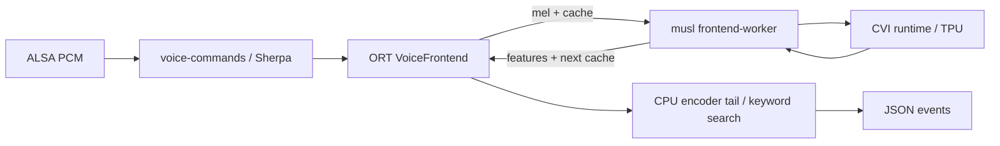

# SG2002 中文口令识别

`voice-commands` 将单声道录音转换为小车命令事件。它在本地运行 Sherpa-ONNX
关键词识别模型，标准输出为逐行 JSON，供后续控制程序接入。当前实现到 JSON
事件为止，尚未连接底盘或电机控制；输出的 `stop` 也是一条识别事件。

固定文件识别可以独立运行，不依赖麦克风驱动。SG2002 的 `listen.sh` 实时采集
依赖 [ALSA 麦克风支持 PR #2497](https://github.com/rcore-os/tgoskits/pull/2497)
提供的当前设备接口；使用这一入口前，需要包含该支持的 StarryOS 内核与根文件系统。

SG2002 实时采集使用 TPU 前端版本。它保留 CPU 上的流式解码，把卷积前端交给
已有 CVI runtime，在 StarryOS 上通过了固定语音文件识别和连续 120 秒 ALSA 流处理。CPU 版本用于
主机、QEMU 和固定录音验证，在本板持续采集时仍会溢出。实板测量见第 3.3 节。

## 1. 口令与音频

`keywords.txt` 保存拼音序列与命令标签；`voice-commands.c` 的 `commands` 白名单
决定哪些标签能够输出。移动口令带“小车”前缀，使用时一次说一条，句间稍作停顿。

### 1.1 命令事件

当前识别“小车前进”“小车后退”“小车左转”“小车右转”和“停止”，分别输出
`forward`、`backward`、`left`、`right`、`stop`。例如说“小车前进”后，程序输出：

```json
{"command":"forward","time":1.440}
```

`time` 是检测时已消耗的音频秒数，包括文件末尾为完成解码而补入的静音。
未检测到关键词时没有事件，运行诊断写入标准错误。关键词模型不分析句子的否定或
引用关系；“不要小车前进”仍包含完整口令，不能把它当作自然语言意图理解。
`main()` 保留十六条候选音素序列，使共用“小车”前缀的口令在连续输入中保持可选，
关键词接受阈值为 0.20。

### 1.2 输入格式

`read_wave()` 接受 16 kHz、单声道、16 位整数 PCM WAV，并在读取时校验 RIFF 块边界；`read_raw()` 接受标准输入上的
16 kHz、单声道、`S16_LE` 原始音频，也可通过 `--raw-file` 读取文件或 FIFO。
两者都经 `feed()` 和 `decode()` 增量推理，
管道分块不需要与采样点或模型窗口对齐。采样率错误、空输入和截断采样点会报错退出。

手机立体声录音先转换成单声道 WAV。本次真人录音保留左声道后通过五条口令检查；
默认双声道混合曾丢失“前进”，因此转换时明确选择声道，而不是直接混音：

```bash
ffmpeg -i voice.m4a -af 'pan=mono|c0=c0' -ar 16000 -c:a pcm_s16le voice.wav
```

## 2. 构建

`prepare-model.py` 按固定版本及 SHA256 获取模型，权重保存在构建目录中。
采用 Zipformer zh-en 3M 2025-12-20 的 chunk-16/left-64 全 fp32 版本，权重约
12.5 MiB。`main()` 显式指定 `zipformer2`，省去用于自动判断模型类型的重复加载。
模型及其许可声明来自
[训练作者的模型仓库](https://modelscope.cn/models/pkufool/icefall-kws-zipformer-zh-en-3M-2025-12-20)。

### 2.1 主机程序

以下命令在仓库根目录执行。Python 环境只用于取得带头文件的主机 SDK；实际识别程序
是 C 可执行文件，通过 `SHERPA_ONNX_ROOT` 链接 SDK。

```bash
app=apps/starry/sg2002-voice-commands
uv venv target/voice-host-env
uv pip install --python target/voice-host-env/bin/python sherpa-onnx==1.12.26
sdk=$(target/voice-host-env/bin/python -c 'import pathlib,sherpa_onnx; print(pathlib.Path(sherpa_onnx.__file__).parent)')
python3 "$app/prepare-model.py" target/voice-model
cmake -S "$app" -B target/voice-host -G Ninja \
  -DCMAKE_BUILD_TYPE=Release -DSHERPA_ONNX_ROOT="$sdk"
cmake --build target/voice-host
target/voice-host/voice-commands target/voice-model "$app/validation/commands.wav"
```

### 2.2 RISC-V 部署包

RISC-V 程序采用 RV64GC/LP64D，运行库随包部署。`run.sh` 显式调用包内 glibc
加载器，系统中的 musl 程序继续使用原有运行库。`build-bundle.sh` 负责链接程序、
复制运行依赖并下载同一份模型。

```bash
app=apps/starry/sg2002-voice-commands
bash "$app/build-runtime.sh"
bash "$app/build-bundle.sh" target/voice-riscv-runtime/sdk \
  target/voice-riscv-runtime/toolchain.cmake target/voice-bundle
```

`build-runtime.sh` 面向 Ubuntu 24.04，使用 Clang、LLD、CMake、Ninja、curl、Git、
patchelf、unzip 和已有 APT 软件源。生成部署包还需要 LLVM 18 的 `llvm-objdump-18`。
交叉开发包解压到 `target/voice-deps/sysroot`，
用于构建用户态依赖；缓存与构建输出均保存在 `target/`。

### 2.3 TPU 部署包

`build-tpu-bundle.sh` 在 CPU 部署包上加入专用前端。构建需要 Ubuntu 24.04 x86_64、
Python 3.10、TPU-MLIR 1.30.2、RISC-V musl C 工具链，以及
[SG200x TPU SDK](https://github.com/milkv-duo/tpu-sdk-sg200x/tree/6fa0d80a635db13b6b9dc061d68b8da0593b79f3)。
SDK 与 `aka00-tennis-yolo` 使用同一提交，可以复用已有副本；`CVI_CC` 指向
musl 工具链的 `gcc`，旁边还需有对应的 `strip`。本次板测使用 GCC 11.2.1。

CVI SDK 和 musl 工具链是外部构建输入，仓库仅提供构建脚本，不包含 SDK 二进制
或预编译部署包。`build-tpu-bundle.sh` 会把所需运行库复制到本地部署目录；公开
分发该目录前，需要按所用 SDK 与工具链的上游条款另行核对许可、版权声明和源码提供要求。

已有兼容编译环境时直接设置 `TPU_PYTHON`；否则按锁定依赖建立环境。Torch 只用于
编译器导入 ONNX 转换模块，采用官方 CPU wheel，不需要 CUDA。

```bash
app=apps/starry/sg2002-voice-commands
uv venv --python 3.10 target/voice-tpu-env
uv pip sync --python target/voice-tpu-env/bin/python3 --require-hashes \
  --index https://download.pytorch.org/whl/cpu --index-strategy unsafe-best-match \
  "$app/tpu-requirements.txt"
export TPU_PYTHON="$PWD/target/voice-tpu-env/bin/python3"
export CVI_CC=/path/to/musl-toolchain/bin/riscv64-linux-musl-gcc
bash "$app/build-runtime.sh"
bash "$app/build-tpu-bundle.sh" target/voice-riscv-runtime/sdk \
  target/voice-riscv-runtime/toolchain.cmake /path/to/tpu-sdk-sg200x \
  target/voice-tpu-bundle
```

输出目录必须尚不存在。脚本在临时目录中完成构建、FP32 拆分等价检查，以及 BF16
中间模型和最终 CVI 模拟器的数值检查，全部成功后才发布部署目录。
`target/voice-tpu-build/model/` 保存转换日志，包内 `model/tpu-model.json` 保存模型
散列和工具版本。`tpu/build-inputs.txt` 记录实际 SDK 输入散列与交叉编译器版本。
锁文件中的 OpenCV 4.8.0.74 是 TPU-MLIR 的上游固定依赖，已被上游标记弃用；
它只存在于专用构建环境。`tpu-tool.py` 避免编译器 wheel 自带的旧 glibc 覆盖宿主库。

### 2.4 C906 指令兼容

C906 对 `FENCE.TSO` 存在兼容问题，带有该指令的通用 RISC-V 运行库可能在加载时
触发非法指令异常。[OpenSBI 的修复说明](https://lists.infradead.org/pipermail/opensbi/2022-May/002783.html)
记录了这一问题；开发板上的固件版本不一定包含对应处理。

`build-bundle.sh` 调用 `prepare-runtime.py` 检查程序及其共享库，将反汇编确认的
`FENCE.TSO` 改为 `FENCE RW,RW`。后者提供更强的内存顺序，符合
[RISC-V 内存屏障规范](https://docs.riscv.org/reference/isa/v20240411/unpriv/rv32.html)。
转换保持指令长度和地址不变，并核对可执行段、文件偏移及原始字节；相同字节的常量数据
保持原样。`python3 apps/starry/sg2002-voice-commands/tests/runtime.py` 使用实际链接的
ELF 检查这些行为。

## 3. 运行与验证

固定录音先验证音频到事件的完整路径，实时采集则在这一识别路径前接入现有 ALSA
接口。合成样本是可重复的功能检查材料，录音环境中的识别率和误触发率需要另外测量。

### 3.1 固定录音

`verify.py` 直接启动实际识别程序，核对口令顺序、无关语音、静音、管道分块和输入
错误。`validation/commands.wav` 包含五条口令，`noncommands.wav` 包含普通句子与
不带“小车”前缀的方向词。素材说明见 `validation/provenance.txt`。

```bash
app=apps/starry/sg2002-voice-commands
python3 "$app/verify.py" target/voice-host/voice-commands target/voice-model "$app/validation"
VOICE_BUNDLE_DIR="$PWD/target/voice-bundle" \
  cargo xtask starry app qemu -t sg2002-voice-commands --arch riscv64
```

QEMU 场景通过 `prebuild.sh` 将部署包放入独立运行镜像，以 `validate.sh` 检查实际
StarryOS 用户态进程的输出，包括长静音后的连续两轮口令。成功时输出
`VOICE_COMMANDS_TEST_PASSED`。采集脚本的退出与进程回收另由
`python3 "$app/tests/listen.py"` 检查。

此应用需要预先构建部署包并设置 `VOICE_BUNDLE_DIR`，因此在 `apps/.ignore` 中
排除默认批量烟测；显式选择 `-t sg2002-voice-commands` 仍会运行上述检查。

QEMU 使用 CPU 包；TPU 文件识别要求真实的 `/dev/cvi-tpu0` 和 ION 设备，
实时采集还需要 ALSA 设备。
在板端对 TPU 包运行相同的 `./validate.sh`，再运行 `./listen.sh` 检查持续采集。
`tests/frontend.py` 另用真实 ORT 会话和 CPU 前端进程验证跨进程数据、连续缓存、
工作进程启动失败、中途退出与子进程回收；它不模拟 TPU 硬件。构建 TPU 包后可执行：

```bash
python3 "$app/tests/frontend.py" target/voice-riscv-runtime/sdk/include/onnxruntime \
  /path/to/host/libonnxruntime.so "$TPU_PYTHON" target/voice-tpu-build/model
```

### 3.2 麦克风输入

连接麦克风，并将完整 TPU 部署目录放到已配置音频及 TPU 驱动的系统后，在目录内运行 `./listen.sh`。
默认采集设备为 `hw:0,0`，也可通过第一个参数指定其他设备。`listen.sh` 用
`arecord --fatal-errors` 输出原始 PCM，随后交给同一识别程序。FIFO 在模型初始化
完成后才打开，采集端因此不会在模型加载期间提前积压录音。

```bash
./run.sh validation/commands.wav
./listen.sh hw:0,0
```

采集期间应由该进程独占麦克风。缓冲区溢出或声卡错误会终止采集并使启动脚本返回
失败，控制端应把输入中断与识别出的“停止”区分处理。连接电机时，还需由控制端
统一落实运动时限、失联停车和其他输入源的优先级。

模型初始化约需 26～30 秒，这段时间尚未开始采集。当前 Debian ORT 1.21 运行库
启动时会向标准错误输出 ONNX schema 重复注册诊断，
随后完成模型加载并进入识别。命令接收端只解析标准输出，标准错误单独保存为运行日志。

### 3.3 实板处理速度

2026-10-07 在 LicheeRV Nano SG2002 原有 Linux 5.10.4 上，C906 时钟为 850 MHz。
随包的五条合成口令、十秒静音后的连续两轮口令均按顺序识别，无关语音样本没有输出事件。
显式指定模型类型后，10.37 秒口令录音共处理约 34.9 秒，其中首条结果在启动后约
18.6 秒出现；`wait4()` 记录的峰值驻留内存约 67.5 MiB。

CPU 版本按相邻识别事件的音频位置与墙钟时间计算，稳态处理一秒音频约需 1.6 秒。
StarryOS 上的同一 CPU 包通过固定录音组，但 `listen.sh` 持续采集时因 `arecord`
报溢出而退出，因此没有采用增大缓冲区来掩盖吞吐不足。

同日 StarryOS 实板的八候选 TPU 基线通过五条口令、无关语音和十秒静音后的连续两轮口令。
相邻事件给出的稳态处理比约为 0.64～0.65 秒处理一秒音频；10.37 秒录音总耗时
36.26 秒，其中首次事件在 29.14 秒出现。总耗时包含模型启动，不能当作稳态处理比。
独立前端探针中，单次 TPU 推理约 4.7～4.9 毫秒，取回的两个输出张量与 CVI 模拟器逐元素相同；
相对 FP32 参考的余弦相似度分别为 0.99991 和 0.99997。

该八候选基线的持续采集先通过 45 秒进程运行与终止检查，再用相同的 8192/1024 缓冲设置，
给 `arecord` 加上 `-d 120`，确认取得 120 秒 ALSA 采集数据。后者连同启动共耗时
152.40 秒，退出状态为零，没有采集溢出，退出后没有遗留采集、识别或前端进程。
测试时板上未连接麦克风：ALSA 流用于验证持续输入处理，合成语音文件用于验证
口令识别。真实声音采集和底盘动作连接尚待实现与验证。

随后用 20.63 秒的真人手机录音验证当前十六候选、0.20 阈值配置，五条口令均被检出。
把该录音、合成口令、无关语音及长静音后的两轮口令合并为 74.72 秒连续输入后，
实板返回完整的二十条预期事件，无关语音段为零事件；含启动耗时 79.73 秒，稳态处理比
约为 0.68。扩大候选数量解决了 TPU 版本对这段真人录音的“右转”漏检。

## 4. 前端执行边界

`voice-commands.c` 继续拥有音频输入、关键词解码和事件输出。加速只替换编码器
前端，沿用 Starry 已有的 TPU、ION 和进程接口，不增加内核协议。

### 4.1 模型拆分

`prepare-tpu-model.py` 只接受固定 SHA256 的 FP32 编码器，将 batch 固定为 1。
输入 `x=[1,45,80]` 和 `embed_states=[1,128,3,19]` 经卷积、ConvNeXt、投影和归一化，
得到 `[1,16,128]` 特征及新的前端缓存；其余编码器、预测网络和搜索仍在 CPU 上运行。
CPU 尾部保留 `x` 的形状输入，避免把依赖窗口形状的节点误删。

四处激活中的 `max(0,z)+log(1+exp(-abs(z)))` 被改写为等价的 ONNX `Softplus(z)`，
绕过 TPU-MLIR 1.30.2 对原展开形式的错误转换。构建先比较不同输入范围，再比较
三个连续状态帧的完整编码器结果。BF16 检查随后由编译器执行，不以模型注册成功
替代数值验证。原 FP32 权重和模型许可声明仍是派生模型的来源。

### 4.2 进程所有权

Sherpa 和 ORT 使用私有 glibc，CVI SDK 使用 musl，二者不能装入同一进程。
`sherpa-frontend-hook.patch` 只为编码器会话登记显式指定的自定义算子库；
`Frontend` 为 `voice.sg2002::VoiceFrontend` 创建并拥有一个独立 musl 工作进程。
模型状态仍归 ORT 会话，工作进程每次只处理传入的一帧与缓存。



`frontend-protocol.h` 固定握手与浮点数数量。工作进程核对 CVI 张量名称、类型和数量，
并将 ION 张量复制到普通用户缓冲区后再写管道，避免把设备映射直接作为 Starry
系统调用缓冲区。厂商标准输出重定向到标准错误，不能混入二进制协议或命令事件。

### 4.3 失败与退出

`Frontend::transfer()` 使用非阻塞管道和有期限的等待；工作进程退出、协议不匹配或
设备错误会使推理失败，不会静默回退到处理速度不足的 CPU 前端。`Frontend::run()`
在传播传输错误前调用 `stop()` 回收工作进程，不依赖上层会话的析构。`Frontend::stop()`
关闭管道，让工作进程在 EOF 后释放 CVI 模型；两秒内仍未退出时终止并回收子进程。
`listen.sh` 负责采集与识别进程的共同退出。

CPU 与 TPU 包分目录保存，切换只需停止当前采集后运行另一目录的入口。CPU 包的
`run.sh` 清除前端环境变量，TPU 包的 `run.sh` 则设置包内绝对路径；系统 musl、
Linux 镜像和持久启动配置均不需要替换。回退到 CPU 包仍可验证固定录音，但不提供
本板持续实时采集能力。
