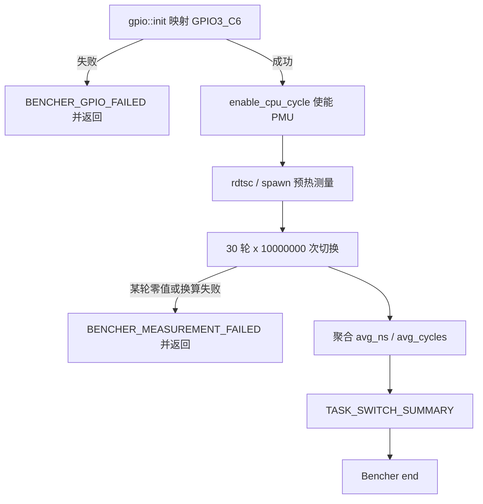

# Orange Pi task-switch 调度切换基准

本用例在 Orange Pi 5 Plus 上以单个 vCPU 运行 `apps/arceos/task-switch` ArceOS 客户机，测量同优先级 FIFO(80) 两个任务之间 `yield` 往返的调度切换开销，并在每个计时间隔内驱动 GPIO3_C6 引脚，供示波器核对。客户机的任务运行在 EL1，自己完成测量、换算与判定，板卡 runner 只等待既定的成功与失败标记。

## 1. 定位与分工

任务切换基准在不同平台上使用不同的测量通路，本用例只覆盖实体 RK3588 板卡上的 AxVisor 客户机路径。

### 1.1 与 QEMU 调度延迟基准的关系

`apps/arceos/scheduler-latency-bench` 与 `bench_switch()`/`bench_spawn()` 测量的是同类目标：同为 FIFO(80) 双线程 `yield` 往返与 `spawn` 开销，因此两者在测量对象上重叠，区别在于测量通路与平台责任。QEMU 用例在 x86_64 下用 `std::time::Instant` 取证，依赖宿主时钟，适合快速回归；本用例的计时来源是 AArch64 的 `CNTVCT_EL0` 系统计数器与 PMU 的 `PMCCNTR_EL0` 周期计数，并用 GPIO3_C6 输出提供实体引脚时序旁证，覆盖 QEMU 无法观察的板卡时序。两者互补使用，任一都不能单独替代另一方的证据。

### 1.2 平台与权限前提

本应用只支持 AArch64 RK3588 ArceOS 板卡客户机：`apps/arceos/task-switch/src/main.rs` 对非 AArch64 目标直接给出 `compile_error!`，不提供任何返回零值的桩实现。该 ArceOS 标准库应用不是用户进程，其任务始终运行在 EL1，直接在 EL1 读取 `PMCCNTR_EL0`、`CNTVCT_EL0`、`CNTFRQ_EL0`；`cycle::enable_cpu_cycle()` 仍会写 `PMUSERENR_EL0` 打开 EL0 授权位，但这是沿用原 Rust-Shyper 的授权序列，本应用的负载并不进入 EL0。

客户机通过 `gpio::init()` 用 `ax_mm::iomap` 映射 RK3588 的 GPIO/IOC 物理窗口并直接读写 GPIO3_C6，这依赖 `task-switch.toml` 中 `guest_type = "passthrough"` 实际声明的设备窗口。PMU 访问是另一条独立前提：`PMCCNTR_EL0` 等寄存器能否在 EL1 读到，由板卡启动环境是否放开 MDCR_EL2 的 `TPM`/`TPMCR` trap 决定；EL1 应用无法自行清除 EL2 的 PMU trap，本仓库也未写入 MDCR_EL2，因此这只是本用例的部署前置条件，而不是 AxVisor 源码保证。运行时若触发 PMU trap，客户机无法继续测量，板卡失败门禁会把本次运行判为失败，而不是接受一个有效读数。

本用例固定单 vCPU、单物理 CPU：`task-switch.toml` 的 `cpu_num = 1` 与 `phys_cpu_ids = [0x400]`，以及 `guest-build.toml` 的 `max_cpu_num = 1` 保证两个切换任务运行在同一物理 CPU 上。PMU 控制寄存器的唯一写入者是单个主任务，peer 任务只切换 GPIO3_C6，因此本用例依赖的 PMU 状态有一个串行的所有者。

## 2. 测量与判定

测量分为预热、逐轮往返与跨轮聚合三段，只有在完整工作量跑完且每轮都得到非零 PMU 与时间结果后，客户机才输出成功摘要。

### 2.1 测量流程

主任务先用 `cycle::enable_cpu_cycle()` 按 64 位模式使能周期计数器，随后依次运行 `rdtsc`、`spawn` 与 30 轮、每轮 10,000,000 次切换的工作量；轮数常量 `SWITCH_ROUNDS` 与单轮常量 `SWITCHES_PER_ROUND` 固定为 30 与 `10_000_000`。每个计时间隔就是 `bench_switch()` 内循环的一次 `main -> peer`、`peer -> main` 往返，包含两次上下文切换；每轮把 `SWITCHES_PER_ROUND` 作为切换次数，由 `apps/arceos/task-switch/src/convert.rs` 中的 `ticks_to_nanos()`、`cpu_freq_hz()` 与 `div_round()` 换算成每次切换的平均值，而不是每往返一次的平均值。

下面的流程图给出一次完整运行从初始化到判定输出的状态转移，帮助理解失败提前返回的位置。



流程图中 `gpio::init()` 失败与逐轮读数异常都会在主任务内提前返回，因此不会打印后续成功标记；只有聚合后的非零结果才会走完 `TASK_SWITCH_SUMMARY` 与 `Bencher end` 两步。

### 2.2 成功与失败标记

板卡用例在 `board-orangepi-5-plus-task-switch.toml` 中把成功条件拆成两个 `shell_check_steps`，因为 runner 将同一 `success_regex` 数组内的模式视为“任一命中即完成”，而不是“全部必须命中”。第一步要求汇总行 `TASK_SWITCH_SUMMARY rounds=30 samples_per_round=10000000 avg_ns=<非零> avg_cycles=<非零>`，第二步要求原始完成行 `Bencher end`，从而同时约束“确实测量到非零值”与“完整工作量跑完”。

失败条件由顶层 `fail_regex` 提供，除 panic、客户机初始化失败等通用标记外，额外匹配客户机主动输出的 `BENCHER_GPIO_FAILED reason=...` 与 `BENCHER_MEASUREMENT_FAILED reason=...`。下表列出客户机侧标记与它们对应的触发位置。

| 标记 | 触发位置 | 含义 |
| --- | --- | --- |
| `BENCHER_GPIO_FAILED reason=<token>` | `main()` 调用 `gpio::init()` 失败 | GPIO3_C6 无法映射或配置，基准停止且不测量 |
| `BENCHER_MEASUREMENT_FAILED reason=<token>` | `main()` 的换算或逐轮零值检查 | 读数或换算无效，主任务提前返回 |
| `AXVISOR_TASK_SWITCH_GROUP_SUMMARY index=<n> samples_per_direction=<n> avg_cycles=<n> min_cycles=<n> max_cycles=<n>` | `main()` 每个有效轮次测量完成 | 供 nightly 性能报告采集的逐轮摘要 |
| `TASK_SWITCH_SUMMARY ...` | `main()` 聚合完成 | 30 轮均得到非零均值 |
| `Bencher end` | `main()` 末尾 | 基准正常结束 |

表中前三项是客户机的过程输出，后两项是成功证据；`fail_regex` 与两段 `success_regex` 共同保证测量恒为零或换算异常时用例无法通过。整次板卡执行仍受 `timeout = 3600` 约束，该超时只是基础设施上限，不是性能门槛。

每个有效轮次结束后，客户机额外打印一行 `AXVISOR_TASK_SWITCH_GROUP_SUMMARY index=<n> samples_per_direction=<n> avg_cycles=<n> min_cycles=<n> max_cycles=<n>`：`index` 是轮次编号，`samples_per_direction` 是单向切换次数（`SWITCHES_PER_ROUND / 2`），`avg_cycles` 是该轮每次切换的平均 PMU 周期数，`min_cycles`/`max_cycles` 是该轮每次切换的最小与最大周期数。这是原 Rust-Shyper 客户机沿用的性能报告标记格式，`scripts/test/ci_perf_report.py` 的 `task-switch/avg_cycles/index-<n>` 指标取自该行，因此前缀与字段名保持不变；该行只在有效（非零）轮次后打印，不改变由 `TASK_SWITCH_SUMMARY` 与 `Bencher end` 两步承担的成功门禁强度。

## 3. 配置与运行入口

本用例的构建与运行都通过仓库固定工具链和 `cargo xtask` 入口完成，不依赖外部脚本或宿主 Python 判定。

### 3.1 构建配置

客户机构建、AxVisor 宿主构建与虚拟机描述分别放在同一目录的三个配置文件中。`guest-build.toml` 描述客户机包名、目标与能力：`package = "task-switch"`、`target = "aarch64-unknown-none-softfloat"`、`features = ["bench-fifo-policy"]` 与 `max_cpu_num = 1`；`guest-builds.toml` 通过 `arceos_build_configs = ["guest-build.toml"]` 让宿主构建前先构建客户机。`build-aarch64-unknown-none-softfloat.toml` 启用宿主侧的基准专用特性与 `vm_configs`，`task-switch.toml` 则固定 `guest_type = "passthrough"`、`cpu_num = 1` 与 `phys_cpu_ids = [0x400]`。

客户机的 FIFO 作用域由 `bench-fifo-policy` 控制：`main()` 在 `rdtsc`/`spawn` 之后调用 `configure_current_task_for_switch_bench()` 把主任务移入 FIFO(80)，`spawn_switch_peer()` 以同一策略创建 peer，运行时全局默认策略保持 Fair。宿主侧 vCPU 宿主任务的策略由 AxVisor 的每虚拟机调度策略承担：`axvm::AxVM::new_with_vcpu_schedule_policy(config, policy)` 接收一个 `axvm::SchedulePolicy`，普通 `axvm::AxVM::new` 保持 Fair；该策略按 VM 固定，供 vCPU 宿主任务的 prepare、start、restart 复用。`os/axvisor/src/config.rs` 的 `create_guest_vm` 在本用例启用的本地 `bench-fifo-vcpu-policy` feature 下，用 `axvm::RtPriority` 构造优先级 80 的 FIFO 策略传入；`virtualization/axvm` 不再为该基准保留专用 feature，公共类型只有 `axvm::{SchedulePolicy, RtPriority}`。

### 3.2 标准命令

本地与持续集成共用标准入口：只构建客户机时执行 `cargo xtask arceos build --config benchmarks/axvisor/board-orangepi-5-plus/task-switch/guest-build.toml`，只构建宿主时执行 `cargo xtask axvisor build --config benchmarks/axvisor/board-orangepi-5-plus/task-switch/build-aarch64-unknown-none-softfloat.toml`。需要实体板卡与已配置板卡服务时执行 `cargo xtask axvisor test board --board orangepi-5-plus-task-switch`。

纯算术换算（`convert::ticks_to_nanos()`、`convert::cpu_freq_hz()`、`convert::div_round()`）可以从对应单元测试确定性验证，不需要读取硬件寄存器：

```bash
cargo xtask cross-test --arch aarch64 -p task-switch --no-default-features
```

该命令在 AArch64 musl 目标下只编译 `convert` 模块与其单元测试，不构建板卡客户机 `main`；`.github/ci/checks/workspace.toml` 的 `test-task-switch-convert` 在持续集成中以同一命令运行它。板卡运行入口只接受 `TASK_SWITCH_SUMMARY` 与 `Bencher end` 同时出现，纯算术测试通过并不代表板卡测量通过。

## 4. 目录布局与用例发现

性能测例已由已合入的 PR2504 统一到 `benchmarks/` 下，AxVisor 板卡用例发现逻辑在 `test-suit/axvisor/<group>` 之外同时搜索 `benchmarks/axvisor`。本用例因此位于：

```text
benchmarks/axvisor/board-orangepi-5-plus/task-switch/
├── README.md
├── board-orangepi-5-plus-task-switch.toml     # 板卡运行与成功/失败判定
├── build-aarch64-unknown-none-softfloat.toml  # AxVisor 宿主构建
├── guest-build.toml                           # 客户机构建
├── guest-builds.toml                          # 板卡运行前先构建客户机
└── task-switch.toml                           # AxVisor 客户机描述
```

`normal` 组除 `test-suit/axvisor/normal` 外还搜索 `benchmarks/axvisor`，因此 `cargo xtask axvisor test board --board orangepi-5-plus-task-switch` 直接按 `board-orangepi-5-plus-task-switch.toml` 推导出的板卡名 `orangepi-5-plus-task-switch` 选中本用例，无需额外的目录注册或用例路由。旧 `task-switch-overhead` 用例已由本 PR 删除并替换为本用例；nightly 与性能报告语义由 `benchmarks.toml` 清单统一提供，检查项本身不再写 `nightly_only`/`performance_report`。

与 QEMU `scheduler-latency-bench` 的分工见 1.1：两者测量同类切换开销，本用例提供实体 RK3588 板卡上的 PMU/CNTVCT 计数与 GPIO 引脚证据，QEMU 用例提供宿主时钟下的快速回归，二者互补而不互为替代。
