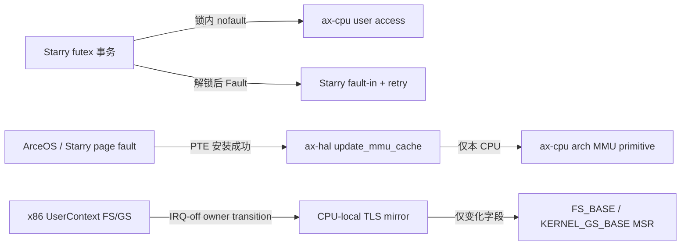

# `ax-cpu` 用户态转换前置改进

## 状态与范围

本文定义从 PR #1775 独立提取的三个前置改进：可恢复的 nofault 用户内存访问、
缺页完成后的本地 MMU 同步，以及 x86 LinuxCurrent 用户 TLS 懒安装。三者都位于
用户态指令与内核状态转换的边界，目标是在不迁移 #1775 整体任务运行时架构的前提下，
先消除可以独立验证的正确性风险和固定开销。

本次明确不包含：

- IRQ-off idle 与 clockevent 事务；
- active-mm、页表根及 CPU mask 所有权迁移；
- 跨 CPU TLB shootdown 或新增 IPI；
- x86 double-fault IST 路径；
- `UserContext` 的 bytemuck 化和整套 trapframe 重构；
- robust-list 等不持有 futex 队列锁的用户内存访问迁移。

因此本改进能解除 #1775 的部分底层耦合，但不代表 #1775 的其余调度、时钟和地址空间
所有权问题已经完成。

## 问题与成功条件

### Futex 锁内用户访问

`WAIT` 的条件复查、`CMP_REQUEUE` 的比较和 `WAKE_OP` 的原子读改写都必须与 futex
队列锁保护的状态变更组成一个事务。普通 faultable 用户访问可能在持锁期间进入缺页
处理、等待内存或调度，破坏锁的执行上下文约束；若把读取提前到加锁前，用户映射和值
又可能在加锁前后发生变化。

成功条件是：锁内访问只返回成功、`Fault` 或 `Retry`，不进入缺页处理；`Fault` 和
`Retry` 都不得唤醒、重排或留下 waiter。需要补页时先释放全部 futex 队列锁，再执行
fault-in、yield 并从事务起点重试。

### 缺页完成后的本地可见性

地址空间后端成功安装 PTE 后，故障 CPU 可能仍保留无效项或软件 refill 产生的占位项。
若不在重试故障指令前完成架构要求的本地同步，刚安装的映射仍可能再次故障。

成功条件是：只有成功处理的缺页恰好执行一次、按页对齐的本地
`update_mmu_cache`；拒绝路径不执行。该操作不承担远端 CPU 的映射失效，也不改变
地址空间或页表根所有权。

### x86 用户 TLS 固定 MSR 开销

原实现每次进入用户态都读取内核 FS 并写用户 FS/GS，每次退出又读取用户 FS/GS 并
恢复内核 FS。LinuxCurrent 模式已经禁止内核 TLS，且 `CR4.FSGSBASE` 关闭时用户不能
绕过内核修改 FS/GS base，因此 `UserContext` 与 CPU-local 镜像可以成为完整的状态源。

成功条件是：CPU 首次初始化用户 TLS 镜像；进入用户态前只写发生变化的 MSR；相同
FS/GS 不写 MSR；单字段变化只写对应 MSR；generation 回绕时跳过 0，使 0 始终表示
“未初始化”。普通 trap/syscall 汇编不再保存和恢复 FS/GS MSR。

## 接口与所有权

### Nofault 用户访问

`ax-cpu` 暴露 `user_read_u32` 和 `user_atomic_u32`，错误由
`UserAccessError`/`UserAtomicError` 明确区分。四个架构的汇编访问点都登记在独立
`__nofault_ex_table` 中；trap 必须先尝试 nofault fixup，失败后才能进入普通 OS 缺页
处理。RISC-V 的原子实现显式声明 `zaamo`，不依赖目标配置的隐式指令能力。

原子操作支持 futex `WAKE_OP` 需要的 Set、Add、Or、And-not、Xor。无效地址必须在
任何存储生效前恢复为 `Fault`；比较交换竞争返回 `Retry`，由上层释放锁、yield 后重试。
Starry 的 fault-in 包装只负责让映射可访问，不替代锁内的条件复查。

### 本地 MMU 同步

`ax_cpu::asm::update_mmu_cache` 是架构原语，`ax_hal::cache::update_mmu_cache` 负责
统一按 4 KiB 页对齐。行为矩阵如下：

| 架构 | 本地行为 | 原因 |
| --- | --- | --- |
| RISC-V | 对目标页执行 `SFENCE.VMA` | 允许缓存无效 PTE |
| LoongArch | 对目标页执行本地 TLB 失效 | refill 可能保留不可读/不可执行占位项 |
| x86_64 | 空操作 | 不缓存无效叶项 |
| AArch64 | 空操作 | 页表遍历与该缺页安装路径无需无条件本地失效 |

ArceOS `ax-mm` 和 Starry 地址空间只在后端报告已成功处理后调用该边界，并且调用发生在
返回 trap、重试原故障指令之前。

### x86 LinuxCurrent TLS

每 CPU 的架构保留区保存 `{fs_base, gs_base, generation}`。访问该区域必须满足：CPU
area 已安装、当前 GS 指向内核 CPU area、本地 IRQ 已关闭。初始化先把物理 FS 和
inactive `IA32_KERNEL_GS_BASE` 清零，再最后发布非零 generation；后续更新也始终最后
发布 generation。

`UserContext::run` 在关闭 IRQ 后比较上下文与 CPU 镜像，按需执行 `WRMSR`。用户态
trap 入口仍通过 `SWAPGS` 恢复内核 CPU area；由于 `CR4.FSGSBASE` 在初始化时被显式
断言关闭，trap 期间用户 FS/GS 值不会自行改变，退出用户态时不必再次 `RDMSR`。
`UserContext` 的私有 continuation 字段只保存内核栈指针，并用显式保留字段与编译期
offset/size 断言固定真实 16 字节对齐布局。

## 安全契约

- nofault 接口的调用方必须保证指针描述预期的用户 `u32`；异常表只把同步访问故障
  转成错误，不赋予地址有效性，也不替代上层权限检查。
- futex 队列锁持有期间不得调用 fault-in、yield 或普通 faultable 用户访问；错误退出
  前不得提交任何队列副作用。
- `update_mmu_cache` 只能表示“本 CPU 刚完成一次缺页安装”，不能被当作远端 shootdown
  或页表生命周期屏障。
- x86 TLS 镜像只有当前 CPU 可修改；读、MSR 写与镜像发布期间 IRQ 必须保持关闭。
- `CR4.FSGSBASE` 必须保持关闭。若未来允许用户直接执行 FSGSBASE 指令，必须重新设计
  用户上下文捕获和镜像失效协议，不能继续信任当前缓存。

## 备选方案

- 在 futex 锁内继续使用 faultable API：会把缺页和调度带入不可睡眠临界区，拒绝。
- 加锁前预读或 fault-in 一次：不能阻止加锁前后映射和值变化，只能作为解锁后的准备
  动作，拒绝作为条件复查。
- 每次成功缺页做全局 TLB shootdown：扩大了本地完成边界，并混入 #1775 的 CPU mask
  与 active-mm 所有权，拒绝。
- x86 每次进入/退出无条件读写 MSR：语义正确但保留固定串行化开销，作为改进前基线。
- 启用 FSGSBASE 让用户直接维护 TLS：需要新的捕获和安全模型，不属于本前置改进。

## 验证契约

确定性回归必须先在旧策略上失败，再让同一测试转绿：

- nofault：真实无效地址通过异常表恢复；五种 RMW；`Fault`/`Retry` 零副作用；fault-in
  观察点证明所有 futex 锁已释放。
- MMU：成功缺页一次页对齐本地同步，拒绝路径零次同步。
- TLS：相同值零 MSR 写，单字段变化只写对应寄存器，未初始化强制写双寄存器，
  generation 回绕保持非零。

真实系统回归继续使用现有 `qemu/system` 分组：futex 覆盖 lazy fault、比较和 RMW
事务；x86 `arch_prctl` 覆盖重复 FS/GS 设置；pthread 覆盖 `CLONE_SETTLS` 并通过多线程
反复 `sched_yield` 验证 TLS 隔离。任何子用例失败都必须由 grouped runner 汇总为失败，
不能新增绕过现有分组的独立 QEMU 配置。
