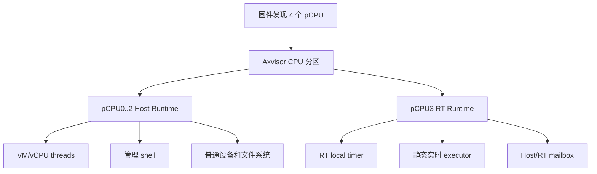
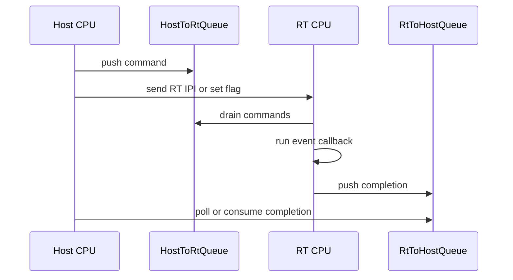

# Axvisor 实时 CPU 分区设计

## 1. 目标范围

Axvisor 的实时能力以物理 CPU 所有权分区为基础，而不是在普通 SMP 调度器里增加一个高优先级任务。设计目标是在 4 核系统上让 `pCPU0..2` 继续运行现有 Axvisor host runtime，让 `pCPU3` 进入独立的实时 runtime；普通 host runtime 仍负责 VM 管理、设备、shell、文件系统和 vCPU thread，实时 CPU 则只执行固定的内核态实时工作，不进入用户态，也不提供 syscall。

### 1.1 问题约束

当前 Axvisor 通过 `os/axvisor/Cargo.toml` 依赖 `ax-std` 并启用 `smp`、`multitask`、`irq`、`hv` 和 `tls`。这些 feature 让 Axvisor 复用 `os/arceos/modules/axruntime/src/mp.rs` 中的 `rust_main_secondary()`，secondary CPU 会初始化 per-cpu、HAL、内存、`ax_task` run queue、IPI 和 IRQ，最后进入 `ax_task::run_idle()`。如果只在 `cpu_id == 3` 时跳到另一个循环，普通 runtime 仍会把该 CPU 视为可调度 CPU，导致启动同步、IPI readiness、IRQ affinity、block runtime 和 vCPU placement 继续依赖它。

这些代码锚点共同定义了第一版不能绕过的行为边界。实时 CPU 分区必须先让 host runtime 明确知道哪些 CPU 属于 host，再让 RT runtime 接管被隔离的 CPU；否则实现会在简单 QEMU 启动中看似可用，却在 VM、IPI、block I/O 或 shell 并发路径中挂死。

| 代码锚点 | 当前职责 | 实时分区影响 |
| --- | --- | --- |
| `axruntime::mp::start_secondary_cpus()` | 按 `ax_hal::cpu_num()` 启动 secondary CPU | 后续需要按 host CPU 集启动普通 secondary，并单独启动 RT CPU |
| `axruntime::mp::rust_main_secondary()` | 所有 secondary CPU 进入普通 runtime | 后续需要在完成最小 CPU 初始化后按所有权分流 |
| `ax_realtime_secondary_main()` | Axvisor 提供的 RT secondary 入口 | RT CPU 从 `axruntime` 跳入 Axvisor RT runtime 的固定落点 |
| `axruntime::INITED_CPUS` | 等待所有普通 runtime CPU 初始化完成 | 计数语义必须改为 host CPU 数，不能包含 RT CPU |
| `ax_ipi::wait_for_all_cpus_ready()` | 等待普通 IPI 可用 | RT CPU 不应参与普通 IPI readiness |
| `axruntime::fs::online_smp()` | 在 SMP online 后扩展 block runtime | 扩展范围必须是 host CPU 集 |
| `config::build_axvm_config()` | 将 guest `cpu_num` 和 placement 交给 AxVM | vCPU placement 必须拒绝 RT CPU |

第一阶段只增加设计文档和默认关闭的代码边界，不改变这些锚点的运行语义。后续阶段每次只改变一个可验证的生命周期边界，确保每个阶段都能独立编译和回滚。

### 1.2 成功标准

最小完整功能不是“有一个高优先级 thread”，而是“host CPU 和 RT CPU 的所有权不可混淆”。在默认关闭时，Axvisor 的现有 QEMU 和板卡行为必须保持不变；启用实时分区后，普通 Axvisor runtime 只能在 host CPU 集上运行，RT CPU 只能运行静态实时 executor，并且 host 侧可以观测 RT 状态。

可观察成功标准按阶段递进。设计阶段只要求文档和空边界可编译；CPU 分区阶段要求 4 核启动时 `pCPU3` 不进入 `ax_task::run_idle()`，而 `pCPU0..2` 上的 Axvisor 和默认 VM 仍能启动；timer 阶段要求 RT CPU 的本地 timer 统计递增；executor 阶段要求周期任务和 deadline miss 统计可观测；设备阶段才要求某个设备 IRQ 被固定交给 RT CPU。



图中的 `Partition` 是整个方案的核心状态源。所有后续模块，包括 secondary boot、scheduler affinity、VM placement、IRQ route 和 block runtime，都应读取同一份 CPU 所有权事实，而不是在各自模块里重复判断“最后一个 CPU”。

### 1.3 非目标

第一版实时能力不承诺完整 FreeRTOS 兼容，也不让 guest vCPU 直接在 RT scheduler 上运行。RT CPU 执行的是 host 内核态静态 executor，不进入用户态，不提供 syscall，不运行 `std::thread`，也不复用普通 `ax_task` 的 sleep、mutex、timer wheel 或 workqueue 语义。

这些非目标降低了第一版的资源所有权和调度复杂度。RT guest 独占物理 CPU、设备直通给 RTOS guest、动态创建实时任务、SCHED_DEADLINE 类调度策略、跨 CPU 迁移和普通设备驱动的实时化都应作为后续独立设计处理。

## 2. 架构边界

实时 CPU 分区引入三个 CPU 集合：固件发现的物理 CPU 集、普通 Axvisor host runtime 拥有的 host CPU 集、RT runtime 独占的 realtime CPU 集。`ax_hal::cpu_num()` 当前被大量代码当作普通 runtime CPU 数使用，因此后续实现不能简单把它解释为物理 CPU 数；需要在 Axvisor/ArceOS runtime 边界上显式传递 host CPU 集。

### 2.1 CPU 所有权

CPU 所有权由一个小而稳定的 Axvisor 边界表达，第一阶段代码锚点是 `os/axvisor/src/realtime.rs` 中的 `CpuOwner` 和 `cpu_owner()`。默认 feature 未启用时，所有 CPU 都属于 `Host`，因此现有行为完全不变；启用后，后续阶段会把配置解析、启动分流和 affinity 校验接到这个边界上。

| CPU 所有者 | 运行内容 | 禁止内容 |
| --- | --- | --- |
| `Host` | Axvisor main、shell、VM manager、普通 vCPU thread、普通设备 IRQ | 无 |
| `Realtime` | 静态 RT executor、RT timer、RT mailbox、RT-owned IRQ | `ax_task` run queue、普通 VM/vCPU、普通 block hctx |
| `Offline` | park loop | 调度、IRQ route、RT executor |

`Offline` 是预留状态，用于处理超过构建容量的 CPU 或未来配置显式禁用的 CPU。第一版不会扩大公共配置面来支持它，但状态模型保留该分支能避免后续用 magic number 或裸布尔值表达不可运行 CPU。

### 2.2 启动分流

后续 CPU 分流应发生在 secondary CPU 完成最小架构初始化之后、进入普通 scheduler 初始化之前。`axruntime::mp::rust_main_secondary()` 当前把所有 secondary CPU 串成一条路径；实时分区实现需要把这条路径拆成“共同最小初始化”和“所有者专属初始化”两个阶段。

```mermaid
stateDiagram-v2
    [*] --> SecondaryEntry
    SecondaryEntry --> MinimalCpuInit
    MinimalCpuInit --> HostSecondary: CpuOwner::Host
    MinimalCpuInit --> RtSecondary: CpuOwner::Realtime
    MinimalCpuInit --> Parked: CpuOwner::Offline
    HostSecondary --> HostIdle: ax_task::run_idle
    RtSecondary --> RtLoop: static executor
    Parked --> Parked: wait_for_irqs
```

`MinimalCpuInit` 至少需要包含 per-cpu area、trap vector、MMU/page table、local interrupt controller 和必要的 allocator per-cpu 状态。`HostSecondary` 继续执行现有 `ax_task::init_scheduler_secondary()`、普通 IPI readiness 和 `INITED_CPUS` 发布；`RtSecondary` 则初始化 RT timer、mailbox 和 executor，不能发布成普通 scheduler CPU。

### 2.3 调度隔离

普通 scheduler 只能看到 host CPU 集，RT CPU 不参与 `ax_task` run queue、task migration、普通 `available_parallelism()`、host console reader affinity 或 VM/vCPU placement。Axvisor 的 `guest_console::host` 已经会通过 `ax_task::set_current_affinity()` 固定 console reader，类似调用在实时分区启用后必须使用 host CPU mask，而不是直接选择物理 CPU。

调度隔离的维护规则是：任何接受 CPU ID 或 CPU mask 的 host-facing API，都必须说明它使用的是 host CPU 命名空间还是物理 CPU 命名空间。VM 配置中的 `phys_cpu_ids` 和 `phys_cpu_sets` 当前通过 `config::build_axvm_config()` 传给 `PhysCpuList::new()`；启用实时分区后，这里必须拒绝包含 RT CPU 的 guest placement，而不是静默重映射。

## 3. 实时运行时

RT runtime 是一个单核、静态、无普通任务调度的执行环境。它可以复用底层 HAL 的 CPU-local、trap、timer 和 IRQ 原语，但不能依赖普通 `ax_task` 的 run queue、sleepable lock、动态 task 创建或线程局部调度语义。

### 3.1 入口函数

RT 核的应用层入口是 `os/axvisor/src/realtime.rs` 中的 `ax_realtime_secondary_main(cpu_id) -> !`。`axruntime` 在完成最小 secondary CPU-local 初始化并判定该 CPU 属于 `SecondaryCpuOwner::Realtime` 后，通过这个符号跳入 Axvisor；因此后续 RT timer、mailbox 和 executor 都应从这个入口向下展开，而不是继续塞在 `axruntime` 内部。

当前入口执行一个临时 heartbeat loop，用于证明 core3 已经离开普通 host scheduler 域，并且持续在 Axvisor RT 入口内运行。`rt status` shell 命令读取 `RtStatus` 快照，显示 RT CPU、入口状态、heartbeat 次数和最近 heartbeat 时间；后续阶段会把 heartbeat loop 替换为 RT timer 初始化和静态 executor 主循环。

### 3.2 静态执行器

第一版 RT executor 只支持启动时静态注册的周期任务和事件任务。周期任务由 RT local timer 驱动，事件任务由 host 到 RT 的 mailbox 触发；任务 callback 运行在 RT CPU 上，不能阻塞在普通 mutex 上，也不能调用可能睡眠的 host API。

| RT 任务字段 | 语义 | 第一版约束 |
| --- | --- | --- |
| `name` | 诊断名称 | 静态字符串 |
| `period` | 周期任务触发间隔 | 固定配置，不动态修改 |
| `deadline` | deadline miss 统计阈值 | 只统计，不做复杂抢占 |
| `callback` | RT CPU 上执行的函数 | 不分配、不睡眠、不迁移 |

第一版不需要引入复杂 trait object 层级。可以先用固定表和函数指针完成最小闭环，等出现多个真实 RT 任务来源后再抽象注册接口。

### 3.3 Timer 模型

RT timer 必须与普通 host scheduler timer 分离。普通 host timer 继续服务 `ax_task`、sleep、timeout 和 VM wait；RT timer 只更新 RT executor 的 deadline 和统计，不调用普通 scheduler tick，也不唤醒普通 task。

AArch64 上尤其需要保持与 `book/design/axvisor-aarch64-generic-timer.md` 的 guest timer 契约一致。RT CPU 如果运行在 EL2 host 侧，必须明确使用哪个物理或虚拟 timer，不能破坏 Axvisor 的 guest CNTV/CNTP world switch、host CNTV PPI ownership 或 VGIC level 语义。

### 3.4 通信队列

Host 和 RT 的通信应通过有界队列和显式 IPI/flag 完成，不能让 RT hot path 获取普通 sleepable lock。第一版可使用启动时预分配的 bounded queue；队列满时返回确定错误或增加 drop 统计，不能在 RT CPU 上无限 spin 等待 host 消费。



这个通信模型把跨 CPU 共享限制在两个队列和少量原子状态中。RT callback 可以读取命令和发布结果，但不能直接调用 `AxvmManager`、shell 输出、文件系统或普通驱动管理接口。

## 4. 资源所有权

实时分区只有在资源所有权同样被分区后才有稳定实时性。CPU 隔离是第一步，后续还必须明确内存、IRQ 和设备是否属于 host 或 RT。

### 4.1 内存池

RT runtime 应使用启动时预分配的静态内存池，进入实时循环后默认不调用全局 allocator。队列、任务表、统计区和 RT stack 都应在 primary CPU 启动阶段或 RT CPU early 阶段完成分配，并在进入 RT loop 前冻结。

共享统计区需要考虑 cache line 对齐和 memory ordering。host 读取 RT 统计时应使用 Acquire，RT 写入发布状态时应使用 Release；只做计数且不承载同步含义的字段可以使用 Relaxed，但必须通过状态发布路径解释可见性。

### 4.2 IRQ 路由

RT-owned IRQ 不能进入普通 host IRQ dispatch。后续接入真实设备时，平台层需要把该 IRQ 的 affinity 固定到 RT CPU，并让 `ax_hal::irq` 或更底层的 controller route 知道该 IRQ 属于 RT owner；普通设备 probe 不应同时绑定同一 MMIO range 或 IRQ line。

第一版设备非目标下，只有 RT local timer 和可能的 RT IPI 需要处理。真实设备接入前必须先定义设备所有权配置、probe 排除规则、IRQ enable/disable 语义和 teardown 行为。

### 4.3 VM 放置

普通 VM 和 vCPU thread 默认只能使用 host CPU 集。Axvisor 的 VM TOML 中 `cpu_num`、`phys_cpu_ids` 和 `phys_cpu_sets` 表达 guest placement；启用实时分区后，配置解析或 `build_axvm_config()` 必须在创建 `PhysCpuList` 前校验这些字段，发现 RT CPU 时返回可诊断错误。

未来如果要让 RTOS guest 独占 RT CPU，应作为“dedicated pCPU guest”单独设计。那条路径涉及 guest vCPU 与物理 CPU 绑定、虚拟中断、timer、设备直通和 host teardown，不应混入第一版 host RT executor。

## 5. 交付阶段

每个阶段必须保持可编译，并且默认行为不变，除非该阶段明确打开实时分区配置。实现 PR 应尽量按纵向切片提交：先建立边界和验证，再接入启动分流，最后扩展 timer、executor 和设备所有权。

### 5.1 阶段一

阶段一只增加设计文档和默认关闭的代码边界。`os/axvisor/src/realtime.rs` 提供 `CpuOwner`、`cpu_owner()` 和 `host_cpu_count()` 这类无副作用查询，默认返回所有 CPU 都属于 host；`os/axvisor/Cargo.toml` 增加 `realtime` feature，但不启用它，不改变任何启动路径。

验收方式是普通 Axvisor crate 继续编译，且启用 `realtime` feature 时这些边界也能通过 clippy。这个阶段不要求 QEMU 行为变化。

### 5.2 阶段二

阶段二把 CPU 分区接入 secondary 启动。目标是在 4 核环境中让 host runtime 只等待 host CPU，RT CPU 进入一个只 park 或统计心跳的 `rt_secondary_main()`，并且普通 Axvisor VM 和 shell 仍能工作。这个阶段只支持最后一个非 0 logical CPU 作为 RT CPU，也就是 4 核系统中的 core3；primary CPU 或中间 CPU 分区涉及 primary boot、日志、设备 probe、IRQ mask 和 VM manager 的所有权迁移，应作为后续独立设计处理。

验收方式应包含一个 4 核 QEMU Axvisor case。通过条件是 host secondary CPU 初始化完成、RT CPU 打印一次初始化成功、默认 VM 启动成功，并且系统不会卡在 `INITED_CPUS` 或 IPI readiness 等待。

### 5.3 阶段三

阶段三增加 RT local timer 和只读统计。RT CPU 的 timer IRQ 只更新 RT 统计，不调用普通 scheduler tick；host 侧通过 shell 或日志读取 `timer_irqs`、`max_dispatch_latency`、`missed_deadlines` 等字段。

验收方式是 RT timer 计数递增，普通 host sleep、VM wait 和 guest timer 行为不回退。AArch64 路径还必须核对 `book/design/axvisor-aarch64-generic-timer.md` 中的 host/guest timer ownership 没有被破坏。

### 5.4 阶段四

阶段四增加静态 RT executor 和 host/RT mailbox。executor 支持固定周期 callback 和事件 callback，mailbox 使用有界预分配队列，队列满时返回错误或计入 drop 统计。

验收方式是一个确定的周期任务能在 RT CPU 上运行并发布统计，host 能提交事件并收到 completion。RT callback 路径不得出现动态分配、普通 sleepable lock 或 `ax_task` API 调用。

### 5.5 阶段五

阶段五才接入 RT-owned 设备或 IRQ。该阶段需要设备所有权配置，普通 probe 排除同一设备，IRQ route 固定到 RT CPU，并提供 teardown 或禁用语义。

验收方式应针对一个简单设备或模拟 IRQ 建立端到端 case。通过条件是设备 IRQ 只由 RT CPU 处理，host VM、shell 和普通设备路径仍稳定，RT latency 和 drop 统计能定位异常。
