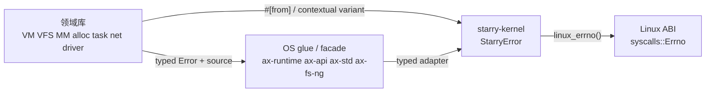

# 领域错误分层与 Linux errno 边界

## 背景与问题

TGOSKits 过去把 `ax-errno` 的 `AxError/AxResult` 同时当作组件错误、OS glue
错误和 Linux ABI errno 使用。这样做有三个直接后果：

- 可复用库在错误发生时就丢失领域类型和 source，调用方只能重新猜测语义；
- 组件反向依赖 OS 错误码，VFS、内存、任务、驱动等边界无法独立演进；
- StarryOS 各调用链重复维护 `map_err`/mapper，容易让同一错误得到不同 errno。

本设计把错误所有权放回产生失败的领域，只在 ABI 或外部 trait 边界做转换。
它是行为保持型架构重构：不得改变 syscall 的 errno 数值、检查顺序或错误优先级。

## 目标与非目标

目标：

- lib、component、domain、driver crate 使用 `thiserror` 定义可匹配的自身错误；
- 一对一转换优先使用 `#[from]` 或 `From`，保留 `source()` 链；
- `starry-kernel` 使用 `StarryError` 聚合内部错误，只在 Linux ABI 边界转为 errno；
- 使用 crates.io 的 `syscalls::Errno` 表示 Linux errno，不在仓库维护重复源码；
- 删除仅搬运类型的 `map_err` 和集中 mapper，保留带操作语义的边界转换；
- host bin/tool 使用 `anyhow` 做顶层编排，不把 `anyhow::Error` 泄漏到库 API。

非目标：

- 不借本次重构改变 Linux ABI 语义；
- 不把所有错误压成一个跨 workspace 的大 enum；
- 不修改 crates.io 第三方库的公开错误 API；
- 不用 host `std::io::Error` 取代需要 `no_std`、可穷举语义的领域错误；
- 不执行物理板卡测试，本次只做板级配置构建。

## 依赖方向与所有权



依赖必须单向向上：领域库不知道 `StarryError` 和 Linux errno；StarryOS 可以依赖
领域库并决定 ABI 映射。外部 trait 要求另一种错误类型时，适配器位于 trait 实现侧，
不能为了适配而让领域 crate 反向依赖上层。

主要错误所有权如下：

| 边界 | 自有错误 |
| --- | --- |
| VM / signal | `VmError`、`SignalError` |
| address space / allocator | `MmError`、`MappingError`、`IomapError`、`TlbShootdownError`、`AllocError` |
| VFS / filesystem runtime | `VfsError`、`BlockError` |
| I/O capability / network | `IoError`、`NetError` |
| task / runtime | `TaskError`、`RuntimeError` |
| ArceOS facade | `ApiError`、`PosixError`、`StdError` |
| drivers | 各驱动自身 `Error`，例如 RGA、KPU、JPEG、JPU、TPU、ION、RKNPU |
| StarryOS kernel | `StarryError` |

仓库不再包含 `components/axerrno`，workspace manifest 也不声明 `ax-errno`。无法在本次
修改的 crates.io `kbpf-basic`、`kmod-loader` 和 `kapi` 仍可传递解析 crates.io 上的
`ax-errno`/`axerrno`；workspace 自有代码不直接导入这些类型。若上游以后提供领域错误，
可直接移除相应传递依赖，不需要恢复本地 patch。

## 转换规则

### 稳定的一对一来源

一个 source 在目标错误中只有一个稳定含义时使用 `#[from]`：

```rust
#[derive(Debug, thiserror::Error)]
pub enum StarryError {
    #[error(transparent)]
    Vm(#[from] VmError),
    #[error(transparent)]
    Vfs(#[from] VfsError),
}
```

调用方使用 `?`，不写 `map_err(Target::Variant)`。手写 `From` 只用于需要保持旧公开
变体、合并多个等价变体或适配不可修改第三方类型的情况。

### 一源多义与操作上下文

同一个 source 会因操作不同而得到不同 ABI 语义时，目标变体必须携带上下文，不能
提供全局 `From`。例如 DMA allocation 的多数失败是 `ENOMEM`，而 device I/O 的非法
layout 是 `EINVAL`、硬件错误是 `EIO`：

```rust
StarryError::Dma {
    operation: DmaOperation::BufferAllocation,
    source,
}
```

同理，ptrace、connect、xattr、netlink、ELF、设备寄存器操作等需要保留显式映射，
因为映射本身表达调用点的语义或 Linux 错误优先级。

### ABI 边界

`StarryError::linux_errno()` 是 Starry 领域错误到 Linux errno 的唯一通用转换。
普通 syscall dispatcher 最终返回：

```rust
-error.linux_errno().into_raw()
```

io_uring、AIO、netlink 等在自身 wire ABI 中嵌入 errno 的接口也调用同一方法。原生
`Errno` 通过 `StarryError::Errno` 原样保存，包括 `syscalls::Errno::new(...)` 构造的
非 canonical 数值。

## Linux errno 类型选择

统一使用 workspace 已有的 crates.io `syscalls` crate：

- `syscalls::Errno` 提供 Linux errno 常量；
- `Errno::new(i32)` 和 `into_raw()` 可以保留、输出原始数值；
- crate 支持 `no_std` 使用，不要求仓库维护生成表；
- errno 不进入领域库公共 API，只出现在 POSIX/Starry ABI 层。

不得新增本地 Linux errno enum、复制 libc 常量表或恢复 `ax-errno` patch。

## 为什么保留 `ax-io::IoError`

`core::io::Error` 是携带动态 payload/上下文的对象型错误，`ErrorKind` 是
`#[non_exhaustive]` 的分类。它们适合标准 I/O trait 的开放生态，但不能完整取代当前
`ax-io` 契约：

- 内核热路径依赖 `IoError: Copy + Eq`；
- VFS、网络和 Starry errno adapter 需要穷举全部领域变体；
- `no_std` 组件不应为动态错误 payload 增加分配和对象所有权；
- `Unsupported` 与 `OperationNotSupported`、`BadAddress` 与 `InvalidInput` 等必须在
  Linux ABI 映射前保持区分。

因此 `ax-io` 保留 typed `IoError/IoResult`，trait 名称和调用风格可继续贴近
`core::io`。在实现真正的 `core::io` trait 时，适配发生在 trait 实现侧，不改变
领域错误所有权。

## Starry errno 映射

以下表是 `StarryError::linux_errno()` 的行为契约。表中用 `A | B` 表示多个领域变体
映射到同一 errno，不表示错误优先级发生合并。

### VM、signal 与内存

| 来源 | 变体 | errno |
| --- | --- | --- |
| `VmError` | `BadAddress | AccessDenied` | `EFAULT` |
| `VmError` | `TooLong` | `ENAMETOOLONG` |
| `SignalError` | `UserMemory(VmError)` | 与对应 `VmError` 相同 |
| `MmError` | `InvalidInput(_)` | `EINVAL` |
| `MmError` | `NoMemory` | `ENOMEM` |
| `MmError` | `AlreadyExists` | `EEXIST` |
| `MmError` | `BadAddress | BadState(_)` | `EFAULT` |
| `MmError` | `Unsupported` | `ENOSYS` |
| `MappingError` | `InvalidParam` | `EINVAL` |
| `MappingError` | `AlreadyExists` | `EEXIST` |
| `MappingError` | `BadState` | `EFAULT` |
| `PagingError` | `NoMemory` | `ENOMEM` |
| `PagingError` | 其余变体 | `EINVAL` |
| `TlbShootdownError` | `CpuOffline | Unsupported` | `ENOSYS` |
| `TlbShootdownError` | `Timeout` | `ETIMEDOUT` |
| `TlbShootdownError` | `Platform` | `EIO` |
| `AllocError` | `NoMemory` | `ENOMEM` |
| `AllocError` | `NotFound` | `ENOENT` |
| `AllocError` | `NotInitialized | AlreadyInitialized` | `EFAULT` |
| `AllocError` | `MemoryOverlap` | `EEXIST` |
| `AllocError` | `InvalidParam | NotAllocated` | `EINVAL` |

### cgroup

| 变体 | errno |
| --- | --- |
| `NotInitialized | InvalidInput` | `EINVAL` |
| `NotFound` | `ENOENT` |
| `AlreadyExists` | `EEXIST` |
| `ResourceBusy` | `EBUSY` |
| `NoSuchProcess` | `ESRCH` |
| `DirectoryNotEmpty` | `ENOTEMPTY` |

### VFS

| `VfsError` 变体 | errno |
| --- | --- |
| `AlreadyExists` | `EEXIST` |
| `BadAddress | BadState` | `EFAULT` |
| `BadFileDescriptor` | `EBADF` |
| `CrossesDevices` | `EXDEV` |
| `DirectoryNotEmpty` | `ENOTEMPTY` |
| `FilesystemLoop` | `ELOOP` |
| `FileTooLarge` | `EFBIG` |
| `InvalidData | InvalidInput` | `EINVAL` |
| `Interrupted` | `EINTR` |
| `Io` | `EIO` |
| `IsADirectory` | `EISDIR` |
| `NameTooLong` | `ENAMETOOLONG` |
| `NoMemory` | `ENOMEM` |
| `NoSuchDevice` | `ENODEV` |
| `NoSuchDeviceOrAddress` | `ENXIO` |
| `NotADirectory` | `ENOTDIR` |
| `NotATty` | `ENOTTY` |
| `NotFound` | `ENOENT` |
| `OperationNotPermitted` | `EPERM` |
| `OperationNotSupported` | `EOPNOTSUPP` |
| `PermissionDenied` | `EACCES` |
| `ReadOnlyFilesystem` | `EROFS` |
| `ResourceBusy` | `EBUSY` |
| `StorageFull` | `ENOSPC` |
| `TimedOut` | `ETIMEDOUT` |
| `Unsupported` | `ENOSYS` |
| `WouldBlock` | `EAGAIN` |

`Unsupported` 表示该 syscall/capability 未实现；`OperationNotSupported` 表示对象存在但
不支持该操作。两者分别保持 `ENOSYS` 和 `EOPNOTSUPP`，禁止合并。

### I/O 与网络

`NetError` 先通过它对 `IoError` 的领域转换，再使用下表：

| `IoError` 变体 | errno |
| --- | --- |
| `AddrInUse` | `EADDRINUSE` |
| `AlreadyConnected` | `EISCONN` |
| `AddressFamilyUnsupported` | `EAFNOSUPPORT` |
| `AlreadyExists` | `EEXIST` |
| `ArgumentListTooLong` | `E2BIG` |
| `BadAddress | BadState` | `EFAULT` |
| `BadFileDescriptor` | `EBADF` |
| `BrokenPipe` | `EPIPE` |
| `ConnectionRefused` | `ECONNREFUSED` |
| `ConnectionReset` | `ECONNRESET` |
| `CrossesDevices` | `EXDEV` |
| `DirectoryNotEmpty` | `ENOTEMPTY` |
| `DestAddrRequired` | `EDESTADDRREQ` |
| `FilesystemLoop` | `ELOOP` |
| `FileTooLarge` | `EFBIG` |
| `IllegalBytes` | `EILSEQ` |
| `InProgress` | `EINPROGRESS` |
| `Interrupted` | `EINTR` |
| `InvalidData | InvalidInput` | `EINVAL` |
| `InvalidExecutable` | `ENOEXEC` |
| `Io | UnexpectedEof | WriteZero` | `EIO` |
| `IsADirectory` | `EISDIR` |
| `MessageTooLong` | `EMSGSIZE` |
| `NameTooLong` | `ENAMETOOLONG` |
| `NoMemory` | `ENOMEM` |
| `NoSuchDevice` | `ENODEV` |
| `NoSuchDeviceOrAddress` | `ENXIO` |
| `NoSuchProcess` | `ESRCH` |
| `NotADirectory` | `ENOTDIR` |
| `NotASocket` | `ENOTSOCK` |
| `NotATty` | `ENOTTY` |
| `NotConnected` | `ENOTCONN` |
| `NotFound` | `ENOENT` |
| `OperationNotPermitted` | `EPERM` |
| `OperationNotSupported` | `EOPNOTSUPP` |
| `OutOfRange` | `ERANGE` |
| `PermissionDenied` | `EACCES` |
| `ProtocolOptionUnsupported` | `ENOPROTOOPT` |
| `ReadOnlyFilesystem` | `EROFS` |
| `ResourceBusy` | `EBUSY` |
| `StorageFull` | `ENOSPC` |
| `TimedOut` | `ETIMEDOUT` |
| `TooManyOpenFiles` | `EMFILE` |
| `Unsupported` | `ENOSYS` |
| `WouldBlock` | `EAGAIN` |

### task、runtime 与 block runtime

| 来源 | 变体 | errno |
| --- | --- | --- |
| `TaskError` | `Interrupted(_)` | `EINTR` |
| `TaskError` | `Elapsed(_)` | `ETIMEDOUT` |
| `TaskError` | `WouldBlock` | `EAGAIN` |
| `TaskError` | `Irq(_)` | `EIO` |
| `RuntimeError` | `SerialNotStarted` | `EFAULT` |
| `RuntimeError` | `SerialControlBusy` | `EBUSY` |
| `RuntimeError` | `WouldBlock` | `EAGAIN` |
| `RuntimeError` | `OperationNotSupported` | `EOPNOTSUPP` |
| `RuntimeError` | `InvalidCpu { .. }` | `EINVAL` |
| `RuntimeError` | 其余 source 变体 | `EIO` |
| `BlockError` | `InvalidRequest` | `EINVAL` |
| `BlockError` | `InvalidState | RuntimeUnavailable` | `EFAULT` |
| `BlockError` | `WouldBlock` | `EAGAIN` |
| `BlockError` | `NoMemory` | `ENOMEM` |
| `BlockError` | `Unsupported` | `ENOSYS` |
| `BlockError` | `TimedOut` | `ETIMEDOUT` |
| `BlockError` | `ResourceBusy` | `EBUSY` |
| `BlockError` | `NotFound` | `ENOENT` |
| `BlockError` | `Io | Irq(_)` | `EIO` |
| `BlockError` | `Device { source, .. }` | 按 `source: BlkError` 保留上述类别 |

### DMA、设备与其他边界

| 来源/上下文 | 变体 | errno |
| --- | --- | --- |
| DMA buffer allocation | `LayoutError(_)` | `EINVAL` |
| DMA buffer allocation | 其余 `DmaError` | `ENOMEM` |
| DMA device I/O | `NoMemory` | `ENOMEM` |
| DMA device I/O | `LayoutError(_) | NullPointer | ZeroSizedBuffer` | `EINVAL` |
| DMA device I/O | 其余 `DmaError` | `EIO` |
| `ax_driver::Error` | 全部 source-preserving 变体 | `EIO` |
| `core::fmt::Error` | — | `EINVAL` |
| `Interrupted` | — | `EINTR` |
| `Elapsed` | — | `ETIMEDOUT` |

设备领域错误必须在进入 `StarryError` 前保留具体 source。RGA、JPEG、KPU、JPU、TPU、
ION、RKNPU、USB、vsock 等一源多义操作使用带 operation 的 Starry 变体或调用点转换；
不能在驱动 crate 内提供 Linux `as_errno()`。

### Starry 自有叶子变体

| 变体 | errno | 变体 | errno |
| --- | --- | --- | --- |
| `AlreadyExists` | `EEXIST` | `ArgumentListTooLong` | `E2BIG` |
| `BadAddress | BadState` | `EFAULT` | `BadFileDescriptor` | `EBADF` |
| `BrokenPipe` | `EPIPE` | `CrossesDevices` | `EXDEV` |
| `FilesystemLoop` | `ELOOP` | `IllegalBytes` | `EILSEQ` |
| `InProgress` | `EINPROGRESS` | `Interrupted` | `EINTR` |
| `InvalidData | InvalidInput` | `EINVAL` | `InvalidExecutable` | `ENOEXEC` |
| `Io | UnexpectedEof | WriteZero` | `EIO` | `IsADirectory` | `EISDIR` |
| `NameTooLong` | `ENAMETOOLONG` | `NoMemory` | `ENOMEM` |
| `NoSuchDevice` | `ENODEV` | `NoSuchDeviceOrAddress` | `ENXIO` |
| `NoSuchProcess` | `ESRCH` | `NotADirectory` | `ENOTDIR` |
| `NotASocket` | `ENOTSOCK` | `NotATty` | `ENOTTY` |
| `NotFound` | `ENOENT` | `OperationNotPermitted` | `EPERM` |
| `OperationNotSupported` | `EOPNOTSUPP` | `OutOfRange` | `ERANGE` |
| `PermissionDenied` | `EACCES` | `ReadOnlyFilesystem` | `EROFS` |
| `ResourceBusy` | `EBUSY` | `StorageFull` | `ENOSPC` |
| `TimedOut` | `ETIMEDOUT` | `TooManyOpenFiles` | `EMFILE` |
| `Unsupported` | `ENOSYS` | `WouldBlock` | `EAGAIN` |

## VFS 与外部 trait 适配

`axfs-ng-vfs` 只暴露 `VfsError/VfsResult`，不依赖 errno。ext4、FAT、volume 和 block
runtime 在 `ax-fs-ng` 实现层转换为 `VfsError`。实现 `ax-io` trait 时，`ax-fs-ng`
再把 `VfsError` 转为 `IoError`；这是两个平级 capability 之间的显式适配，不是 Linux
ABI 转换。

Starry pseudofs 实现 VFS trait 时，优先直接返回 `VfsError`。内部操作已经产生
`StarryError` 且必须跨 VFS trait 时，转换会尽量保留原 `VfsError`；不能表达的 errno
显式回退为 `VfsError::Io`。该回退只存在于外部 trait 边界，Starry 内部调用链仍保留
完整 source。

## 设备错误

SG200x JPU 展示了驱动领域的分层方式：

- `JpegHeaderError`：JPEG marker/table/parser 失败；
- `JpuDmaAddressError`：32 位 DMA register 表示失败；
- `JpuBufferError`：frame/plane/buffer invariant；
- `JpuRegisterError`：reset/BBC register poll；
- `JpuHardwareSetupError`：GRAM setup，并通过 `#[from]` 保留 register/DMA source；
- `JpuInspectError/JpuDecodeError`：公开操作级聚合错误。

table upload 当前没有失败分支，因此返回 `()`；禁止为了统一签名保留假的
`Result<(), &'static str>`。其他驱动也遵循同一规则：字符串只用于 Display 文本和
日志，不作为可恢复错误 payload。

## 迁移与验收顺序

1. 给现有领域错误补齐 `thiserror::Error`，保持调用语义。
2. 迁移 allocator、MM、task、runtime、API facade 和全部 workspace consumers。
3. 迁移设备错误，补齐 operation adapter。
4. 一次性迁移 VFS enum、trait 实现和 filesystem adapter。
5. 引入 `StarryError`，迁移 kernel 私有调用链并删除纯搬运 mapper。
6. 删除本地 `ax-errno` crate、workspace dependency、patch、测试白名单和仓库同步项。
7. 审计所有剩余 `map_err`：只允许外部 trait、第三方错误或操作相关 ABI 映射。

验收证据包括：

- 每个领域 crate 的变体、Display 和 source 测试；
- `DomainError -> StarryError -> Errno` 表驱动断言；
- 非 canonical `Errno::new(...)` 数值不丢失；
- 受影响 package 的 `cargo xtask clippy --package ...`；
- 四架构 Starry QEMU/axtest 和 x86_64 system 用例；
- QEMU AArch64、OrangePi 5 Plus、SG2002、K230 配置构建；
- 不执行物理板卡测试。

最终依赖审计必须满足：workspace-owned manifest 不直接声明 `ax-errno`，仓库不存在
本地 `axerrno` 源码或 patch；锁文件中的同名包只能来自 crates.io 第三方传递依赖。
