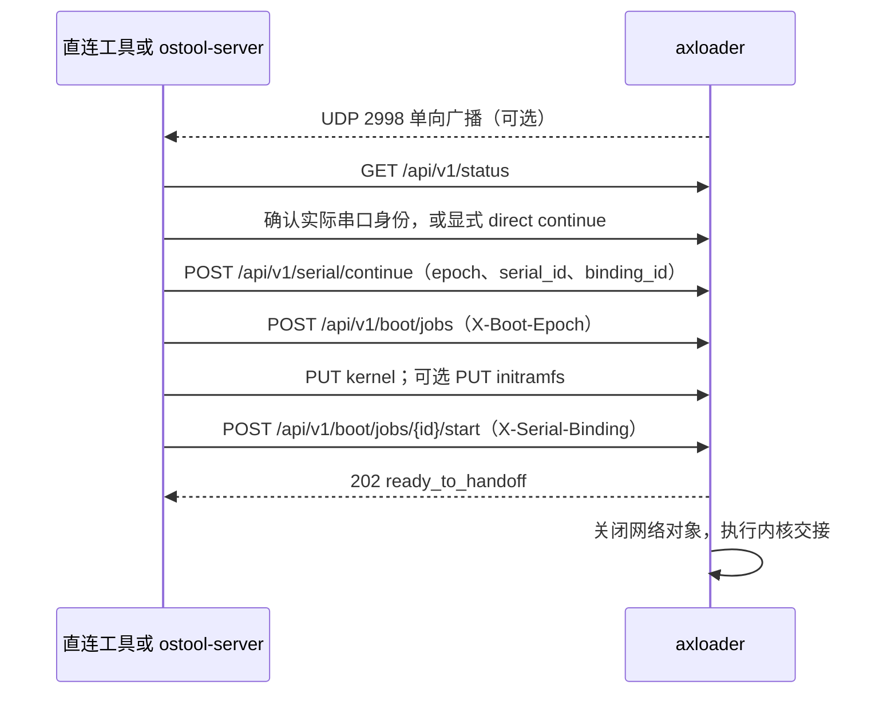
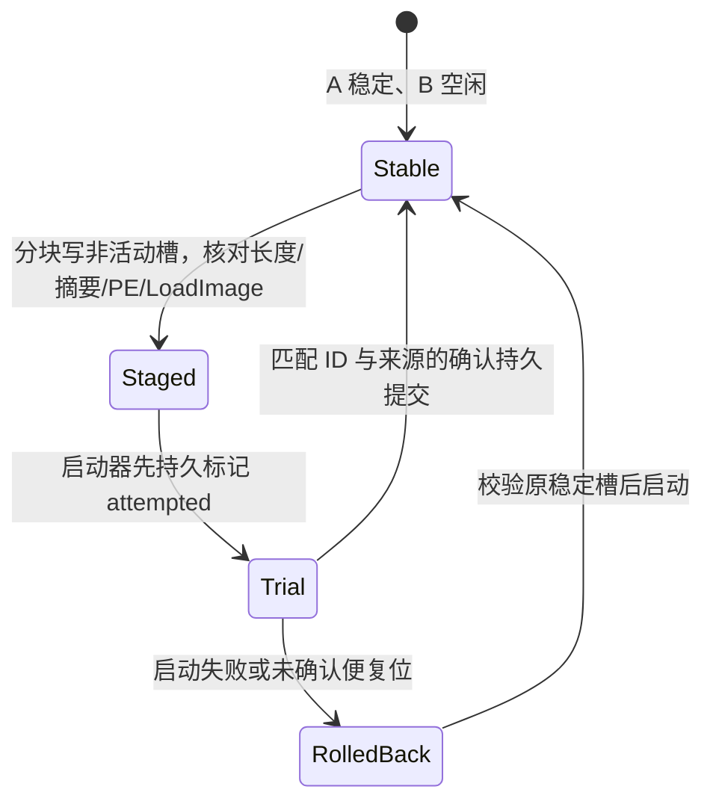

# axloader

## 1. 网络控制

### 1.1 设备接口

axloader 在同一网卡使用 UEFI SNP、IP4、UDP4 与 TCP4，向 UDP `2998` 广播自身
MAC、架构、`boot_epoch` 和 HTTP 端口，并在 TCP `2999` 提供设备接口。它不再
发现 ostool-server、轮询任务或通过 HTTP 下载镜像；串口在启动前输出本次身份帧和诊断，并在交接后
供目标系统使用。`network::NetworkInterface::select()` 选择网卡，
`network::Announcer` 广播，`direct::Listener` 接受请求。调用方可以直接按设备 IP
操作，ostool-server 也调用同一组接口。

每次启动创建新的 `boot_epoch`。所有修改请求均需 `X-Boot-Epoch` 与
`GET /api/v1/status` 返回值一致；错误代次返回 `409`。当前协议为 v6，旧版
v2/v3/v4 的兼容入口只保留在 ostool-server。以下接口由
`boot_server::BootServer` 和 `axloader::ota::OtaController` 共享监听器：

| 接口 | 作用 |
| --- | --- |
| `GET /api/v1/status` | 读取启动代次、MAC、实际 UART 参数、绑定/错误、硬件、启动事务与 OTA 状态 |
| `POST /api/v1/serial/continue` | 当前 epoch、serial_id、binding_id、bound/direct；相同请求幂等 |
| `DELETE /api/v1/serial/bindings/{binding_id}` | 撤销当前匹配令牌，恢复身份帧 |
| `POST /api/v1/boot/jobs` | 提交启动 ID、x86_64 ELF64、内核和可选归档的长度、SHA-256、命令行；入口固定为 `__x86_64_efi_pe_entry` |
| `GET /api/v1/boot/jobs/{id}` | 查询已接收文件及阶段 |
| `PUT /api/v1/boot/jobs/{id}/kernel` | 定长上传内核，要求匹配 `X-Image-Sha256` |
| `PUT /api/v1/boot/jobs/{id}/initramfs` | 定长上传可选归档，要求匹配摘要 |
| `POST /api/v1/boot/jobs/{id}/start` | 核对 `X-Serial-Binding` 后装载、回复 `202`，释放 UART 和固件网络后交接 |
| `DELETE /api/v1/boot/jobs/{id}` | 取消尚未启动的事务 |
| `GET /api/v1/ota/status` | 读取 ESP 稳定槽和待试槽状态 |
| `PUT /api/v1/ota/image` | 定长上传 EFI，写入非活动槽后回复 `202` 并重启 |
| `POST /api/v1/ota/confirm` | 用升级 ID 和来源确认当前待试槽 |

v6 设备必须与支持 `POST /api/v1/serial/continue`、`X-Serial-Binding` 的
ostool-server 配套使用，板卡 ESP/U 盘中的 `axloader.efi` 也要更新到同一版本。
不需要串口隧道时仍须显式发送 `direct` continue；启动返回 `409 serial_binding_required`
时，先检查服务端/loader 版本是否配套，再检查串口身份是否完成绑定。

启动文件暂存内存，每个文件上限 256 MiB，EFI 上限 32 MiB，请求头上限
4 KiB。只接受定长请求体，连接空闲 30 秒后取消，SHA-256 不符时不发布文件。
上传时 `direct::Connection::wait()` 仍推进广播；同一时间只处理一个上传事务。
`BootServer::create()` 允许同 ID、同清单重试，其他并发事务返回冲突。只有
文件核对和 `elf_loader::load_elf()`、`payload::prepare_uploaded()` 成功后，
才回复 `ready_to_handoff`、释放 TCP/UDP 对象并进入内核。

`cmdline` 与 `initramfs` 相互独立且都可省略。axloader 把命令行编码成带 NUL
结尾的 UCS-2，临时安装到自身 `EFI_LOADED_IMAGE_PROTOCOL.LoadOptions`；没有
命令行时显式安装空 LoadOptions，避免把 axloader 自身参数传给内核。归档存在时，
axloader 注册 Linux EFI initrd 约定的 `EFI_LOAD_FILE2_PROTOCOL` 提供者和
`MEDIA/VENDOR` 设备路径；EFI 入口异常返回时会恢复
原 LoadOptions，并释放本次事务持有的命令行与归档。

### 1.2 启动流程

调用方无需提供 ostool-server 地址。宿主可查询设备 IP，直接提交启动事务；
ostool-server 在实验网收到广播后先 GET 状态，再依据板卡 MAC 和 Session 决定是否上传。



同一 Session 设备复位后得到新启动代次，服务端可以按旧 `boot_id` 重新推送。
待试 EFI 槽必须先收到对应来源的确认，才接受启动事务。TCP4 被动监听不可用
时仅显示诊断；完全切换后的网络启动需要固件提供该协议。

## 2. 自动串口

`loader::serial::SerialBeacon` 从固件 `ConOut` 设备路径匹配唯一 UART，读取 `Serial::io_mode()`
的生效波特率、数据位、校验、停止位和硬件流控。无法读取某个参数时使用 UEFI 常见的
115200/8N1、无硬件流控，并在 HTTP 状态保留诊断；无法唯一选择 UART 或没有可用协议时仍
明确报告自动绑定不可用。身份帧会先应用有效参数写出，再恢复固件原设置。不以 USB SN 或
SMBIOS serial 作为启动身份。

### 2.1 本次身份与门禁

每次启动的 `serial_id` 是独立 128 位 ID；优先 UEFI RNG，缺失时将平台单调计数、
固件时间和 MAC 哈希为 ID，不能仅靠秒级时间和栈地址区分快速复位。
`SerialBeacon::progress()` 每 250 ms 启动 ASCII 身份帧发送，以最多 4 字节的部分写入推进。
`BootServer` 状态与 UDP 公告关联同一 serial_id 和 epoch；网络确认后停止身份帧。

```text
\r\nAXLOADER-SERIAL/1 <32位小写十六进制 serial_id>\r\n
```

`bound` 对应宿主 UART 身份匹配；`direct` 由不需要隧道的客户端显式放行，不能显示为串口已绑定。
启动需当前 epoch 和绑定令牌；上传、查询、OTA 不受 UART 门禁影响。撤销当前令牌后恢复发送。
设备重启后任何旧 ID 和绑定均无效。

### 2.2 固件借用与退出

现有 console driver 保持连接。每次参数读取或写入使用短期非独占 `GetProtocol` guard，
在 `TPL_CALLBACK` 阻止竞争回调，先关闭 guard 再恢复 TPL；没有协议引用跨越网络轮询。
写入暂用 5 ms 超时并恢复原属性，无事件回调保留 Rust 上下文。
`efi_main` 在 OTA reset 和内核交接前显式析构 TCP/UDP 对象与 beacon 计时器。
约束依据 [UEFI Boot Services](https://uefi.org/specs/UEFI/2.10/07_Services_Boot_Services.html)
和 [Serial IO](https://uefi.org/specs/UEFI/2.11/12_Protocols_Console_Support.html#efi-serial-io-protocol-write)。

## Hardware identity

The permanent SNP MAC is preferred. If it is empty, the current link MAC is
used. Only six-byte Ethernet addresses are accepted.

SMBIOS 3 is preferred and SMBIOS 2 is the fallback. The loader reports only
Type 1 manufacturer, product, version, and serial through HTTP. Parsing checks
entry-point checksums, structure bounds, string termination and string indexes,
and rejects tables larger than 1 MiB.

## Supported targets

| Architecture | Rust UEFI target | EFI boot filename |
| --- | --- | --- |
| `x86_64` | `x86_64-unknown-uefi` | `BOOTX64.EFI` |

The current loader accepts little-endian x86_64 ELF64 images. `PT_LOAD`
segments must have page-aligned physical addresses. Protocol v6 requires the
`__x86_64_efi_pe_entry` symbol and rejects `httpboot_entry`, an ELF header entry,
or a `BootInfo` fallback. The maximum uploaded kernel is 256 MiB.

## Build and test

Use the project task runner:

```bash
rustup target add x86_64-unknown-uefi
cargo xtask axloader build --target x86_64-unknown-uefi --release
cargo xtask clippy --package axloader
cargo xtask axloader test qemu --target x86_64-unknown-uefi
```

The output is:

```text
target/x86_64-unknown-uefi/release/axloader.efi
target/x86_64-unknown-uefi/release/axloader-launcher.efi
```

QEMU 测试使用 OVMF、真实 FAT 磁盘和 `hostfwd` 访问设备监听端口；
跨启动上传真实 ArceOS UEFI ELF，分别验证两个字段均省略、仅 cmdline、仅
initramfs、两者都有以及 ESP initramfs 回退，并以目标内核输出的 `HOST_CMDLINE`、
`HOST_INITRAMFS_PASSED` 为成功证据。测试先核对真实 UART 身份及上报参数，再验证 bound/direct 放行、错误绑定令牌拒绝，
并覆盖 SHA-256、OTA 待试槽确认和
回滚。服务端协议测试另见 ostool 的
`docs/axloader-network-control.md`。

## x86_64 OTA 布局与状态

安装后，ESP 中的 `EFI/BOOT/BOOTX64.EFI` 是独立构建的
`axloader-launcher.efi`；`EFI/AXLOADER/A.EFI`、`B.EFI` 是可升级装载器。
全新安装时 A、B 初始使用同一份新装载器，A 为稳定槽且没有待试升级；迁移安装时
A 保存旧装载器，B 使用新装载器。`STATE0.BIN` 与 `STATE1.BIN` 分别存放 256 字节
`State::encode()` 记录。记录包含代次、稳定槽、待试槽、两槽 SHA-256、
升级 ID、来源、试运行标志、上次结果和记录校验和。`OtaDisk::load()` 只选择
校验通过且代次较新的记录，`OtaDisk::commit()` 只写另一份，Flush 后读回
核对。FAT 不是事务性文件系统；两份记录都不可用时启动器停止并显示诊断。



`launcher::launch()` 从同一 ESP 的完整设备路径调用 `LoadImage`／`StartImage`；
只信任状态记录中对应的文件摘要。待试槽在接收服务端确认指令或直连方确认前
不会接收内核启动命令。待试装载器宕机或断电，下一次启动先回滚。旧稳定槽
也无法核对时，必须使用外部介质修复；回滚会清除未确认槽的可信摘要，
防止它在稳定槽随后损坏时被提升为稳定槽。普通升级只写非活动槽；32 MiB 是
镜像上限。

`loader::direct::Listener` 同时处理上述启动和升级路由。直连上传不依赖
ostool-server；上传方在重启后先核对运行摘要与升级 ID，再用当前启动代次
确认。服务端指派传入 `X-Update-Source: server` 和 `X-Update-Id`，只在再次
发现匹配升级 ID 与运行摘要的待试槽后发送同来源确认。直连任务无法由服务端
误确认；确认状态写入并 Flush 成功后才接收内核启动事务。

仅在可信隔离实验网使用：SHA-256 检查传输一致性，不认证上传者或服务器，
MAC 也不是身份认证。若以后要求内核验签，须先让 A/B 都执行同一验签策略并
验证拒绝路径，再允许回滚；旧槽可能恢复旧的内核认证缺口。

## Install to removable media

脚本支持全新安装和旧布局迁移。全新安装适用于已经格式化但没有可用
`BOOTX64.EFI` 的 x86_64 可写 FAT ESP，不需要旧装载器：

```bash
./bootloader/axloader/scripts/build-install-efi.sh \
  --fresh --device /dev/sdb1
```

全新安装会把新装载器复制到 A、B，生成稳定状态记录，再写入 launcher。
如果 ESP 原先有 `BOOTX64.EFI`，脚本会把它保存为
`EFI/AXLOADER/BOOTX64.PREVIOUS.EFI`，但不会把它作为回滚槽使用。首次启动不需要
确认；后续 OTA 从非活动槽开始试运行。首次替换 launcher 仍有断电窗口，必须保留
外部恢复介质。

迁移已有系统时，保留旧版 `BOOTX64.EFI` 并省略 `--fresh`：

```bash
./bootloader/axloader/scripts/build-install-efi.sh
./bootloader/axloader/scripts/build-install-efi.sh --device /dev/sdb1
```

默认按 `OSTOOLBOOT` 查找分区。脚本会构建并校验两个 PE 映像、检查空闲空间、
写入 A/B 和双状态记录、同步并逐项核对，最后替换 `BOOTX64.EFI`。迁移模式还会
把旧文件保存为 `EFI/AXLOADER/BOOTX64.ORIGINAL.EFI`，B 首次作为直连待试槽，
安装命令打印升级 ID，上传方须在首次启动后核对摘要并调用确认接口。两种模式都
会拒绝已有 `EFI/AXLOADER` 文件的 ESP，避免覆盖未知状态；请先离线恢复或清理。

`cargo xtask axloader test qemu --target x86_64-unknown-uefi` 使用同一块真实
FAT 映像跨多次启动，检查 `hostfwd` 上的直连、错误摘要、短请求、待试复位、
持久确认及旧槽恢复。宿主需要 `qemu-system-x86_64`、KVM、`mkfs.vfat`、
`mcopy`、`mmd` 和 `python3`。完整的本地服务端联调以隔离配置和 loopback
管理端口运行，不安装 systemd 服务，也不修改 runner。

## Troubleshooting

`loader_tcp4_unavailable` 表示同一网卡没有 SNP/IP4/UDP4/TCP4 协议束；
`loader_tcp4_listen_failed` 表示固件未能在端口 `2999` 创建被动 TCP4 实例。
`loader_broadcast_error` 仅影响自动发现；有设备 IP 的直连调用仍可用。
返回 `409 stale_boot_epoch` 时重新 GET 状态，使用新的启动代次发起请求。
`ready_to_handoff` 后出现交接错误，应核对 ELF/归档入口和 UEFI 退出路径。
