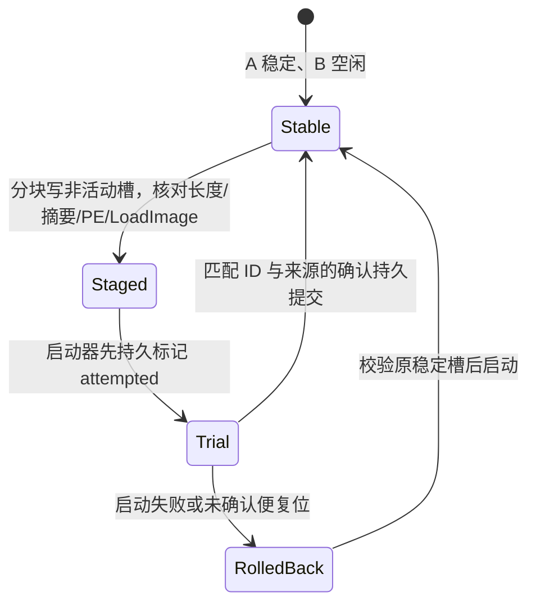

# axloader

`axloader` is the UEFI loader used by AxVisor HTTP-boot boards. Its control
plane uses firmware-provided network protocols; serial is reserved for loader
diagnostics and for the target system after handoff.

The loader does not implement a network adapter driver and does not read UEFI
`ConIn` or open `SerialIo`. It selects one physical UEFI controller that
provides all of these protocols:

- `EFI_SIMPLE_NETWORK_PROTOCOL` for the permanent and current Ethernet MAC;
- `EFI_IP4_CONFIG2_PROTOCOL` for IPv4 configuration;
- `EFI_UDP4_SERVICE_BINDING_PROTOCOL` for server discovery;
- `EFI_HTTP_SERVICE_BINDING_PROTOCOL` for JSON control and image download.

Keeping those services in one interface bundle prevents discovery on one NIC
and HTTP transfer on another. Diagnostic text uses firmware `ConOut` only.

## Network boot protocol

`httpboot-protocol` 0.3 按同一 `boot_id` 交接内核和可选的宿主
`initramfs`、`cmdline`。`BootPayload` 在退出 UEFI Boot Services 前安装到配置表，
由 someboot 接收并预留归档物理页。会话流程如下：

1. 在选定的 UEFI 网络控制器上配置 IPv4，并向 UDP 端口 `2998` 广播包含协议版本、
   MAC、架构和加载器版本的 JSON 发现报文。
2. 只接受一个服务端的响应；多个服务端响应会触发重新发现。
3. 读取 SMBIOS Type 1 身份；设备未绑定或空闲时，每两秒调用
   `POST /api/v1/loaders/poll`。
4. 收到 `boot` 后通过 `POST /api/v1/loaders/status` 报告进度，下载内核 ELF，
   核验长度和 SHA-256。若本会话提供宿主 initramfs，再下载该归档并独立核验长度
   和 SHA-256，同时保存 `cmdline`。任一核验失败都不交接。
5. `PreparedPayload::publish()` 把归档页和命令行写入 `BootPayload` 配置表；随后
   报告 `ready_to_handoff`，销毁 UDP/HTTP/IP 对象，退出 Boot Services 并进入内核。
   若状态上报失败，撤销配置表并回收尚未交接的归档页。

Every loader restart performs discovery again and gets a fresh
`registration_id`. The server binds the device by its persistent MAC and may
reissue the active Session's same `boot_id`. A failed `boot_id` is not retried
until the server publishes a new command.

Discovery retries forever with a 1, 2, 4, 8, then 10 second capped backoff. An
unbound or idle loader remains available for configuration and future
Sessions; it never falls back to serial control.

## Hardware identity

The permanent SNP MAC is preferred. If it is empty, the current link MAC is
used. Only six-byte Ethernet addresses are accepted.

SMBIOS 3 is preferred and SMBIOS 2 is the fallback. The loader reports only
Type 1 manufacturer, product, version, and serial through HTTP. Parsing checks
entry-point checksums, structure bounds, string termination and string indexes,
and rejects tables larger than 1 MiB.

## Supported targets

| Architecture | Rust UEFI target | EFI boot filename |
| --- | --- | --- |
| `x86_64` | `x86_64-unknown-uefi` | `BOOTX64.EFI` |

The current loader accepts little-endian x86_64 ELF64 images. `PT_LOAD`
segments must have page-aligned physical addresses. If `httpboot_entry` is
requested, the loader resolves that symbol; otherwise it uses the ELF header
entry. The maximum download is 256 MiB.

## Build and test

Use the project task runner:

```bash
rustup target add x86_64-unknown-uefi
cargo xtask axloader build --target x86_64-unknown-uefi --release
cargo xtask clippy --package axloader
cargo xtask axloader test qemu --target x86_64-unknown-uefi
```

The output is:

```text
target/x86_64-unknown-uefi/release/axloader.efi
target/x86_64-unknown-uefi/release/axloader-launcher.efi
```

The QEMU test uses OVMF, q35, a virtio network device, real UDP discovery and
HTTP control/download. The serial stream is observed for diagnostics and is
never used to inject a command. Success requires all of the following:

- discovery and HTTP polling completed;
- `/kernel.elf` 和 `/session/initramfs.cpio` 都被请求；
- 内核和归档各自的长度及 SHA-256 均已核验；
- 诊断输出包含 `host_payload_ready:`；
- `ready_to_handoff` reached the control server;
- `elf_loaded:` appeared in diagnostics.

## x86_64 OTA 布局与状态

首次迁移后，ESP 中的 `EFI/BOOT/BOOTX64.EFI` 是独立构建的
`axloader-launcher.efi`；`EFI/AXLOADER/A.EFI` 是迁移前的装载器，
`B.EFI` 是新装载器。`STATE0.BIN` 与 `STATE1.BIN` 分别存放 256 字节
`State::encode()` 记录。记录包含代次、稳定槽、待试槽、两槽 SHA-256、
升级 ID、来源、试运行标志、上次结果和记录校验和。`OtaDisk::load()` 只选择
校验通过且代次较新的记录，`OtaDisk::commit()` 只写另一份，Flush 后读回
核对。FAT 不是事务性文件系统；两份记录都不可用时启动器停止并显示诊断。



`launcher::launch()` 从同一 ESP 的完整设备路径调用 `LoadImage`／`StartImage`；
只信任状态记录中对应的文件摘要。待试槽在接收服务端确认指令或直连方确认前
不会接收内核启动命令。待试装载器宕机或断电，下一次启动先回滚。旧稳定槽
也无法核对时，必须使用外部介质修复；回滚会清除未确认槽的可信摘要，
防止它在稳定槽随后损坏时被提升为稳定槽。普通升级只写非活动槽；32 MiB 是
镜像上限。

`loader::direct::Listener` 使用同一 NIC 的 UEFI TCP4 被动监听 `2999`：

| 接口 | 调用 |
| --- | --- |
| `GET /api/v1/ota/status` | 查看运行/稳定槽、摘要、升级 ID、阶段和最近结果 |
| `PUT /api/v1/ota/image` | 原始 EFI 请求体；必须带 `Content-Length`、`X-Image-Sha256`，成功返回 `202` 和升级 ID 并冷重启 |
| `POST /api/v1/ota/confirm` | JSON `{"update_id":"..."}`；仅当前直连待试槽接受 |

直连升级不依赖 ostool-server。上传方在重启后先核对 `running_sha256` 和
`pending_update_id`，再确认。服务端指派使用协议 v4：轮询带 `ota` 状态，
`update` 给出镜像 URL/长度/摘要，装载器下载、落盘并重启；新槽轮询到匹配
注册代次、MAC、升级 ID 与运行摘要后才接收 `confirm_update`。服务器启动任务
仍兼容 v3。TGOS 暂以 `httpboot-protocol` 0.3 的启动结构序列化加上 v4 OTA
字段；ostool 0.4 的协议发布后可直接替换为共享 OTA 类型。

当前使用的 OVMF 在同一网卡同时保持被动 TCP4 子对象与 HTTP 客户端时，
服务端控制请求会停住。装载器在控制请求期间暂时关闭直连监听，交换完成
后重新监听；直连方如果在该窗口连接失败，应重新查询状态再上传或确认。
发现服务器和轮询间隔仍会处理直连接入；这份固件暂不能保证控制请求期间
端口 `2999` 连续可用。HTTP 子对象配置了 10 秒固件超时，令牌仍由固件的
`Poll` 完成；固件若不完成令牌，当前没有独立于固件的强制截止时间。

仅在可信隔离实验网使用：SHA-256 检查传输一致性，不认证上传者或服务器，
MAC 也不是身份认证。若以后要求内核验签，须先让 A/B 都执行同一验签策略并
验证拒绝路径，再允许回滚；旧槽可能恢复旧的内核认证缺口。

## Install to removable media

本脚本只做首次迁移，必须在尚有旧版 `BOOTX64.EFI` 的 x86_64 可写 ESP 上运行：

```bash
./bootloader/axloader/scripts/build-install-efi.sh
./bootloader/axloader/scripts/build-install-efi.sh --device /dev/sdb1
```

默认按 `OSTOOLBOOT` 查找分区。脚本先构建并校验两份 PE 映像、检查空闲
空间，把旧文件备份为 `EFI/AXLOADER/BOOTX64.ORIGINAL.EFI` 与 A，写入 B、
双状态记录和临时启动器并同步、逐项核对；最后才覆盖 `BOOTX64.EFI`。
首次替换启动器仍有断电窗口；保留原文件备份和外部启动介质。B 首次作为
直连待试槽，安装命令打印升级 ID，上传方须在首次启动后核对摘要并调用
确认接口。脚本发现已有布局会中止，需离线修复后再尝试。

`cargo xtask axloader test qemu --target x86_64-unknown-uefi` 除原有内核
HTTP 交接冒烟外，使用同一块真实 FAT 映像跨多次 QEMU 启动，宿主通过
`hostfwd` 检查直连端口、错误 SHA/短请求、首次确认、待试掉电回滚、
确认后持久启动、写完非活动槽但尚未提交状态的断电，以及 v4 服务端指派、
确认和再次启动。此测试需要 `qemu-system-x86_64`、KVM、`mkfs.vfat`、
`mcopy`、`mmd`、`python3`。

## Troubleshooting

`network_select_error`

No single UEFI controller exposes SNP, IPv4 configuration, UDP4 service
binding, and HTTP service binding. Check that the firmware contains the driver
for the configured NIC.

`discovery_error: Timeout`

The loader did not receive a valid UDP offer. Check VLAN/bridge broadcast
forwarding, server UDP port `2998`, DHCP, and that exactly one server instance
is visible.

`control_boot_error`

The poll or status exchange failed. Check the offered HTTP base URL and the
server's `loader_network.public_base_url` as seen from the UEFI client. JSON
POST requests carry explicit `Content-Type: application/json` and
`Content-Length` headers because an HTTP/1.1 server must not infer a request
body from bytes following an unframed header block.

`elf_load_error: Download(SizeMismatch)`、`Sha256Mismatch` 或 `host_payload_error`

内核或宿主归档与当前会话清单不符，或者宿主镜像无法安装到 UEFI 配置表。检查
服务端该 `boot_id` 的镜像和 `cmdline`，上传新制品以创建新 `boot_id`；失败的命令
不会在同一会话中自动重试。

When debugging handoff, remember that `ready_to_handoff` is the last reliable
network state. No UEFI network object may remain live across
`ExitBootServices`.
