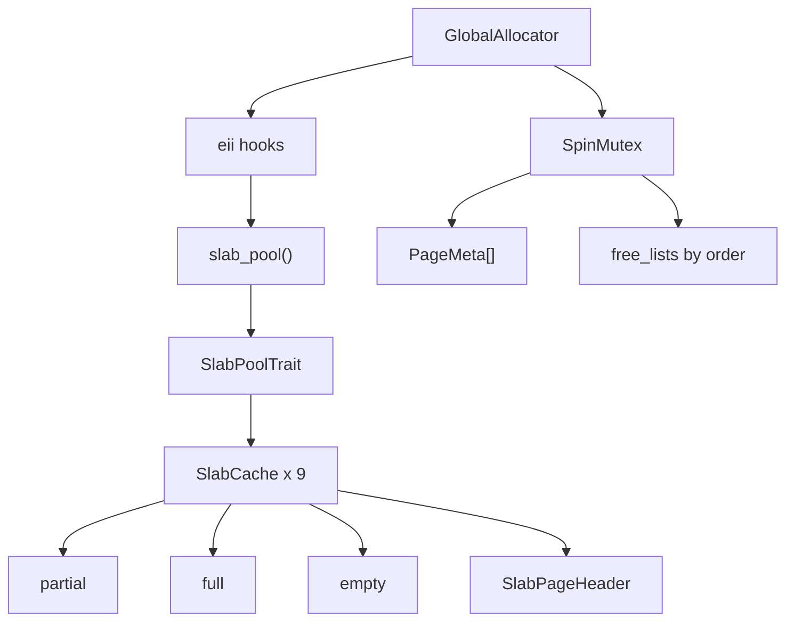
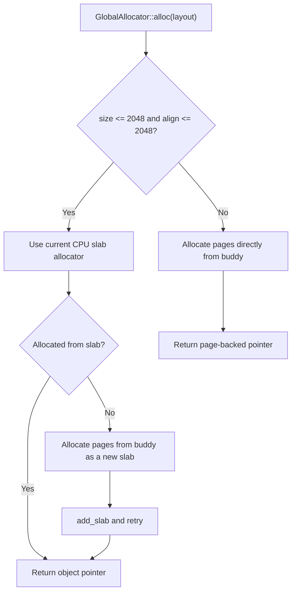
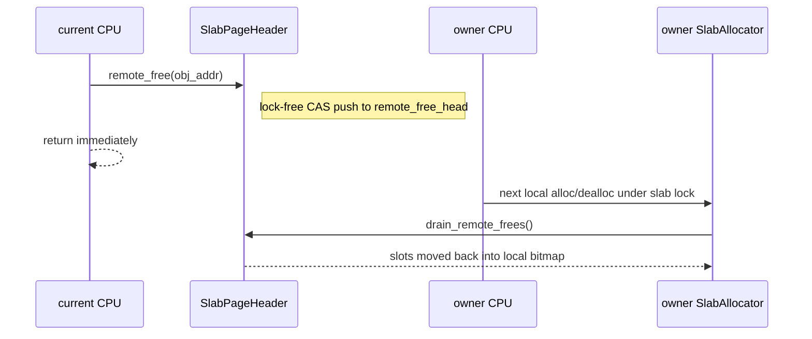

# buddy-slab-allocator

A `no_std` two-level allocator for kernel and embedded environments, combining a buddy page allocator with per-CPU slab allocators.

## Overview

The current implementation is built from three layers:

1. `BuddyAllocator`
   Manages one or more virtual memory sections in page units, with power-of-two splitting and merging.
2. `SlabAllocator`
   Manages small objects up to 2048 bytes with fixed size classes.
3. `GlobalAllocator`
   Combines the two, routing small allocations to per-CPU slab caches and large allocations to buddy pages.

The design details are documented in [docs/design.md](docs/design.md).

## Architecture



### Allocation routing



### Cross-CPU free path



## Features

- Buddy page allocation with splitting and merging
- Dynamic hot-add of managed regions via `add_region`
- Slab allocation for 9 size classes: `8..=2048`
- Per-CPU slab caches
- Lock-free cross-CPU remote frees
- DMA32 / lowmem page allocation via `alloc_pages_lowmem`
- `no_std` friendly
- Built-in `log` integration
- Standalone `BuddyAllocator` and `SlabAllocator` usage

## Add dependency

```toml
[dependencies]
buddy-slab-allocator = "0.2.0"
```

## Using `GlobalAllocator`

```rust
#![feature(extern_item_impls)]

use buddy_slab_allocator::eii::{slab_pool_impl, virt_to_phys_impl};
use buddy_slab_allocator::{GlobalAllocator, PerCpuSlab, SlabPoolTrait, StaticSlabPool};
use core::alloc::Layout;

const PAGE_SIZE: usize = 0x1000;

fn current_cpu_id() -> usize {
    0
}

static SLAB_POOL: StaticSlabPool<PAGE_SIZE, 1> =
    StaticSlabPool::new([PerCpuSlab::new(0)], current_cpu_id);

#[virt_to_phys_impl]
fn virt_to_phys(vaddr: usize) -> usize {
    vaddr
}

#[slab_pool_impl]
fn slab_pool() -> &'static dyn SlabPoolTrait {
    &SLAB_POOL
}

let allocator = GlobalAllocator::<PAGE_SIZE>::new();
let region_start = 0x8000_0000 as *mut u8;
let region_size = 16 * 1024 * 1024;
let region = unsafe { core::slice::from_raw_parts_mut(region_start, region_size) };

unsafe {
    allocator.init(region).unwrap();
}

let layout = Layout::from_size_align(64, 8).unwrap();
let ptr = allocator.alloc(layout).unwrap();

unsafe {
    allocator.dealloc(ptr, layout);
}

// More memory can be added later.
let extra_region_start = 0x9000_0000 as *mut u8;
let extra_region_size = 8 * 1024 * 1024;
let extra_region = unsafe {
    core::slice::from_raw_parts_mut(extra_region_start, extra_region_size)
};

unsafe {
    allocator.add_region(extra_region).unwrap();
}
```

`GlobalAllocator` is designed as a singleton-style system allocator: only one live
instance should be initialized at a time.

## Using Buddy and Slab separately

For lower-level control, the two building blocks can be used directly.

```rust
use buddy_slab_allocator::{
    BuddyAllocator, SlabAllocResult, SlabAllocator, SlabDeallocResult,
};
use core::alloc::Layout;

const PAGE_SIZE: usize = 0x1000;
let region_start = 0x8000_0000 as *mut u8;
let region_size = 16 * 1024 * 1024;
let region = unsafe { core::slice::from_raw_parts_mut(region_start, region_size) };

let mut buddy = BuddyAllocator::<PAGE_SIZE>::new();
unsafe {
    buddy.init(region).unwrap();
}

let mut slab = SlabAllocator::<PAGE_SIZE>::new();
let layout = Layout::from_size_align(64, 8).unwrap();

let ptr = loop {
    match slab.alloc(layout).unwrap() {
        SlabAllocResult::Allocated(ptr) => break ptr,
        SlabAllocResult::NeedsSlab { size_class, pages } => {
            let slab_bytes = pages * PAGE_SIZE;
            let addr = buddy.alloc_pages(pages, slab_bytes).unwrap();
            slab.add_slab(size_class, addr, slab_bytes, 0);
        }
    }
};

match slab.dealloc(ptr, layout) {
    SlabDeallocResult::Done => {}
    SlabDeallocResult::FreeSlab { base, pages } => {
        buddy.dealloc_pages(base, pages);
    }
}

let extra_region_start = 0x9000_0000 as *mut u8;
let extra_region_size = 8 * 1024 * 1024;
let extra_region = unsafe {
    core::slice::from_raw_parts_mut(extra_region_start, extra_region_size)
};

unsafe {
    buddy.add_region(extra_region).unwrap();
}
```

## Public API summary

- `GlobalAllocator<PAGE_SIZE>`
  High-level allocator facade that can also implement `GlobalAlloc`, and supports `add_region`, `managed_section_count`, `managed_section`, `managed_bytes`, and `allocated_bytes`.
- `BuddyAllocator<PAGE_SIZE>`
  Standalone multi-section page allocator, supporting `init`, `add_region`, section queries, `managed_bytes`, and `allocated_bytes`.
- `ManagedSection`
  Read-only summary for one managed section.
- `SlabAllocator<PAGE_SIZE>`
  Standalone slab allocator.
- `SizeClass`
  Fixed object size classes used by slab.
- `SlabAllocResult`
  `Allocated(ptr)` or `NeedsSlab { size_class, pages }`.
- `SlabDeallocResult`
  `Done` or `FreeSlab { base, pages }`.
- `SlabPoolTrait`
  System-global slab pool interface used by `GlobalAllocator`, exposing
  object-safe `current_slab()` / `owner_slab()` primitives with default
  routing for `alloc` / `add_slab` / `dealloc`.
- `SlabPoolExt`
  Callback-style helpers: `with_current_slab()` and `with_owner_slab()`.
- `eii`
  Declares `slab_pool()` and `virt_to_phys()` for platform integration.

`managed_bytes` counts only allocatable heap bytes and excludes region-prefix metadata.
`allocated_bytes` is backend page occupancy, not the exact sum of requested `layout.size()`.

## Testing

```bash
# Run normal tests
cargo test

# Run tests serially
cargo test -- --test-threads=1

# Run ignored stress tests
cargo test --test stress_test -- --ignored --nocapture

# Check benchmarks compile
cargo check --benches

# Run benchmarks
cargo bench
```

More test notes are in [tests/README.md](tests/README.md).

## License

Licensed under [Apache-2.0](LICENSE).
