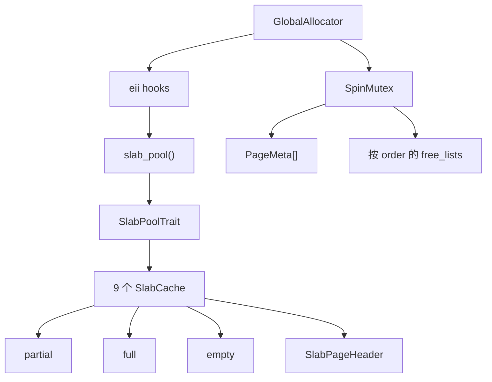
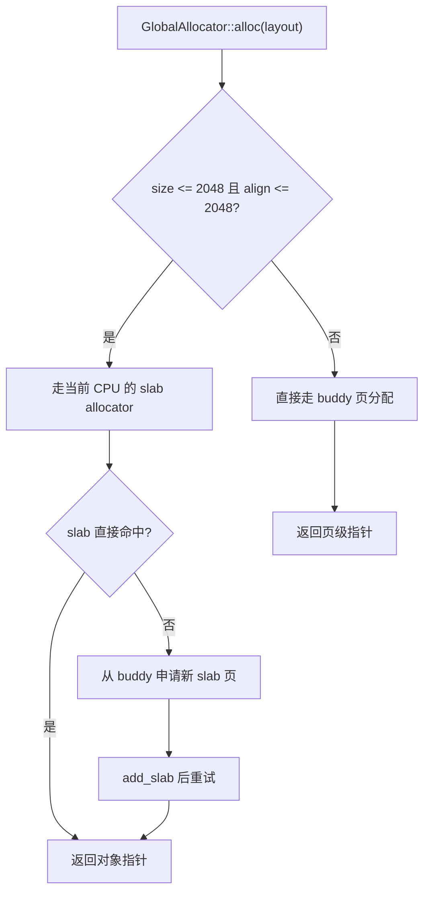
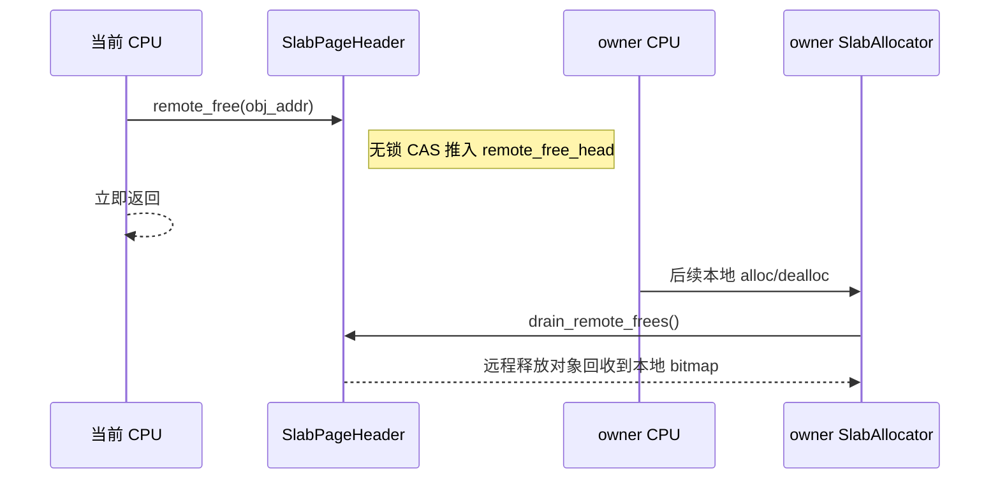

# buddy-slab-allocator 内存分配器

这是一个面向内核和嵌入式环境的 `no_std` 两级内存分配器，结合了 buddy 页分配器与 per-CPU slab 小对象分配器。

## 总览

当前实现由三层组成：

1. `BuddyAllocator`
   管理一个或多个虚拟内存 section，支持按 2 的幂分裂与合并。
2. `SlabAllocator`
   管理 `<= 2048` 字节的小对象，采用固定 size class。
3. `GlobalAllocator`
   将两者组合起来，对小对象走 per-CPU slab，对大对象走 buddy 页分配。

更完整的设计细节见 [docs/design.md](docs/design.md)。

## 架构图



### 分配路由



### 跨 CPU 释放



## 特性

- Buddy 页分配，支持拆分与合并
- 支持通过 `add_region` 动态追加可管理 region
- Slab 小对象分配，固定 9 个 size class：`8..=2048`
- per-CPU slab cache
- 跨 CPU 释放走 lock-free remote free
- 支持 `alloc_pages_lowmem` 低地址页分配
- 适合 `no_std`
- 内置 `log` 日志支持
- 可分别独立使用 `BuddyAllocator` 与 `SlabAllocator`

## 添加依赖

```toml
[dependencies]
buddy-slab-allocator = "0.2.0"
```

## 使用 `GlobalAllocator`

```rust
#![feature(extern_item_impls)]

use buddy_slab_allocator::eii::{slab_pool_impl, virt_to_phys_impl};
use buddy_slab_allocator::{GlobalAllocator, PerCpuSlab, SlabPoolTrait, StaticSlabPool};
use core::alloc::Layout;

const PAGE_SIZE: usize = 0x1000;

fn current_cpu_id() -> usize {
    0
}

static SLAB_POOL: StaticSlabPool<PAGE_SIZE, 1> =
    StaticSlabPool::new([PerCpuSlab::new(0)], current_cpu_id);

#[virt_to_phys_impl]
fn virt_to_phys(vaddr: usize) -> usize {
    vaddr
}

#[slab_pool_impl]
fn slab_pool() -> &'static dyn SlabPoolTrait {
    &SLAB_POOL
}

let allocator = GlobalAllocator::<PAGE_SIZE>::new();
let region_start = 0x8000_0000 as *mut u8;
let region_size = 16 * 1024 * 1024;
let region = unsafe { core::slice::from_raw_parts_mut(region_start, region_size) };

unsafe {
    allocator.init(region).unwrap();
}

let layout = Layout::from_size_align(64, 8).unwrap();
let ptr = allocator.alloc(layout).unwrap();

unsafe {
    allocator.dealloc(ptr, layout);
}

let extra_region_start = 0x9000_0000 as *mut u8;
let extra_region_size = 8 * 1024 * 1024;
let extra_region = unsafe {
    core::slice::from_raw_parts_mut(extra_region_start, extra_region_size)
};

unsafe {
    allocator.add_region(extra_region).unwrap();
}
```

`GlobalAllocator` 按系统级单例分配器设计：同一时刻只应初始化一套正在使用的实例。

## 分别使用 Buddy 与 Slab

如果需要更底层的控制，也可以分别使用这两个组件。

```rust
use buddy_slab_allocator::{
    BuddyAllocator, SlabAllocResult, SlabAllocator, SlabDeallocResult,
};
use core::alloc::Layout;

const PAGE_SIZE: usize = 0x1000;
let region_start = 0x8000_0000 as *mut u8;
let region_size = 16 * 1024 * 1024;
let region = unsafe { core::slice::from_raw_parts_mut(region_start, region_size) };

let mut buddy = BuddyAllocator::<PAGE_SIZE>::new();
unsafe {
    buddy.init(region).unwrap();
}

let mut slab = SlabAllocator::<PAGE_SIZE>::new();
let layout = Layout::from_size_align(64, 8).unwrap();

let ptr = loop {
    match slab.alloc(layout).unwrap() {
        SlabAllocResult::Allocated(ptr) => break ptr,
        SlabAllocResult::NeedsSlab { size_class, pages } => {
            let slab_bytes = pages * PAGE_SIZE;
            let addr = buddy.alloc_pages(pages, slab_bytes).unwrap();
            slab.add_slab(size_class, addr, slab_bytes, 0);
        }
    }
};

match slab.dealloc(ptr, layout) {
    SlabDeallocResult::Done => {}
    SlabDeallocResult::FreeSlab { base, pages } => {
        buddy.dealloc_pages(base, pages);
    }
}

let extra_region_start = 0x9000_0000 as *mut u8;
let extra_region_size = 8 * 1024 * 1024;
let extra_region = unsafe {
    core::slice::from_raw_parts_mut(extra_region_start, extra_region_size)
};

unsafe {
    buddy.add_region(extra_region).unwrap();
}
```

## 公开 API 摘要

- `GlobalAllocator<PAGE_SIZE>`
  高层门面，也可以作为 `GlobalAlloc` 使用，并支持 `add_region`、`managed_section_count`、`managed_section`、`managed_bytes` 与 `allocated_bytes`。
- `BuddyAllocator<PAGE_SIZE>`
  独立多 section 页分配器，支持 `init`、`add_region`、section 查询、`managed_bytes` 与 `allocated_bytes`。
- `ManagedSection`
  单个 managed section 的只读摘要。
- `SlabAllocator<PAGE_SIZE>`
  独立 slab 分配器。
- `SizeClass`
  slab 使用的固定对象尺寸类。
- `SlabAllocResult`
  `Allocated(ptr)` 或 `NeedsSlab { size_class, pages }`。
- `SlabDeallocResult`
  `Done` 或 `FreeSlab { base, pages }`。
- `SlabPoolTrait`
  `GlobalAllocator` 使用的系统级 slab 池接口，暴露 object-safe 的
  `current_slab()` / `owner_slab()` 原语，并提供 `alloc` / `add_slab` /
  `dealloc` 默认路由。
- `SlabPoolExt`
  callback 风格辅助接口：`with_current_slab()` 和 `with_owner_slab()`。
- `eii`
  声明 `slab_pool()` 与 `virt_to_phys()`，供平台侧实现。

`managed_bytes` 只统计可分配 heap，不包含 region 前缀 metadata。
`allocated_bytes` 表示后端页占用，不是用户请求的 `layout.size()` 精确求和。

## 测试

```bash
# 常规测试
cargo test

# 串行执行，便于排查问题
cargo test -- --test-threads=1

# 运行忽略的压力测试
cargo test --test stress_test -- --ignored --nocapture

# 检查 benchmark 是否可编译
cargo check --benches

# 运行 benchmark
cargo bench
```

更多测试说明见 [tests/README.md](tests/README.md)。

## 许可证

采用 [Apache-2.0](LICENSE) 许可证。
