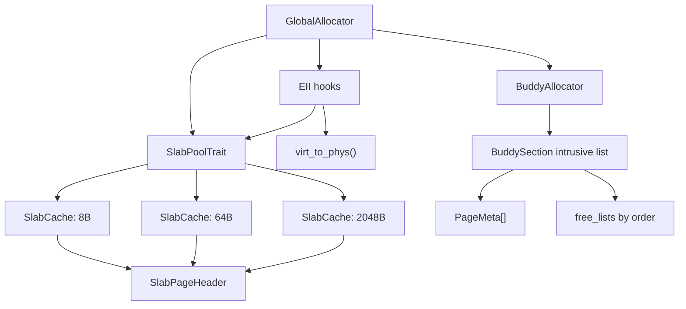
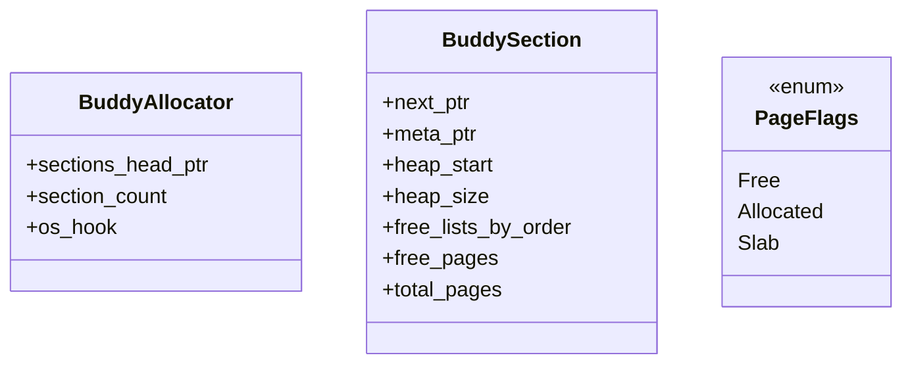
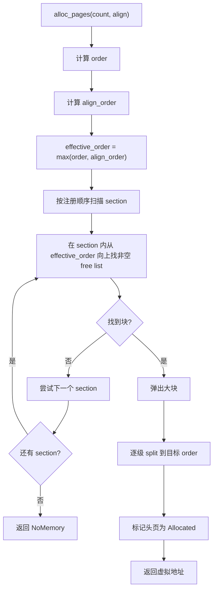
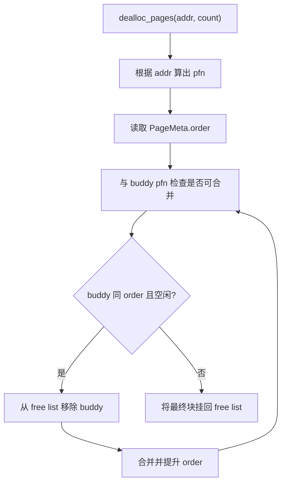
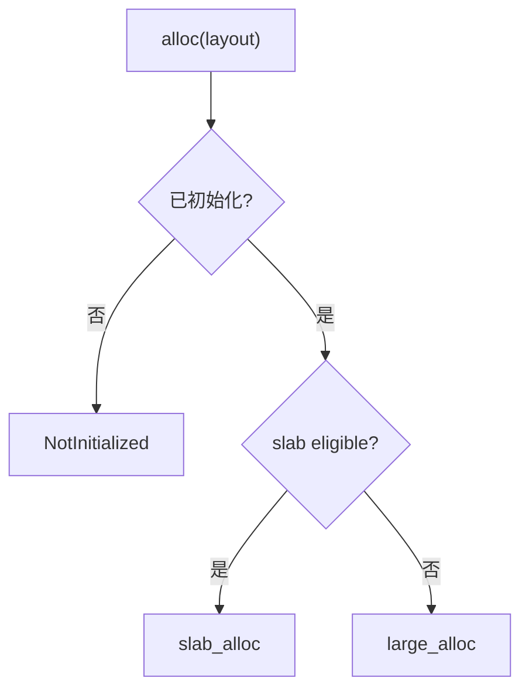
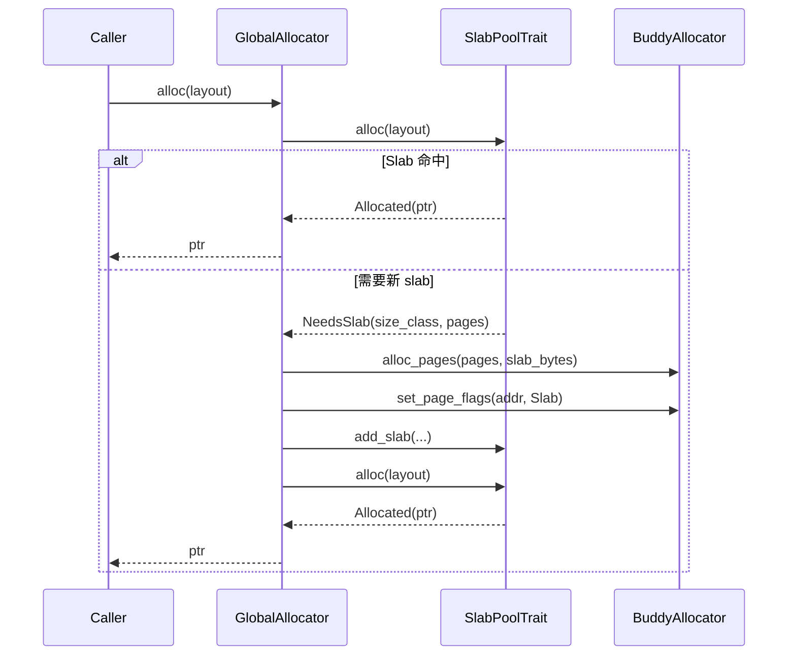
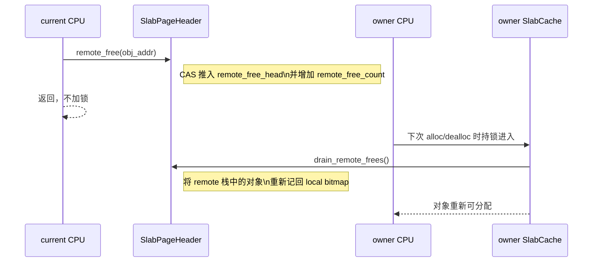

# buddy-slab-allocator 设计文档

本文档面向阅读和维护当前实现的开发者，描述这个分配器在 `buddy + slab` 两级结构下的核心数据结构、初始化过程、`add_region` 热添加流程、`alloc` / `dealloc` 路径，以及多核并发场景下的协作方式。

文中描述以当前仓库实现为准，重点对应以下模块：

- `src/global.rs`
- `src/buddy/mod.rs`
- `src/slab/mod.rs`
- `src/slab/cache.rs`
- `src/slab/page.rs`

## 1. 设计目标

这个分配器服务于 `no_std`、内核或嵌入式环境，目标是同时满足两类需求：

- 页级分配：按页返回连续内存，支持 power-of-two 分裂和合并。
- 小对象分配：对 `<= 2048` 字节的对象提供更低碎片、更低分配开销的快速路径。

因此整体采用两级结构：

- 后端：`BuddyAllocator`
  负责管理一个或多个 section 中的页。
- 前端：`SlabAllocator`
  负责管理不同 size class 的小对象。
- 门面：`GlobalAllocator`
  统一对外暴露 `alloc` / `dealloc` / `alloc_pages` / `dealloc_pages` 等接口。

## 2. 总体结构

### 2.1 地址语义

当前实现的主语义是“虚拟地址”：

- `GlobalAllocator::init()` 接收的是一段可写 `&mut [u8]` 区域。
- `BuddyAllocator` 管理的是一段连续虚拟地址区间。
- `alloc_pages()`、`alloc()` 返回的也都是虚拟地址。

物理地址只在 `alloc_pages_lowmem()` 里参与判断：

- 候选块的虚拟地址通过 `eii::virt_to_phys()` 翻译成物理地址。
- 只有物理地址低于 `4 GiB` 的块才会被当作 DMA32 候选。

### 2.2 容量统计语义

当前公开了两类整体容量统计：

- `managed_bytes`
  所有 section 中可分配 heap 的总字节数，不包含 region 前缀 metadata。
- `allocated_bytes`
  后端页占用字节数，按 `managed_bytes - free_pages * PAGE_SIZE` 计算。

因此 `allocated_bytes` 的口径是“页后端已经占住多少字节”，不是用户请求的 `layout.size()` 精确累加。
它会包含：

- slab 页
- empty slab cache 保留页
- 对齐放大
- buddy / slab 的内部碎片

## 3. 初始化、追加 Region 与内存布局

当前实现支持两种 region 进入 allocator 的方式：

- `GlobalAllocator::init(region)`
  注册首个 region；slab 池由外部通过 `eii::slab_pool()` 提供。
- `GlobalAllocator::add_region(region)`
  在运行时追加新的 region，只扩展 buddy 后端。

对 buddy 而言，每个 region 都会被拆成：

- 前缀：region 自带元数据
- 后缀：该 section 的 managed heap

首个 global region 的元数据前缀包含：

- `BuddySection`
- `PageMeta[]`

后续追加 region 的元数据前缀只包含：

- `BuddySection`
- `PageMeta[]`

### 3.1 初始化步骤

`GlobalAllocator::init()` 的主要步骤如下：

1. 根据 `region.len()` 计算首个 section 最多能管理多少页。
2. 在 region 前缀预留 `BuddySection + PageMeta[]`。
3. 选择一个页对齐的 section heap 起点。
4. 将首个 section 注册进 `BuddyAllocator`。
5. 将 allocator 标记为已初始化。

当前实现按“系统里只有唯一一套全局 allocator”建模；slab 池通过
`eii::slab_pool()` 接入，而不是存放在 `GlobalAllocator` 内部。

`GlobalAllocator::add_region()` 的步骤更简单：

1. 校验 allocator 已初始化。
2. 在新 region 前缀预留 `BuddySection + PageMeta[]`。
3. 计算该 section 的可管理 heap。
4. 将该 section 追加到 buddy 的 intrusive list 尾部。

### 3.2 为什么 metadata 放在 region 前缀

这样做有几个好处：

- 不需要额外的启动期堆分配。
- `BuddySection` 与 `PageMeta[]` 都跟随 region 自身生命周期。
- 不需要预先声明最大 section 数量。

代价是：

- metadata 会消耗一部分可分配空间。
- 每个 section 的 heap 起点都可能晚于各自的 region 起点。
- section 查询与地址归属定位当前采用线性扫描。

## 4. BuddyAllocator 设计

`BuddyAllocator` 管理页级内存，是整个系统的共享后端。它的基本单位不再是单一 heap，而是一个按注册顺序串起来的 section 链表。

### 4.1 核心数据结构

说明：

- `BuddyAllocator` 自身只维护 section 链表头和 section 数量。
- 每个 `BuddySection` 都拥有自己的一组 `PageMeta[]` 和 `free_lists`。
- `PageMeta` 仍然是每页一项的外部元数据。
- 同一 section 内按 buddy 规则拆分和合并，section 之间不跨界合并。

### 4.2 buddy 初始化

初始化某个 section 时，buddy 会从低地址到高地址扫描该 section 的整段 heap：

- 每次尽量切出“当前地址自然对齐、且仍然放得下”的最大 order 块。
- 将该块挂到对应 order 的 free list。

这一步的结果是：

- 该 section 中的所有页都被覆盖。
- 该 section 的 free list 从一开始就处于可分裂、可合并的标准 buddy 形态。

### 4.3 页分配流程

注意点：

- `count` 会向上取整到 2 的幂。
- `align` 也会转成对应的 `align_order`。
- 真正分配的块大小可能大于用户请求。

### 4.4 低地址页分配

`alloc_pages_lowmem()` 的差异在于：

- 不只看 free list 是否有块。
- 还要检查块的物理地址区间是否完全落在 `DMA32_LIMIT` 下方。

流程是：

1. 逐个扫描候选 free list。
2. 对每个候选块调用 `os.virt_to_phys(addr)`。
3. 计算 `phys + block_bytes <= 4GiB` 是否成立。
4. 找到合格块后执行和普通分配相同的拆分逻辑。

### 4.5 页释放流程

`dealloc_pages(addr, count)` 的关键点是：

- `addr` 必须是原始返回地址。
- 实际释放的 order 以 `PageMeta.order` 为准。
- `count` 主要用于 debug 断言，确保调用者没有传得比真实块更大。

## 5. SlabAllocator 设计

`SlabAllocator` 不直接申请页，它只管理“已经拿到的 slab page”。

### 5.1 size class

当前固定 9 个 size class：

- 8
- 16
- 32
- 64
- 128
- 256
- 512
- 1024
- 2048

布局规则：

- `layout.size()` 与 `layout.align()` 取较大值。
- 选择能容纳它的最小 size class。
- 超过 `2048` 字节则不走 slab。

### 5.2 SlabCache 的三条链

每个 size class 对应一个 `SlabCache`，内部维护三条 intrusive list：

- `partial`
  还有空位的 slab，优先分配。
- `full`
  本地 bitmap 没空位，但可能积累了 remote free。
- `empty`
  所有对象都空闲的 slab。

实现上还有限制：

- 每个 `SlabCache` 最多缓存 1 个空 slab。
- 如果又出现新的空 slab，多出来的那个会还给 buddy。

这也是压力测试里“页数不一定精确回到初始值”的原因之一：每个 CPU、每个 size class 允许保留一个空 slab 作为缓存。

### 5.3 SlabPageHeader

每个 slab page 起始位置都嵌着一个 `SlabPageHeader`。

它包含：

- `magic`
- `size_class`
- `object_count`
- `local_free_count`
- `owner_cpu`
- `slab_bytes`
- `list_prev/list_next`
- `local_bitmap`
- `remote_free_head`
- `remote_free_count`

### 5.4 本地分配

owner CPU 在持有对应 slab 锁时执行本地分配：

1. 先看 `partial` 头 slab。
2. 如果它有 remote free，先 drain 回本地 bitmap。
3. 从 bitmap 找一个空位。
4. 如果分完后满了，把 slab 从 `partial` 挪到 `full`。

如果 `partial` 不行，则：

1. 扫 `full`，找是否有 slab 因 remote free 重新出现空位。
2. 如果有，把它移回 `partial`。
3. 还不行就尝试复用 `empty` 中缓存的 slab。
4. 再不行就返回 `NeedsSlab`，要求上层先提供新页。

## 6. GlobalAllocator 的分配路径

`GlobalAllocator` 是真正对外使用的入口。

它把请求分成两类：

- 小对象：走 slab
- 大对象：走 buddy

判断条件：

- `layout.size() <= 2048`
- `layout.align() <= 2048`

满足才走 slab。

### 6.1 alloc 总流程

### 6.2 小对象分配

这里有一个很重要的锁顺序细节：

- 当 slab 缺页时，`GlobalAllocator` 会先释放 slab 锁，再去拿 buddy 锁。

这样可以避免：

- 持有 slab 锁时阻塞在 buddy 上。
- 未来演化成更复杂锁图时出现循环等待。

### 6.3 大对象分配

大对象路径很直接：

1. 根据 `layout.size()` 计算页数。
2. 对齐至少是 `PAGE_SIZE`。
3. 调用 `BuddyAllocator::alloc_pages()`。

大对象不会进入 slab，也不会设置 `PageFlags::Slab`。

## 7. dealloc 路径

### 7.1 大对象释放

大对象释放和分配对称：

1. 根据 `layout.size()` 推导页数。
2. 直接进入 `BuddyAllocator::dealloc_pages()`。

### 7.2 小对象释放：本地路径

如果当前 CPU 就是该 slab 的 owner：

1. 通过对象地址反推出 slab base。
2. 拿 owner CPU 对应的 slab 锁。
3. 调用 `slab.dealloc(ptr, layout)`。
4. 如果结果是 `Done`，结束。
5. 如果结果是 `FreeSlab { base, pages }`，释放 slab 锁后把整页还给 buddy。

为什么空 slab 不总是立刻还给 buddy：

- `SlabCache` 会保留一个 empty slab 作为热缓存。
- 只有当已有一个 cached empty slab 时，新的空 slab 才会还给 buddy。

### 7.3 小对象释放：远程路径

如果当前 CPU 不是 owner CPU，不会直接拿对方的 slab 锁。

而是走 lock-free remote free：

这条路径的核心特点：

- 释放方不需要知道 owner CPU 的锁状态。
- 释放方不抢远端锁。
- owner CPU 在后续本地操作时，顺手把 remote free 合并回 bitmap。

这也是当前实现中“跨 CPU free 无锁，但重新利用对象仍由 owner CPU 控制”的关键设计。

## 8. 多线程与并发模型

### 8.1 并发边界

当前实现中真正共享的状态主要有两类：

- `BuddyAllocator`
  整体包在一个 `SpinMutex` 里，页级操作串行化。
- 每 CPU 一个 `SlabAllocator`
  每个都各自包在一个 `SpinMutex` 里。

因此并发模型可以概括为：

- 小对象本地路径：只竞争本 CPU 的 slab 锁。
- 小对象远程 free：不走锁，直接原子 CAS。
- 缺页或空 slab 回收：会短暂进入全局 buddy 锁。

### 8.2 为什么是 per-CPU slab

如果所有小对象都走单个全局 slab 锁，会有两个问题：

- 多核下锁竞争重。
- 小对象热点路径和页级路径容易互相干扰。

per-CPU slab 的好处是：

- 本地分配/释放命中时只碰本 CPU 锁。
- 跨 CPU free 通过 remote list 延后处理，不把释放方拖进远端临界区。

### 8.3 远程释放的正确性依赖

远程释放正确性依赖几个事实：

- slab 页头里记录了 `owner_cpu`。
- 远程释放只把对象地址压到无锁链表里。
- owner CPU 持锁 drain 时，再把对象重新放回本地 bitmap。
- remote 栈中的 next 指针写在对象自身内存开头，这要求被释放对象已经不再被用户使用。

### 8.4 锁顺序

当前实现中建议理解为以下顺序：

- 常规 slab 本地路径：只拿 slab 锁。
- 常规 buddy 页路径：只拿 buddy 锁。
- slab 缺页：先释放 slab 锁，再拿 buddy 锁，再重新拿 slab 锁。
- slab 回收空页：先释放 slab 锁，再拿 buddy 锁。

这样可以避免出现“持有 slab 锁后等待 buddy，同时另一路持有 buddy 锁又等待 slab”的循环。

## 9. 关键实现细节

### 9.1 `PageFlags`

页状态分三种：

- `Free`
- `Allocated`
- `Slab`

含义是：

- `Free`：在 buddy free list 中。
- `Allocated`：普通页分配返回的块头页。
- `Slab`：该块当前作为 slab 页使用。

### 9.2 buddy 只在块头记录 order

`PageMeta.order` 只有块头页有意义。

因此：

- 分配时只标记头页的 `order`。
- 释放时调用方必须传回原始返回地址。

### 9.3 `dealloc_pages(count)` 为什么不完全信任 `count`

因为分配时请求可能被扩大：

- `count` 会按 buddy order 向上取整。
- `align` 也可能把块提升到更高阶。

所以释放时真正信任的是 `PageMeta.order`，`count` 只用于做 debug 级别的合理性检查。

### 9.4 empty slab 缓存策略

每个 `SlabCache` 最多保留一个 empty slab。

这是一个很重要的折中：

- 优点：后续同 size class 再分配时更快，减少 buddy 往返。
- 代价：空闲页不会总是立刻全部回收到 buddy。

所以测试或观测时不能简单假设：

- “所有对象释放后，buddy free pages 一定精确回到初始值”。

更准确的理解应是：

- 除去每 CPU、每 size class 允许缓存的 empty slab 后，应当没有额外页泄漏。

## 10. realloc 行为

`GlobalAllocator` 通过 `GlobalAlloc` 实现了 `realloc`：

1. 构造新的 `Layout`
2. 新分配一块内存
3. 拷贝 `min(old_size, new_size)` 字节
4. 释放旧块

它不是原地扩容，也没有针对 slab/buddy 做特殊优化。

## 11. 当前实现的优点与限制

### 11.1 优点

- 结构清晰，页级与对象级职责分离。
- 小对象本地路径开销低。
- 跨 CPU free 不抢远端锁。
- 初始化不依赖额外堆分配。
- 支持低地址页分配。

### 11.2 限制

- buddy 后端仍然是全局单锁。
- `remote_free` 的对象复用必须等 owner CPU 后续 drain。
- empty slab 缓存会牺牲一部分“空闲页立刻回收”的极致性。
- `realloc` 为通用 copy 语义，不做原地优化。

## 12. 阅读源码建议

如果想快速建立整体理解，建议按下面顺序读：

1. `src/lib.rs`
   先看公开模块、EII、`SlabPoolTrait` 与 `SlabPoolExt`。
2. `src/global.rs`
   先理解门面层如何在 buddy/slab 间路由。
3. `src/buddy/mod.rs`
   看页级分配、拆分和合并。
4. `src/slab/mod.rs`
   看 slab 与上层的接口契约。
5. `src/slab/cache.rs`
   看 `partial/full/empty` 三链切换。
6. `src/slab/page.rs`
   看 bitmap、remote free 栈与 owner CPU drain。

## 13. 一句话总结

这个分配器的核心思想可以概括成一句话：

> 用 buddy 统一管理页，用 per-CPU slab 加速小对象，把跨 CPU free 变成“无锁登记、延迟回收”，从而在实现复杂度、局部性和并发开销之间取得平衡。
