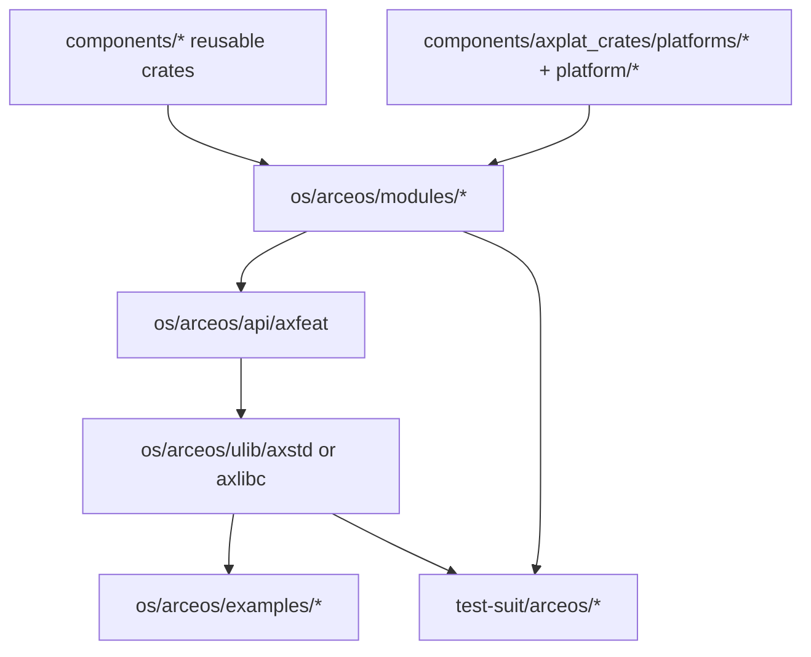

# ArceOS 开发指南

在 TGOSKits 里，ArceOS 既是一个可以单独运行的模块化操作系统，也是 StarryOS 与 Axvisor 复用的基础能力提供者。理解 ArceOS 的关键不只是"怎么跑示例"，而是"一个能力如何从模块一路走到应用和测试"。本文档介绍 ArceOS 在仓库中的位置、运行入口、典型开发流程和调试方法，帮助你高效地进行 ArceOS 相关的开发和验证。

## 1. ArceOS 在仓库里的位置

ArceOS 的代码分布在多个目录中，不同目录承担不同的角色。`os/arceos/` 下是 ArceOS 自身的内核模块、API 层和示例，`components/` 下则是被 ArceOS 和其他系统共同复用的基础 crate，`test-suit/arceos/` 则负责系统级自动化测试。理解这些目录的边界，是判断改动影响面的第一步。

| 路径 | 角色 | 什么时候会改到 |
| --- | --- | --- |
| `os/arceos/modules/` | 内核模块层 | 改 HAL、调度、驱动、网络、文件系统、运行时 |
| `os/arceos/api/` | feature 与对外 API 聚合 | 要新增 feature、能力开关或统一入口 |
| `os/arceos/ulib/` | 用户侧库 | 要把能力暴露给应用时 |
| `os/arceos/examples/` | 示例应用 | 做最小验证、写新 demo |
| `test-suit/arceos/` | 系统级测试 | 做自动化回归 |
| `components/axplat_crates/platforms/*` 与 `platform/*` | 平台实现 | 新平台或板级适配 |

最重要的认知是：

- `components/` 里的基础 crate 和 `os/arceos/modules/*` 经常一起构成 ArceOS 能力
- 你改了 ArceOS 的基础层，StarryOS 和 Axvisor 也可能被连带影响

## 2. 运行入口

ArceOS 提供两种运行方式：仓库根目录的 `cargo xtask arceos` 统一入口和 `os/arceos/` 下的本地 Makefile 入口。前者更适合日常开发和 CI，后者更适合需要精细控制 Makefile 变量的场景。

### 仓库根目录的推荐入口

```bash
cargo xtask arceos build --package arceos-helloworld --arch riscv64
cargo xtask arceos run --package arceos-helloworld --arch riscv64
```

常用参数：

- `--package`: 选择应用包，例如 `arceos-helloworld`
- `--arch`: `riscv64`、`x86_64`、`aarch64`、`loongarch64`
- `--platform`: 覆盖默认平台
- `--features`: 传额外 feature
- `--smp`: 指定 CPU 数量
- `--plat-dyn`: 控制是否启用动态平台

### `os/arceos/` 里的本地入口

```bash
cd os/arceos
make A=examples/helloworld ARCH=riscv64 run
make A=examples/httpserver ARCH=riscv64 NET=y run
make A=examples/shell ARCH=riscv64 BLK=y run
```

什么时候更适合用 `make`：

- 你在调试 ArceOS 自己的 Makefile 变量
- 你需要显式操控 `NET=y`、`BLK=y`、`LOG=debug` 这类本地入口参数

## 3. 从组件到应用的典型链路

ArceOS 的能力从可复用 crate 出发，经过内核模块层聚合，再通过 feature 和用户库暴露给应用。下面的流程图展示了这条链路中各层的角色和关系。理解这条链路，有助于判断你的改动应该落在哪一层。



这条链路对应了几种常见开发动作：

- 改内部实现：动 `components/` 或 `modules/`
- 新增 feature 开关：动 `axfeat`
- 新增应用侧 API：动 `axstd` / `axlibc`
- 新增验证样例：动 `examples/` 或 `test-suit/arceos/`

## 4. 常见开发动作

本节列出 ArceOS 开发中最常见的几类改动，以及对应的推荐验证路径。无论你是修改基础组件、暴露新能力、还是添加示例应用，都应该先跑最小消费者来验证改动是否正确。

### 4.1 修改基础组件或模块

如果你改的是：

- `components/axerrno`、`components/kspin`、`components/page_table_multiarch`
- 或 `os/arceos/modules/axhal`、`axtask`、`axdriver`、`axnet`、`axfs`

建议先跑最小消费者：

```bash
cargo xtask arceos run --package arceos-helloworld --arch riscv64
```

如果改的是特定能力，再换对应的示例：

```bash
# 网络相关
cargo xtask arceos run --package arceos-httpserver --arch riscv64 --net

# 文件系统相关
cargo xtask arceos run --package arceos-shell --arch riscv64 --blk
```

### 4.2 新增 feature 或暴露给应用

当一个能力已经在模块层实现，但你还希望应用可选启用时，常见接线顺序是：

1. 在 `os/arceos/modules/*` 完成或接入实现
2. 在 `os/arceos/api/axfeat` 暴露 feature
3. 需要给应用直接用时，再接到 `os/arceos/ulib/axstd` 或 `axlibc`

如果你只做了第 1 步，没有走到 `axfeat` 或 `axstd`，应用层通常是看不到这个能力的。

### 4.3 添加一个新示例应用

新增示例通常放在 `os/arceos/examples/<name>/`。最小 `Cargo.toml` 可以参考：

```toml
[package]
name = "myapp"
version = "0.1.0"
edition.workspace = true

[dependencies]
axstd.workspace = true
```

最小 `src/main.rs` 可以参考现有 `helloworld` 的写法：

```rust
#![cfg_attr(feature = "axstd", no_std)]
#![cfg_attr(feature = "axstd", no_main)]

#[cfg(feature = "axstd")]
use axstd::println;

#[cfg_attr(feature = "axstd", unsafe(no_mangle))]
fn main() {
    println!("Hello from myapp!");
}
```

然后直接运行：

```bash
cargo xtask arceos run --package myapp --arch riscv64
```

### 4.4 添加或修改平台

如果你改的是平台逻辑，需要一起看：

- `components/axplat_crates/platforms/*`
- `platform/axplat-dyn`
- `platform/x86-qemu-q35`

验证时通常要显式指定平台：

```bash
cargo xtask arceos run --package arceos-helloworld --arch aarch64 \
    --platform axplat-aarch64-qemu-virt
```

## 5. 验证入口

ArceOS 提供了从示例应用到系统测试的多层验证入口。日常开发时用示例应用做快速验证，改动稳定后再用系统测试做回归。适合在 host 上跑的基础 crate 可以直接用 `cargo test`。

### 示例应用

```bash
cargo xtask arceos run --package arceos-helloworld --arch riscv64
cargo xtask arceos run --package arceos-httpclient --arch riscv64
cargo xtask arceos run --package arceos-httpserver --arch riscv64 --net
cargo xtask arceos run --package arceos-shell --arch riscv64 --blk
```

### 系统测试

```bash
cargo xtask test arceos --target riscv64gc-unknown-none-elf
```

这条命令会自动发现 `test-suit/arceos/` 下的测试包，例如任务调度相关测试。

### host / unit 测试

对于适合在 host 上跑的基础 crate，优先先做：

```bash
cargo test -p axerrno
```

## 6. 调试建议

ArceOS 提供了日志级别控制和 GDB 调试两种主要调试手段。调整日志级别最直接的方式是通过本地 Makefile 传入 `LOG` 变量；需要断点调试时，本地 Makefile 的 `debug` 目标已经集成了 GDB 启动。

### 看更详细的运行日志

本地 Makefile 路径最直接：

```bash
cd os/arceos
make A=examples/helloworld ARCH=riscv64 LOG=debug run
```

### 启动 GDB 调试

ArceOS 本地 Makefile 已经有现成的 `debug` 目标：

```bash
cd os/arceos
make A=examples/helloworld ARCH=riscv64 debug
```

这比在根目录命令里硬塞额外 QEMU 参数更可靠，因为根 `cargo xtask arceos run` 当前并不直接暴露原始 QEMU 参数透传接口。

### 什么时候优先用根目录入口

- 你要验证集成行为
- 你要和 `test-suit`、StarryOS 或 Axvisor 的共享依赖对齐
- 你希望命令风格和 CI 更接近

## 7. 继续阅读

以下是理解 ArceOS 及其上下文的推荐阅读顺序，覆盖了从外部入口到内部机制、从组件视角到系统集成视角的完整知识链。

- [arceos-internals.md](arceos-internals.md): 系统理解 ArceOS 的分层、feature 装配、启动路径和内部机制
- [components.md](components.md): 从组件视角继续看共享依赖怎么接到三个系统
- [build-system.md](build-system.md): 理解根 xtask、Makefile 和 workspace 的边界
- [starryos-guide.md](starryos-guide.md): 如果你的 ArceOS 改动会波及 StarryOS
- [axvisor-guide.md](axvisor-guide.md): 如果你的 ArceOS 改动会波及 Axvisor
