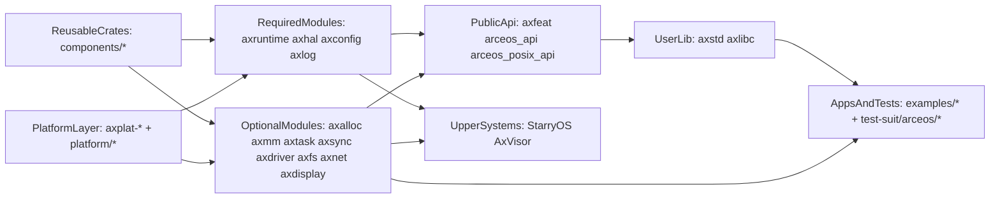
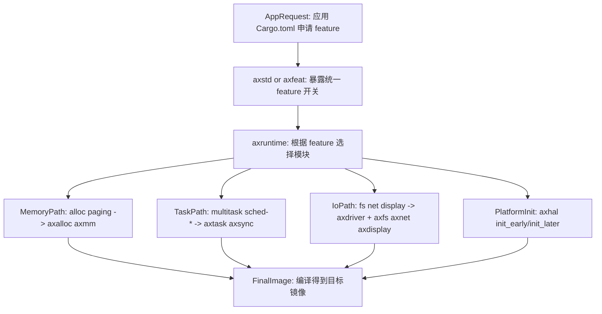
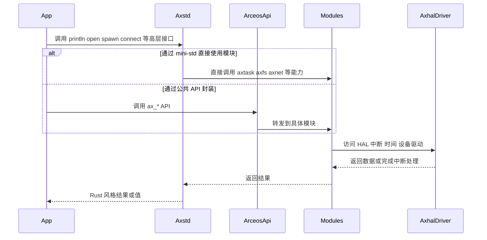
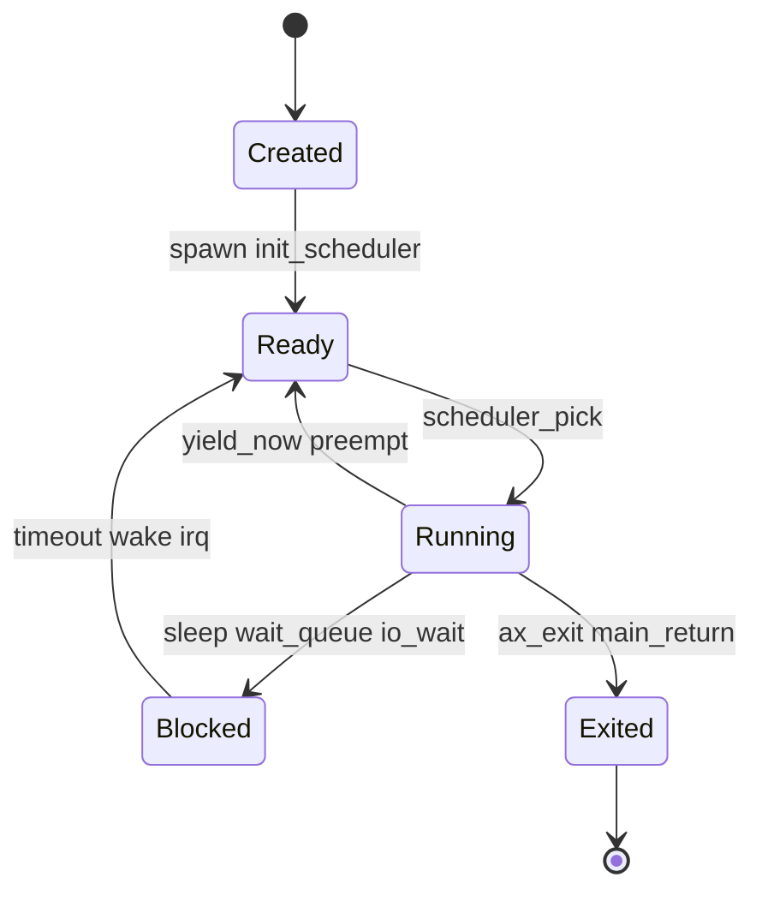
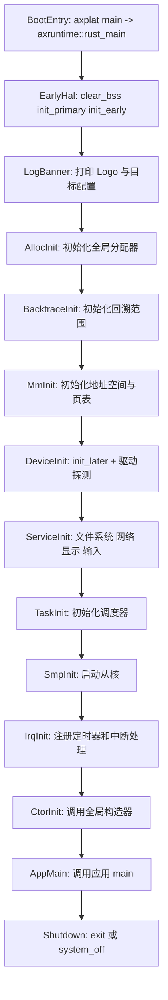

# ArceOS 深度技术解析

这篇文档不是上手指南，而是面向准备修改内核模块、做性能分析、补充特性或向上层系统复用 ArceOS 能力的开发者。它重点回答四类问题：

- ArceOS 在 TGOSKits 中的分层边界是什么。
- 一个能力如何从 `Cargo feature` 一路装配到运行时模块。
- 启动、调度、文件系统、网络等能力在内部如何协作。
- 当你准备做功能改进、性能优化或二次开发时，应该从哪里下手。

如果你的目标只是先把示例跑起来，请先读 [quick-start.md](quick-start.md) 和 [arceos-guide.md](arceos-guide.md)。

## 1. 系统定位与设计目标

ArceOS 在本仓库中同时扮演三种角色：

| 角色 | 含义 | 在 TGOSKits 中的体现 |
| --- | --- | --- |
| 组件化单内核 | 通过 Rust crate 与 feature 做编译期装配，尽量减少不需要的运行时负担 | `os/arceos/modules/*`、`os/arceos/api/*`、`os/arceos/ulib/*` |
| 基础系统平台 | 直接承载示例应用、测试包和实验性系统程序 | `os/arceos/examples/*`、`test-suit/arceos/*` |
| 共享能力提供者 | 为 StarryOS 和 AxVisor 复用 HAL、任务、内存、驱动等基础能力 | `axhal`、`axtask`、`axmm`、`axdriver` 等模块被上层系统直接依赖 |

从设计目标看，ArceOS 不追求“大而全”的宏内核语义，而更强调以下几点：

| 目标 | 具体含义 | 典型实现落点 |
| --- | --- | --- |
| 编译期可裁剪 | 只链接被 feature 选中的能力，避免把不需要的子系统塞进镜像 | `axfeat`、`axruntime/Cargo.toml` |
| 层次分离 | 把可复用 crate、OS 相关模块、API 封装、用户库和应用分开管理 | `components/`、`modules/`、`api/`、`ulib/` |
| 跨平台 | 用统一 HAL 和平台 crate 支撑多架构与多板级目标 | `axhal`、`axplat-*`、`platform/*` |
| 低抽象损耗 | `axstd` 直接调用 ArceOS 模块，而不是先走 libc 和 syscall | `os/arceos/ulib/axstd/src/lib.rs` |
| Rust 安全性 | 利用所有权、trait、类型系统和同步原语减少数据竞争和空悬引用 | `axsync`、`axtask`、`crate_interface` |

## 2. 总体架构与分层设计

从仓库结构看，ArceOS 的关键价值不是“有很多 crate”，而是这些 crate 被有意识地组织成一条从底层平台到上层应用的能力传递链。



阅读这张图时，可以按“从下往上”和“从右往左”两种方向理解：

- 从下往上看，它说明应用最终不是直接绑定某个驱动文件，而是经由 `user lib -> API -> modules -> HAL/platform` 这一链路拿到能力。
- 从右往左看，它说明 StarryOS 和 AxVisor 复用的不是“整个 ArceOS”，而是底层模块能力，因此你修改 `axhal`、`axtask`、`axdriver` 之类的模块，很可能会同时影响多个系统。

### 2.1 分层职责

| 层次 | 主要目录 | 关注点 |
| --- | --- | --- |
| 可复用 crate 层 | `components/*` | 算法、同步、容器、地址空间、设备抽象等可被多个系统复用的基础构件 |
| 平台与 HAL 层 | `platform/*`、`components/axplat_crates/platforms/*`、`os/arceos/modules/axhal` | 架构相关启动、时钟、中断、内存映射、设备访问 |
| 内核服务模块层 | `os/arceos/modules/*` | 内存分配、页表、任务调度、驱动、文件系统、网络、图形等 OS 能力 |
| API 聚合层 | `os/arceos/api/*` | feature 选择、稳定 API 封装、POSIX 兼容接口 |
| 用户库层 | `os/arceos/ulib/*` | `axstd`、`axlibc` 等高层开发接口 |
| 应用与测试层 | `os/arceos/examples/*`、`test-suit/arceos/*` | 场景化验证与系统回归 |

### 2.2 必选模块与可选模块

ArceOS 的基础骨架由四个必选模块组成：

- `axruntime`：启动与初始化总控。
- `axhal`：统一硬件抽象层。
- `axconfig`：平台常量、栈大小、物理内存、目标平台等构建时参数。
- `axlog`：日志输出与格式化。

其余模块大多按 feature 启用，例如：

| 模块 | 典型 feature | 作用 |
| --- | --- | --- |
| `axalloc` | `alloc` | 全局内存分配器 |
| `axmm` | `paging` | 地址空间与页表管理 |
| `axtask` | `multitask`、`sched-*` | 任务创建、调度、sleep、wait queue |
| `axsync` | `multitask` | 锁、同步原语 |
| `axdriver` | `driver-*`、`fs`、`net`、`display` | 设备探测与驱动初始化 |
| `axfs` | `fs` | 文件系统与挂载 |
| `axnet` | `net` | 网络栈 |
| `axdisplay` | `display` | 图形显示 |

## 3. 核心设计理念与实现机制

### 3.1 Crates 与 Modules 的边界

ArceOS 文档中反复强调 `Crates` 与 `Modules` 的区别：

- `components/*` 里的 crate 更偏通用基础构件，尽量与某一具体 OS 设计解绑。
- `modules/*` 则显式体现 ArceOS 的设计取向，例如任务模型、驱动装配方式、文件系统初始化路径等。

这种分层的收益是：

- 可以让更多基础能力在 StarryOS、AxVisor 等系统中重复使用。
- 可以把“OS 语义”集中到 `modules/*` 和 `api/*`，降低 API 污染。
- 可以把“是否启用某个能力”交给 Cargo feature，而不是运行时动态决策。

### 3.2 Feature 驱动的系统装配

ArceOS 的装配逻辑不是写在一个“总配置脚本”里，而是分布在应用依赖、`axstd/axfeat` feature、以及 `axruntime` 的 feature 依赖图中。



一个很典型的例子是 `httpserver` 示例应用只在依赖里声明：

```toml
[dependencies]
axstd = { workspace = true, features = ["alloc", "multitask", "net"], optional = true }
```

而 `axruntime` 则把这些 feature 继续映射为更底层的模块依赖，例如：

```toml
[features]
alloc = ["dep:axalloc"]
multitask = ["axtask/multitask"]
fs = ["axdriver", "dep:axfs"]
net = ["axdriver", "dep:axnet"]
display = ["axdriver", "dep:axdisplay"]
```

这意味着对开发者最重要的一点是：**ArceOS 的“功能是否存在”本质上是编译期装配问题，而不是运行时开关问题。**

### 3.3 API 封装策略

ArceOS 提供了三种不同粒度的对外接口：

| 接口层 | 目录 | 适合谁使用 | 特点 |
| --- | --- | --- | --- |
| `arceos_api` | `os/arceos/api/arceos_api` | 内核模块、系统软件、需要直接使用 ArceOS 能力的上层系统 | 提供 `sys`、`time`、`mem`、`task`、`fs`、`net`、`display` 等明确分类的 API |
| `arceos_posix_api` | `os/arceos/api/arceos_posix_api` | 需要 POSIX 风格接口的用户层或兼容层 | 更接近 C / POSIX 习惯 |
| `axstd` / `axlibc` | `os/arceos/ulib/*` | 应用开发者 | 分别提供 Rust 风格 mini-std 与 libc 风格接口 |

`arceos_api` 的组织方式很直接：按能力域导出稳定函数。例如：

| API 模块 | 典型能力 |
| --- | --- |
| `sys` | CPU 数、关机 |
| `time` | 单调时间、实时时间 |
| `mem` | 内存分配、DMA 分配 |
| `task` | `spawn`、sleep、yield、wait queue |
| `fs` | 文件与目录操作 |
| `net` | TCP/UDP socket 与 DNS |
| `display` | 帧缓冲与刷新 |
| `modules` | 在需要时直接回落到具体模块 |

### 3.4 为什么 `axstd` 不走 syscall

`axstd` 的注释明确说明，它提供的是“类似 Rust `std` 的接口”，但其实现不是通过 libc 和 syscall，而是**直接调用 ArceOS 模块**。这有两个直接影响：

- 对单内核应用而言，调用路径更短，减少中间 ABI 层的开销。
- 应用侧接口和内核能力之间的对应关系更清晰，便于做 feature 裁剪和性能分析。

下面这张时序图展示了 ArceOS 中最常见的两条能力调用路径：



阅读这张图时要注意：

- `axstd` 路径更偏“应用开发接口”。
- `arceos_api` 路径更偏“系统软件与内部组件接口”。
- 两者最终都要落到 `modules/*` 和 `axhal`，所以性能瓶颈与行为差异通常也在那里。

## 4. 主要功能组件与交互关系

### 4.1 核心模块速览

| 组件 | 目录 | 关键职责 | 常见联动对象 |
| --- | --- | --- | --- |
| `axruntime` | `os/arceos/modules/axruntime` | 系统主入口、初始化顺序、主核/从核协同 | `axhal`、`axlog`、`axalloc`、`axmm`、`axtask`、`axdriver` |
| `axhal` | `os/arceos/modules/axhal` | CPU、内存、时间、中断、页表、TLS、DTB 等硬件抽象 | 平台 crate、`axruntime` |
| `axalloc` | `os/arceos/modules/axalloc` | 全局堆分配、DMA 相关地址转换 | `axruntime`、`axmm` |
| `axmm` | `os/arceos/modules/axmm` | 地址空间、页表、映射后端 | `axruntime`、上层内存管理逻辑 |
| `axtask` | `os/arceos/modules/axtask` | 调度器、任务创建、等待队列、定时器驱动的 sleep | `axruntime`、`axsync` |
| `axsync` | `os/arceos/modules/axsync` | mutex 等同步原语 | `axtask`、任意并发模块 |
| `axdriver` | `os/arceos/modules/axdriver` | 设备探测与驱动初始化 | `axfs`、`axnet`、`axdisplay` |
| `axfs` | `os/arceos/modules/axfs` | 文件系统挂载、文件/目录 API | `axdriver` |
| `axnet` | `os/arceos/modules/axnet` | 网络栈、socket 抽象 | `axdriver` |
| `axconfig` | `os/arceos/modules/axconfig` | 构建期常量与目标参数 | 所有模块 |
| `axlog` | `os/arceos/modules/axlog` | 多级日志与格式化输出 | 所有模块 |

### 4.2 模块之间的关键交互

ArceOS 的模块交互可以粗略归纳为四条主线：

1. 启动主线  
   `axruntime -> axhal -> axalloc/axmm -> axtask -> axdriver -> axfs/axnet`

2. API 主线  
   `axstd/arceos_api -> axtask/axfs/axnet/... -> axhal`

3. 平台主线  
   `axplat-* / platform/* -> axhal -> axruntime`

4. 测试主线  
   `examples/* / test-suit/* -> axstd or arceos_api -> modules/*`

### 4.3 任务与调度模型

`axtask` 的设计有几个值得注意的点：

- `multitask` 打开前后，模块会走完全不同的实现路径。
- 调度算法由 `sched-fifo`、`sched-rr`、`sched-cfs` 等 feature 选择。
- 如果启用了 `irq`，sleep、定时等待和 timer tick 才能利用中断驱动；否则很多时间相关行为只能退化为更朴素的实现。

下面的状态图可以帮助你理解大部分任务 API 最终如何影响调度状态：



这张图适合用来判断：

- 一个“卡住”的任务更可能是在 `Blocked` 等待某个唤醒事件，还是根本没有被放进 `Ready` 队列。
- 一个调度问题究竟是“没有启用正确 scheduler feature”，还是“唤醒条件没有成立”。

## 5. 关键执行场景分析

### 5.1 系统启动与运行时初始化

ArceOS 的主入口在 `axruntime::rust_main()`。它从平台引导代码跳入后，会按固定顺序把最基础的运行时环境搭起来。



这个流程里有几个容易被忽略的关键点：

- `axhal::init_early()` 与 `axhal::init_later()` 分成两阶段，说明平台初始化并不是一次性完成的。
- 文件系统、网络、显示等服务并不直接初始化自己，而是依赖 `axdriver::init_drivers()` 的探测结果。
- `main()` 真正被调用前，调度器、中断、构造器都可能已经完成初始化，因此应用拿到的是“已具备最小运行时”的环境。

### 5.2 Feature 装配对启动路径的影响

ArceOS 的启动流程虽然固定，但每一步是否执行，取决于 feature 是否被启用：

- 没有 `alloc`，就不会初始化全局堆。
- 没有 `paging`，就不会进入 `axmm::init_memory_management()`。
- 没有 `multitask`，则不会初始化调度器，`main()` 返回后会直接 `system_off()`。
- 没有 `fs`、`net`、`display`，相应的驱动初始化与子系统初始化也不会发生。

这也是为什么定位问题时要优先检查 Cargo feature，而不是先怀疑运行时分支。

### 5.3 从应用入口到模块能力的典型调用

最小 `Hello World` 示例非常简单：

```rust
#![cfg_attr(feature = "axstd", no_std)]
#![cfg_attr(feature = "axstd", no_main)]

#[cfg(feature = "axstd")]
use axstd::println;

#[cfg_attr(feature = "axstd", unsafe(no_mangle))]
fn main() {
    println!("Hello, world!");
}
```

但它背后已经隐含了如下事实：

- 应用必须通过 `axstd` 或其他用户接口接入 ArceOS 运行时。
- `println!` 最终会落到控制台输出能力，而控制台又由 `axhal` 的平台控制台接口承接。
- 如果你把这个例子换成 `httpserver`，就会额外要求 `alloc`、`multitask`、`net` 三类 feature，进而把网络栈与任务系统一起装配进镜像。

## 6. 开发环境与构建指南

### 6.1 推荐环境

第一次做 ArceOS 开发时，建议直接复用仓库已有约定：

- Linux 开发环境。
- 安装 Rust toolchain 与目标三元组。
- 使用 QEMU 做最小验证。
- 第一次优先固定 `riscv64`，等流程稳定后再切换到 `x86_64`、`aarch64` 或 `loongarch64`。

最小工具准备可直接参考 [quick-start.md](quick-start.md)，这里只保留 ArceOS 最常用的部分：

```bash
rustup target add riscv64gc-unknown-none-elf
rustup target add aarch64-unknown-none-softfloat
rustup target add x86_64-unknown-none
rustup target add loongarch64-unknown-none-softfloat

cargo install cargo-binutils
```

### 6.2 两套常用构建入口

| 入口 | 适合场景 | 典型命令 |
| --- | --- | --- |
| 根目录 `cargo xtask arceos ...` | 集成开发、和 CI 风格保持一致、联调共享组件 | `cargo xtask arceos run --package arceos-helloworld --arch riscv64` |
| `os/arceos/Makefile` | 调试 ArceOS 原生 Makefile 参数、手工控制 QEMU 选项与日志 | `cd os/arceos && make A=examples/helloworld ARCH=riscv64 LOG=debug run` |

推荐的最小闭环是：

```bash
cargo xtask arceos run --package arceos-helloworld --arch riscv64
cargo xtask arceos run --package arceos-httpserver --arch riscv64 --net
cargo xtask arceos run --package arceos-shell --arch riscv64 --blk
```

### 6.3 面向模块开发的验证顺序

| 改动类型 | 第一条验证路径 | 第二条验证路径 |
| --- | --- | --- |
| 基础 crate 或 `axhal`、`axtask` | `arceos-helloworld` | `cargo xtask test arceos --target riscv64gc-unknown-none-elf` |
| 网络栈 | `arceos-httpserver --net` | 对应网络测试或上层消费者 |
| 文件系统 | `arceos-shell --blk` | `test-suit/arceos` 中相关测试 |
| API/用户库 | 使用该 API 的最小示例 | 再补系统级测试 |

## 7. 核心 API 与配置使用说明

### 7.1 `axstd` 的使用方式

如果你写的是 Rust 应用，优先从 `axstd` 开始。它把最常见的能力组织为类似标准库的模块：

| 模块 | 说明 |
| --- | --- |
| `axstd::io` | 标准 I/O |
| `axstd::time` | 时间接口 |
| `axstd::thread` | 线程与 sleep |
| `axstd::sync` | 同步原语 |
| `axstd::fs` | 文件系统 |
| `axstd::net` | 网络栈 |
| `axstd::process` | 进程相关抽象 |

应用最小模板通常就是：

```rust
#![cfg_attr(feature = "axstd", no_std)]
#![cfg_attr(feature = "axstd", no_main)]

#[cfg(feature = "axstd")]
use axstd::println;

#[cfg_attr(feature = "axstd", unsafe(no_mangle))]
fn main() {
    println!("Hello from ArceOS!");
}
```

### 7.2 `arceos_api` 的使用方式

如果你在做系统软件、共享组件或需要绕过 `axstd` 的更稳定接口，优先考虑 `arceos_api`。它适合：

- 上层系统复用 ArceOS 能力。
- 写对 feature 更敏感的中间层代码。
- 希望明确知道自己依赖了哪些 OS 能力。

典型调用域包括：

- `task::ax_spawn()`、`task::ax_yield_now()`、`task::ax_wait_queue_wait()`
- `fs::ax_open_file()`、`fs::ax_read_file()`、`fs::ax_set_current_dir()`
- `net::ax_tcp_socket()`、`net::ax_tcp_connect()`、`net::ax_poll_interfaces()`

### 7.3 `axlibc` 与 POSIX 兼容层

如果目标是兼容 C 程序或 POSIX 风格接口，需要关注：

- `os/arceos/api/arceos_posix_api`
- `os/arceos/ulib/axlibc`

这一路径通常比 `axstd` 更适合迁移已有用户态程序，但其语义边界、覆盖率和调试方式更接近兼容层，而不是原生单内核应用开发。

## 8. 调试、故障排查与优化方法

### 8.1 先看日志，再看 feature，再看模块边界

排障时建议按这个顺序：

1. 先确认日志级别是否足够。
2. 再确认应用和运行时到底启用了哪些 feature。
3. 最后再进入具体模块源码分析。

本地最直接的调试命令是：

```bash
cd os/arceos
make A=examples/helloworld ARCH=riscv64 LOG=debug run
make A=examples/helloworld ARCH=riscv64 debug
```

### 8.2 常见问题

| 现象 | 常见原因 | 建议排查路径 |
| --- | --- | --- |
| 链接失败或缺少 `rust-lld` / target | 未安装目标三元组 | 先检查 `rustup target list --installed` |
| 应用编译通过但运行时缺能力 | Cargo feature 没有透传到 `axstd` / `axfeat` / `axruntime` | 从应用 `Cargo.toml` 逆推 feature 链 |
| 网络或块设备功能无效 | 没有启用 `--net`、`--blk` 或相应驱动 feature | 先看命令参数，再看 `axdriver` 初始化 |
| 多任务行为异常 | `multitask` 或 scheduler feature 组合不正确 | 检查 `axtask` 的 feature 和调度器选择 |
| 示例正常、上层系统异常 | 改动影响了 StarryOS / AxVisor 的复用路径 | 补跑对应系统的最小消费者 |

### 8.3 做性能优化时的切入点

如果你的目标是优化 ArceOS，通常优先从以下几个方向切入：

- 启动路径：减少不必要模块初始化，检查 `axruntime` 中的 feature 分支。
- 内存路径：关注 `axalloc`、`axmm` 以及是否存在过度映射或不必要分配。
- 调度路径：分析 `axtask` 调度器选择与 wait queue 唤醒开销。
- I/O 路径：检查 `axdriver -> axfs/axnet` 的调用链是否有多余层次。
- 跨系统影响：如果模块会被 StarryOS 或 AxVisor 复用，优化不能只看 ArceOS 自己的示例表现。

## 9. 二次开发建议与阅读路径

如果你准备继续深入，推荐按下面的顺序扩展：

1. 先从 `os/arceos/modules/axruntime/src/lib.rs` 看完整初始化路径。
2. 再看 `os/arceos/api/axfeat` 与 `axruntime/Cargo.toml`，理解 feature 到模块的装配关系。
3. 根据你关心的子系统分别进入 `axtask`、`axmm`、`axdriver`、`axfs`、`axnet`。
4. 如果改动会波及上层系统，继续阅读 [starryos-internals.md](starryos-internals.md) 与 [axvisor-internals.md](axvisor-internals.md)。

关联阅读建议：

- [arceos-guide.md](arceos-guide.md)：更偏“目录、命令和验证闭环”。
- [components.md](components.md)：更偏“组件如何流向三个系统”。
- [build-system.md](build-system.md)：更偏“workspace、xtask、Makefile、CI 测试入口”。
