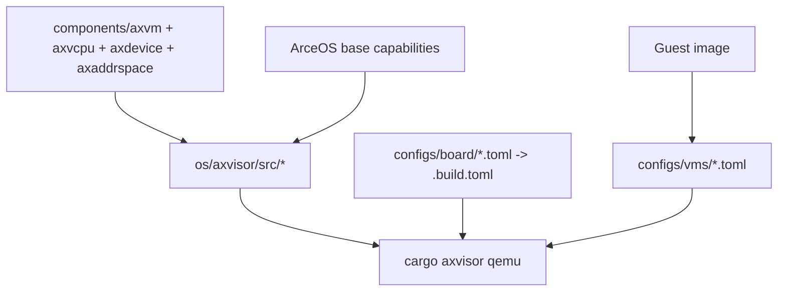

# Axvisor 开发指南

Axvisor 是 TGOSKits 工作区中的 Type-1 Hypervisor，与 ArceOS 和 StarryOS 并列运行。与后两者不同，Axvisor 的开发不仅涉及代码修改，还需关注板级配置、VM 配置及 Guest 镜像的协同。本文档介绍 Axvisor 的源码组织结构、构建与运行入口、快速启动流程、架构概览、开发工作流、测试验证方法及调试手段，帮助开发者快速上手 Axvisor 的开发与调试工作。

## 1. 源码组织

Axvisor 的源码分布在多个目录中：`os/axvisor/` 为 Hypervisor 主体，`components/` 包含虚拟化核心组件，`platform/` 包含板级平台实现。理解这些目录的职责边界，有助于在遇到问题时快速定位需修改的位置。

| 路径 | 角色 | 什么时候会改到 |
| --- | --- | --- |
| `os/axvisor/src/` | Hypervisor 运行时 | VM 生命周期、调度、设备管理、异常处理 |
| `os/axvisor/configs/board/` | 板级配置 | 目标架构、target、feature、默认 VM 列表 |
| `os/axvisor/configs/vms/` | Guest VM 配置 | kernel 路径、入口地址、内存布局、设备直通 |
| `components/axvm`、`components/axvcpu`、`components/axdevice`、`components/axaddrspace` | 虚拟化核心组件 | VM、vCPU、虚拟设备、地址空间 |
| `components/axvisor_api` | Hypervisor 对外接口 | Guest / Hypervisor 交互接口 |
| `platform/x86-qemu-q35` | x86_64 QEMU Q35 平台实现 | x86_64 板级能力 |

此外，Axvisor 运行时依然大量复用了 ArceOS 能力，例如 `axstd` 和底层平台支持。

## 2. 构建与运行

Axvisor 的构建与运行由 `os/axvisor` 自带的 xtask 提供，而非根 `cargo xtask` 的子命令。根目录通过 `cargo axvisor` 别名调用该 xtask，也可直接进入 `os/axvisor/` 使用本地 xtask，两者等价。

以下为两种等价的调用方式：

```bash
# 仓库根目录
cargo axvisor defconfig qemu-aarch64
cargo axvisor build
cargo axvisor qemu
```

```bash
# Axvisor 子目录
cd os/axvisor
cargo xtask defconfig qemu-aarch64
cargo xtask build
cargo xtask qemu
```

本地 xtask 提供以下子命令：

- `defconfig`：加载板级默认配置
- `build`：编译 Hypervisor
- `qemu`：在 QEMU 中运行
- `menuconfig`：交互式配置编辑
- `image`：Guest 镜像管理
- `vmconfig`：生成 VM 配置 schema

## 3. 快速启动：QEMU AArch64

首次使用建议从 `qemu-aarch64` 配置开始，当前仓库的预置配置与 CI 入口优先覆盖此路径。注意：Axvisor 不能仅通过 `defconfig/build/qemu` 三条命令直接启动，因为默认 QEMU 配置会引用 `tmp/rootfs.img`，该文件不会自动生成。

### 3.1 推荐方式：使用 setup_qemu.sh 脚本

请勿直接从 `defconfig/build/qemu` 开始。推荐使用以下流程：

```bash
cd os/axvisor
./scripts/setup_qemu.sh arceos
```

该脚本会自动完成以下操作：

1. 下载并解压 Guest 镜像到 `/tmp/.axvisor-images/qemu_aarch64_arceos`
2. 从 `configs/vms/arceos-aarch64-qemu-smp1.toml` 生成临时 VM 配置，输出到 `tmp/vmconfigs/arceos-aarch64-qemu-smp1.generated.toml`
3. 自动修正 VM 配置中的 `kernel_path`
4. 复制 `rootfs.img` 到 `os/axvisor/tmp/rootfs.img`

### 3.2 正确的启动命令

准备工作完成后，执行以下命令：

```bash
cd os/axvisor
cargo xtask qemu \
  --build-config configs/board/qemu-aarch64.toml \
  --qemu-config .github/workflows/qemu-aarch64.toml \
  --vmconfigs tmp/vmconfigs/arceos-aarch64-qemu-smp1.generated.toml
```

如果一切正常，ArceOS Guest 会输出 `Hello, world!`。

### 3.3 直接执行 `cargo axvisor qemu` 失败的原因

常见原因如下：

1. `configs/board/qemu-aarch64.toml` 默认配置为 `vm_configs = []`
2. 默认 QEMU 配置模板 `scripts/ostool/qemu-aarch64.toml` 会引用 `tmp/rootfs.img`

因此，仅执行以下命令并不充分：

```bash
cargo axvisor defconfig qemu-aarch64
cargo axvisor build
cargo axvisor qemu
```

除非已手动准备好以下资源，否则 QEMU 将因缺少 rootfs 或 VM 配置而启动失败：

- `.build.toml`
- 可用的 `vmconfigs`
- `os/axvisor/tmp/rootfs.img`

## 4. 架构概览

Axvisor 的启动依赖四类要素的协同：虚拟化核心组件提供 VM/vCPU/设备抽象，ArceOS 基础能力提供平台与运行时支撑，板级配置决定编译目标与 feature，VM 配置和 Guest 镜像决定每个 Guest 的具体参数。以下流程图展示了各要素之间的依赖关系。



该依赖关系对应以下四类不同层面的改动：

- 代码实现：`components/*` 或 `os/axvisor/src/*`
- 板级能力：`configs/board/*`、`platform/x86-qemu-q35`
- 单个 Guest 启动参数：`configs/vms/*`
- Guest 本身内容：外部生成的 Guest 镜像

## 5. 开发工作流

本节介绍 Axvisor 开发中常见的几类改动。无论修改核心组件、运行时代码、板级配置还是 VM 参数，均应按推荐顺序逐步验证，避免在配置未对齐的情况下直接运行 QEMU。

### 5.1 修改虚拟化核心组件

若修改内容涉及以下组件：

- `components/axvm`
- `components/axvcpu`
- `components/axdevice`
- `components/axaddrspace`

建议先进行构建验证：

```bash
cargo axvisor defconfig qemu-aarch64
cargo axvisor build
```

仅在 Guest 镜像和 VM 配置均已准备就绪后，再执行：

```bash
cargo axvisor qemu
```

### 5.2 修改 Hypervisor 运行时

`os/axvisor/src/*` 属于系统整合层。此类改动通常依赖以下条件的正确配置：

- 板级 feature 是否启用
- Guest 的 `kernel_path` 是否正确
- 设备直通或内存区域配置是否一致

推荐排查顺序：

1. 先确认 `build` 成功
2. 再确认 `.build.toml` 和 `configs/vms/*.toml`
3. 最后再判断是不是运行时代码本身的问题

### 5.3 新增板级支持

新增板级支持通常需要同步完成两部分工作：

- `os/axvisor/configs/board/<board>.toml`
- 对应的平台 crate，例如 `components/axplat_crates/platforms/*` 或 `platform/x86-qemu-q35`

当前仓库提供的板级配置包括：

- `qemu-aarch64.toml`
- `qemu-riscv64.toml`
- `qemu-x86_64.toml`
- `orangepi-5-plus.toml`
- `phytiumpi.toml`
- `roc-rk3568-pc.toml`

### 5.4 调整 VM 配置

若需切换 Guest 或修改 Guest 资源分配，主要入口为 `configs/vms/*.toml`，常用配置项包括：

- `kernel_path`
- `entry_point`
- `cpu_num`
- `memory_regions`
- `passthrough_devices`
- `excluded_devices`

这类改动通常不需要动 Hypervisor 主代码，但经常会决定你能不能真正把 Guest 拉起来。

## 6. 测试与验证

Axvisor 提供从编译验证到 QEMU 运行再到自动化测试的多层验证入口。日常开发先通过构建验证确认编译通过，在环境就绪后运行 QEMU，最后通过根工作区测试入口执行自动化回归。

### 构建验证

```bash
cd os/axvisor
cargo xtask defconfig qemu-aarch64
cargo xtask build
```

### QEMU 运行验证

```bash
cd os/axvisor
./scripts/setup_qemu.sh arceos
cargo xtask qemu \
  --build-config configs/board/qemu-aarch64.toml \
  --qemu-config .github/workflows/qemu-aarch64.toml \
  --vmconfigs tmp/vmconfigs/arceos-aarch64-qemu-smp1.generated.toml
```

### 自动化回归测试

```bash
cargo xtask test axvisor --target aarch64-unknown-none-softfloat
```

这条命令属于根工作区测试矩阵，不等价于本地 `cargo xtask qemu ...`。它会走自己的测试逻辑，并自动确保所需镜像已下载；当前 AArch64 测试默认使用的是 Linux guest 测试配置，而不是你手工运行的 ArceOS guest 路径。

### x86_64 路径

如果你在做 x86_64 相关改动，可以切到：

```bash
cargo axvisor defconfig qemu-x86_64
cargo axvisor build
```

这时常常还要一起关注 `platform/x86-qemu-q35`。

## 7. 调试指南

Axvisor 的启动失败通常不是代码问题，而是配置未对齐。本节总结最常见的排查思路和可用的调试命令。

### 优先检查配置

启动失败时，最常见的原因是以下四项配置未正确对齐：

1. `.build.toml` 是不是当前想要的板级配置
2. `vm_configs` 是不是空的
3. `configs/vms/*.toml` 里的 `kernel_path` 是否真实存在
4. Guest 镜像的入口地址、加载地址、内存布局是否匹配

### 调整日志与配置

推荐操作步骤：

- 在板级配置中调高日志级别
- 重新执行 `defconfig`
- 需要交互式调整时使用 `cargo axvisor menuconfig`

### 常用排错命令

```bash
# 重新生成当前配置
cargo axvisor defconfig qemu-aarch64

# 查看或调整配置
cargo axvisor menuconfig

# 只做构建，先排除编译问题
cargo axvisor build

# 使用官方脚本准备镜像和 rootfs
cd os/axvisor
./scripts/setup_qemu.sh arceos

# 明确指定 VM 配置运行
cargo xtask qemu \
  --build-config configs/board/qemu-aarch64.toml \
  --qemu-config .github/workflows/qemu-aarch64.toml \
  --vmconfigs tmp/vmconfigs/arceos-aarch64-qemu-smp1.generated.toml
```

## 8. 延伸阅读

以下是深入理解 Axvisor 及其上下文的推荐阅读顺序。

- [axvisor-internals.md](axvisor-internals.md): 系统理解 Axvisor 的五层架构、VMM 启动链、vCPU 任务模型与 `axvisor_api`
- [components.md](components.md): 从组件角度看 Axvisor 与 ArceOS / StarryOS 的共享依赖
- [build-system.md](build-system.md): 理解 `cargo axvisor` 与根 `cargo xtask test axvisor` 的边界
- [quick-start.md](quick-start.md): 如果你只是想先把第一条 QEMU 路径跑通
