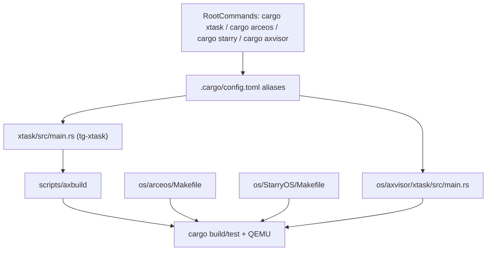

# 构建系统说明

这篇文档只回答三件事：

- 根目录 `cargo xtask` 到底负责什么
- 为什么 `os/arceos`、`os/StarryOS` 和 `os/axvisor` 还有各自的入口
- 修改一个组件后，应该从哪个命令开始验证

## 1. 一图看懂入口关系



仓库里实际上有两套常用入口：

- 根目录集成入口：`cargo xtask`、`cargo arceos`、`cargo starry`、`cargo axvisor`
- 子项目本地入口：`os/arceos/Makefile`、`os/StarryOS/Makefile`、`os/axvisor` 自带 xtask

## 2. 根目录命令真实落点

根 `.cargo/config.toml` 当前定义了四个关键别名：

| 命令 | 实际落点 | 说明 |
| --- | --- | --- |
| `cargo xtask ...` | `run -p tg-xtask -- ...` | 根目录统一入口 |
| `cargo arceos ...` | `run -p tg-xtask -- arceos ...` | ArceOS 别名 |
| `cargo starry ...` | `run -p tg-xtask -- starry ...` | StarryOS 别名 |
| `cargo axvisor ...` | `run -p axvisor --bin xtask -- ...` | Axvisor 本地 xtask 的根目录别名 |

根 `xtask/src/main.rs` 当前只暴露三类子命令：

- `test`
- `arceos`
- `starry`

所以有一个容易踩的坑：

- `cargo xtask arceos ...` 有效
- `cargo xtask starry ...` 有效
- `cargo xtask test ...` 有效
- `cargo xtask axvisor ...` 无效
- Axvisor 需要用 `cargo axvisor ...`，或者进入 `os/axvisor/` 后执行 `cargo xtask ...`

## 3. 根 workspace 为什么看起来“有点绕”

根 `Cargo.toml` 同时做了三件事：

1. 把常用 crate 放进统一 workspace  
   包括 `components/*` 下的大量基础组件、`os/arceos/modules/*`、`os/arceos/api/*`、`os/arceos/ulib/*`、ArceOS 示例、`os/StarryOS/{kernel,starryos}`、`os/axvisor`、`platform/*`、`test-suit/*` 和 `xtask/`。

2. 排除嵌套 workspace 目录  
   例如 `os/arceos`、`os/StarryOS`、`components/axplat_crates`、`components/axdriver_crates`、`components/axmm_crates` 等目录本身是独立 workspace，不会整体再塞进根 workspace。

3. 用 `[patch.crates-io]` 把依赖重定向到仓库本地路径  
   例如 `axhal`、`axdriver_*`、`axplat-*`、`starry-*`、`axvm`、`axvcpu` 等，虽然有些目录不直接在根 workspace 里，但依然会被工作区中的其他包通过 patch 引用到本地源码。

这个设计的意义是：

- 让你可以在一个仓库里跨组件联调
- 又不破坏 ArceOS、StarryOS 以及若干组件仓库自己原有的工作区结构

## 4. 什么时候用哪个入口

| 你的目标 | 推荐入口 | 原因 |
| --- | --- | --- |
| 跑 ArceOS 示例或改 ArceOS 模块 | 根目录 `cargo xtask arceos ...` | 最适合集成开发 |
| 只调 ArceOS Makefile 变量或兼容旧工作流 | `cd os/arceos && make ...` | 最贴近 ArceOS 原生入口 |
| 跑 StarryOS 或准备 rootfs | 根目录 `cargo xtask starry ...` | 统一管理 rootfs、构建和运行 |
| 调 StarryOS 自己的 Makefile 细节 | `cd os/StarryOS && make ...` | 最贴近 StarryOS 原生入口 |
| 配置、构建、启动 Axvisor | 根目录 `cargo axvisor ...` 或 `cd os/axvisor && cargo xtask ...` | Axvisor build/qemu 由本地 xtask 提供 |
| 跑统一测试矩阵 | 根目录 `cargo xtask test ...` | CI 与本地入口一致 |

最常用的一组命令是：

```bash
# ArceOS
cargo xtask arceos build --package arceos-helloworld --arch riscv64
cargo xtask arceos run --package arceos-helloworld --arch riscv64

# StarryOS
cargo xtask starry build --arch riscv64 --package starryos
cargo xtask starry run --arch riscv64 --package starryos
cargo xtask starry rootfs --arch riscv64

# Axvisor
cd os/axvisor
./scripts/setup_qemu.sh arceos
cargo xtask qemu \
  --build-config configs/board/qemu-aarch64.toml \
  --qemu-config .github/workflows/qemu-aarch64.toml \
  --vmconfigs tmp/vmconfigs/arceos-aarch64-qemu-smp1.generated.toml

# 测试
cargo xtask test std
cargo xtask test arceos --target riscv64gc-unknown-none-elf
cargo xtask test starry --target riscv64gc-unknown-none-elf
cargo xtask test axvisor --target aarch64-unknown-none-softfloat
```

## 5. 各系统各自读哪些配置

### ArceOS

ArceOS 的本地入口是 `os/arceos/Makefile`。它会把：

- `ARCH` 映射为目标 triple
- `A` / `APP` 解释为应用路径
- `FEATURES` / `APP_FEATURES` 解释为模块与应用特性
- `BLK` / `NET` / `GRAPHIC` / `MEM` 等传递给 QEMU

常见的本地入口命令：

```bash
cd os/arceos
make A=examples/helloworld ARCH=riscv64 run
make A=examples/httpserver ARCH=riscv64 NET=y run
make A=examples/shell ARCH=riscv64 BLK=y run
```

几个值得知道的文件：

- `os/arceos/Makefile`: 本地构建入口
- `os/arceos/.axconfig.toml`: Makefile 默认生成的最终配置文件
- `os/arceos/examples/*`: 示例应用
- `os/arceos/modules/*`: 核心模块
- `os/arceos/api/*`: feature 和对外 API 聚合

### StarryOS

根目录 `cargo xtask starry ...` 走的是 `xtask/src/starry/*`，它和本地 `os/StarryOS/Makefile` 不是完全同一套路径。

根目录入口的特点：

- `build` / `run` 默认包是 `starryos`
- `test` 使用专门的 `starryos-test`
- `rootfs` 和 `run` 会围绕目标产物目录里的 `disk.img` 工作
- `img` 仍然存在，但已经是 `rootfs` 的废弃别名

本地 Makefile 入口的特点：

- `make rootfs` 会把镜像复制到 `os/StarryOS/make/disk.img`
- `make ARCH=riscv64 run` 会走 StarryOS 自己的 `make/` 目录逻辑
- `make rv` 和 `make la` 是快捷别名

也就是说，StarryOS 有两个常见的 rootfs 位置：

- 根目录 xtask 路径：通常在 `target/<triple>/<profile>/disk.img`
- 本地 Makefile 路径：`os/StarryOS/make/disk.img`

这不是冲突，而是两套入口使用不同的默认产物目录。

### Axvisor

Axvisor 的构建与运行完全由 `os/axvisor` 自带 xtask 管理。根目录的 `cargo axvisor ...` 只是为了方便，不是通过根 `tg-xtask` 转发。

当前你最需要知道的文件是：

- `os/axvisor/.cargo/config.toml`: 本地 `cargo xtask` 别名
- `os/axvisor/xtask/src/main.rs`: `defconfig` / `build` / `qemu` / `menuconfig` / `image` 等命令实现
- `os/axvisor/configs/board/*.toml`: 板级配置
- `os/axvisor/configs/vms/*.toml`: Guest VM 配置
- `os/axvisor/.build.toml`: `defconfig` 复制板级配置后生成的当前生效配置

`defconfig <board>` 的行为是：

1. 校验 `configs/board/<board>.toml` 是否存在
2. 备份已有 `.build.toml`
3. 把板级配置复制成新的 `.build.toml`

当前仓库里现成的 QEMU 板级配置主要是：

- `qemu-aarch64`
- `qemu-x86_64`

其中 `qemu-aarch64.toml` 当前默认是 `vm_configs = []`，而默认 QEMU 配置模板还会引用 `tmp/rootfs.img`。所以新开发者第一次跑 Axvisor 时，不能只执行 `cargo axvisor defconfig/build/qemu`，而应该优先使用 `os/axvisor/scripts/setup_qemu.sh` 自动准备镜像、生成 VM 配置并复制 rootfs。

## 6. 测试入口和实际测试对象

### `cargo xtask test std`

这条命令会读取 `scripts/test/std_crates.csv`，逐个对列表里的 workspace package 执行 `cargo test -p <package>`。

适合场景：

- 改了基础 crate
- 想先确认 host/`std` 测试没有被破坏

### `cargo xtask test arceos`

根 `xtask` 会自动发现 `test-suit/arceos/` 下的测试包，并逐个在 QEMU 中运行。例如 `test-suit/arceos/task/yield` 这类包会被自动纳入测试。

常用命令：

```bash
cargo xtask test arceos --target riscv64gc-unknown-none-elf
```

如果不显式传 `--target`，会走默认架构路径；新开发者通常建议先显式写出来。

### `cargo xtask test starry`

这条命令会构建并运行 `test-suit/starryos` 下的 `starryos-test` 包，而不是普通的 `starryos` 包。

```bash
cargo xtask test starry --target riscv64gc-unknown-none-elf
```

### `cargo xtask test axvisor`

这条命令是根工作区对 Axvisor 的统一测试入口。当前 CI 里真正启用的是：

```bash
cargo xtask test axvisor --target aarch64-unknown-none-softfloat
```

## 7. CI 与本地如何对齐

当前 `.github/workflows/test.yml` 做的事情很直接：

- `cargo xtask test std`
- `cargo xtask test arceos --target ...`
- `cargo xtask test starry --target ...`
- `cargo xtask test axvisor --target aarch64-unknown-none-softfloat`

也就是说，本地最稳妥的验证方式就是复用这些命令，而不是另外发明一套脚本。

## 8. 最容易踩的坑

### 以为 `cargo xtask` 能直接构建 Axvisor

不能。根 `cargo xtask` 没有 `axvisor` 子命令。请改用：

```bash
cd os/axvisor
./scripts/setup_qemu.sh arceos
cargo xtask qemu \
  --build-config configs/board/qemu-aarch64.toml \
  --qemu-config .github/workflows/qemu-aarch64.toml \
  --vmconfigs tmp/vmconfigs/arceos-aarch64-qemu-smp1.generated.toml
```

### 以为 StarryOS 的 rootfs 永远在 `os/StarryOS/make/disk.img`

只有本地 Makefile 路径是这样。根目录 `cargo xtask starry rootfs` 默认围绕目标产物目录工作。

### 以为被 `exclude` 的目录就不会参与构建

不对。很多被 `exclude` 的目录仍会通过 `[patch.crates-io]` 被其他包引用到本地源码。

### 进入 `os/axvisor/` 后忘了 `cargo xtask` 的含义已经变了

在仓库根目录，`cargo xtask` 是 `tg-xtask`。  
进入 `os/axvisor/` 后，`cargo xtask` 变成 Axvisor 自己的 xtask。

## 相关文档

- [quick-start.md](quick-start.md): 先把仓库跑起来
- [components.md](components.md): 从组件视角看三个系统的接线关系
- [arceos-guide.md](arceos-guide.md): ArceOS 模块、API 和示例
- [starryos-guide.md](starryos-guide.md): StarryOS 内核、rootfs 和 syscall 路径
- [axvisor-guide.md](axvisor-guide.md): Axvisor 板级配置、VM 配置和虚拟化组件
- [repo.md](repo.md): Subtree 管理与同步策略
