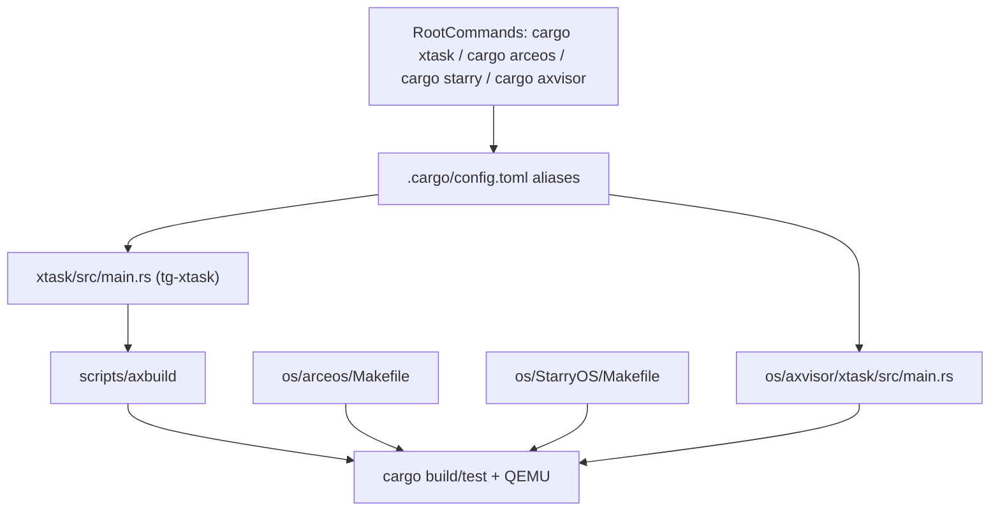

# 构建系统

本文档说明 TGOSKits 工作区的构建系统架构，重点阐述三个核心问题：根目录 `cargo xtask` 的职责范围、`os/arceos`、`os/StarryOS` 和 `os/axvisor` 各自保留本地构建入口的原因，以及修改组件后应从哪个命令开始验证。理解构建系统有助于开发者选择正确的命令入口，避免在多个构建系统之间产生混淆。

## 1. 入口总览

TGOSKits 工作区采用分层构建系统设计：统一的根目录入口与各子项目的本地构建入口并存。该设计既支持跨系统联调与统一测试，又兼容各项目原有的工作流。



工作区实际存在两套构建入口：根目录集成入口（`cargo xtask`、`cargo arceos`、`cargo starry`、`cargo axvisor`）和子项目本地入口（`os/arceos/Makefile`、`os/StarryOS/Makefile`、`os/axvisor` 自带 xtask）。

## 2. 命令映射

根目录的命令系统通过 `.cargo/config.toml` 定义了四个关键别名，将用户命令映射到实际的构建工具。

### 2.1 别名定义

根 `.cargo/config.toml` 定义的四个关键别名如下：

| 命令 | 实际落点 | 说明 |
| --- | --- | --- |
| `cargo xtask ...` | `run -p tg-xtask -- ...` | 根目录统一入口 |
| `cargo arceos ...` | `run -p tg-xtask -- arceos ...` | ArceOS 别名 |
| `cargo starry ...` | `run -p tg-xtask -- starry ...` | StarryOS 别名 |
| `cargo axvisor ...` | `run -p axvisor --bin xtask -- ...` | Axvisor 本地 xtask 的根目录别名 |

### 2.2 子命令范围限制

根 `xtask/src/main.rs` 当前仅暴露三类子命令：`test`、`arceos` 和 `starry`。因此 `cargo xtask arceos ...`、`cargo xtask starry ...`、`cargo xtask test ...` 均有效，但 `cargo xtask axvisor ...` 无效。Axvisor 需使用 `cargo axvisor ...`，或进入 `os/axvisor/` 后执行 `cargo xtask ...`。

## 3. 工作区结构

TGOSKits 采用复杂的多层 workspace 结构管理多个系统和组件。根 `Cargo.toml` 同时承担三项职责：将常用 crate 纳入统一 workspace、排除嵌套 workspace 目录、通过 `[patch.crates-io]` 将依赖重定向到仓库本地路径。该设计支持跨组件联调，同时不破坏各子项目原有的工作区结构。

### 3.1 统一 workspace 管理

根 `Cargo.toml` 把常用 crate 放进统一 workspace，包括 `components/*` 下的大量基础组件、`os/arceos/modules/*`、`os/arceos/api/*`、`os/arceos/ulib/*`、ArceOS 示例、`os/StarryOS/{kernel,starryos}`、`os/axvisor`、`platform/*`、`test-suit/*` 和 `xtask/`。

### 3.2 嵌套 workspace 排除

一些目录本身是独立 workspace，不会整体再塞进根 workspace，例如 `os/arceos`、`os/StarryOS`、`components/axplat_crates`、`components/axdriver_crates`、`components/axmm_crates` 等。

### 3.3 依赖重定向

根 `Cargo.toml` 使用 `[patch.crates-io]` 把依赖重定向到仓库本地路径，例如 `axhal`、`axdriver_*`、`axplat-*`、`starry-*`、`axvm`、`axvcpu` 等。虽然有些目录不直接在根 workspace 里，但依然会被工作区中的其他包通过 patch 引用到本地源码。

## 4. 命令选择指南

根据开发目标的不同，应选择相应的命令入口。ArceOS 和 StarryOS 主要使用根目录 `cargo xtask` 命令，而 Axvisor 既可使用根目录 `cargo axvisor` 别名，也可进入 `os/axvisor/` 使用其独立的 xtask。

### 4.1 入口选择对照表

| 你的目标 | 推荐入口 | 原因 |
| --- | --- | --- |
| 跑 ArceOS 示例或改 ArceOS 模块 | 根目录 `cargo xtask arceos ...` | 最适合集成开发 |
| 只调 ArceOS Makefile 变量或兼容旧工作流 | `cd os/arceos && make ...` | 最贴近 ArceOS 原生入口 |
| 跑 StarryOS 或准备 rootfs | 根目录 `cargo xtask starry ...` | 统一管理 rootfs、构建和运行 |
| 调 StarryOS 自己的 Makefile 细节 | `cd os/StarryOS && make ...` | 最贴近 StarryOS 原生入口 |
| 配置、构建、启动 Axvisor | 根目录 `cargo axvisor ...` 或 `cd os/axvisor && cargo xtask ...` | Axvisor build/qemu 由本地 xtask 提供 |
| 跑统一测试矩阵 | 根目录 `cargo xtask test ...` | CI 与本地入口一致 |

### 4.2 常用命令示例

最常用的一组命令是：

```bash
# ArceOS
cargo xtask arceos build --package arceos-helloworld --arch riscv64
cargo xtask arceos run --package arceos-helloworld --arch riscv64

# StarryOS
cargo xtask starry build --arch riscv64 --package starryos
cargo xtask starry run --arch riscv64 --package starryos
cargo xtask starry rootfs --arch riscv64

# Axvisor
cd os/axvisor
./scripts/setup_qemu.sh arceos
cargo xtask qemu \
  --build-config configs/board/qemu-aarch64.toml \
  --qemu-config .github/workflows/qemu-aarch64.toml \
  --vmconfigs tmp/vmconfigs/arceos-aarch64-qemu-smp1.generated.toml

# 测试
cargo xtask test std
cargo xtask test arceos --target riscv64gc-unknown-none-elf
cargo xtask test starry --target riscv64gc-unknown-none-elf
cargo xtask test axvisor --target aarch64-unknown-none-softfloat
```

## 5. 系统配置与构建

ArceOS、StarryOS 和 Axvisor 各自拥有独立的配置与构建方式。ArceOS 和 StarryOS 主要通过 Makefile 进行配置，而 Axvisor 使用自带的 xtask 系统管理配置与构建。

### 5.1 ArceOS 配置与构建

ArceOS 的本地入口是 `os/arceos/Makefile`。它会把 `ARCH` 映射为目标 triple，把 `A` / `APP` 解释为应用路径，把 `FEATURES` / `APP_FEATURES` 解释为模块与应用特性，把 `BLK` / `NET` / `GRAPHIC` / `MEM` 等传递给 QEMU。常见的本地入口命令如下：

```bash
cd os/arceos
make A=examples/helloworld ARCH=riscv64 run
make A=examples/httpserver ARCH=riscv64 NET=y run
make A=examples/shell ARCH=riscv64 BLK=y run
```

几个值得知道的文件：`os/arceos/Makefile` 是本地构建入口；`os/arceos/.axconfig.toml` 是 Makefile 默认生成的最终配置文件；`os/arceos/examples/*` 包含示例应用；`os/arceos/modules/*` 包含核心模块；`os/arceos/api/*` 包含 feature 和对外 API 聚合。

### 5.2 StarryOS 配置与构建

根目录 `cargo xtask starry ...` 走的是 `xtask/src/starry/*`，它和本地 `os/StarryOS/Makefile` 不是完全同一套路径。根目录入口的特点是 `build` / `run` 默认包是 `starryos`，`test` 使用专门的 `starryos-test`，`rootfs` 和 `run` 会围绕目标产物目录里的 `disk.img` 工作，`img` 仍然存在但已经是 `rootfs` 的废弃别名。

本地 Makefile 入口的特点是 `make rootfs` 会把镜像复制到 `os/StarryOS/make/disk.img`，`make ARCH=riscv64 run` 会走 StarryOS 自己的 `make/` 目录逻辑，`make rv` 和 `make la` 是快捷别名。也就是说，StarryOS 有两个常见的 rootfs 位置：根目录 xtask 路径通常在 `target/<triple>/<profile>/disk.img`，本地 Makefile 路径是 `os/StarryOS/make/disk.img`。这不是冲突，而是两套入口使用不同的默认产物目录。

### 5.3 Axvisor 配置与构建

Axvisor 的构建与运行完全由 `os/axvisor` 自带 xtask 管理。根目录的 `cargo axvisor ...` 只是为了方便，不是通过根 `tg-xtask` 转发。当前你最需要知道的文件包括：`os/axvisor/.cargo/config.toml` 定义本地 `cargo xtask` 别名；`os/axvisor/xtask/src/main.rs` 实现 `defconfig` / `build` / `qemu` / `menuconfig` / `image` 等命令；`os/axvisor/configs/board/*.toml` 包含板级配置；`os/axvisor/configs/vms/*.toml` 包含 Guest VM 配置；`os/axvisor/.build.toml` 是 `defconfig` 复制板级配置后生成的当前生效配置。

`defconfig <board>` 的行为是校验 `configs/board/<board>.toml` 是否存在、备份已有 `.build.toml`、把板级配置复制成新的 `.build.toml`。当前仓库里现成的 QEMU 板级配置主要是 `qemu-aarch64` 和 `qemu-x86_64`。其中 `qemu-aarch64.toml` 当前默认是 `vm_configs = []`，而默认 QEMU 配置模板还会引用 `tmp/rootfs.img`。所以新开发者第一次跑 Axvisor 时，不能只执行 `cargo axvisor defconfig/build/qemu`，而应该优先使用 `os/axvisor/scripts/setup_qemu.sh` 自动准备镜像、生成 VM 配置并复制 rootfs。

## 6. 测试入口

TGOSKits 提供统一的测试入口管理不同类型的测试。根目录 `cargo xtask test` 命令支持标准库测试、ArceOS 测试、StarryOS 测试和 Axvisor 测试。理解这些测试入口有助于快速验证改动是否影响现有功能。

### 6.1 标准库测试

`cargo xtask test std` 命令会读取 `scripts/test/std_crates.csv`，逐个对列表里的 workspace package 执行 `cargo test -p <package>`。这个命令适合在改了基础 crate 后，想先确认 host/`std` 测试没有被破坏的场景。

### 6.2 ArceOS 测试

`cargo xtask test arceos` 命令会让根 `xtask` 自动发现 `test-suit/arceos/` 下的测试包，并逐个在 QEMU 中运行。例如 `test-suit/arceos/task/yield` 这类包会被自动纳入测试。常用命令是 `cargo xtask test arceos --target riscv64gc-unknown-none-elf`，如果不显式传 `--target` 会走默认架构路径，新开发者通常建议先显式写出来。

### 6.3 StarryOS 测试

`cargo xtask test starry` 命令会构建并运行 `test-suit/starryos` 下的 `starryos-test` 包，而不是普通的 `starryos` 包。常用命令是 `cargo xtask test starry --target riscv64gc-unknown-none-elf`。

### 6.4 Axvisor 测试

`cargo xtask test axvisor` 命令是根工作区对 Axvisor 的统一测试入口。当前 CI 里真正启用的是 `cargo xtask test axvisor --target aarch64-unknown-none-softfloat`。

## 7. 持续集成

当前 `.github/workflows/test.yml` 执行的测试流程如下：

- `cargo xtask test std`
- `cargo xtask test arceos --target ...`
- `cargo xtask test starry --target ...`
- `cargo xtask test axvisor --target aarch64-unknown-none-softfloat`

建议本地验证时复用上述命令，保持与 CI 一致。

## 8. 常见问题与注意事项

### 误认为 `cargo xtask` 可直接构建 Axvisor

根 `cargo xtask` 没有 `axvisor` 子命令。请改用：

```bash
cd os/axvisor
./scripts/setup_qemu.sh arceos
cargo xtask qemu \
  --build-config configs/board/qemu-aarch64.toml \
  --qemu-config .github/workflows/qemu-aarch64.toml \
  --vmconfigs tmp/vmconfigs/arceos-aarch64-qemu-smp1.generated.toml
```

### 误认为 StarryOS 的 rootfs 永远位于 `os/StarryOS/make/disk.img`

仅本地 Makefile 路径使用该位置。根目录 `cargo xtask starry rootfs` 使用目标产物目录下的镜像。

### 误认为 `exclude` 的目录不参与构建

部分被 `exclude` 的目录仍会通过 `[patch.crates-io]` 被其他包引用到本地源码。

### 在 `os/axvisor/` 中误用 `cargo xtask` 的含义

在仓库根目录，`cargo xtask` 指向 `tg-xtask`；进入 `os/axvisor/` 后，`cargo xtask` 变为 Axvisor 自身的 xtask。

## 相关文档

- [quick-start.md](quick-start.md): 先把仓库跑起来
- [components.md](components.md): 从组件视角看三个系统的接线关系
- [arceos-guide.md](arceos-guide.md): ArceOS 模块、API 和示例
- [starryos-guide.md](starryos-guide.md): StarryOS 内核、rootfs 和 syscall 路径
- [axvisor-guide.md](axvisor-guide.md): Axvisor 板级配置、VM 配置和虚拟化组件
- [repo.md](repo.md): Subtree 管理与同步策略
