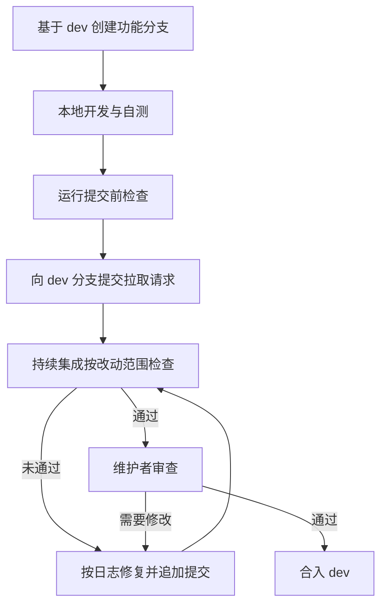

# 贡献指南

社区欢迎各种形式的贡献，包括代码、文档、测试以及社区建设。所有改动都以公开讨论和审查为基础，这样既能保证质量，也让经验能够沉淀下来。

## 1. 贡献渠道

参与者可以通过反馈问题、提出建议和参与讨论加入社区协作。问题与建议提交到议题，讨论在社区渠道中进行，改动则以拉取请求的形式提出。

### 1.1 报告问题

使用过程中发现的缺陷统一提交到 [GitHub Issues](https://github.com/rcore-os/tgoskits/issues)。提交前请先搜索是否已有同类议题，避免重复讨论，也能更快找到已有的解决思路或临时规避方式。

一份有效的缺陷报告应包含使用的系统、运行环境、触发问题的操作过程、期望结果与实际结果，以及完整的错误输出；已经排查过的方向也一并说明。信息越完整，维护者越容易定位原因，具体结构见[获取帮助](/community/support)。

### 1.2 提出建议

功能建议同样通过 [GitHub Issues](https://github.com/rcore-os/tgoskits/issues) 提出。建议中请说明使用场景、希望解决的问题和预期的收益，便于社区判断优先级和实现方式，也便于其他参与者判断自己是否有类似需求。

建议涉及较大改动时，请先与社区讨论并达成共识，再着手实现。这样既能避免重复劳动，也能让方案在设计阶段就得到反馈，减少实现完成后再做方向调整的成本。

### 1.3 参与讨论

一般性问题、使用经验交流和方案讨论欢迎在社区讨论渠道中进行。回答他人的提问、帮助复现问题、整理已有结论，同样是对社区的实际贡献，也会让后续遇到同类问题的人更容易找到答案。

## 2. 贡献流程

代码和文档改动通过拉取请求提交，从准备分支到合入需要经过本地检查、持续集成和人工审查三个环节，每个环节都能提前发现不同的问题。

### 2.1 准备分支

日常开发的改动以 `dev` 分支为基线，`main` 分支只接收已经完成集成验证的内容。分支划分与合并节奏由维护者统一安排，见[仓库管理指南](/docs/contributing/repo)。

请先 fork 上游仓库，再克隆自己的副本并配置上游地址，改动推送到自己的 fork。保留上游地址便于后续同步社区的最新改动，也能减少合并时的冲突。

```bash
git clone https://github.com/<your-github-name>/tgoskits.git
cd tgoskits
git remote add upstream https://github.com/rcore-os/tgoskits.git
git checkout -b feature/your-feature-name
```

分支名带类型前缀，`feature/`、`fix/`、`refactor/`、`docs/` 分别对应新功能、缺陷修复、重构和文档改动，便于他人快速判断改动性质，也便于后续按类型检索历史提交。

### 2.2 提交前的检查

提交前请完成下列检查。持续集成会执行相同的内容，本地提前运行可以更快发现问题，也避免反复推送只为了确认某一项检查是否通过。

| 检查 | 命令 |
|------|------|
| 代码格式 | `cargo fmt` |
| 静态检查 | `cargo xtask clippy` |
| 并发语义检查 | `cargo xtask sync-lint` |
| 测试 | `cargo xtask test` |

改动只涉及部分内容时，可以使用增量方式缩小检查范围，具体参数见[命令索引](/docs/build/commands)。如果检查给出告警，请修复根本原因，而不是在改动中屏蔽告警，否则同类问题会在后续改动中继续出现。

### 2.3 提交拉取请求

拉取请求标题使用英文并遵循 `type(scope): content` 形式，例如 `fix(axfs-ng-vfs): keep parent traversal inside chroot`；正文使用中文，说明要解决的问题、实际改动以及每一步方案背后的逻辑。改动集中在单个软件包时，把软件包名写进 `scope`，便于维护者据此找到合适的审查人。

从创建分支到合入，改动会依次经过本地检查、持续集成和人工审查，其中任何一步未通过都需要回到上一步修正，下图是这条路径的完整走向，其中 CI 指持续集成检查。



持续集成的结果决定拉取请求能否进入审查。提交后请先确认未通过的项是由改动引起还是环境问题，再把处理结论写回拉取请求，这样审查人不必重新判断同一份日志，检查项的含义见 [CI 与容器镜像](/docs/build/ci)。

### 2.4 接受审查

所有改动都需要经过审查。维护者会审查您的拉取请求，并可能提出修改意见；请根据反馈调整改动或补充说明，并在讨论中保持友好和专业，把分歧集中在具体行为和技术取舍上。

审查关注改动是否解决了它声称的问题、是否与社区既有做法一致、是否附带必要的验证与文档更新。审查意见针对改动本身而非提交者个人，反馈及时处理可以让改动更快合入。

## 3. 各类贡献

社区的工作不只有功能开发，文档、测试和日常答疑同样需要有人持续投入。不同方向的准备方式和验收标准各不相同，下面按类别说明各自需要具备的条件。

### 3.1 代码贡献

代码改动除功能本身外，还需要保证风格统一、告警清零，并为新增的公共接口补充文档注释。提交前请确认改动范围内的检查全部通过，并说明验证时使用的系统与环境。

### 3.2 文档贡献

文档贡献包括修正错误或不清晰的表述、补充使用示例、完善教程以及改进导航结构。文档站点分为主文档与社区文档两部分，本地预览与写作规范见[文档部署](/docs/contributing/docs)。

写作时请保持说明准确、结构清晰，描述行为变化的同时同步更新受影响的页面，避免同一份文档中出现互相矛盾的说法，也避免读者按旧内容操作后得到不同结果。

### 3.3 测试贡献

测试用于证明功能确实按预期工作。社区鼓励复用和增强已有用例，只有在缺少独立验证时新增测试，不以用例数量或覆盖率增长为目标，因为无法说明行为的用例在长期维护中只会增加负担。

测试位置与执行方式的选择见[测试与验证](/docs/build/ci)；修复缺陷时，请同时说明该用例在修复前的表现，以此证明它确实覆盖了出现问题的路径，而不是只验证了改动后的结果。

### 3.4 社区支持

回答问题、整理议题、翻译文档、组织分享同样属于贡献。这类工作让社区的知识更容易被找到和使用，也减少维护者重复解释同一问题的次数，社区在认可贡献者时会一并考虑。

## 4. 发布与认可

发布节奏由维护者根据改动情况决定，参与者的工作在版本记录和社区名单中都会得到体现，因此提交信息与改动说明需要写清实际内容。

### 4.1 版本发布

版本号遵循语义化版本控制：主版本号对应不兼容的接口修改，次版本号对应向下兼容的功能新增，修订号对应向下兼容的问题修正。发布说明由工具依据提交历史生成，因此提交信息请按约定式提交格式书写，它会直接影响使用者看到的变更记录。发布节奏与配置见[版本发布](/docs/ci/publishing/releases)。

### 4.2 贡献认可

贡献者名单记录在[团队成员](/community/team)页面，发布说明中也会致谢当期的改动。名单按公开贡献记录整理，长期在某一方向投入的贡献者会被邀请进入核心团队，参与审查和方向讨论，无需单独申请。

## 5. 获取帮助

贡献过程中遇到阻碍时，[获取帮助](/community/support)列出了提问渠道和所需的信息结构。描述问题时附上操作过程和完整输出，可以让协助者更快判断问题出在环境、配置还是代码上。

协作中遇到与社区准则相关的问题，同样可以通过这些渠道与维护者联系，我们会认真处理每一条反馈，并在讨论中说明后续的处理方式与理由。

