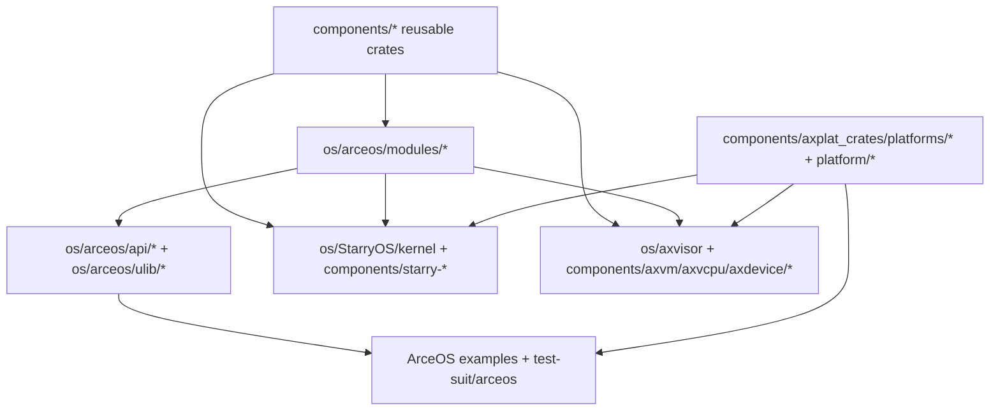

# 基于组件开发指南

TGOSKits 的核心价值不只是“把仓库放在一起”，而是让你可以从组件出发，一路追到 ArceOS、StarryOS 和 Axvisor 的实际消费者。这篇文档专门回答这个问题。

如果你已经知道目标 crate 的名字，建议和 [`docs/crates/README.md`](crates/README.md) 配合阅读：这里负责回答“它处在哪一层、通常影响谁”，crate 索引负责回答“它具体依赖谁、文档入口在哪”。

## 1. 组件不只在 `components/`

新开发者最容易误解的一点是：只有 `components/` 才算组件。实际上，TGOSKits 里至少有六类“组件化层次”。

| 路径 | 角色 | 典型内容 | 主要消费者 |
| --- | --- | --- | --- |
| `components/` | subtree 管理的独立可复用 crate | `axerrno`、`kspin`、`axvm`、`starry-process` | 三套系统都可能直接或间接使用 |
| `os/arceos/modules/` | ArceOS 内核模块 | `axhal`、`axtask`、`axnet`、`axfs` | ArceOS，且经常被 StarryOS 和 Axvisor 复用 |
| `os/arceos/api/` | feature 与对外 API 聚合 | `axfeat`、`arceos_api` | ArceOS 应用、StarryOS、Axvisor |
| `os/arceos/ulib/` | 用户侧库 | `axstd`、`axlibc` | ArceOS 示例与用户应用 |
| `os/StarryOS/kernel/` | StarryOS 内核逻辑 | syscall、进程、内存、文件系统 | `starryos` 包 |
| `os/axvisor/` | Hypervisor 运行时与配置 | `src/`、`configs/board/`、`configs/vms/` | Axvisor |

此外还有两个经常要一起看的目录：

- `components/axplat_crates/platforms/*` 与 `platform/*`：平台实现
- `test-suit/*`：系统级测试入口

## 2. 组件是怎样流到三个系统里的



这张图的意思不是所有改动都要经过所有层，而是告诉你常见路径通常有三种：

1. 纯复用 crate 直接被系统包依赖  
   例如 `components/starry-process`、`components/axvm`

2. 先经过 ArceOS 模块层，再被上层系统消费  
   例如 `axhal`、`axtask`、`axdriver`、`axnet`

3. 通过平台和配置接到最终系统  
   例如 `axplat-*`、`platform/x86-qemu-q35`、Axvisor 的 `configs/board/*.toml`

## 3. 先判断你的改动应该落在哪

| 你要改什么 | 优先看哪里 | 常见影响面 |
| --- | --- | --- |
| 通用基础能力：错误、锁、页表、Per-CPU、容器 | `components/axerrno`、`components/kspin`、`components/page_table_multiarch`、`components/percpu` | 三套系统都可能受影响 |
| ArceOS 内核服务：调度、HAL、驱动、网络、文件系统 | `os/arceos/modules/*`，以及相关 `axdriver_crates` / `axmm_crates` / `axplat_crates` | ArceOS，且可能波及 StarryOS / Axvisor |
| ArceOS 的 feature 或应用接口 | `os/arceos/api/axfeat`、`os/arceos/ulib/axstd`、`os/arceos/ulib/axlibc` | ArceOS 应用与上层系统 |
| StarryOS 的 Linux 兼容行为 | `components/starry-*`、`os/StarryOS/kernel/*` | StarryOS |
| Hypervisor、vCPU、虚拟设备、VM 管理 | `components/axvm`、`components/axvcpu`、`components/axdevice`、`components/axvisor_api`、`os/axvisor/src/*` | Axvisor |
| 平台、板级适配或 VM 启动配置 | `components/axplat_crates/platforms/*`、`platform/*`、`os/axvisor/configs/*` | 一到多个系统 |

如果你还不知道一个 crate 是谁维护、来自哪个独立仓库，先看 `scripts/repo/repos.csv`。它是所有 subtree 组件的来源总表。

## 4. 修改已有组件时，推荐的验证闭环

### 4.1 先找“最近的消费者”

不要一上来跑完整测试矩阵。先问自己：

- 这个 crate 是被哪个包直接依赖的
- 它是只影响一个系统，还是会同时影响多个系统
- 有没有比“启动整套系统”更小的验证入口

通常可以先看相关 `Cargo.toml`，再选择最小运行路径。

### 4.2 从最小路径开始

| 改动位置 | 第一步验证 | 第二步验证 |
| --- | --- | --- |
| `components/axerrno`、`components/kspin`、`components/lazyinit` 这类基础 crate | `cargo test -p <crate>` | `cargo xtask arceos run --package arceos-helloworld --arch riscv64` |
| `os/arceos/modules/*` | `cargo xtask arceos run --package arceos-helloworld --arch riscv64` | 需要功能时换成 `arceos-httpserver --net` 或 `arceos-shell --blk` |
| `components/starry-*`、`os/StarryOS/kernel/*` | `cargo xtask starry run --arch riscv64 --package starryos` | `cargo xtask test starry --target riscv64gc-unknown-none-elf` |
| `components/axvm`、`components/axvcpu`、`components/axdevice`、`os/axvisor/src/*` | `cd os/axvisor && cargo xtask build` | 准备好 Guest 后运行 `./scripts/setup_qemu.sh arceos`，再执行 `cargo xtask qemu --build-config ... --qemu-config ... --vmconfigs ...` |

### 4.3 最后再补统一测试

```bash
cargo xtask test std
cargo xtask test arceos --target riscv64gc-unknown-none-elf
cargo xtask test starry --target riscv64gc-unknown-none-elf
cargo xtask test axvisor --target aarch64-unknown-none-softfloat
```

如果你改的是跨系统基础组件，至少要跑：

- 一条 host/`std` 路径
- 一条 ArceOS 路径
- 一条它真正影响到的系统路径

## 5. 新增组件时，先把“工作区接线”做对

### 5.1 先选层次，再创建目录

先问自己这个新 crate 应该属于哪一层：

- 真正可复用的独立 crate：放 `components/`
- 仅属于 ArceOS 的 OS 模块：放 `os/arceos/modules/`
- 仅属于 ArceOS 的 API 或用户库：放 `os/arceos/api/` 或 `os/arceos/ulib/`
- 仅属于 StarryOS / Axvisor 的系统内部逻辑：优先放对应系统目录

### 5.2 新建普通 leaf crate 的最小模板

如果它是一个新的普通组件，可以从类似下面的 `Cargo.toml` 开始：

```toml
[package]
name = "my_component"
version = "0.1.0"
edition.workspace = true

[dependencies]
```

相比旧仓库里常见的模板，这里更推荐直接复用根工作区的 `edition.workspace = true`，和当前仓库保持一致。

### 5.3 把组件接到根 workspace

普通 leaf crate 常见需要两步：

1. 在根 `Cargo.toml` 的 `[workspace.members]` 里加入路径
2. 在 `[patch.crates-io]` 里加入同名 patch，让其他包解析到本地源码

例如：

```toml
[workspace]
members = [
    "components/my_component",
]

[patch.crates-io]
my_component = { path = "components/my_component" }
```

### 5.4 遇到嵌套 workspace 时不要照抄

`components/axplat_crates`、`components/axdriver_crates`、`components/axmm_crates` 这类目录本身是独立 workspace。给这类目录加新 crate 时，通常应该：

- 先在它自己的 workspace 里接好
- 再在根 `Cargo.toml` 里为具体 leaf crate 增加 patch 或 member
- 不要把整个父目录直接重新塞回根 workspace

### 5.5 什么时候需要改 `repos.csv`

只有当这个新组件本身要作为独立 subtree 仓库管理时，才需要把它加入 `scripts/repo/repos.csv`。如果你只是先在 TGOSKits 内部做原型，不一定要立刻动 subtree 配置。

Subtree 细节请看 [repo.md](repo.md)。

## 6. 把组件接到 ArceOS

在 ArceOS 里，组件开发常见的落地链路是：

1. 复用逻辑在 `components/` 或 `os/arceos/modules/` 实现
2. 如果要作为可选能力暴露，接到 `os/arceos/api/axfeat`
3. 如果要给应用直接用，再接到 `os/arceos/ulib/axstd` 或 `axlibc`
4. 用 `os/arceos/examples/*` 或 `test-suit/arceos/*` 验证

最常用的三个验证入口：

```bash
cargo xtask arceos run --package arceos-helloworld --arch riscv64
cargo xtask arceos run --package arceos-httpserver --arch riscv64 --net
cargo xtask arceos run --package arceos-shell --arch riscv64 --blk
```

什么时候要动哪层：

- 只改内部实现：通常只动 `components/` 或 `modules/`
- 要新增 feature 开关：动 `os/arceos/api/axfeat`
- 要新增应用侧 API：动 `os/arceos/ulib/axstd` 或 `axlibc`
- 要增加示例：动 `os/arceos/examples/`

## 7. 把组件接到 StarryOS

StarryOS 的一个关键点是：它既复用了大量 ArceOS 模块，也维护了自己的一套 `starry-*` 组件和 `os/StarryOS/kernel/` 内核逻辑。

常见路径如下：

- 通用基础能力：先改 `components/*` 或 `os/arceos/modules/*`
- Linux 兼容行为：改 `components/starry-*` 或 `os/StarryOS/kernel/*`
- 启动包、特性组合、平台入口：改 `os/StarryOS/starryos`

验证时建议优先用根目录集成入口：

```bash
cargo xtask starry rootfs --arch riscv64
cargo xtask starry run --arch riscv64 --package starryos
```

如果你的改动会影响用户态行为，例如 syscall、文件系统或 rootfs 内程序，通常还要再做一层验证：

- 把测试程序放进 rootfs
- 或直接扩展 `test-suit/starryos`

## 8. 把组件接到 Axvisor

Axvisor 的组件化通常分成三层：

1. 复用 crate  
   例如 `axvm`、`axvcpu`、`axdevice`、`axvisor_api`

2. Hypervisor 运行时  
   `os/axvisor/src/*`

3. 板级与 VM 配置  
   `os/axvisor/configs/board/*` 与 `os/axvisor/configs/vms/*`

因此，做 Axvisor 相关改动时要特别注意区分：

- 这是“代码”改动，还是“配置”改动
- 它影响的是 Hypervisor 本身，还是 Guest 启动参数

最小验证路径通常是：

```bash
cd os/axvisor
cargo xtask build
```

只有当 Guest 镜像、`tmp/rootfs.img` 和 `vmconfigs` 已经准备好时，再继续：

```bash
cd os/axvisor
./scripts/setup_qemu.sh arceos
cargo xtask qemu \
  --build-config configs/board/qemu-aarch64.toml \
  --qemu-config .github/workflows/qemu-aarch64.toml \
  --vmconfigs tmp/vmconfigs/arceos-aarch64-qemu-smp1.generated.toml
```

如果你改的是板级能力，还要一起看：

- `components/axplat_crates/platforms/*`
- `platform/x86-qemu-q35`
- `os/axvisor/configs/board/*.toml`

## 9. 什么时候需要看 `repo.md`

下面这些场景暂时不需要进入 subtree 细节：

- 修改已有组件源码
- 在 TGOSKits 里先做联调验证
- 只做根 workspace 内的依赖接线

下面这些场景就应该去看 [repo.md](repo.md)：

- 新增一个要长期独立维护的 subtree 组件
- 需要同步组件仓库和主仓库
- 需要改 `scripts/repo/repos.csv`

## 10. 推荐阅读顺序

- [quick-start.md](quick-start.md): 先把三套系统入口跑通
- [build-system.md](build-system.md): 再理解 workspace、xtask 和测试矩阵
- [arceos-guide.md](arceos-guide.md): 继续看 ArceOS 的模块与 API 关系
- [starryos-guide.md](starryos-guide.md): 继续看 StarryOS 的 rootfs、syscall 和内核入口
- [axvisor-guide.md](axvisor-guide.md): 继续看 Axvisor 的板级配置、VM 配置和 Guest 启动
