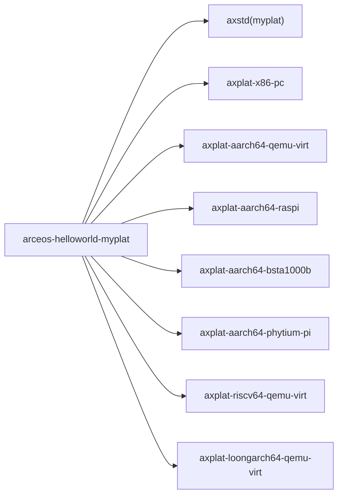

# `arceos-helloworld-myplat` 技术文档

> 路径：`os/arceos/examples/helloworld-myplat`
> 类型：示例应用 crate
> 分层：ArceOS 层 / 平台显式链接样例
> 版本：`0.1.0`
> 文档依据：`Cargo.toml`、`src/main.rs`、`os/arceos/.github/workflows/build.yml`、根 `README.md`

`arceos-helloworld-myplat` 和普通 `arceos-helloworld` 的差别，不在应用逻辑，而在平台接线方式。它同样只打印一句 `Hello, world!`，但不是依赖 ArceOS 默认平台自动链接，而是通过 `axstd` 的 `myplat` 路径和本 crate 自己的 `cfg_if!` 显式 `extern crate` 某个目标平台包。

因此它真正演示的是：**应用侧如何显式绑定平台 crate，验证 `myplat` 模式下的平台 bring-up 是否成立。它不是跨平台框架，也不是面向业务代码的通用模板。**

## 1. 架构设计分析
### 1.1 设计定位
这个 crate 的功能依然极简，但它多了一层非常关键的编译期分发逻辑：

- `x86-pc`
- `aarch64-qemu-virt`
- `aarch64-raspi4`
- `aarch64-bsta1000b`
- `aarch64-phytium-pi`
- `riscv64-qemu-virt`
- `loongarch64-qemu-virt`

每个 feature 都对应一个明确的平台 crate，并且还会给相应平台打开 `smp`、`irq` 等能力。也就是说，它虽然只打印一句话，但背后验证的是“平台包能否被应用显式接线并成功链接”。

### 1.2 源码中的关键分层
`src/main.rs` 主要有两层结构：

1. `cfg_if!` + `extern crate axplat_*`
2. 与 `arceos-helloworld` 几乎相同的 `main()` 输出逻辑

其中第一层才是本 crate 的核心。若目标架构和 feature 没有匹配上，源码会在 `target_os = "none"` 场景下直接 `compile_error!`，明确提示“没有链接平台 crate”。

这说明它并非“多平台 hello world”，而是“显式平台接线正确性验证器”。

### 1.3 与默认平台模式的关系
`axstd` 的 `myplat` feature 会把平台选择责任交给应用本身；`axhal` 在 `feature = "myplat"` 下也不会替你自动 `extern crate` 默认平台。

所以这条链路可以概括为：


它验证的是“平台显式注入”这条链，而不是默认 `defplat` 链。

## 2. 核心功能说明
### 2.1 实际演示的系统能力链
这个样例真正覆盖的是：

- 应用通过 Cargo feature 选择具体平台
- 平台 crate 被显式链接进最终镜像
- `axstd`/`axhal` 走 `myplat` 模式而非默认平台模式
- 运行时能够初始化到用户 `main()`
- 控制台输出可用

### 2.2 为什么只保留一句打印
这里故意不再加入文件系统、多任务或网络逻辑，是为了让失败面只集中在：

- 平台 crate feature 是否选对
- 架构和平台是否匹配
- 平台 crate 是否能被正确链接
- `myplat` bring-up 是否正常

如果它还承担别的功能，就很难分辨故障到底来自平台接线还是上层子系统。

### 2.3 边界澄清
这份样例不是：

- 平台无关应用模板
- 自定义板卡完整移植指南
- 可复用的多平台抽象框架

它只是最小验证入口，用来证明“某个具体平台包已经能被应用显式带起来”。

## 3. 依赖关系图谱


### 3.1 直接依赖
- `cfg-if`：编译期按架构和 feature 选择平台 crate。
- `axstd`：通过 `myplat` feature 接入 ArceOS 用户侧接口。
- 各目标架构对应的平台 crate：真正把板级启动、串口、时钟、中断等实现接进来。

### 3.2 关键间接依赖
- `axhal`：在 `myplat` 模式下等待应用显式链接平台包。
- `axruntime`：完成主运行时 bring-up。
- `arceos_api` / `axfeat`：继续承担上层 API 和特性聚合。

### 3.3 主要消费者
- 新平台或新板卡的最小应用级 bring-up 验证。
- CI 中的多平台构建矩阵。
- 平台包维护者的“先证明确实能链接起来”第一步检查。

## 4. 开发指南
### 4.1 推荐构建方式
这个样例更适合用 ArceOS 自带的 `make` 接口，因为 `MYPLAT`、`APP_FEATURES` 和架构选择都很明确：

```bash
cd os/arceos
make ARCH=riscv64 A=examples/helloworld-myplat SMP=4 APP_FEATURES=riscv64-qemu-virt
make MYPLAT=axplat-riscv64-qemu-virt A=examples/helloworld-myplat SMP=4 APP_FEATURES=riscv64-qemu-virt
```

对树莓派 4、飞腾派、BSTA1000B 这类板卡，则通常直接用 `MYPLAT=<平台包>` 路径。

### 4.2 修改时的关键约束
1. 新增平台时，要同时补 Cargo feature、目标依赖和 `cfg_if!` 分支。
2. `target_arch` 与平台 feature 必须一一对应，不能只加依赖不加分支。
3. 这里适合放“最小成功验证”，不适合加入复杂业务逻辑。

### 4.3 何时用它，何时不用
适合：

- 新平台刚接入仓库时做最小链接验证
- 板级包改动后做最小启动回归
- 验证 `myplat` 工作流而不是默认平台工作流

不适合：

- 验证块设备、网络、调度器等高层能力
- 作为复杂应用的起始模板

## 5. 测试策略
### 5.1 当前测试形态
它的主要验证方式是构建矩阵而非复杂运行逻辑。仓库 CI 已经显式覆盖多组 `helloworld-myplat` 构建命令，分别检查：

- x86 PC
- AArch64 QEMU virt
- AArch64 Raspi
- AArch64 BSTA1000B
- AArch64 Phytium Pi
- RISC-V QEMU virt
- LoongArch64 QEMU virt

### 5.2 集成验证重点
最关键的成功标准不是功能丰富，而是：

- 能否成功完成链接
- 是否因为缺少平台 crate 触发 `compile_error!`
- 平台 bring-up 后能否到达 `main()`
- 是否能完成最小控制台输出

### 5.3 推荐补充验证
如果某个平台已经通过本样例，后续应继续用更高层入口覆盖：

1. `arceos-helloworld-myplat`
2. 对应平台上的 `arceos-shell` 或其他功能样例
3. 对应平台包自己的更深入回归

## 6. 跨项目定位分析
### 6.1 ArceOS
它属于 ArceOS 自身的示例目录，但职责非常窄：验证 `myplat` 路径下的平台显式链接是否成立，而不是验证 ArceOS 整体功能。

### 6.2 StarryOS
StarryOS 不直接依赖这个 crate。它可能复用同一批底层平台包，但不会把本样例本身当成组成部分。

### 6.3 Axvisor
Axvisor 也不会直接消费这个 crate。它的跨项目价值只体现在：当共享平台包改动后，可以先用这条最小路径验证板级接线，再进入更复杂的 Hypervisor 场景。
