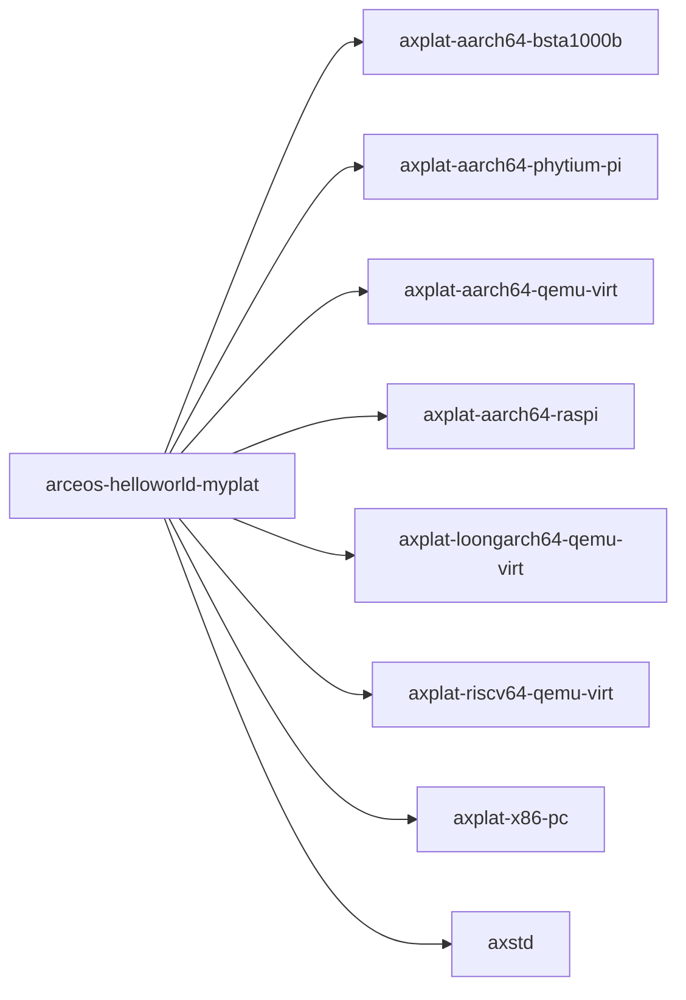

# `arceos-helloworld-myplat` 技术文档

> 路径：`os/arceos/examples/helloworld-myplat`
> 类型：二进制 crate
> 分层：ArceOS 层 / ArceOS 示例程序
> 版本：`0.1.0`
> 文档依据：当前仓库源码、`Cargo.toml` 与 未检测到 crate 层 README

`arceos-helloworld-myplat` 的核心定位是：ArceOS 示例程序

## 1. 架构设计分析
- 目录角色：ArceOS 示例程序
- crate 形态：二进制 crate
- 工作区位置：子工作区 `os/arceos`
- feature 视角：主要通过 `aarch64-bsta1000b`、`aarch64-phytium-pi`、`aarch64-qemu-virt`、`aarch64-raspi4`、`loongarch64-qemu-virt`、`riscv64-qemu-virt`、`x86-pc` 控制编译期能力装配。
- 关键数据结构：该 crate 暴露的数据结构较少，关键复杂度主要体现在模块协作、trait 约束或初始化时序。
- 设计重心：该 crate 的实现通常很薄，核心价值不在抽象复用，而在于用最小代码路径把某个 ArceOS 能力组合真正跑起来。

### 1.1 内部模块划分
- 当前 crate 未显式声明多个顶层 `mod`，复杂度更可能集中在单文件入口、宏展开或下层子 crate。

### 1.2 核心算法/机制
- 该 crate 是入口/编排型二进制，复杂度主要来自初始化顺序、配置注入和对下层模块的串接。

## 2. 核心功能说明
- 功能定位：ArceOS 示例程序
- 对外接口：该 crate 的公开入口主要是 `main()` 或命令子流程，本身不强调稳定库 API。
- 典型使用场景：用于展示或回归某个具体 ArceOS 能力组合，既是示例程序，也是最小 smoke test 入口。 这类 crate 的核心使用方式通常是运行入口本身，而不是被别的库当作稳定 API 依赖。
- 关键调用链示例：按当前源码布局，常见入口/初始化链可概括为 `main()`。

## 3. 依赖关系图谱


### 3.1 直接与间接依赖
- `axplat-aarch64-bsta1000b`
- `axplat-aarch64-phytium-pi`
- `axplat-aarch64-qemu-virt`
- `axplat-aarch64-raspi`
- `axplat-loongarch64-qemu-virt`
- `axplat-riscv64-qemu-virt`
- `axplat-x86-pc`
- `axstd`

### 3.2 间接本地依赖
- `arceos_api`
- `arm_pl011`
- `arm_pl031`
- `axalloc`
- `axallocator`
- `axbacktrace`
- `axconfig`
- `axconfig-gen`
- `axconfig-macros`
- `axcpu`
- `axdisplay`
- `axdma`
- 另外还有 `57` 个同类项未在此展开

### 3.3 被依赖情况
- 当前未发现本仓库内其他 crate 对其存在直接本地依赖。

### 3.4 间接被依赖情况
- 当前未发现更多间接消费者，或该 crate 主要作为终端入口使用。

### 3.5 关键外部依赖
- `cfg-if`

## 4. 开发指南
### 4.1 运行入口
```toml
# `arceos-helloworld-myplat` 是二进制/编排入口，通常不作为库依赖。
# 更常见的接入方式是通过对应构建/运行命令触发，而不是在 Cargo.toml 中引用。
```

```bash
cargo xtask arceos run --package arceos-helloworld-myplat --arch riscv64
```

### 4.2 初始化流程
1. 先确认目标架构、平台和示例所需 feature；涉及网络或块设备时同步准备对应运行参数。
2. 优先通过 `cargo xtask arceos run --package <包名> --arch <arch>` 启动，而不是把它当作普通 host 程序直接运行。
3. 把串口输出、退出码和功能表现作为验证结果，必要时补充对应 `test-suit/arceos` 回归场景。

### 4.3 关键 API 使用提示
- 该 crate 的关键接入点通常是运行命令、CLI 参数或入口函数，而不是稳定库 API。

## 5. 测试策略
### 5.1 当前仓库内的测试形态
- 当前 crate 目录中未发现显式 `tests/`/`benches/`/`fuzz/` 入口，更可能依赖上层系统集成测试或跨 crate 回归。

### 5.2 单元测试重点
- 示例 crate 通常不以大量单元测试为主，若存在辅助函数，可覆盖参数解析、状态检查和错误分支。

### 5.3 集成测试重点
- 重点是通过 `cargo xtask arceos run` 在 QEMU/目标平台上验证示例行为与输出是否符合预期。

### 5.4 覆盖率要求
- 覆盖率建议以场景覆盖为主：至少保证示例主路径、关键 feature 组合和失败输出可观测。

## 6. 跨项目定位分析
### 6.1 ArceOS
`arceos-helloworld-myplat` 直接位于 `os/arceos/` 目录树中，是 ArceOS 工程本体的一部分，承担 ArceOS 示例程序。

### 6.2 StarryOS
当前未检测到 StarryOS 工程本体对 `arceos-helloworld-myplat` 的显式本地依赖，若参与该系统，通常经外部工具链、配置或更底层生态间接体现。

### 6.3 Axvisor
当前未检测到 Axvisor 工程本体对 `arceos-helloworld-myplat` 的显式本地依赖，若参与该系统，通常经外部工具链、配置或更底层生态间接体现。
