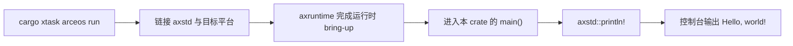
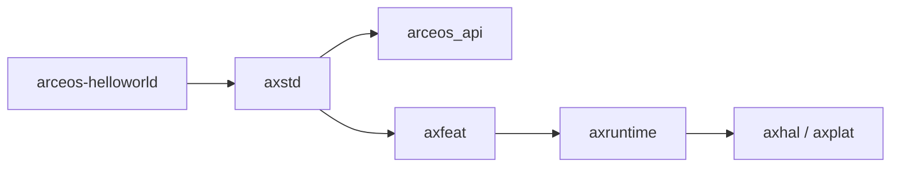

# `arceos-helloworld` 技术文档

> 路径：`os/arceos/examples/helloworld`
> 类型：示例应用 crate
> 分层：ArceOS 层 / 示例与 smoke test 入口
> 版本：`0.1.0`
> 文档依据：`Cargo.toml`、`src/main.rs`、`.qemu.toml`、根 `README.md`、`docs/arceos-guide.md`

`arceos-helloworld` 是 ArceOS 最短、最直接的应用入口之一。它的源码只有一个 `main()`，运行时只做一件事：在 `axruntime` 完成平台、内存和控制台初始化后，通过 `axstd::println!` 打印 `Hello, world!`。因此它的价值不在功能丰富，而在于把“平台选定 -> 运行时 bring-up -> 进入应用主函数 -> 控制台输出”这条最短能力链稳定地跑通。

这也是它最重要的边界：**它是 ArceOS 的最小启动样例和 smoke test 入口，不是可复用应用框架，也不是建议在此基础上持续堆功能的模板工程。**

## 1. 架构设计分析
### 1.1 设计定位
从源码上看，这个 crate 几乎没有业务逻辑：

- `Cargo.toml` 只声明了一个可选依赖 `axstd`
- `src/main.rs` 只在启用 `axstd` 时切到 `no_std`/`no_main`
- `main()` 内部只有一条 `println!("Hello, world!")`

这说明它不是要封装 API，而是故意把上层逻辑压缩到最低，让问题定位集中在 ArceOS 的启动链本身。

### 1.2 真实启动链
这个样例的关键不在 `main()` 本身，而在 `main()` 之前已经发生了什么：



结合 `axstd`、`axfeat`、`axruntime` 和 `axhal` 的实际实现，可以把这条链理解为：

1. 构建系统为目标架构选择平台包，并把 `axstd` 接入最终镜像。
2. `axruntime` 在到达应用 `main()` 之前完成早期平台初始化、日志/控制台准备以及必要的运行时装配。
3. `main()` 被调用后，`println!` 直接验证“控制台已经可用，最小应用入口已经成立”。

### 1.3 条件编译的作用
`src/main.rs` 里使用了：

- `#![cfg_attr(feature = "axstd", no_std)]`
- `#![cfg_attr(feature = "axstd", no_main)]`
- `#[cfg(feature = "axstd")] use axstd::println;`

这套写法的意义是：

- 在裸机场景下，它作为 ArceOS 应用使用 `axstd`
- 在未启用 `axstd` 的场景下，仍尽量保持对本地工具链友好，方便编辑器分析和基础构建

因此，这个 crate 既是“最小 ArceOS 应用”，也是“最小可维护示例”。

## 2. 核心功能说明
### 2.1 核心功能
这个 crate 实际演示的不是“hello world 语法”，而是下面这条系统能力链：

- 应用只需提供 `main()`
- `axstd` 为应用提供类 `std` 的最小输出接口
- `axruntime` 保证在进入 `main()` 前控制台已经可用
- 目标平台的最小启动、陷入入口和串口路径没有断

只要 `Hello, world!` 能稳定打印出来，就说明最小应用入口链基本贯通。

### 2.2 这份样例刻意不做什么
它没有也不应该承担下面这些职责：

- 不演示文件系统、网络、块设备或多任务
- 不验证调度器、公平性或 IRQ 路径
- 不提供任何可被别的 crate 复用的上层 API
- 不充当“新应用从这里改起”的通用脚手架

一旦你要验证更复杂的能力，应该切换到更有针对性的样例或测试入口，例如 `arceos-shell`、`arceos-httpserver` 或 `test-suit/arceos/*`。

## 3. 依赖关系图谱


### 3.1 直接依赖
- `axstd`：唯一直接依赖。该样例并不直接操作 `axruntime`、`axhal` 或平台 crate，而是通过 `axstd` 间接接入整条 ArceOS 运行时栈。

### 3.2 关键间接依赖
- `arceos_api`：承接 `axstd` 的系统调用式接口。
- `axfeat`：把内核特性与运行时特性组合到最终镜像。
- `axruntime`：负责在应用 `main()` 之前完成 bring-up。
- `axhal` / 平台 crate：负责控制台、时钟、启动入口和硬件初始化。

### 3.3 主要消费者
- 开发者的第一次 ArceOS 启动验证。
- `README.md`、`docs/quick-start.md`、`docs/arceos-guide.md` 中的最小运行示例。
- 调整底层运行时后需要一个最短验证入口时的 smoke test。

## 4. 开发指南
### 4.1 推荐运行方式
最常见的使用方式是直接走根工作区的集成入口：

```bash
cargo xtask arceos run --package arceos-helloworld --arch riscv64
```

需要切换架构时，只替换 `--arch` 即可。

### 4.2 维护时的约束
如果你要修改这个样例，建议遵守三条约束：

1. 保持它足够小，只承担“最小启动成功”验证。
2. 不要把新的系统能力直接堆到这里；应该新增独立样例来验证新能力。
3. 若修改输出文本或启动方式，要同步考虑仓库文档中引用它的 quick start 路径。

### 4.3 适合用它验证什么
- `axruntime` 改动后，系统是否还能进入应用 `main()`
- 控制台输出路径是否正常
- 新平台或新架构接线后，最小应用是否能跑起来

不适合用它验证什么：

- 调度器语义
- IRQ 定时器行为
- 文件系统和设备驱动
- 应用侧复杂 API 组合

## 5. 测试策略
### 5.1 当前测试形态
这个 crate 没有独立的单元测试，也不是 `test-suit/arceos` 下的自动回归包。它更像“文档级和联调级 smoke test 入口”。

### 5.2 集成验证重点
配套的 `.qemu.toml` 提供了本地运行参数，重点观察：

- 是否成功启动到应用入口
- 是否打印出 `Hello, world!`
- 是否在打印前出现 panic 或早期启动失败

### 5.3 推荐回归方式
当底层改动可能影响最小启动链时，优先先跑它，再跑更复杂的样例：

1. `arceos-helloworld`
2. `arceos-shell` 或网络/块设备样例
3. `cargo xtask test arceos --target ...`

这样能更快判断故障是在“最小启动链”还是在“更高层功能链”。

## 6. 跨项目定位分析
### 6.1 ArceOS
它是 ArceOS 自身的最小应用样例，也是仓库文档默认引用的第一条运行路径。对 ArceOS 而言，它承担的是“启动是否通”的验证职责，而不是功能展示全集。

### 6.2 StarryOS
StarryOS 不直接依赖这个 crate。本样例不会进入 StarryOS 镜像或用户态体系；StarryOS 只会间接受到底层 `axruntime`、`axhal` 等公共能力变更的影响。

### 6.3 Axvisor
Axvisor 同样不会把它作为组成部分复用。它唯一的跨项目价值，是在公共底层组件调整后，提供一条比 Hypervisor 场景更短、更易定位的最小验证路径。
