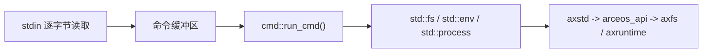
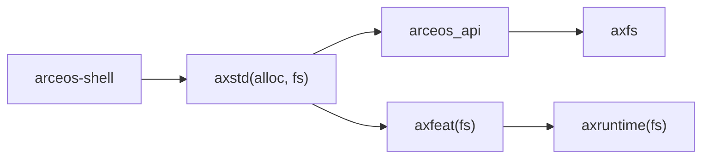

# `arceos-shell` 技术文档

> 路径：`os/arceos/examples/shell`
> 类型：示例应用 crate
> 分层：ArceOS 层 / 文件系统与交互能力样例
> 版本：`0.1.0`
> 文档依据：`Cargo.toml`、`src/main.rs`、`src/cmd.rs`、`docs/arceos-guide.md`

`arceos-shell` 是 ArceOS 用来演示“控制台输入输出 + 当前目录 + 基础文件系统操作 + 系统退出”这一整条能力链的最小交互样例。它通过串口读取字符，维护一行命令缓冲，并把命令分发到本地的 `cmd` 模块执行。

需要特别澄清的是：**它只是演示 ArceOS 用户侧文件系统和控制台能力的样例入口，不是可扩展 shell 框架，也不是通用命令解释器库。**

## 1. 架构设计分析
### 1.1 设计定位
这个 crate 只有两个源码文件：

- `src/main.rs`：负责 REPL 主循环、字符回显、退格处理和命令提交
- `src/cmd.rs`：负责内建命令表与具体命令实现

也就是说，它并不提供复杂的解析器，而是把重点放在“系统接口是否能串起来”上。

### 1.2 REPL 主线
`main()` 中的主循环做的事情非常直接：

1. 先执行一次 `help`，打印可用命令。
2. 根据当前工作目录打印提示符 `arceos:<cwd>$ `。
3. 每次从 `stdin` 读取 1 个字节。
4. 对回车、换行、退格、Delete 和控制字符做最小处理。
5. 遇到命令结束时，把缓冲区交给 `cmd::run_cmd()`。

这是一条非常“系统调用味”的路径：



### 1.3 `cmd.rs` 的命令边界
命令表是一个静态 `CMD_TABLE`，当前只包含：

- `cat`
- `cd`
- `echo`
- `exit`
- `help`
- `ls`
- `mkdir`
- `pwd`
- `rm`
- `uname`

实现方式也刻意保持朴素：

- 没有管道
- 没有通配符
- 没有作业控制
- 没有环境变量展开
- 重定向只支持 `echo ... > file` 这种最小写文件路径

所以它验证的是 ArceOS 文件系统 API 能否工作，而不是 shell 语言本身。

## 2. 核心功能说明
### 2.1 实际演示的能力链
这个样例实际覆盖了四类能力：

- 控制台输入输出：字符读写、回显、提示符显示
- 当前目录与路径处理：`pwd`、`cd`
- 文件和目录操作：`ls`、`cat`、`mkdir`、`rm`、`echo > file`
- 系统信息和退出：`uname`、`exit`

对应到真实调用关系上：

- `std::env::current_dir` / `set_current_dir` 最终落到 `arceos_api::fs::ax_current_dir` / `ax_set_current_dir`
- `std::fs::*` 经过 `axstd` 落到 `axfs`
- `std::process::exit(0)` 在 unikernel 语义下等价于整机终止

### 2.2 关键实现细节
- `path_to_str()` 根据是否启用 `axstd` 走不同签名，兼顾裸机和本地工具链。
- `do_ls()` 不只是列名字，还会读取元数据、权限位和文件类型。
- `do_uname()` 通过编译期环境变量 `AX_ARCH`、`AX_PLATFORM` 拼出目标平台信息，并用 `available_parallelism()` 推断是否输出 `SMP`。
- `run_cmd()` 只做最小的按空白切分，不支持复杂语法。

### 2.3 边界澄清
这份样例不是：

- 可嵌入的 shell 库
- 命令解析框架
- POSIX shell 兼容层
- 面向 StarryOS 用户空间的终端方案

它只是 ArceOS 应用侧验证文件系统和控制台接口的一条直观入口。

## 3. 依赖关系图谱


### 3.1 直接依赖
- `axstd`：打开了 `alloc` 和 `fs` feature，说明该样例显式依赖堆分配与文件系统。

### 3.2 关键间接依赖
- `arceos_api::fs`：工作目录、目录遍历、文件读写等 API 的上层桥接。
- `axfs`：真正承载文件、目录和路径操作。
- `axruntime(fs)`：保证文件系统相关子系统在应用 `main()` 前已被装配。

### 3.3 主要消费者
- ArceOS 文件系统联调时的交互式验证。
- 文档中推荐的块设备/文件系统示例入口。
- 调试当前目录、读写文件、目录遍历这类问题时的手工最小复现环境。

## 4. 开发指南
### 4.1 推荐运行方式
通常需要带块设备能力运行：

```bash
cargo xtask arceos run --package arceos-shell --arch riscv64 --blk
```

`--blk` 很重要，因为这个样例的价值就在于文件系统路径，而不是单纯控制台打印。

### 4.2 扩展命令时的建议
1. 优先把命令保持为最小系统能力演示，不要把这里做成完整 shell。
2. 新命令尽量直接映射到一个明确的 ArceOS 能力，例如文件读写、目录操作、时间或网络。
3. 如果需要复杂解析规则，说明它已经超出这个样例的边界，应该单独做新 crate。

### 4.3 修改 REPL 主循环时的注意点
- 当前实现按字节读写，适合串口和极简环境，不要轻易引入复杂行编辑器依赖。
- `MAX_CMD_LEN` 固定为 256，任何增强都要考虑裸机内存和交互确定性。
- `exit` 的语义是整机退出，不是结束单个“进程”。

## 5. 测试策略
### 5.1 当前测试形态
这个样例没有独立的自动化断言脚本，更多依赖手工交互验证。它适合做“人眼观察 + 命令操作”的集成测试。

### 5.2 推荐验证清单
最少应覆盖：

1. 启动后是否自动打印 `help`
2. `pwd` / `cd` 是否能改变当前目录
3. `mkdir`、`ls`、`echo > file`、`cat`、`rm` 是否能串起来
4. `uname` 是否能反映目标架构与平台
5. `exit` 是否能正确关机

### 5.3 与自动回归的关系
`arceos-shell` 更偏交互样例，不像 `test-suit/arceos/*` 那样适合用固定 `success_regex` 自动判定。因此它更适合：

- 手工联调
- 故障定位
- 作为更自动化测试之前的人工验证入口

## 6. 跨项目定位分析
### 6.1 ArceOS
它是 ArceOS 示例层里最直接的文件系统交互入口，承担的是“应用侧文件系统是否可用”的演示职责，而不是长期维护的 shell 子系统。

### 6.2 StarryOS
StarryOS 有自己的用户态与 Linux 兼容语义，这个样例不会被直接复用。它与 StarryOS 的关系主要体现在：二者可能共享更底层的文件系统和平台能力，但不会共享这层交互逻辑。

### 6.3 Axvisor
Axvisor 不直接消费它。对 Axvisor 开发者而言，它唯一的价值是当共享底层组件发生变化时，可以先用比 Hypervisor 场景更简单的文件系统样例验证公共能力是否仍然正常。
