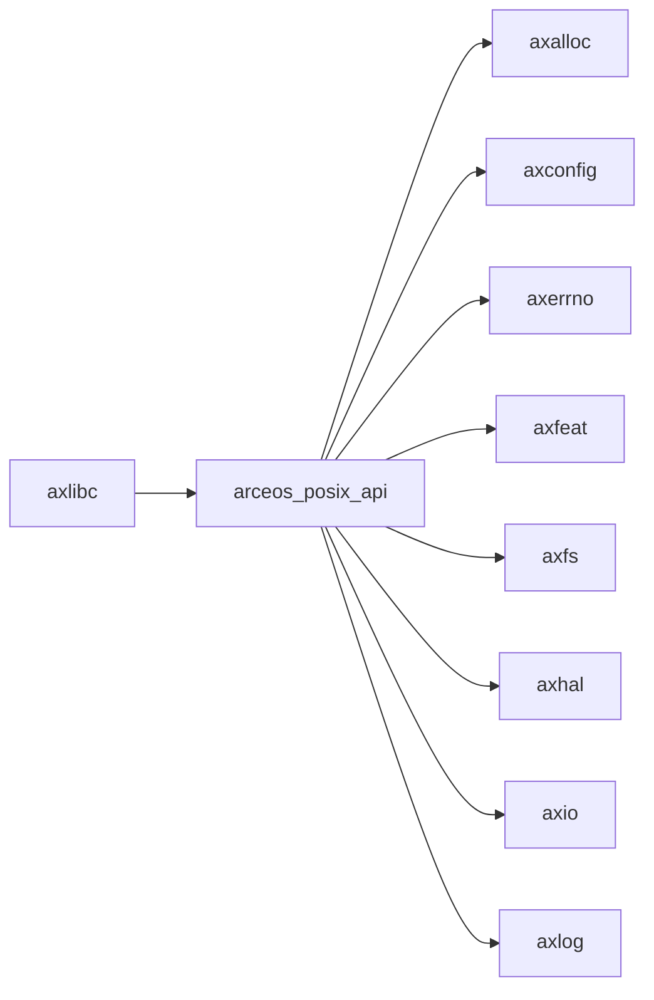

# `arceos_posix_api` 技术文档

> 路径：`os/arceos/api/arceos_posix_api`
> 类型：库 crate
> 分层：ArceOS 层 / ArceOS 公共 API/feature 聚合层
> 版本：`0.3.0-preview.3`
> 文档依据：当前仓库源码、`Cargo.toml` 与 未检测到 crate 层 README

`arceos_posix_api` 的核心定位是：POSIX-compatible APIs for ArceOS modules

## 1. 架构设计分析
- 目录角色：ArceOS 公共 API/feature 聚合层
- crate 形态：库 crate
- 工作区位置：子工作区 `os/arceos`
- feature 视角：主要通过 `alloc`、`epoll`、`fd`、`fs`、`irq`、`multitask`、`net`、`pipe`、`select`、`smp` 控制编译期能力装配。
- 关键数据结构：该 crate 暴露的数据结构较少，关键复杂度主要体现在模块协作、trait 约束或初始化时序。
- 设计重心：该 crate 更接近能力门面层：它把 `ax*` 内核模块的能力按 API 域重新组织成稳定接口，重点在 feature 转发、符号导出和上层契约，而不是独立实现完整子系统。

### 1.1 内部模块划分
- `utils`：通用工具函数和辅助类型
- `imp`：内部实现细节与 trait/backend 绑定
- `ctypes`：内部子模块

### 1.2 核心算法/机制
- 事件轮询与 I/O 多路复用

## 2. 核心功能说明
- 功能定位：POSIX-compatible APIs for ArceOS modules
- 对外接口：从源码可见的主要公开入口包括 `char_ptr_to_str`、`check_null_ptr`、`check_null_mut_ptr`。
- 典型使用场景：面向 ArceOS 上层模块、用户库和应用接口层提供稳定能力门面，避免直接依赖过多内部模块细节。
- 关键调用链示例：该 crate 没有单一固定的初始化链，通常按 CPU、时间、内存、任务、文件系统等能力域独立调用。

## 3. 依赖关系图谱


### 3.1 直接与间接依赖
- `axalloc`
- `axconfig`
- `axerrno`
- `axfeat`
- `axfs`
- `axhal`
- `axio`
- `axlog`
- `axnet`
- `axruntime`
- `axsync`
- `axtask`
- 另外还有 `1` 个同类项未在此展开

### 3.2 间接本地依赖
- `arm_pl011`
- `arm_pl031`
- `axallocator`
- `axbacktrace`
- `axconfig-gen`
- `axconfig-macros`
- `axcpu`
- `axdisplay`
- `axdma`
- `axdriver`
- `axdriver_base`
- `axdriver_block`
- 另外还有 `47` 个同类项未在此展开

### 3.3 被依赖情况
- `axlibc`

### 3.4 间接被依赖情况
- 当前未发现更多间接消费者，或该 crate 主要作为终端入口使用。

### 3.5 关键外部依赖
- `bindgen`
- `flatten_objects`
- `lazy_static`
- `spin`

## 4. 开发指南
### 4.1 依赖配置
```toml
[dependencies]
arceos_posix_api = { workspace = true }

# 如果在仓库外独立验证，也可以显式绑定本地路径：
# arceos_posix_api = { path = "os/arceos/api/arceos_posix_api" }
```

### 4.2 初始化流程
1. 优先通过该 crate 提供的稳定 API 接入能力，而不是直接深入底层 `os/arceos/modules/*` 实现。
2. 根据目标能力开启对应 feature，并确认它们与 `axruntime`、驱动、文件系统或网络子系统的装配关系。
3. 在最小消费者路径上验证 API 语义、错误码和资源释放行为是否与上层预期一致。

### 4.3 关键 API 使用提示
- 优先关注函数入口：`char_ptr_to_str`、`check_null_ptr`、`check_null_mut_ptr`。

## 5. 测试策略
### 5.1 当前仓库内的测试形态
- 当前 crate 目录中未发现显式 `tests/`/`benches/`/`fuzz/` 入口，更可能依赖上层系统集成测试或跨 crate 回归。

### 5.2 单元测试重点
- 建议围绕 API 契约、feature 分支、资源管理和错误恢复路径编写单元测试。

### 5.3 集成测试重点
- 建议至少补一条 ArceOS 示例或 `test-suit/arceos` 路径，必要时覆盖多架构或多 feature 组合。

### 5.4 覆盖率要求
- 覆盖率建议：公开 API、初始化失败路径和主要 feature 组合必须覆盖；涉及调度/内存/设备时需补系统级验证。

## 6. 跨项目定位分析
### 6.1 ArceOS
`arceos_posix_api` 直接位于 `os/arceos/` 目录树中，是 ArceOS 工程本体的一部分，承担 ArceOS 公共 API/feature 聚合层。

### 6.2 StarryOS
当前未检测到 StarryOS 工程本体对 `arceos_posix_api` 的显式本地依赖，若参与该系统，通常经外部工具链、配置或更底层生态间接体现。

### 6.3 Axvisor
当前未检测到 Axvisor 工程本体对 `arceos_posix_api` 的显式本地依赖，若参与该系统，通常经外部工具链、配置或更底层生态间接体现。
