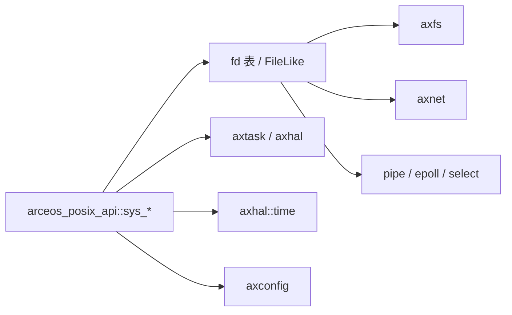
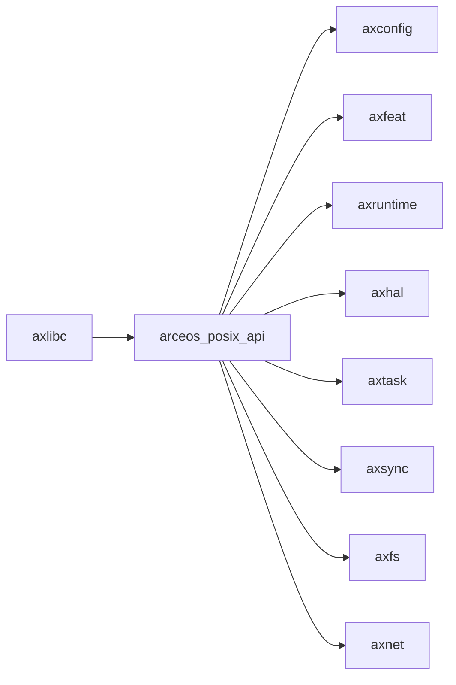

# `arceos_posix_api` 技术文档

> 路径：`os/arceos/api/arceos_posix_api`
> 类型：库 crate
> 分层：ArceOS 层 / POSIX 语义实现层
> 版本：`0.3.0-preview.3`
> 文档依据：`Cargo.toml`、`build.rs`、`src/lib.rs`、`src/utils.rs`、`src/imp/task.rs`、`src/imp/fd_ops.rs`、`src/imp/fs.rs`、`src/imp/net.rs`、`src/imp/io.rs`、`src/imp/time.rs`、`src/imp/resources.rs`、`src/imp/sys.rs`、`src/imp/pipe.rs`、`src/imp/io_mpx/select.rs`、`src/imp/io_mpx/epoll.rs`、`src/imp/pthread/mod.rs`

`arceos_posix_api` 是 ArceOS 的 POSIX 语义实现层。它并不导出 libc 风格的 `extern "C"` 符号，而是以 `sys_*` 形式提供一组面向上层包装器的接口，并在内部直接操作 `axfs`、`axnet`、`axtask`、`axhal` 等模块。`axlibc` 正是建立在它之上的 C ABI 层。

## 1. 架构设计分析
### 1.1 设计定位
这个 crate 的位置很容易误判。结合源码看，它既不是：

- 用户态系统调用陷入层
- 通用 libc 实现
- 单纯的模块重导出层

它真正承担的是“把 ArceOS 模块能力组织成 POSIX 语义”的工作。也就是说：

- 语义实现放在这里
- C ABI 包装留给 `axlibc`
- Rust `std` 风格包装留给 `axstd`

### 1.2 顶层模块结构
`src/lib.rs` 暴露出的主要内容有三类：

- `config`：直接重导出 `axconfig::*`
- `ctypes`：构建期生成的 POSIX C 类型绑定
- `sys_*` 接口：按 `fd`、`fs`、`net`、`pipe`、`pthread`、`time`、`io`、`resources`、`sys` 等域导出

内部实现则集中在 `imp/` 下，形成如下分层：

- `task`、`time`、`sys`、`resources`：基础进程/时间/资源语义
- `fd_ops`：统一 fd 表与 `FileLike` 抽象
- `fs`、`net`、`pipe`：把具体对象接入 `FileLike`
- `io_mpx`：`select` / `epoll`
- `pthread`：线程与互斥量包装

### 1.3 `FileLike` 是对象模型核心
这个 crate 最重要的内部抽象不是某个 `sys_*` 函数，而是 `imp::fd_ops::FileLike`：

- `read`
- `write`
- `stat`
- `poll`
- `set_nonblocking`
- `into_any`

文件、socket、pipe、epoll 实例都通过这个 trait 接入统一 fd 表。fd 表本身用：

- `scope_local`
- `FlattenObjects`
- `RwLock`

来维护，并在初始化时预填 `stdin`、`stdout`、`stderr`。

这意味着 `arceos_posix_api` 不是“每个接口各写一套对象表”，而是先统一对象模型，再把 POSIX 接口投影到这套模型上。

### 1.4 真实调用链
当前实现的关键链路可以概括为：

几个典型例子：

- `sys_open()` 创建 `axfs::fops::File`，再封装成 `FileLike`
- `sys_socket()` 创建 `TcpSocket` 或 `UdpSocket`，再放入 fd 表
- `sys_pipe()` 创建共享环形缓冲区的读写端并加入 fd 表
- `sys_select()` / `sys_epoll_wait()` 轮询 `FileLike::poll()`，必要时调用 `axnet::poll_interfaces()`

### 1.5 错误模型
`src/utils.rs` 中的 `syscall_body!` 宏定义了该 crate 统一的返回值规则：

- 成功时返回正常值
- 失败时返回 `-LinuxError::code()`

因此 `arceos_posix_api` 自身维持的是“内核式负错误码”约定，而不是 libc 层的 `errno` 约定。`errno` 转换由 `axlibc` 完成。

### 1.6 构建期代码生成
`build.rs` 做了两件关键事情：

1. 通过 `bindgen` 生成 `src/ctypes_gen.rs`
2. 根据是否开启 `multitask` 生成 `axlibc/include/ax_pthread_mutex.h`

这说明它不仅是语义实现层，也顺带承担了与上层 C ABI 对齐所需的一部分类型布局生成工作。

## 2. 核心功能说明
### 2.1 主要功能
- 实现文件、网络、时间、线程、资源限制等 POSIX 风格语义。
- 维护 fd 表和面向多种对象的统一抽象。
- 以 `sys_*` 形式向上提供稳定调用接口。
- 为 `axlibc` 提供类型和行为基础。

### 2.2 关键能力域
- `task`：`sys_sched_yield`、`sys_getpid`、`sys_exit`
- `io`：`sys_read`、`sys_write`、`sys_writev`
- `fs`：`sys_open`、`sys_stat`、`sys_fstat`、`sys_getcwd`、`sys_rename`
- `net`：`sys_socket`、`sys_bind`、`sys_connect`、`sys_send*`、`sys_recv*`、`sys_getaddrinfo`
- `pipe`：基于环形缓冲区的 `sys_pipe`
- `io_mpx`：`sys_select`、`sys_epoll_*`
- `pthread`：线程创建、退出、join、mutex
- `time` / `resources` / `sys`：时间、`getrlimit`、`sysconf`

### 2.3 `pthread` 的真实语义
`pthread` 路径不是调用某个独立的 POSIX 线程子系统，而是：

- 用 `axtask::spawn()` 创建任务
- 用 `BTreeMap<u64, pthread_t>` 维护任务 ID 到 pthread 结构的映射
- 用 `axsync::Mutex<()>` 作为 `pthread_mutex_t` 的底层实现

因此它是“POSIX 线程语义适配”，不是“把 Linux 线程 ABI 原封不动搬进来”。

### 2.4 与 `axstd` / `axlibc` 的边界
三者职责需要明确区分：

- `axstd`：Rust 高层接口，像 `std`
- `arceos_posix_api`：POSIX 语义实现，像 `sys_*` 内核接口
- `axlibc`：C ABI 导出和 `errno` 处理，像 libc 壳层

`arceos_posix_api` 是中间层，而不是最终应用直接看到的开发接口。

## 3. 依赖关系图谱

### 3.1 关键直接依赖
- `axconfig`：提供 `TASK_STACK_SIZE`、`MAX_CPU_NUM` 等 POSIX 查询所需常量。
- `axruntime`：以 `extern crate` 方式引入，确保相关运行时上下文可用。
- `axhal`、`axtask`、`axsync`：支撑时间、任务、互斥量与等待语义。
- `axfs`、`axnet`：分别支撑文件和网络对象。
- `flatten_objects`、`scope-local`、`spin`：支撑 fd 表与对象管理。

### 3.2 关键直接消费者
- `axlibc`：当前最主要、也是最直接的消费者。

### 3.3 关键间接消费者
- 通过 `axlibc` 运行的 C 应用
- 任何未来可能直接调用 `sys_*` 的 Rust 包装层

## 4. 开发指南
### 4.1 什么时候应优先改这里
当问题属于“POSIX 语义本身”时，应优先改 `arceos_posix_api`，例如：

- fd 表行为
- socket 和 pipe 语义
- `select` / `epoll` 的可读可写判定
- `pthread_*`、`sysconf`、`getrlimit` 等系统语义

如果只是 C ABI、`errno`、头文件或符号名问题，优先改 `axlibc`。

### 4.2 修改时的关键约束
1. 保持 `syscall_body!` 返回负错误码的统一约定。
2. 新对象若要进 fd 表，优先实现 `FileLike`，不要另起一套平行描述方式。
3. 网络相关轮询路径要考虑 `axnet::poll_interfaces()` 的协作。
4. `pthread_mutex_t` 的内存布局一旦变化，必须同步关注 `build.rs` 生成的头文件。
5. 任何 API 语义改动都要评估 `axlibc` 是否仍能正确包装。

### 4.3 开发建议
- 先确认语义应该更接近 POSIX 还是更接近当前 ArceOS 能力边界。
- 对 `select` / `epoll` 等阻塞接口，要同步检查无 `multitask`、有 `net`、无 `net` 等多种 feature 组合。
- 对 `pipe`、`pthread` 这类自维护对象，重点检查生命周期与资源释放。

## 5. 测试策略
### 5.1 当前测试形态
当前 crate 没有独立的 `tests/` 目录，主要依赖上层 `axlibc` 和实际程序路径做集成验证。

### 5.2 建议重点验证
- fd 表：打开/关闭/复制/非阻塞设置
- 文件语义：`open`、`stat`、`lseek`、`rename`
- 网络语义：TCP/UDP、地址转换、`getaddrinfo`
- I/O 多路复用：`select`、`epoll`
- 线程语义：`pthread_create`、`join`、mutex

### 5.3 集成测试建议
- 至少一条 C 侧文件 I/O 路径
- 至少一条 socket 路径
- 至少一条 pipe + select/epoll 路径
- 至少一条 pthread 路径

### 5.4 高风险改动
- `FileLike` trait 和 fd 表实现
- `syscall_body!` 错误返回约定
- `pthread_mutex_t` 布局
- `select` / `epoll` 的轮询与超时逻辑

## 6. 跨项目定位分析
### 6.1 ArceOS
`arceos_posix_api` 是 ArceOS POSIX 兼容能力的实现核心。它把底层模块能力转换成一组可被 libc 和 C 应用消费的系统语义。

### 6.2 StarryOS
当前仓库里 StarryOS 没有把它作为主要接口层，因此它在 StarryOS 中不是核心依赖。不过若未来要复用同一套 POSIX 语义实现，这里会是自然候选。

### 6.3 Axvisor
当前仓库里 Axvisor 也没有直接依赖 `arceos_posix_api`。即便未来复用，它更可能承担“兼容接口实现层”角色，而不会变成 hypervisor 的策略中心。
