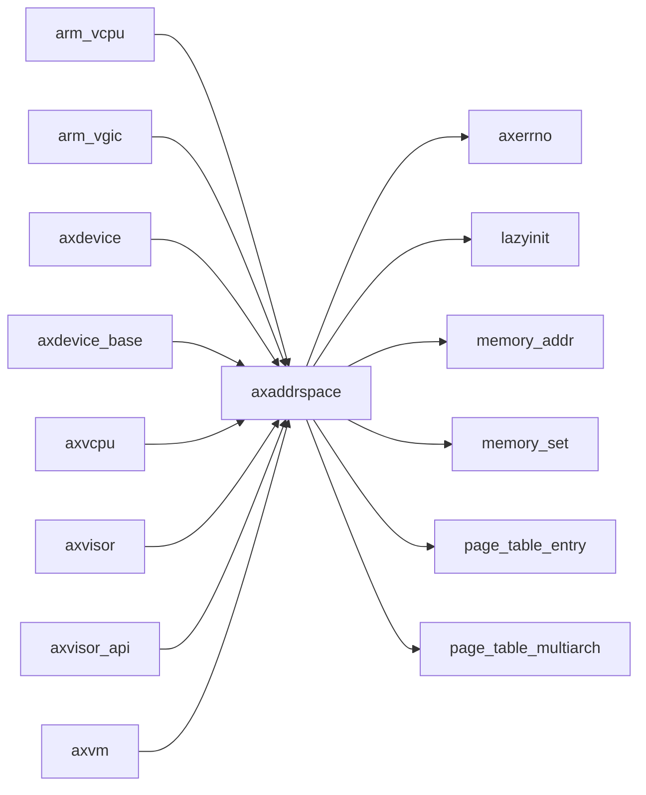

# `axaddrspace` 技术文档

> 路径：`components/axaddrspace`
> 类型：库 crate
> 分层：组件层 / 可复用基础组件
> 版本：`0.3.0`
> 文档依据：当前仓库源码、`Cargo.toml` 与 `components/axaddrspace/README.md`

`axaddrspace` 的核心定位是：ArceOS-Hypervisor guest address space management module

## 1. 架构设计分析
- 目录角色：可复用基础组件
- crate 形态：库 crate
- 工作区位置：根工作区
- feature 视角：主要通过 `arm-el2` 控制编译期能力装配。
- 关键数据结构：可直接观察到的关键数据结构/对象包括 `NestedPageFaultInfo`、`AddrSpace`、`Port`、`SysRegAddr`、`PhysFrame`、`MockTranslator`、`AccessWidth`、`NestedPageTable`、`HostVirtAddr`、`HostPhysAddr` 等（另有 4 个关键类型/对象）。
- 设计重心：该 crate 通常作为多个内核子系统共享的底层构件，重点在接口边界、数据结构和被上层复用的方式。

### 1.1 内部模块划分
- `addr`：内部子模块
- `address_space`：内部子模块
- `device`：Definitions about device accessing
- `frame`：内部子模块
- `hal`：硬件抽象层与平台接口桥接
- `memory_accessor`：Unified guest memory access interface This module provides a safe and consistent way to access guest memory from VirtIO device implementations, handling address translation and me…
- `npt`：内部子模块

### 1.2 核心算法/机制
- 内存分配器初始化、扩容或对象分配路径

## 2. 核心功能说明
- 功能定位：ArceOS-Hypervisor guest address space management module
- 对外接口：从源码可见的主要公开入口包括 `base`、`end`、`size`、`page_table`、`page_table_root`、`contains_range`、`new_empty`、`map_linear`、`NestedPageFaultInfo`、`AddrSpace` 等（另有 8 个公开入口）。
- 典型使用场景：作为共享基础设施被多个 OS 子系统复用，常见场景包括同步、内存管理、设备抽象、接口桥接和虚拟化基础能力。
- 关键调用链示例：按当前源码布局，常见入口/初始化链可概括为 `mapping_err_to_ax_err()` -> `new_empty()` -> `map_linear()` -> `map_alloc()` -> `setup_test_addr_space()` -> ...。

## 3. 依赖关系图谱


### 3.1 直接与间接依赖
- `axerrno`
- `lazyinit`
- `memory_addr`
- `memory_set`
- `page_table_entry`
- `page_table_multiarch`

### 3.2 间接本地依赖
- 未检测到额外的间接本地依赖，或依赖深度主要停留在第一层。

### 3.3 被依赖情况
- `arm_vcpu`
- `arm_vgic`
- `axdevice`
- `axdevice_base`
- `axvcpu`
- `axvisor`
- `axvisor_api`
- `axvm`
- `riscv_vcpu`
- `riscv_vplic`
- `x86_vcpu`

### 3.4 间接被依赖情况
- 当前未发现更多间接消费者，或该 crate 主要作为终端入口使用。

### 3.5 关键外部依赖
- `assert_matches`
- `axin`
- `bit_field`
- `bitflags`
- `cfg-if`
- `lazy_static`
- `log`
- `numeric-enum-macro`
- `spin`
- `x86`

## 4. 开发指南
### 4.1 依赖配置
```toml
[dependencies]
axaddrspace = { workspace = true }

# 如果在仓库外独立验证，也可以显式绑定本地路径：
# axaddrspace = { path = "components/axaddrspace" }
```

### 4.2 初始化流程
1. 在 `Cargo.toml` 中接入该 crate，并根据需要开启相关 feature。
2. 若 crate 暴露初始化入口，优先调用 `init`/`new`/`build`/`start` 类函数建立上下文。
3. 在最小消费者路径上验证公开 API、错误分支与资源回收行为。

### 4.3 关键 API 使用提示
- 优先关注函数入口：`base`、`end`、`size`、`page_table`、`page_table_root`、`contains_range`、`new_empty`、`map_linear` 等（另有 23 项）。
- 上下文/对象类型通常从 `NestedPageFaultInfo`、`AddrSpace`、`Port`、`SysRegAddr`、`PhysFrame`、`MockTranslator` 等结构开始。

## 5. 测试策略
### 5.1 当前仓库内的测试形态
- 存在单元测试/`#[cfg(test)]` 场景：`src/address_space/mod.rs`、`src/frame.rs`、`src/lib.rs`、`src/memory_accessor.rs`。

### 5.2 单元测试重点
- 建议用单元测试覆盖公开 API、错误分支、边界条件以及并发/内存安全相关不变量。

### 5.3 集成测试重点
- 建议补充被 ArceOS/StarryOS/Axvisor 消费时的最小集成路径，确保接口语义与 feature 组合稳定。

### 5.4 覆盖率要求
- 覆盖率建议：核心算法与错误路径达到高覆盖，关键数据结构和边界条件应实现接近完整覆盖。

## 6. 跨项目定位分析
### 6.1 ArceOS
`axaddrspace` 更偏 ArceOS 生态的基础设施或公共模块；当前未观察到 ArceOS 本体对其存在显式直接依赖。

### 6.2 StarryOS
当前未检测到 StarryOS 工程本体对 `axaddrspace` 的显式本地依赖，若参与该系统，通常经外部工具链、配置或更底层生态间接体现。

### 6.3 Axvisor
`axaddrspace` 不在 Axvisor 目录内部，但被 `axvisor` 等 Axvisor crate 直接依赖，说明它是该系统的共享构件或底层服务。
