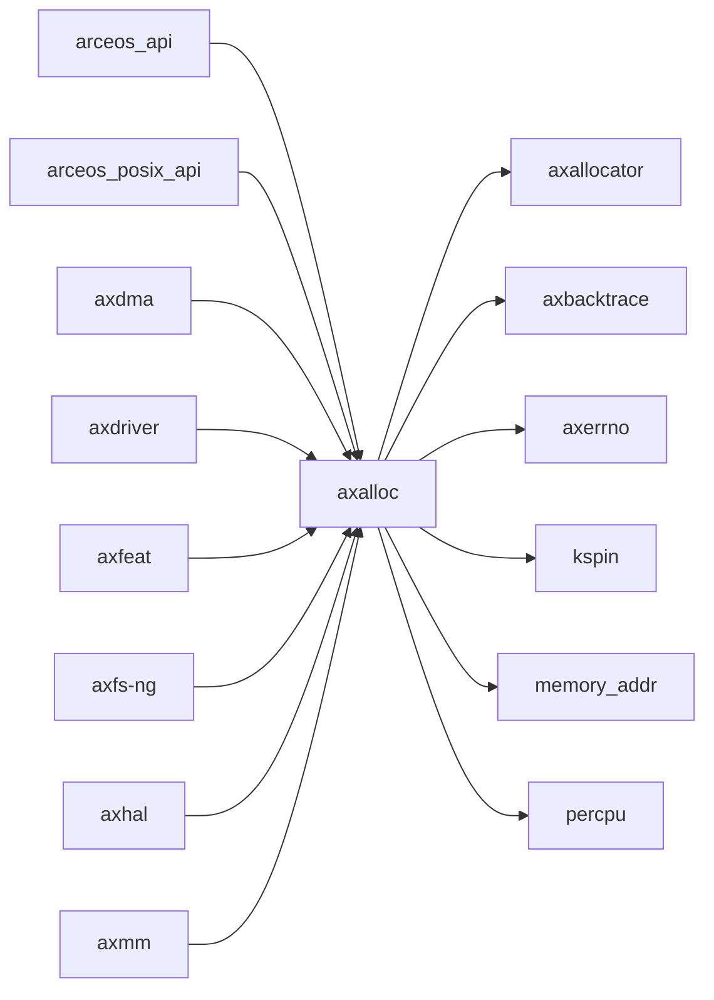

# `axalloc` 技术文档

> 路径：`os/arceos/modules/axalloc`
> 类型：库 crate
> 分层：ArceOS 层 / ArceOS 内核模块
> 版本：`0.3.0-preview.3`
> 文档依据：当前仓库源码、`Cargo.toml` 与 `os/arceos/modules/axalloc/README.md`

`axalloc` 的核心定位是：ArceOS global memory allocator

## 1. 架构设计分析
- 目录角色：ArceOS 内核模块
- crate 形态：库 crate
- 工作区位置：子工作区 `os/arceos`
- feature 视角：主要通过 `buddy`、`hv`、`level-1`、`page-alloc-4g`、`page-alloc-64g`、`slab`、`tlsf`、`tracking` 控制编译期能力装配。
- 关键数据结构：可直接观察到的关键数据结构/对象包括 `Usages`、`GlobalPage`、`AllocationInfo`、`GlobalAllocator`、`UsageKind`、`DefaultByteAllocator`、`RustHeap`、`VirtMem`、`PageCache`、`PAGE_SIZE` 等（另有 2 个关键类型/对象）。

### 1.1 内部模块划分
- `page`：内部子模块
- `tracking`：内部子模块（按 feature: tracking 条件启用）
- `axvisor_impl`：Axvisor-specific memory allocator implementation using buddy-slab-allocator crate. This implementation is designed for virtualization scenarios and provides address translation su…（按 feature: hv 条件启用）
- `default_impl`：Default memory allocator implementation using axallocator crate. This is the standard ArceOS memory allocator implementation that uses the axallocator crate with support for diffe…（按 feature: hv 条件启用）

### 1.2 核心算法/机制
- 内存分配器初始化、扩容或对象分配路径
- 页级映射、页表维护与地址空间布局

## 2. 核心功能说明
- 功能定位：ArceOS global memory allocator
- 对外接口：从源码可见的主要公开入口包括 `get`、`global_allocator`、`alloc`、`alloc_zero`、`alloc_contiguous`、`start_vaddr`、`start_paddr`、`size`、`Usages`、`GlobalPage` 等（另有 3 个公开入口）。
- 典型使用场景：主要服务于 ArceOS 内核模块装配，是运行时、驱动、内存、网络或同步等子系统的一部分。
- 关键调用链示例：按当前源码布局，常见入口/初始化链可概括为 `new()` -> `alloc()` -> `alloc_zero()` -> `alloc_contiguous()` -> `start_vaddr()` -> ...。

## 3. 依赖关系图谱


### 3.1 直接与间接依赖
- `axallocator`
- `axbacktrace`
- `axerrno`
- `kspin`
- `memory_addr`
- `percpu`

### 3.2 间接本地依赖
- `bitmap-allocator`
- `crate_interface`
- `kernel_guard`
- `percpu_macros`

### 3.3 被依赖情况
- `arceos_api`
- `arceos_posix_api`
- `axdma`
- `axdriver`
- `axfeat`
- `axfs-ng`
- `axhal`
- `axmm`
- `axplat-dyn`
- `axruntime`
- `starry-kernel`

### 3.4 间接被依赖情况
- `arceos-affinity`
- `arceos-helloworld`
- `arceos-helloworld-myplat`
- `arceos-httpclient`
- `arceos-httpserver`
- `arceos-irq`
- `arceos-memtest`
- `arceos-parallel`
- `arceos-priority`
- `arceos-shell`
- `arceos-sleep`
- `arceos-wait-queue`
- 另外还有 `14` 个同类项未在此展开

### 3.5 关键外部依赖
- `buddy-slab-allocator`
- `cfg-if`
- `log`
- `strum`

## 4. 开发指南
### 4.1 依赖配置
```toml
[dependencies]
axalloc = { workspace = true }

# 如果在仓库外独立验证，也可以显式绑定本地路径：
# axalloc = { path = "os/arceos/modules/axalloc" }
```

### 4.2 初始化流程
1. 在 `Cargo.toml` 中接入该 crate，并根据需要开启相关 feature。
2. 若 crate 暴露初始化入口，优先调用 `init`/`new`/`build`/`start` 类函数建立上下文。
3. 在最小消费者路径上验证公开 API、错误分支与资源回收行为。

### 4.3 关键 API 使用提示
- 优先关注函数入口：`get`、`global_allocator`、`alloc`、`alloc_zero`、`alloc_contiguous`、`start_vaddr`、`start_paddr`、`size` 等（另有 28 项）。
- 上下文/对象类型通常从 `Usages`、`GlobalPage`、`AllocationInfo`、`GlobalAllocator` 等结构开始。

## 5. 测试策略
### 5.1 当前仓库内的测试形态
- 当前 crate 目录中未发现显式 `tests/`/`benches/`/`fuzz/` 入口，更可能依赖上层系统集成测试或跨 crate 回归。

### 5.2 单元测试重点
- 建议围绕 API 契约、feature 分支、资源管理和错误恢复路径编写单元测试。

### 5.3 集成测试重点
- 建议至少补一条 ArceOS 示例或 `test-suit/arceos` 路径，必要时覆盖多架构或多 feature 组合。

### 5.4 覆盖率要求
- 覆盖率建议：公开 API、初始化失败路径和主要 feature 组合必须覆盖；涉及调度/内存/设备时需补系统级验证。

## 6. 跨项目定位分析
### 6.1 ArceOS
`axalloc` 直接位于 `os/arceos/` 目录树中，是 ArceOS 工程本体的一部分，承担 ArceOS 内核模块。

### 6.2 StarryOS
`axalloc` 不在 StarryOS 目录内部，但被 `starry-kernel` 等 StarryOS crate 直接依赖，说明它是该系统的共享构件或底层服务。

### 6.3 Axvisor
`axalloc` 主要通过 `axvisor` 等上层 crate 被 Axvisor 间接复用，通常处于更底层的公共依赖层。
