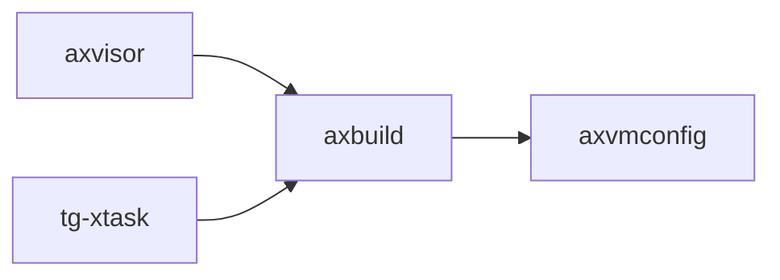

# `axbuild` 技术文档

> 路径：`scripts/axbuild`
> 类型：库 crate
> 分层：工具层 / 宿主侧构建与开发工具
> 版本：`0.3.0-preview.3`
> 文档依据：当前仓库源码、`Cargo.toml` 与 未检测到 crate 层 README

`axbuild` 的核心定位是：宿主侧构建与开发工具

## 1. 架构设计分析
- 目录角色：宿主侧构建与开发工具
- crate 形态：库 crate
- 工作区位置：根工作区
- feature 视角：主要通过 `cli` 控制编译期能力装配。
- 关键数据结构：可直接观察到的关键数据结构/对象包括 `AxBuild`、`BuildOutput`、`Builder`、`PreparedArtifacts`。
- 设计重心：该 crate 运行在宿主机侧，重点是 CLI、配置、外部命令调用和开发流水线接线，而不是目标系统内核热路径。

### 1.1 内部模块划分
- `arceos`：内部子模块
- `axvisor`：内部子模块

### 1.2 核心算法/机制
- 该 crate 主要实现宿主侧命令编排、配置解析和构建流水线控制，复杂度集中在任务编排而非内核热路径算法。
- 静态配置建模、编译期注入或 TOML 解析

## 2. 核心功能说明
- 功能定位：宿主侧构建与开发工具
- 对外接口：从源码可见的主要公开入口包括 `new`、`from_overrides`、`build`、`run_qemu`、`test`、`run_qemu_with_config_path`、`test_with_config_path`、`AxBuild`。
- 典型使用场景：运行在宿主机侧，为构建、测试、镜像准备、依赖分析或开发辅助提供命令行能力。
- 关键调用链示例：按当前源码布局，常见入口/初始化链可概括为 `new()` -> `build()` -> `run_qemu()` -> `run_qemu_with_config_path()` -> `run_qemu_internal()` -> ...。

## 3. 依赖关系图谱


### 3.1 直接与间接依赖
- `axvmconfig`

### 3.2 间接本地依赖
- `axerrno`

### 3.3 被依赖情况
- `axvisor`
- `tg-xtask`

### 3.4 间接被依赖情况
- 当前未发现更多间接消费者，或该 crate 主要作为终端入口使用。

### 3.5 关键外部依赖
- `anyhow`
- `cargo_metadata`
- `chrono`
- `clap`
- `colored`
- `flate2`
- `jkconfig`
- `log`
- `object`
- `ostool`
- `regex`
- `reqwest`
- 另外还有 `9` 个同类项未在此展开

## 4. 开发指南
### 4.1 运行入口
```toml
[dependencies]
axbuild = { workspace = true }

# 如果在仓库外独立验证，也可以显式绑定本地路径：
# axbuild = { path = "scripts/axbuild" }
```

### 4.2 初始化流程
1. 先确认该工具运行在宿主机侧，并准备需要的工作区、配置文件、镜像或外部命令环境。
2. 优先通过 CLI 子命令或 `--manifest-path` 方式运行，避免误把它当作裸机/内核镜像的一部分。
3. 对修改后的行为至少做一次成功路径和一次失败路径验证，重点检查日志、输出文件和外部命令返回值。

### 4.3 关键 API 使用提示
- 该 crate 的关键接入点通常是运行命令、CLI 参数或入口函数，而不是稳定库 API。
- 优先关注函数入口：`new`、`from_overrides`、`build`、`run_qemu`、`test`、`run_qemu_with_config_path`、`test_with_config_path`。
- 上下文/对象类型通常从 `AxBuild` 等结构开始。

## 5. 测试策略
### 5.1 当前仓库内的测试形态
- 存在单元测试/`#[cfg(test)]` 场景：`src/arceos/build.rs`、`src/arceos/features.rs`、`src/arceos/ostool.rs`、`src/axvisor/image/spec.rs`。

### 5.2 单元测试重点
- 建议覆盖命令解析、配置序列化/反序列化、路径计算和失败分支。

### 5.3 集成测试重点
- 建议增加 CLI 金丝雀测试、示例工程 smoke test 或与 CI 命令一致的端到端验证。

### 5.4 覆盖率要求
- 覆盖率建议：命令分派和配置读写逻辑应保持高覆盖，外部命令执行路径至少要有成功/失败双向验证。

## 6. 跨项目定位分析
### 6.1 ArceOS
`axbuild` 更偏 ArceOS 生态的基础设施或公共模块；当前未观察到 ArceOS 本体对其存在显式直接依赖。

### 6.2 StarryOS
当前未检测到 StarryOS 工程本体对 `axbuild` 的显式本地依赖，若参与该系统，通常经外部工具链、配置或更底层生态间接体现。

### 6.3 Axvisor
`axbuild` 不在 Axvisor 目录内部，但被 `axvisor` 等 Axvisor crate 直接依赖，说明它是该系统的共享构件或底层服务。
