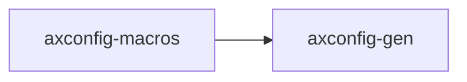

# `axconfig-gen` 技术文档

> 路径：`components/axconfig-gen/axconfig-gen`
> 类型：库 + 二进制混合 crate
> 分层：组件层 / 可复用基础组件
> 版本：`0.2.1`
> 文档依据：当前仓库源码、`Cargo.toml` 与 `components/axconfig-gen/axconfig-gen/README.md`

`axconfig-gen` 的核心定位是：A TOML-based configuration generation tool for ArceOS.

## 1. 架构设计分析
- 目录角色：可复用基础组件
- crate 形态：库 + 二进制混合 crate
- 工作区位置：子工作区 `components/axconfig-gen`
- feature 视角：该 crate 没有显式声明额外 Cargo feature，功能边界主要由模块本身决定。
- 关键数据结构：可直接观察到的关键数据结构/对象包括 `ConfigItem`、`Config`、`Output`、`ConfigValue`、`ConfigErr`、`OutputFormat`、`ConfigType`、`ConfigResult`、`ConfigTable`、`Err` 等（另有 1 个关键类型/对象）。
- 设计重心：该 crate 通常作为多个内核子系统共享的底层构件，重点在接口边界、数据结构和被上层复用的方式。

### 1.1 内部模块划分
- `config`：配置模型、解析与静态参数装配
- `output`：内部子模块
- `ty`：内部子模块
- `value`：内部子模块
- `tests`：测试辅助与场景验证代码（按条件编译启用）

### 1.2 核心算法/机制
- 静态配置建模、编译期注入或 TOML 解析

## 2. 核心功能说明
- 功能定位：A TOML-based configuration generation tool for ArceOS.
- 对外接口：从源码可见的主要公开入口包括 `item_name`、`table_name`、`key`、`value`、`comments`、`value_mut`、`new`、`is_empty`、`ConfigItem`、`Config` 等（另有 5 个公开入口）。
- 典型使用场景：作为共享基础设施被多个 OS 子系统复用，常见场景包括同步、内存管理、设备抽象、接口桥接和虚拟化基础能力。
- 关键调用链示例：按当前源码布局，常见入口/初始化链可概括为 `new()` -> `new_global()` -> `new_table()` -> `new_with_type()`。

## 3. 依赖关系图谱


### 3.1 直接与间接依赖
- 未检测到本仓库内的直接本地依赖；该 crate 可能主要依赖外部生态或承担叶子节点角色。

### 3.2 间接本地依赖
- 未检测到额外的间接本地依赖，或依赖深度主要停留在第一层。

### 3.3 被依赖情况
- `axconfig-macros`

### 3.4 间接被依赖情况
- `arceos-affinity`
- `arceos-helloworld`
- `arceos-helloworld-myplat`
- `arceos-httpclient`
- `arceos-httpserver`
- `arceos-irq`
- `arceos-memtest`
- `arceos-parallel`
- `arceos-priority`
- `arceos-shell`
- `arceos-sleep`
- `arceos-wait-queue`
- 另外还有 `37` 个同类项未在此展开

### 3.5 关键外部依赖
- `clap`
- `toml_edit`

## 4. 开发指南
### 4.1 依赖配置
```toml
[dependencies]
axconfig-gen = { workspace = true }

# 如果在仓库外独立验证，也可以显式绑定本地路径：
# axconfig-gen = { path = "components/axconfig-gen/axconfig-gen" }
```

### 4.2 初始化流程
1. 在 `Cargo.toml` 中接入该 crate，并根据需要开启相关 feature。
2. 若 crate 暴露初始化入口，优先调用 `init`/`new`/`build`/`start` 类函数建立上下文。
3. 在最小消费者路径上验证公开 API、错误分支与资源回收行为。

### 4.3 关键 API 使用提示
- 优先关注函数入口：`item_name`、`table_name`、`key`、`value`、`comments`、`value_mut`、`new`、`is_empty` 等（另有 30 项）。
- 上下文/对象类型通常从 `ConfigItem`、`Config`、`Output`、`ConfigValue` 等结构开始。

## 5. 测试策略
### 5.1 当前仓库内的测试形态
- 存在单元测试/`#[cfg(test)]` 场景：`src/lib.rs`、`src/ty.rs`。

### 5.2 单元测试重点
- 建议用单元测试覆盖公开 API、错误分支、边界条件以及并发/内存安全相关不变量。

### 5.3 集成测试重点
- 建议补充被 ArceOS/StarryOS/Axvisor 消费时的最小集成路径，确保接口语义与 feature 组合稳定。

### 5.4 覆盖率要求
- 覆盖率建议：核心算法与错误路径达到高覆盖，关键数据结构和边界条件应实现接近完整覆盖。

## 6. 跨项目定位分析
### 6.1 ArceOS
`axconfig-gen` 主要通过 `arceos-affinity`、`arceos-helloworld`、`arceos-helloworld-myplat`、`arceos-httpclient`、`arceos-httpserver`、`arceos-irq` 等（另有 27 项） 等上层 crate 被 ArceOS 间接复用，通常处于更底层的公共依赖层。

### 6.2 StarryOS
`axconfig-gen` 主要通过 `starry-kernel`、`starryos`、`starryos-test` 等上层 crate 被 StarryOS 间接复用，通常处于更底层的公共依赖层。

### 6.3 Axvisor
`axconfig-gen` 主要通过 `axvisor` 等上层 crate 被 Axvisor 间接复用，通常处于更底层的公共依赖层。
