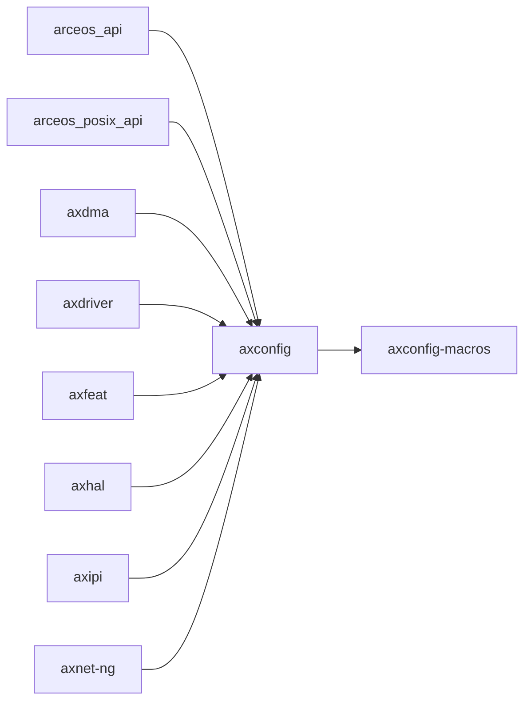

# `axconfig` 技术文档

> 路径：`os/arceos/modules/axconfig`
> 类型：库 crate
> 分层：ArceOS 层 / ArceOS 内核模块
> 版本：`0.3.0-preview.3`
> 文档依据：当前仓库源码、`Cargo.toml` 与 `os/arceos/modules/axconfig/README.md`

`axconfig` 的核心定位是：Platform-specific constants and parameters for ArceOS

## 1. 架构设计分析
- 目录角色：ArceOS 内核模块
- crate 形态：库 crate
- 工作区位置：子工作区 `os/arceos`
- feature 视角：主要通过 `plat-dyn` 控制编译期能力装配。
- 关键数据结构：可直接观察到的关键数据结构/对象包括 `ARCH`、`PACKAGE`、`PLATFORM`、`TASK_STACK_SIZE`。

### 1.1 内部模块划分
- `driver_dyn_config`：内部子模块（按 feature: plat-dyn 条件启用）

### 1.2 核心算法/机制
- 静态配置建模、编译期注入或 TOML 解析

## 2. 核心功能说明
- 功能定位：Platform-specific constants and parameters for ArceOS
- 对外接口：该 crate 更倾向按顶层模块组织接口，当前应重点关注 `driver_dyn_config` 等模块边界。
- 典型使用场景：主要服务于 ArceOS 内核模块装配，是运行时、驱动、内存、网络或同步等子系统的一部分。
- 关键调用链示例：该 crate 没有单一固定的初始化链，通常由上层调用者按 feature/trait 组合接入。

## 3. 依赖关系图谱


### 3.1 直接与间接依赖
- `axconfig-macros`

### 3.2 间接本地依赖
- `axconfig-gen`

### 3.3 被依赖情况
- `arceos_api`
- `arceos_posix_api`
- `axdma`
- `axdriver`
- `axfeat`
- `axhal`
- `axipi`
- `axnet-ng`
- `axruntime`
- `axtask`
- `axvisor`
- `starry-kernel`

### 3.4 间接被依赖情况
- `arceos-affinity`
- `arceos-helloworld`
- `arceos-helloworld-myplat`
- `arceos-httpclient`
- `arceos-httpserver`
- `arceos-irq`
- `arceos-memtest`
- `arceos-parallel`
- `arceos-priority`
- `arceos-shell`
- `arceos-sleep`
- `arceos-wait-queue`
- 另外还有 `12` 个同类项未在此展开

### 3.5 关键外部依赖
- `const-str`

## 4. 开发指南
### 4.1 依赖配置
```toml
[dependencies]
axconfig = { workspace = true }

# 如果在仓库外独立验证，也可以显式绑定本地路径：
# axconfig = { path = "os/arceos/modules/axconfig" }
```

### 4.2 初始化流程
1. 在 `Cargo.toml` 中接入该 crate，并根据需要开启相关 feature。
2. 若 crate 暴露初始化入口，优先调用 `init`/`new`/`build`/`start` 类函数建立上下文。
3. 在最小消费者路径上验证公开 API、错误分支与资源回收行为。

### 4.3 关键 API 使用提示
- 该 crate 更偏编排、配置或内部 glue 逻辑，关键使用点通常体现在 feature、命令或入口函数上。

## 5. 测试策略
### 5.1 当前仓库内的测试形态
- 当前 crate 目录中未发现显式 `tests/`/`benches/`/`fuzz/` 入口，更可能依赖上层系统集成测试或跨 crate 回归。

### 5.2 单元测试重点
- 建议围绕 API 契约、feature 分支、资源管理和错误恢复路径编写单元测试。

### 5.3 集成测试重点
- 建议至少补一条 ArceOS 示例或 `test-suit/arceos` 路径，必要时覆盖多架构或多 feature 组合。

### 5.4 覆盖率要求
- 覆盖率建议：公开 API、初始化失败路径和主要 feature 组合必须覆盖；涉及调度/内存/设备时需补系统级验证。

## 6. 跨项目定位分析
### 6.1 ArceOS
`axconfig` 直接位于 `os/arceos/` 目录树中，是 ArceOS 工程本体的一部分，承担 ArceOS 内核模块。

### 6.2 StarryOS
`axconfig` 不在 StarryOS 目录内部，但被 `starry-kernel` 等 StarryOS crate 直接依赖，说明它是该系统的共享构件或底层服务。

### 6.3 Axvisor
`axconfig` 不在 Axvisor 目录内部，但被 `axvisor` 等 Axvisor crate 直接依赖，说明它是该系统的共享构件或底层服务。
