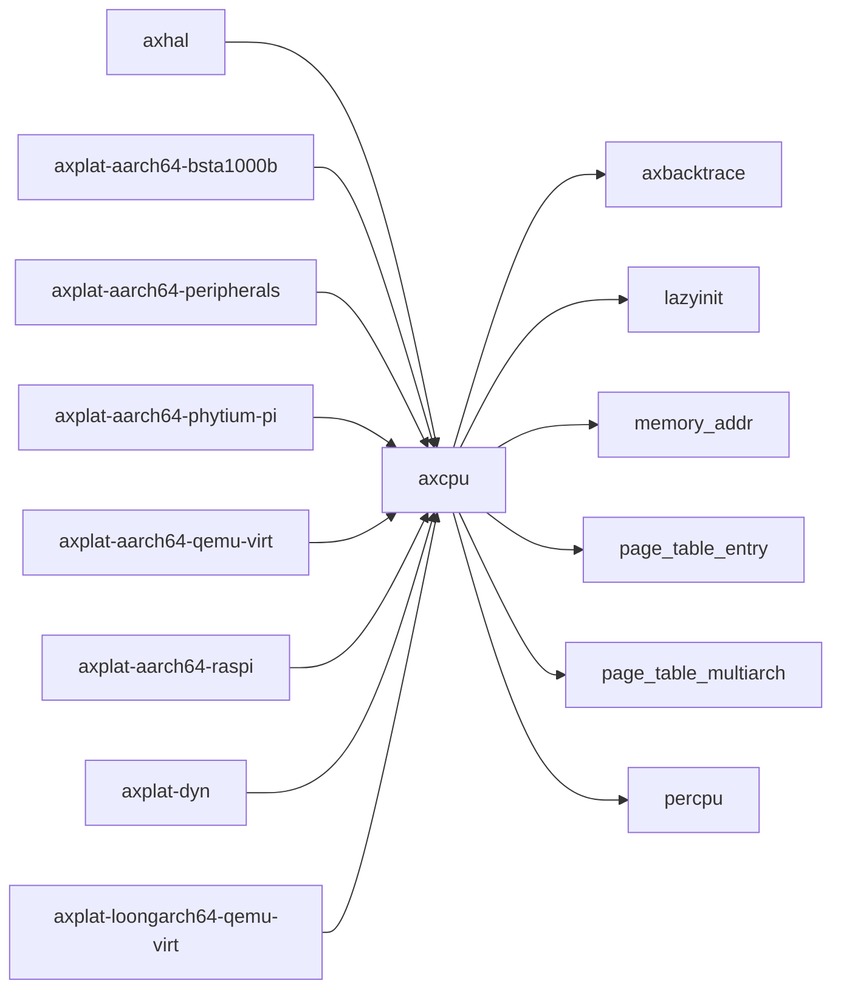

# `axcpu` 技术文档

> 路径：`components/axcpu`
> 类型：库 crate
> 分层：组件层 / 可复用基础组件
> 版本：`0.3.0-preview.8`
> 文档依据：当前仓库源码、`Cargo.toml` 与 `components/axcpu/README.md`

`axcpu` 的核心定位是：Privileged instruction and structure abstractions for various CPU architectures

## 1. 架构设计分析
- 目录角色：可复用基础组件
- crate 形态：库 crate
- 工作区位置：根工作区
- feature 视角：主要通过 `arm-el2`、`fp-simd`、`tls`、`uspace` 控制编译期能力装配。
- 关键数据结构：可直接观察到的关键数据结构/对象包括 `ExceptionTableEntry`、`ReturnReason`、`ExceptionKind`、`IRQ`、`PAGE_FAULT`。
- 设计重心：该 crate 通常作为多个内核子系统共享的底层构件，重点在接口边界、数据结构和被上层复用的方式。

### 1.1 内部模块划分
- `trap`：Trap handling
- `uspace_common`：内部子模块（按 feature: uspace 条件启用）
- `x86_64`：内部子模块
- `riscv`：内部子模块
- `aarch64`：内部子模块
- `loongarch64`：内部子模块

### 1.2 核心算法/机制
- 初始化顺序控制与全局状态建立

## 2. 核心功能说明
- 功能定位：Privileged instruction and structure abstractions for various CPU architectures
- 对外接口：从源码可见的主要公开入口包括 `ExceptionTableEntry`、`ReturnReason`、`ExceptionKind`。
- 典型使用场景：作为共享基础设施被多个 OS 子系统复用，常见场景包括同步、内存管理、设备抽象、接口桥接和虚拟化基础能力。
- 关键调用链示例：该 crate 没有单一固定的初始化链，通常由上层调用者按 feature/trait 组合接入。

## 3. 依赖关系图谱


### 3.1 直接与间接依赖
- `axbacktrace`
- `lazyinit`
- `memory_addr`
- `page_table_entry`
- `page_table_multiarch`
- `percpu`

### 3.2 间接本地依赖
- `axerrno`
- `crate_interface`
- `kernel_guard`
- `percpu_macros`

### 3.3 被依赖情况
- `axhal`
- `axplat-aarch64-bsta1000b`
- `axplat-aarch64-peripherals`
- `axplat-aarch64-phytium-pi`
- `axplat-aarch64-qemu-virt`
- `axplat-aarch64-raspi`
- `axplat-dyn`
- `axplat-loongarch64-qemu-virt`
- `axplat-riscv64-qemu-virt`
- `axplat-x86-pc`
- `axplat-x86-qemu-q35`
- `irq-kernel`
- 另外还有 `2` 个同类项未在此展开

### 3.4 间接被依赖情况
- `arceos-affinity`
- `arceos-helloworld`
- `arceos-helloworld-myplat`
- `arceos-httpclient`
- `arceos-httpserver`
- `arceos-irq`
- `arceos-memtest`
- `arceos-parallel`
- `arceos-priority`
- `arceos-shell`
- `arceos-sleep`
- `arceos-wait-queue`
- 另外还有 `24` 个同类项未在此展开

### 3.5 关键外部依赖
- `aarch64-cpu`
- `cfg-if`
- `linkme`
- `log`
- `loongArch64`
- `riscv`
- `tock-registers`
- `x86`
- `x86_64`

## 4. 开发指南
### 4.1 依赖配置
```toml
[dependencies]
axcpu = { workspace = true }

# 如果在仓库外独立验证，也可以显式绑定本地路径：
# axcpu = { path = "components/axcpu" }
```

### 4.2 初始化流程
1. 在 `Cargo.toml` 中接入该 crate，并根据需要开启相关 feature。
2. 若 crate 暴露初始化入口，优先调用 `init`/`new`/`build`/`start` 类函数建立上下文。
3. 在最小消费者路径上验证公开 API、错误分支与资源回收行为。

### 4.3 关键 API 使用提示
- 上下文/对象类型通常从 `ExceptionTableEntry` 等结构开始。

## 5. 测试策略
### 5.1 当前仓库内的测试形态
- 当前 crate 目录中未发现显式 `tests/`/`benches/`/`fuzz/` 入口，更可能依赖上层系统集成测试或跨 crate 回归。

### 5.2 单元测试重点
- 建议用单元测试覆盖公开 API、错误分支、边界条件以及并发/内存安全相关不变量。

### 5.3 集成测试重点
- 建议补充被 ArceOS/StarryOS/Axvisor 消费时的最小集成路径，确保接口语义与 feature 组合稳定。

### 5.4 覆盖率要求
- 覆盖率建议：核心算法与错误路径达到高覆盖，关键数据结构和边界条件应实现接近完整覆盖。

## 6. 跨项目定位分析
### 6.1 ArceOS
`axcpu` 不在 ArceOS 目录内部，但被 `axhal` 等 ArceOS crate 直接依赖，说明它是该系统的共享构件或底层服务。

### 6.2 StarryOS
`axcpu` 主要通过 `starry-kernel`、`starryos`、`starryos-test` 等上层 crate 被 StarryOS 间接复用，通常处于更底层的公共依赖层。

### 6.3 Axvisor
`axcpu` 主要通过 `axvisor` 等上层 crate 被 Axvisor 间接复用，通常处于更底层的公共依赖层。
