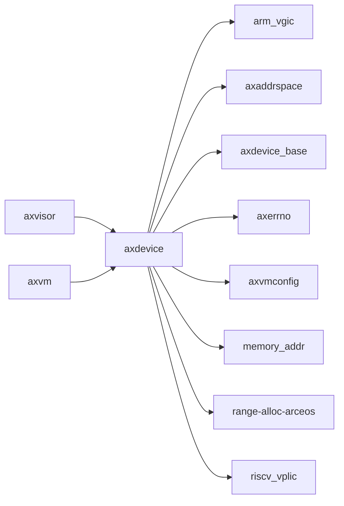

# `axdevice` 技术文档

> 路径：`components/axdevice`
> 类型：库 crate
> 分层：组件层 / 可复用基础组件
> 版本：`0.2.1`
> 文档依据：当前仓库源码、`Cargo.toml` 与 `components/axdevice/README.md`

`axdevice` 的核心定位是：A reusable, OS-agnostic device abstraction layer designed for virtual machines.

## 1. 架构设计分析
- 目录角色：可复用基础组件
- crate 形态：库 crate
- 工作区位置：根工作区
- feature 视角：该 crate 没有显式声明额外 Cargo feature，功能边界主要由模块本身决定。
- 关键数据结构：可直接观察到的关键数据结构/对象包括 `AxVmDeviceConfig`、`AxEmuDevices`、`AxVmDevices`、`AxEmuMmioDevices`、`AxEmuSysRegDevices`、`AxEmuPortDevices`、`GPPT_GICR_ARG_ERR_MSG`。
- 设计重心：该 crate 多数是寄存器级或设备级薄封装，复杂度集中在 MMIO 语义、安全假设和被上层平台/驱动整合的方式。

### 1.1 内部模块划分
- `config`：配置模型、解析与静态参数装配
- `device`：设备抽象、枚举与访问封装

### 1.2 核心算法/机制
- 静态配置建模、编译期注入或 TOML 解析

## 2. 核心功能说明
- 功能定位：A reusable, OS-agnostic device abstraction layer designed for virtual machines.
- 对外接口：从源码可见的主要公开入口包括 `new`、`add_dev`、`find_dev`、`iter`、`iter_mut`、`alloc_ivc_channel`、`release_ivc_channel`、`add_mmio_dev`、`AxVmDeviceConfig`、`AxEmuDevices` 等（另有 1 个公开入口）。
- 典型使用场景：提供寄存器定义、MMIO 访问或设备级操作原语，通常被平台 crate、驱动聚合层或更高层子系统进一步封装。
- 关键调用链示例：按当前源码布局，常见入口/初始化链可概括为 `new()` -> `init()` -> `alloc_ivc_channel()`。

## 3. 依赖关系图谱


### 3.1 直接与间接依赖
- `arm_vgic`
- `axaddrspace`
- `axdevice_base`
- `axerrno`
- `axvmconfig`
- `memory_addr`
- `range-alloc-arceos`
- `riscv_vplic`

### 3.2 间接本地依赖
- `aarch64_sysreg`
- `axvisor_api`
- `axvisor_api_proc`
- `crate_interface`
- `lazyinit`
- `memory_set`
- `page_table_entry`
- `page_table_multiarch`
- `riscv-h`

### 3.3 被依赖情况
- `axvisor`
- `axvm`

### 3.4 间接被依赖情况
- 当前未发现更多间接消费者，或该 crate 主要作为终端入口使用。

### 3.5 关键外部依赖
- `cfg-if`
- `log`
- `spin`

## 4. 开发指南
### 4.1 依赖配置
```toml
[dependencies]
axdevice = { workspace = true }

# 如果在仓库外独立验证，也可以显式绑定本地路径：
# axdevice = { path = "components/axdevice" }
```

### 4.2 初始化流程
1. 先明确该设备/寄存器组件的调用上下文，是被平台 crate 直接使用还是被驱动聚合层再次封装。
2. 修改寄存器位域、初始化顺序或中断相关逻辑时，应同步检查 `unsafe` 访问、访问宽度和副作用语义。
3. 尽量通过最小平台集成路径验证真实设备行为，而不要只依赖静态接口检查。

### 4.3 关键 API 使用提示
- 优先关注函数入口：`new`、`add_dev`、`find_dev`、`iter`、`iter_mut`、`alloc_ivc_channel`、`release_ivc_channel`、`add_mmio_dev` 等（另有 17 项）。
- 上下文/对象类型通常从 `AxVmDeviceConfig`、`AxEmuDevices`、`AxVmDevices` 等结构开始。

## 5. 测试策略
### 5.1 当前仓库内的测试形态
- 存在 crate 内集成测试：`tests/test.rs`。

### 5.2 单元测试重点
- 建议覆盖寄存器位域、设备状态转换、边界参数和 `unsafe` 访问前提。

### 5.3 集成测试重点
- 建议结合最小平台或驱动集成路径验证真实设备行为，重点检查初始化、中断和收发等主线。

### 5.4 覆盖率要求
- 覆盖率建议：寄存器访问辅助函数和关键状态机保持高覆盖；真实硬件语义以集成验证补齐。

## 6. 跨项目定位分析
### 6.1 ArceOS
`axdevice` 更偏 ArceOS 生态的基础设施或公共模块；当前未观察到 ArceOS 本体对其存在显式直接依赖。

### 6.2 StarryOS
当前未检测到 StarryOS 工程本体对 `axdevice` 的显式本地依赖，若参与该系统，通常经外部工具链、配置或更底层生态间接体现。

### 6.3 Axvisor
`axdevice` 不在 Axvisor 目录内部，但被 `axvisor` 等 Axvisor crate 直接依赖，说明它是该系统的共享构件或底层服务。
