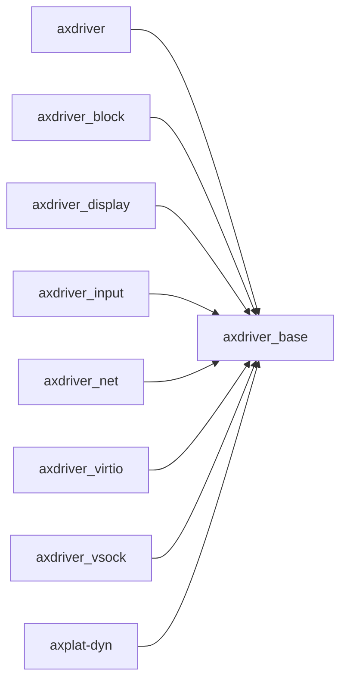

# `axdriver_base` 技术文档

> 路径：`components/axdriver_crates/axdriver_base`
> 类型：库 crate
> 分层：组件层 / 可复用基础组件
> 版本：`0.1.4-preview.3`
> 文档依据：当前仓库源码、`Cargo.toml` 与 `components/axdriver_crates/axdriver_base/README.md`

`axdriver_base` 的核心定位是：Common interfaces for all kinds of device drivers

## 1. 架构设计分析
- 目录角色：可复用基础组件
- crate 形态：库 crate
- 工作区位置：子工作区 `components/axdriver_crates`
- feature 视角：该 crate 没有显式声明额外 Cargo feature，功能边界主要由模块本身决定。
- 关键数据结构：可直接观察到的关键数据结构/对象包括 `DeviceType`、`DevError`、`DevResult`。
- 设计重心：该 crate 多数是寄存器级或设备级薄封装，复杂度集中在 MMIO 语义、安全假设和被上层平台/驱动整合的方式。

### 1.1 内部模块划分
- 当前 crate 未显式声明多个顶层 `mod`，复杂度更可能集中在单文件入口、宏展开或下层子 crate。

### 1.2 核心算法/机制
- 实现重心偏向接口组织和模块协作。

## 2. 核心功能说明
- 功能定位：Common interfaces for all kinds of device drivers
- 对外接口：从源码可见的主要公开入口包括 `DeviceType`、`DevError`、`BaseDriverOps`。
- 典型使用场景：提供寄存器定义、MMIO 访问或设备级操作原语，通常被平台 crate、驱动聚合层或更高层子系统进一步封装。
- 关键调用链示例：该 crate 没有单一固定的初始化链，通常由上层调用者按 feature/trait 组合接入。

## 3. 依赖关系图谱


### 3.1 直接与间接依赖
- 未检测到本仓库内的直接本地依赖；该 crate 可能主要依赖外部生态或承担叶子节点角色。

### 3.2 间接本地依赖
- 未检测到额外的间接本地依赖，或依赖深度主要停留在第一层。

### 3.3 被依赖情况
- `axdriver`
- `axdriver_block`
- `axdriver_display`
- `axdriver_input`
- `axdriver_net`
- `axdriver_virtio`
- `axdriver_vsock`
- `axplat-dyn`

### 3.4 间接被依赖情况
- `arceos-affinity`
- `arceos-helloworld`
- `arceos-helloworld-myplat`
- `arceos-httpclient`
- `arceos-httpserver`
- `arceos-irq`
- `arceos-memtest`
- `arceos-parallel`
- `arceos-priority`
- `arceos-shell`
- `arceos-sleep`
- `arceos-wait-queue`
- 另外还有 `23` 个同类项未在此展开

### 3.5 关键外部依赖
- 当前依赖集合几乎完全来自仓库内本地 crate。

## 4. 开发指南
### 4.1 依赖配置
```toml
[dependencies]
axdriver_base = { workspace = true }

# 如果在仓库外独立验证，也可以显式绑定本地路径：
# axdriver_base = { path = "components/axdriver_crates/axdriver_base" }
```

### 4.2 初始化流程
1. 先明确该设备/寄存器组件的调用上下文，是被平台 crate 直接使用还是被驱动聚合层再次封装。
2. 修改寄存器位域、初始化顺序或中断相关逻辑时，应同步检查 `unsafe` 访问、访问宽度和副作用语义。
3. 尽量通过最小平台集成路径验证真实设备行为，而不要只依赖静态接口检查。

### 4.3 关键 API 使用提示
- 该 crate 更偏编排、配置或内部 glue 逻辑，关键使用点通常体现在 feature、命令或入口函数上。

## 5. 测试策略
### 5.1 当前仓库内的测试形态
- 当前 crate 目录中未发现显式 `tests/`/`benches/`/`fuzz/` 入口，更可能依赖上层系统集成测试或跨 crate 回归。

### 5.2 单元测试重点
- 建议覆盖寄存器位域、设备状态转换、边界参数和 `unsafe` 访问前提。

### 5.3 集成测试重点
- 建议结合最小平台或驱动集成路径验证真实设备行为，重点检查初始化、中断和收发等主线。

### 5.4 覆盖率要求
- 覆盖率建议：寄存器访问辅助函数和关键状态机保持高覆盖；真实硬件语义以集成验证补齐。

## 6. 跨项目定位分析
### 6.1 ArceOS
`axdriver_base` 不在 ArceOS 目录内部，但被 `axdriver` 等 ArceOS crate 直接依赖，说明它是该系统的共享构件或底层服务。

### 6.2 StarryOS
`axdriver_base` 主要通过 `starry-kernel`、`starryos`、`starryos-test` 等上层 crate 被 StarryOS 间接复用，通常处于更底层的公共依赖层。

### 6.3 Axvisor
`axdriver_base` 主要通过 `axvisor` 等上层 crate 被 Axvisor 间接复用，通常处于更底层的公共依赖层。
