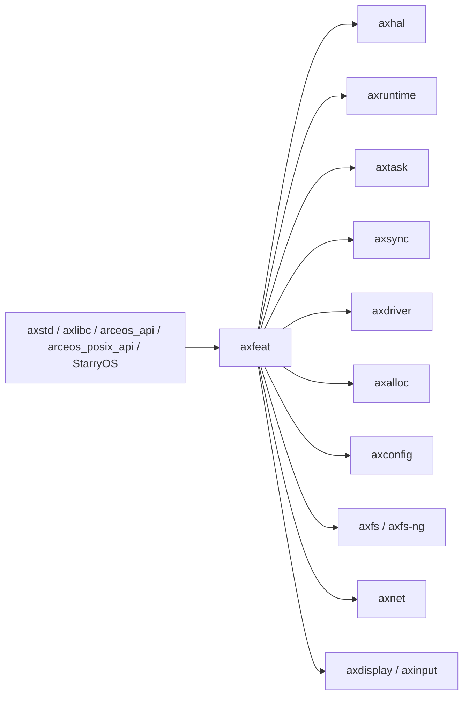
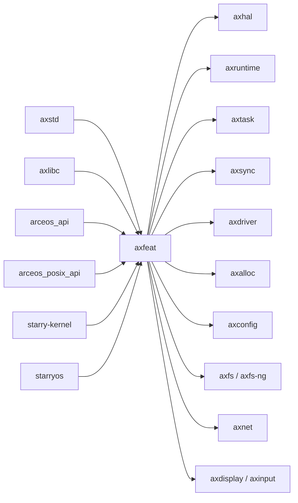

# `axfeat` 技术文档

> 路径：`os/arceos/api/axfeat`
> 类型：库 crate
> 分层：ArceOS 层 / 编译期 feature 聚合层
> 版本：`0.3.0-preview.3`
> 文档依据：`Cargo.toml`、`src/lib.rs`、`os/arceos/api/arceos_api/Cargo.toml`、`os/arceos/api/arceos_posix_api/Cargo.toml`、`os/arceos/ulib/axstd/Cargo.toml`、`os/arceos/ulib/axlibc/Cargo.toml`、`os/StarryOS/kernel/Cargo.toml`

`axfeat` 是 ArceOS 体系里的“feature 配电板”。它本身几乎没有运行时代码，也不暴露复杂 API；真正的价值在于把一套顶层能力开关稳定地映射到 `axhal`、`axruntime`、`axtask`、`axdriver`、`axconfig`、`axalloc` 等具体实现 crate 上，让 `axstd`、`axlibc`、`arceos_api`、`arceos_posix_api` 以及 StarryOS 能用同一组 feature 词汇装配系统。

## 1. 架构设计分析
### 1.1 设计定位
从源码看，`axfeat` 的实现极度克制：`src/lib.rs` 只有 crate 级文档和 `#![no_std]`，所有“逻辑”都在 `Cargo.toml` 的 feature 映射里。这说明它不是运行时门面，而是纯编译期装配层：

- 向上，它为 `axstd`、`axlibc`、`arceos_api`、`arceos_posix_api`、`starry-kernel`、`starryos` 提供统一的能力命名。
- 向下，它把这些顶层能力翻译成对 `axhal`、`axruntime`、`axtask`、`axsync`、`axdriver`、`axalloc`、`axfs`、`axnet` 等 crate 的 feature 组合。
- 横向，它把“平台选择”“内存能力”“调度器”“上层协议栈”“驱动探测方式”放进一套一致的 feature 语义体系，避免每个上层 crate 都各自维护一套命名。

因此，`axfeat` 的关键不是“实现某个功能”，而是“让功能在整个工作区里以一致方式被选中”。

### 1.2 真实装配链路
`axfeat` 的 feature 传播关系可以概括为：



其中几个最重要的真实映射如下：

- `multitask = ["alloc", "axtask/multitask", "axsync/multitask", "axruntime/multitask"]`
  这说明“多任务”不是单个 crate 的开关，而是调度器、同步原语和运行时三方一起进入镜像。
- `fs = ["alloc", "paging", "axdriver/virtio-blk", "dep:axfs", "axruntime/fs"]`
  这说明文件系统 feature 会顺带拉起页表、块设备驱动和运行时初始化路径。
- `net-ng = ["net", "irq", "multitask", "axruntime/net-ng"]`
  这体现了新网络栈不是简单替换，而是要求 IRQ 和多任务一起打开。
- `plat-dyn = ["axhal/plat-dyn", "paging", "axruntime/plat-dyn", "axconfig/plat-dyn"]`
  这条链路直接把动态平台模式同时传播到 HAL、运行时和配置层，是构建期/链接期行为的重要分界点。

### 1.3 feature 分组与边界
按 `Cargo.toml` 可以把 `axfeat` 管的能力分成六组：

- 平台与执行环境：`myplat`、`defplat`、`plat-dyn`、`uspace`、`hv`
- CPU 与中断：`smp`、`fp-simd`、`irq`、`ipi`
- 内存：`alloc`、`alloc-*`、`page-alloc-*`、`paging`、`tls`、`dma`
- 调度与同步：`multitask`、`task-ext`、`sched-fifo`、`sched-rr`、`sched-cfs`
- 上层栈：`fs`、`fs-ng*`、`net`、`net-ng`、`display`、`input`、`rtc`、`vsock`
- 驱动与调试：`bus-mmio`、`bus-pci`、`driver-*`、`dwarf`

这些分组说明 `axfeat` 的职责边界非常清晰：

- 它负责“是否装配”。
- 它不负责“如何初始化”。
- 它也不负责“配置值是什么”。

初始化时序属于 `axruntime`，配置数值属于 `axconfig`/平台配置，具体实现属于各模块本身。

## 2. 核心功能说明
### 2.1 主要功能
- 为 ArceOS 顶层库提供统一的 feature 词汇表。
- 将顶层 feature 精确映射到下游实现 crate 的 feature 组合。
- 利用 optional dependency 控制某些大模块是否真正进入依赖图。
- 为跨项目复用提供稳定装配语义，避免 ArceOS、StarryOS、Axvisor 各自定义一套开关。

### 2.2 对外接口形态
`axfeat` 没有值得单独讨论的运行时 API；它的“接口”就是 feature 名字本身。真实使用方式通常不是调用函数，而是在上层 `Cargo.toml` 里通过依赖它的 crate 间接启用：

```toml
[dependencies]
axstd = { workspace = true, features = ["alloc", "multitask", "net"] }
```

这组 feature 最终会经由 `axstd -> axfeat` 下沉到 `axruntime`、`axtask`、`axnet`、`axdriver` 等模块。

### 2.3 构建期与运行期边界
`axfeat` 是纯构建期组件：

- 它在 Cargo 解析依赖图时决定哪些模块和哪些 feature 被编译。
- 它不会生成配置文件，配置文件生成是 `axconfig-gen`/`axbuild` 的工作。
- 它不会在启动时初始化任何东西，启动编排是 `axruntime` 的工作。

这也是理解整个装配链路的关键前提：`axfeat` 决定“编进来什么”，不是“运行时怎么跑”。

## 3. 依赖关系图谱


### 3.1 关键直接依赖
- `axhal`、`axruntime`：几乎所有系统能力最终都要落到这两层的 feature 上。
- `axtask`、`axsync`：由 `multitask`、调度器和线程相关能力驱动。
- `axalloc`：由 `alloc`、`paging`、`tls`、`dma` 等内存能力触发。
- `axdriver`、`axfs`、`axfs-ng`、`axnet`、`axdisplay`、`axinput`：由上层栈 feature 触发。
- `axconfig`：仅在 `plat-dyn` 路径中直接参与装配链。

### 3.2 关键消费者
- `axstd`：Rust 应用侧 feature 的主要入口。
- `axlibc`：C 应用侧 feature 的主要入口。
- `arceos_api`、`arceos_posix_api`：稳定 API 层的 feature 汇聚点。
- `starry-kernel`、`starryos`：StarryOS 直接复用 `axfeat` 选择底层 ArceOS 能力。

### 3.3 跨 crate 传播规律
- Rust 应用通常经由 `axstd` 间接开启 `axfeat`。
- C 应用通常经由 `axlibc -> arceos_posix_api -> axfeat` 间接开启。
- StarryOS 直接在内核或启动包里依赖 `axfeat`，而不是再包一层 `axstd`。

## 4. 开发指南
### 4.1 何时应该修改 `axfeat`
只有当某个能力需要跨多个顶层 crate 共享同一开关语义时，才应该把它放进 `axfeat`。典型场景包括：

- 新增一个需要同时影响 `axruntime`、`axhal`、`axdriver` 的系统能力。
- 需要让 `axstd`、`axlibc`、`arceos_api` 使用同样的 feature 名称。
- 需要给 StarryOS 或 Axvisor 暴露统一装配入口。

如果某个开关只影响单个 crate 的私有实现，优先留在该 crate 自己的 `Cargo.toml` 中。

### 4.2 新增或调整 feature 的检查清单
1. 明确该 feature 属于平台、内存、调度、上层栈还是驱动层。
2. 检查是否需要同步映射到 `axstd`、`axlibc`、`arceos_api`、`arceos_posix_api`。
3. 检查 optional dependency 是否也要一起加入，否则 feature 打开后模块可能并未真正进入依赖图。
4. 确认 feature 之间的蕴含关系是否合理，例如 `multitask` 是否需要 `alloc`，`net-ng` 是否必须依赖 `irq`。
5. 检查 StarryOS 或其他直接消费者是否会因语义变化而失配。

### 4.3 不应在这里做的事情
- 不要在 `axfeat` 写初始化代码或运行时状态。
- 不要把板级常量、地址布局、栈大小之类的配置塞进 `axfeat`。
- 不要把只服务单个消费者的私有实现细节提升为全局 feature。

## 5. 测试策略
### 5.1 当前测试形态
`axfeat` 自身没有 crate 内单元测试；它的正确性主要体现在“不同 feature 组合下能否成功构建并正确驱动下游模块”。

### 5.2 建议覆盖的编译矩阵
- 最小镜像：无额外 feature，仅验证基础 bring-up。
- `alloc + paging`：验证内存装配链。
- `multitask + irq + sched-rr`：验证调度与中断联动。
- `fs`、`net`、`display`：验证上层栈对驱动与运行时的传播。
- `plat-dyn`：验证动态平台模式是否同步打开 `axhal`、`axruntime`、`axconfig` 的对应路径。

### 5.3 集成验证建议
- ArceOS：至少覆盖 `examples/helloworld` 和带 feature 的 `httpserver`、`shell` 之类样例。
- StarryOS：验证 `starry-kernel`/`starryos` 的默认 feature 组合能继续构建。
- C 侧路径：验证 `axlibc` 打开的 feature 与 `arceos_posix_api` 传播一致。

### 5.4 风险最高的改动
- 改动 `plat-dyn`、`multitask`、`irq`、`paging` 的蕴含关系。
- 改动 `fs`、`net` 等会牵动 optional dependency 的 feature。
- 改动同名 feature 在 `axstd`/`axlibc`/`arceos_api` 中的镜像关系。

## 6. 跨项目定位分析
### 6.1 ArceOS
`axfeat` 是 ArceOS 顶层 feature 语义的唯一汇聚点。`axstd`、`axlibc`、`arceos_api`、`arceos_posix_api` 这些面向不同上层接口的 crate，最终都靠它把能力传播到真正的内核模块。

### 6.2 StarryOS
StarryOS 直接依赖 `axfeat` 选择底层 ArceOS 能力，而不是通过 `axstd` 做二次封装。因此对 StarryOS 来说，`axfeat` 更像“内核能力装配词典”，而不是应用库。

### 6.3 Axvisor
当前仓库里 Axvisor 更多是通过 `axstd` 间接复用 `axfeat` 的 feature 语义。也就是说，`axfeat` 在 Axvisor 中承担的是底层公共装配角色，而不是 hypervisor 专用策略层。
