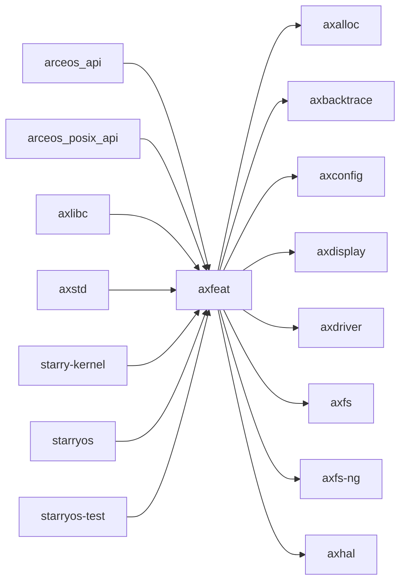

# `axfeat` 技术文档

> 路径：`os/arceos/api/axfeat`
> 类型：库 crate
> 分层：ArceOS 层 / ArceOS 公共 API/feature 聚合层
> 版本：`0.3.0-preview.3`
> 文档依据：当前仓库源码、`Cargo.toml` 与 未检测到 crate 层 README

`axfeat` 的核心定位是：Top-level feature selection for ArceOS

## 1. 架构设计分析
- 目录角色：ArceOS 公共 API/feature 聚合层
- crate 形态：库 crate
- 工作区位置：子工作区 `os/arceos`
- feature 视角：主要通过 `alloc`、`alloc-buddy`、`alloc-level-1`、`alloc-slab`、`alloc-tlsf`、`bus-mmio`、`bus-pci`、`defplat`、`display`、`dma` 等（另有 34 个 feature） 控制编译期能力装配。
- 关键数据结构：该 crate 暴露的数据结构较少，关键复杂度主要体现在模块协作、trait 约束或初始化时序。
- 设计重心：该 crate 更像 ArceOS 的 feature 总开关或能力编排层，关键在编译期开关如何决定下游模块是否被装配进最终镜像。

### 1.1 内部模块划分
- 当前 crate 未显式声明多个顶层 `mod`，复杂度更可能集中在单文件入口、宏展开或下层子 crate。

### 1.2 核心算法/机制
- 该 crate 以 Cargo feature 编排和能力选择为主，核心价值在编译期装配而非运行时复杂算法。

## 2. 核心功能说明
- 功能定位：Top-level feature selection for ArceOS
- 对外接口：该 crate 的公开符号较少，更多承担内部桥接、配置注入或编排职责。
- 典型使用场景：作为 ArceOS 的 feature 编排中心使用，用于把调度、网络、文件系统、设备等能力按需装配进最终镜像。
- 关键调用链示例：该 crate 没有单一固定的初始化链，通常由上层调用者按 feature/trait 组合接入。

## 3. 依赖关系图谱


### 3.1 直接与间接依赖
- `axalloc`
- `axbacktrace`
- `axconfig`
- `axdisplay`
- `axdriver`
- `axfs`
- `axfs-ng`
- `axhal`
- `axinput`
- `axipi`
- `axlog`
- `axnet`
- 另外还有 `4` 个同类项未在此展开

### 3.2 间接本地依赖
- `arm_pl011`
- `arm_pl031`
- `axallocator`
- `axconfig-gen`
- `axconfig-macros`
- `axcpu`
- `axdma`
- `axdriver_base`
- `axdriver_block`
- `axdriver_display`
- `axdriver_input`
- `axdriver_net`
- 另外还有 `43` 个同类项未在此展开

### 3.3 被依赖情况
- `arceos_api`
- `arceos_posix_api`
- `axlibc`
- `axstd`
- `starry-kernel`
- `starryos`
- `starryos-test`

### 3.4 间接被依赖情况
- `arceos-affinity`
- `arceos-helloworld`
- `arceos-helloworld-myplat`
- `arceos-httpclient`
- `arceos-httpserver`
- `arceos-irq`
- `arceos-memtest`
- `arceos-parallel`
- `arceos-priority`
- `arceos-shell`
- `arceos-sleep`
- `arceos-wait-queue`
- 另外还有 `2` 个同类项未在此展开

### 3.5 关键外部依赖
- 当前依赖集合几乎完全来自仓库内本地 crate。

## 4. 开发指南
### 4.1 依赖配置
```toml
[dependencies]
axfeat = { workspace = true }

# 如果在仓库外独立验证，也可以显式绑定本地路径：
# axfeat = { path = "os/arceos/api/axfeat" }
```

### 4.2 初始化流程
1. 在 `Cargo.toml` 中接入该 crate，并根据需要开启相关 feature。
2. 若 crate 暴露初始化入口，优先调用 `init`/`new`/`build`/`start` 类函数建立上下文。
3. 在最小消费者路径上验证公开 API、错误分支与资源回收行为。

### 4.3 关键 API 使用提示
- 该 crate 更偏编排、配置或内部 glue 逻辑，关键使用点通常体现在 feature、命令或入口函数上。

## 5. 测试策略
### 5.1 当前仓库内的测试形态
- 当前 crate 目录中未发现显式 `tests/`/`benches/`/`fuzz/` 入口，更可能依赖上层系统集成测试或跨 crate 回归。

### 5.2 单元测试重点
- 建议围绕 API 契约、feature 分支、资源管理和错误恢复路径编写单元测试。

### 5.3 集成测试重点
- 建议至少补一条 ArceOS 示例或 `test-suit/arceos` 路径，必要时覆盖多架构或多 feature 组合。

### 5.4 覆盖率要求
- 覆盖率建议：公开 API、初始化失败路径和主要 feature 组合必须覆盖；涉及调度/内存/设备时需补系统级验证。

## 6. 跨项目定位分析
### 6.1 ArceOS
`axfeat` 直接位于 `os/arceos/` 目录树中，是 ArceOS 工程本体的一部分，承担 ArceOS 公共 API/feature 聚合层。

### 6.2 StarryOS
`axfeat` 不在 StarryOS 目录内部，但被 `starry-kernel`、`starryos`、`starryos-test` 等 StarryOS crate 直接依赖，说明它是该系统的共享构件或底层服务。

### 6.3 Axvisor
`axfeat` 主要通过 `axvisor` 等上层 crate 被 Axvisor 间接复用，通常处于更底层的公共依赖层。
