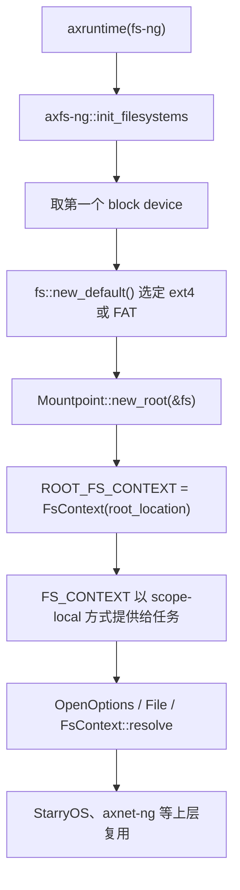
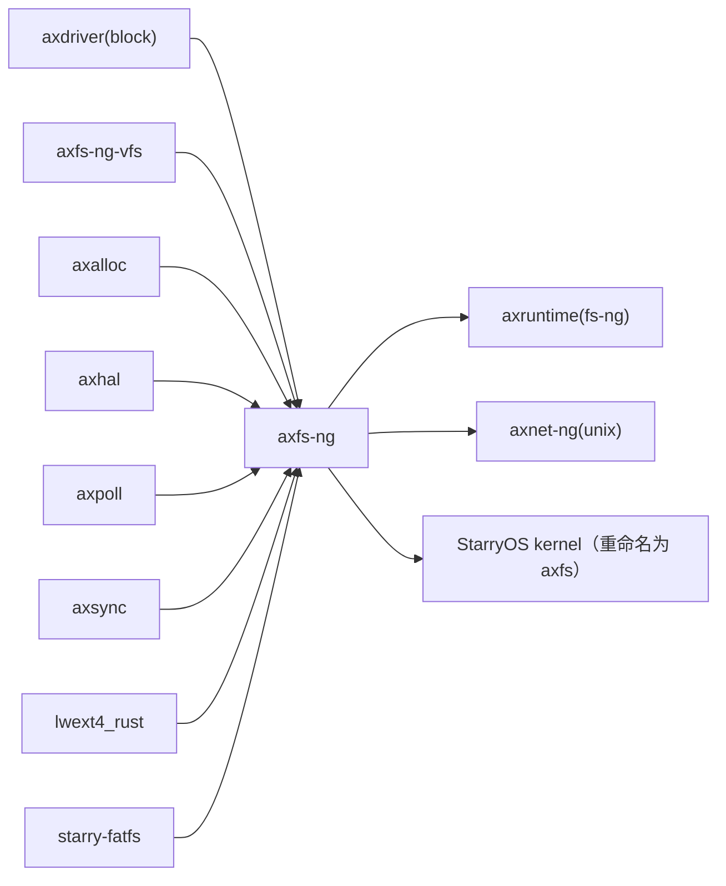

# `axfs-ng` 技术文档

> 路径：`os/arceos/modules/axfs-ng`
> 类型：库 crate
> 分层：ArceOS 层 / ArceOS 内核模块
> 版本：`0.3.0-preview.3`
> 文档依据：`Cargo.toml`、`src/lib.rs`、`src/highlevel/fs.rs`、`src/highlevel/file.rs`、`src/fs/mod.rs`、`src/fs/ext4/fs.rs`、`src/fs/ext4/inode.rs`、`src/fs/fat/fs.rs`、`src/fs/fat/dir.rs`、`src/fs/fat/file.rs`、`os/arceos/modules/axruntime/src/lib.rs`、`os/arceos/modules/axnet-ng/src/unix/mod.rs`、`os/StarryOS/kernel/Cargo.toml`、`os/StarryOS/kernel/src/pseudofs/mod.rs`

`axfs-ng` 是当前仓库中新一代文件系统模块。它把“具体磁盘文件系统后端”与“更完整的高层文件 API”打包在一起：向下基于 `axfs-ng-vfs` 对接 ext4/FAT，向上提供带任务局部文件系统上下文、符号链接解析、页缓存与直接 I/O 选择的文件接口，并且已经成为 StarryOS 现行文件系统路径的基础。

## 1. 架构设计分析
### 1.1 设计定位
`axfs-ng` 的职责可以概括为两层：

- 第一层是“根文件系统接入层”：`init_filesystems()` 从 `axdriver` 取得第一个块设备，通过 `fs::new_default()` 创建一个默认文件系统实例，再把它包成根 `Mountpoint`。
- 第二层是“高层文件语义层”：`FsContext`、`OpenOptions`、`File`、`FileBackend` 等对象在 `axfs-ng-vfs` 提供的节点模型之上，实现更接近现代内核/运行时使用习惯的路径解析与文件访问。

与 `axfs` 相比，它的边界明显更窄也更清晰：

- 不负责 GPT 扫描、`root=` 解析或多分区自动挂载。
- 不在模块内部维护“全局根目录拼装树”。
- 不内置旧式 `ramfs/devfs/proc/sys` 兼容目录生成器。
- 任务工作目录不是全局静态变量，而是 `scope-local` 的 `FS_CONTEXT`。

### 1.2 内部模块划分
- `src/lib.rs`：初始化入口。负责选择块设备、创建默认文件系统、建立根 `Mountpoint` 与 `ROOT_FS_CONTEXT`。
- `src/fs/mod.rs`：后端选择层。按 Cargo feature 决定默认使用 ext4 还是 FAT。
- `src/fs/ext4/*`：基于 `lwext4_rust` 的 ext4 适配层，支持更完整的 inode 元数据、硬链接、符号链接与 `statfs/flush`。
- `src/fs/fat/*`：基于 `starry-fatfs` 的 FAT 适配层，通过 slab 分配合成 inode 编号，补齐目录/文件节点对象。
- `src/highlevel/fs.rs`：`FsContext` 与路径解析逻辑，负责 cwd、root、符号链接跟随、`resolve`/`resolve_no_follow`、目录遍历、创建/删除/链接等。
- `src/highlevel/file.rs`：高层打开文件模型，包含 `OpenOptions`、`FileFlags`、`FileBackend`、`CachedFile`、`File` 等核心对象。

### 1.3 根文件系统初始化与高层访问主线
`axfs-ng` 的主线比 `axfs` 更短，但高层语义更强：



这里有三个实现要点：

1. `cfg_if!` 的选择顺序是 `ext4` 优先于 `fat`。如果两者同时启用，默认后端会落到 ext4。
2. 初始化阶段只建立“一个根挂载点”；后续是否在该根下再挂 `tmpfs`、`devfs`、`procfs`，由调用方通过 `Location.mount()` 决定。
3. `FS_CONTEXT` 不是普通全局静态，而是 `scope-local` 的任务局部对象，默认从 `ROOT_FS_CONTEXT` 克隆。

### 1.4 关键机制
#### 路径解析
`FsContext` 通过 `resolve_components()` 逐段处理 `.`、`..`、`/` 和普通目录项；对符号链接，会经 `try_resolve_symlink()` 最多跟随 `40` 次，超限返回 `FilesystemLoop`。

#### 打开文件与页缓存
`OpenOptions::open()` 最终会落到 `FileBackend`：

- 对普通文件，默认优先走 `CachedFile`，以 4 KiB 物理页为粒度做 LRU 页缓存。
- 如果节点类型是字符设备/FIFO/socket，或节点带有 `NodeFlags::NON_CACHEABLE`，则自动走 `Direct` 后端。
- 如果节点带有 `NodeFlags::ALWAYS_CACHE`，即使显式要求 direct，也会被重新拉回缓存路径。
- 如果节点带有 `NodeFlags::STREAM`，高层 `File` 就不会为它维护独立 seek 位置。

#### 时间戳
在启用 `times` feature 时，高层 `File` 会在 `Drop` 时把访问与修改信息写回节点元数据。这个逻辑是 `axfs-ng` 自己完成的，而不是 `axfs-ng-vfs` 自动提供的。

### 1.5 与 `axfs` 的边界澄清
- `axfs-ng` 不是“把旧 `axfs` 全部重写了一遍”。它没有旧栈的分区扫描、根目录拼装和全局 cwd 设计。
- `axfs-ng` 也不是纯粹的 VFS 抽象层；真正承载 `Filesystem`/`Mountpoint`/`Location`/`Metadata` 的是 `axfs-ng-vfs`。
- 在当前仓库里，StarryOS 的 `Cargo.toml` 直接把 `axfs-ng` 重命名为 `axfs` 使用，因此它已经不只是 ArceOS 的并行实验栈，而是有真实上层消费者的主线实现。

## 2. 核心功能说明
### 2.1 主要功能
- 从块设备创建默认根文件系统。
- 提供按任务隔离的 `FsContext`。
- 提供支持符号链接、硬链接、目录遍历、挂载点解析的路径操作。
- 提供缓存/直通两种文件后端。
- 通过 `axpoll::Pollable` 把文件节点接入事件轮询体系。

### 2.2 后端差异
#### ext4 后端
- 基于 `lwext4_rust`。
- 元数据较完整，能保留 `uid`、`gid`、`nlink`、时间戳与真实 inode 语义。
- 支持 `create`、`link`、`unlink`、`rename`、`set_symlink` 等较完整的 Unix 风格操作。
- `FilesystemOps::flush()` 会向下触发真实的 ext4 flush。

#### FAT 后端
- 基于 `starry-fatfs`。
- 通过 `Slab<()>` 分配合成 inode 编号，目录项缓存与对象生命周期由 `axfs-ng-vfs` 的 `DirEntry`/`DirNode` 承接。
- 不支持硬链接，`set_symlink()` 直接返回 `PermissionDenied`。
- 权限和所有权语义较弱，更多是把 FAT 能提供的信息适配到统一 VFS 模型里。

### 2.3 真实调用场景
- `axruntime`：启用 `fs-ng` 时负责创建根文件系统。
- `axnet-ng`：Unix domain socket 通过 `FS_CONTEXT` 和 `OpenOptions::node_type(NodeType::Socket)` 在文件系统里落 socket 节点，并把 `BindSlot` 放进 `Location::user_data()`。
- StarryOS：文件系统调用层、`tmpfs`/`devfs`/`procfs` 等 pseudofs 挂载、非阻塞文件描述符封装，都直接围绕 `axfs-ng` 的高层对象构建。

### 2.4 真实限制与注意事项
- 默认只取第一个块设备，不做复杂根盘探测。
- 根文件系统类型由编译期 feature 决定，不做运行期磁盘格式探测。
- `OpenOptions::is_valid()` 允许“纯 path handle”这类不带读写权限的打开方式，因此和旧 `axfs::fops::OpenOptions` 的合法性规则并不相同。

## 3. 依赖关系图谱


### 3.1 关键直接依赖
- `axfs-ng-vfs`：新栈的真实 VFS 核心。
- `lwext4_rust`、`starry-fatfs`：默认根文件系统的两种后端。
- `axalloc`、`axhal`：页缓存页分配、物理页地址转换、时间戳更新等高层能力所需。
- `axpoll`、`axsync`：轮询与同步原语。

### 3.2 关键直接消费者
- `axruntime`：负责初始化。
- `axnet-ng`：Unix socket 路径命名空间复用文件系统对象模型。
- StarryOS 内核：当前最重要的真实上层消费者。

### 3.3 与相邻 crate 的关系
- `axfs-ng-vfs` 在 `axfs-ng` 之下，是真正的 VFS 对象模型。
- StarryOS 的 pseudofs 并不定义在 `axfs-ng` 里面，而是在它的根挂载点之上继续挂载。
- 新栈的 ext4 不再依赖 `rsext4`，而是改走 `lwext4_rust`。

## 4. 开发指南
### 4.1 接入方式
```toml
[dependencies]
axfs-ng = { workspace = true, features = ["ext4"] }
```

如果要让 ArceOS runtime 真正初始化它，通常还需要从 `axfeat` 或上层构建 feature 侧启用 `fs-ng`。

### 4.2 改动约束
1. 修改 `src/lib.rs` 的初始化路径时，要同步考虑 `axruntime` 的 `fs-ng` feature 选择逻辑。
2. 修改 `OpenOptions`、`FileBackend` 或 `NodeFlags` 判定时，要联动检查 StarryOS pseudofs、字符设备、Unix socket 与普通文件映射。
3. 修改 `FsContext` 的路径解析时，要同时验证 `resolve`、`resolve_no_follow`、`resolve_parent`、`resolve_nonexistent` 四条路径。
4. 修改 ext4/FAT 后端时，要确认统一语义是否仍与 `axfs-ng-vfs` 对齐，特别是 inode 编号、目录项缓存、链接与元数据更新。

### 4.3 扩展建议
- 如果要增加新的磁盘文件系统后端，优先复用 `axfs-ng-vfs::FilesystemOps`，把“格式实现”和“高层文件语义”分开。
- 如果要添加新的伪文件系统，不应把它塞进 `axfs-ng::init_filesystems()`；更合理的做法是让上层在根 `Location` 上显式挂载。
- 对字符设备、socket、proc 类动态节点，应认真设置 `NodeFlags::NON_CACHEABLE`、`STREAM`、`BLOCKING`，否则页缓存和轮询行为会失真。

## 5. 测试策略
### 5.1 当前测试形态
`axfs-ng` 目录下当前没有独立的 `#[test]` 用例。它的正确性主要依赖：

- 后端库自身测试。
- `axruntime(fs-ng)` 启动路径。
- StarryOS 系统调用和 pseudofs 集成路径。

### 5.2 建议的单元测试
- `FsContext` 的相对路径、绝对路径、`..`、符号链接解析。
- `OpenOptions` 的组合合法性与 `FileFlags` 转换。
- `CachedFile` 的页缓存淘汰、append 锁、truncate 扩缩容。
- `times` feature 下的时间戳回写。

### 5.3 建议的集成测试
- ArceOS 在 `fs-ng-ext4` 和 `fs-ng-fat` 下分别启动。
- StarryOS 的 `/dev`、`/tmp`、`/proc`、`/sys` 挂载后访问正常。
- Unix domain socket 在路径命名空间下 bind/connect/accept 正常。
- 非缓存节点与流式节点在 poll/seek/读写路径上的行为符合预期。

### 5.4 高风险回归点
- `ext4` 与 `fat` 同时开启时的默认后端优先级。
- `NodeFlags` 改动导致的缓存/直通切换变化。
- 符号链接最大跟随次数与循环解析。
- StarryOS 重命名依赖名为 `axfs` 后的 API 兼容性。

## 6. 跨项目定位分析
### 6.1 ArceOS
在 ArceOS 中，`axfs-ng` 是通过 `axfeat` 的 `fs-ng*` feature 链启用的新一代文件系统模块。它和旧 `axfs` 并行存在，但承担的是更现代的高层文件语义与 VFS 对象模型接口。

### 6.2 StarryOS
在 StarryOS 中，`axfs-ng` 已经是实际主线：`kernel/Cargo.toml` 直接把它重命名为 `axfs`，文件系统调用层、pseudofs 挂载和很多设备/非阻塞 I/O 路径都围绕它构建。

### 6.3 Axvisor
当前仓库里的 `os/axvisor` 没有直接依赖 `axfs-ng`。因此在这棵代码树里，它的跨项目定位主要是“ArceOS 新栈 + StarryOS 主线文件系统模块”，而不是 Axvisor 当前运行时的公共基础层。
