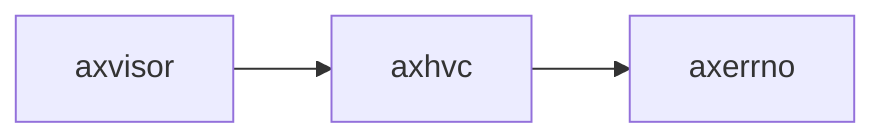

# `axhvc` 技术文档

> 路径：`components/axhvc`
> 类型：库 crate
> 分层：组件层 / 可复用基础组件
> 版本：`0.2.0`
> 文档依据：当前仓库源码、`Cargo.toml` 与 `components/axhvc/README.md`

`axhvc` 的核心定位是：AxVisor HyperCall definitions for guest-hypervisor communication

## 1. 架构设计分析
- 目录角色：可复用基础组件
- crate 形态：库 crate
- 工作区位置：根工作区
- feature 视角：该 crate 没有显式声明额外 Cargo feature，功能边界主要由模块本身决定。
- 关键数据结构：可直接观察到的关键数据结构/对象包括 `InvalidHyperCallCode`、`HyperCallCode`、`Error`、`HyperCallResult`。
- 设计重心：该 crate 通常作为多个内核子系统共享的底层构件，重点在接口边界、数据结构和被上层复用的方式。

### 1.1 内部模块划分
- 当前 crate 未显式声明多个顶层 `mod`，复杂度更可能集中在单文件入口、宏展开或下层子 crate。

### 1.2 核心算法/机制
- 实现重心偏向接口组织和模块协作。

## 2. 核心功能说明
- 功能定位：AxVisor HyperCall definitions for guest-hypervisor communication
- 对外接口：从源码可见的主要公开入口包括 `InvalidHyperCallCode`、`HyperCallCode`。
- 典型使用场景：作为共享基础设施被多个 OS 子系统复用，常见场景包括同步、内存管理、设备抽象、接口桥接和虚拟化基础能力。
- 关键调用链示例：该 crate 没有单一固定的初始化链，通常由上层调用者按 feature/trait 组合接入。

## 3. 依赖关系图谱


### 3.1 直接与间接依赖
- `axerrno`

### 3.2 间接本地依赖
- 未检测到额外的间接本地依赖，或依赖深度主要停留在第一层。

### 3.3 被依赖情况
- `axvisor`

### 3.4 间接被依赖情况
- 当前未发现更多间接消费者，或该 crate 主要作为终端入口使用。

### 3.5 关键外部依赖
- 当前依赖集合几乎完全来自仓库内本地 crate。

## 4. 开发指南
### 4.1 依赖配置
```toml
[dependencies]
axhvc = { workspace = true }

# 如果在仓库外独立验证，也可以显式绑定本地路径：
# axhvc = { path = "components/axhvc" }
```

### 4.2 初始化流程
1. 在 `Cargo.toml` 中接入该 crate，并根据需要开启相关 feature。
2. 若 crate 暴露初始化入口，优先调用 `init`/`new`/`build`/`start` 类函数建立上下文。
3. 在最小消费者路径上验证公开 API、错误分支与资源回收行为。

### 4.3 关键 API 使用提示
- 上下文/对象类型通常从 `InvalidHyperCallCode` 等结构开始。

## 5. 测试策略
### 5.1 当前仓库内的测试形态
- 当前 crate 目录中未发现显式 `tests/`/`benches/`/`fuzz/` 入口，更可能依赖上层系统集成测试或跨 crate 回归。

### 5.2 单元测试重点
- 建议用单元测试覆盖公开 API、错误分支、边界条件以及并发/内存安全相关不变量。

### 5.3 集成测试重点
- 建议补充被 ArceOS/StarryOS/Axvisor 消费时的最小集成路径，确保接口语义与 feature 组合稳定。

### 5.4 覆盖率要求
- 覆盖率建议：核心算法与错误路径达到高覆盖，关键数据结构和边界条件应实现接近完整覆盖。

## 6. 跨项目定位分析
### 6.1 ArceOS
`axhvc` 更偏 ArceOS 生态的基础设施或公共模块；当前未观察到 ArceOS 本体对其存在显式直接依赖。

### 6.2 StarryOS
当前未检测到 StarryOS 工程本体对 `axhvc` 的显式本地依赖，若参与该系统，通常经外部工具链、配置或更底层生态间接体现。

### 6.3 Axvisor
`axhvc` 不在 Axvisor 目录内部，但被 `axvisor` 等 Axvisor crate 直接依赖，说明它是该系统的共享构件或底层服务。
