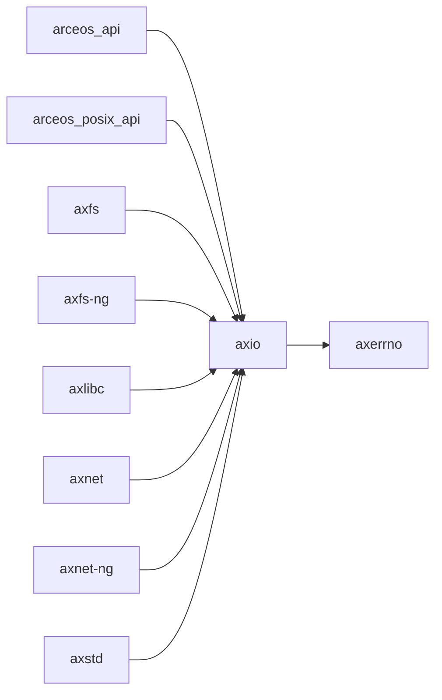

# `axio` 技术文档

> 路径：`components/axio`
> 类型：库 crate
> 分层：组件层 / 可复用基础组件
> 版本：`0.3.0-pre.1`
> 文档依据：当前仓库源码、`Cargo.toml` 与 `components/axio/README.md`

`axio` 的核心定位是：`std::io` for `no_std` environment

## 1. 架构设计分析
- 目录角色：可复用基础组件
- crate 形态：库 crate
- 工作区位置：根工作区
- feature 视角：主要通过 `alloc` 控制编译期能力装配。
- 关键数据结构：可直接观察到的关键数据结构/对象包括 `PollState`、`IntoInnerError`、`Guard`、`Split`、`Lines`、`Adapter`、`SeekFrom`、`Item`、`AxError`、`Error` 等（另有 2 个关键类型/对象）。
- 设计重心：该 crate 通常作为多个内核子系统共享的底层构件，重点在接口边界、数据结构和被上层复用的方式。

### 1.1 内部模块划分
- `buffered`：内部子模块
- `iobuf`：内部子模块
- `prelude`：The I/O Prelude. The purpose of this module is to alleviate imports of many common I/O traits by adding a glob import to the top of I/O heavy modules: ![allow(unused_imports)] use…
- `read`：内部子模块
- `seek`：内部子模块
- `utils`：通用工具函数和辅助类型
- `write`：内部子模块

### 1.2 核心算法/机制
- 该 crate 的实现主要围绕顶层模块分工展开，重点在子系统边界、trait/类型约束以及初始化流程。

## 2. 核心功能说明
- 功能定位：`std::io` for `no_std` environment
- 对外接口：从源码可见的主要公开入口包括 `error`、`into_inner`、`into_error`、`into_parts`、`default_read_exact`、`default_read_buf`、`default_read_buf_exact`、`default_read_to_end`、`PollState`、`IntoInnerError` 等（另有 9 个公开入口）。
- 典型使用场景：作为共享基础设施被多个 OS 子系统复用，常见场景包括同步、内存管理、设备抽象、接口桥接和虚拟化基础能力。
- 关键调用链示例：按当前源码布局，常见入口/初始化链可概括为 `new()` -> `new_wrapped()`。

## 3. 依赖关系图谱


### 3.1 直接与间接依赖
- `axerrno`

### 3.2 间接本地依赖
- 未检测到额外的间接本地依赖，或依赖深度主要停留在第一层。

### 3.3 被依赖情况
- `arceos_api`
- `arceos_posix_api`
- `axfs`
- `axfs-ng`
- `axlibc`
- `axnet`
- `axnet-ng`
- `axstd`
- `starry-kernel`

### 3.4 间接被依赖情况
- `arceos-affinity`
- `arceos-helloworld`
- `arceos-helloworld-myplat`
- `arceos-httpclient`
- `arceos-httpserver`
- `arceos-irq`
- `arceos-memtest`
- `arceos-parallel`
- `arceos-priority`
- `arceos-shell`
- `arceos-sleep`
- `arceos-wait-queue`
- 另外还有 `6` 个同类项未在此展开

### 3.5 关键外部依赖
- `autocfg`
- `heapless`
- `memchr`

## 4. 开发指南
### 4.1 依赖配置
```toml
[dependencies]
axio = { workspace = true }

# 如果在仓库外独立验证，也可以显式绑定本地路径：
# axio = { path = "components/axio" }
```

### 4.2 初始化流程
1. 在 `Cargo.toml` 中接入该 crate，并根据需要开启相关 feature。
2. 若 crate 暴露初始化入口，优先调用 `init`/`new`/`build`/`start` 类函数建立上下文。
3. 在最小消费者路径上验证公开 API、错误分支与资源回收行为。

### 4.3 关键 API 使用提示
- 优先关注函数入口：`error`、`into_inner`、`into_error`、`into_parts`、`default_read_exact`、`default_read_buf`、`default_read_buf_exact`、`default_read_to_end` 等（另有 3 项）。
- 上下文/对象类型通常从 `PollState`、`IntoInnerError`、`Guard`、`Split`、`Lines`、`Adapter` 等结构开始。

## 5. 测试策略
### 5.1 当前仓库内的测试形态
- 存在 crate 内集成测试：`tests/buffered.rs`、`tests/copy.rs`、`tests/cursor.rs`、`tests/impls.rs`、`tests/io.rs`、`tests/iobuf.rs` 等（另有 2 项）。

### 5.2 单元测试重点
- 建议用单元测试覆盖公开 API、错误分支、边界条件以及并发/内存安全相关不变量。

### 5.3 集成测试重点
- 建议补充被 ArceOS/StarryOS/Axvisor 消费时的最小集成路径，确保接口语义与 feature 组合稳定。

### 5.4 覆盖率要求
- 覆盖率建议：核心算法与错误路径达到高覆盖，关键数据结构和边界条件应实现接近完整覆盖。

## 6. 跨项目定位分析
### 6.1 ArceOS
`axio` 不在 ArceOS 目录内部，但被 `arceos_api`、`arceos_posix_api`、`axfs`、`axfs-ng`、`axlibc`、`axnet` 等（另有 2 项） 等 ArceOS crate 直接依赖，说明它是该系统的共享构件或底层服务。

### 6.2 StarryOS
`axio` 不在 StarryOS 目录内部，但被 `starry-kernel` 等 StarryOS crate 直接依赖，说明它是该系统的共享构件或底层服务。

### 6.3 Axvisor
`axio` 主要通过 `axvisor` 等上层 crate 被 Axvisor 间接复用，通常处于更底层的公共依赖层。
