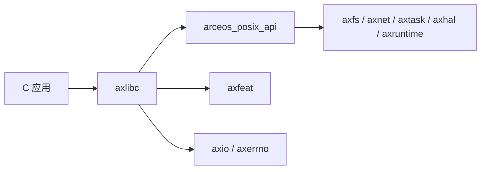

# `axlibc` 技术文档

> 路径：`os/arceos/ulib/axlibc`
> 类型：库 crate（`staticlib`）
> 分层：ArceOS 层 / C ABI 适配层
> 版本：`0.3.0-preview.3`
> 文档依据：`Cargo.toml`、`src/lib.rs`、`build.rs`、`src/utils.rs`、`src/fs.rs`、`src/net.rs`、`src/pthread.rs`、`src/malloc.rs`、`src/errno.rs`、`os/arceos/api/arceos_posix_api/src/lib.rs`

`axlibc` 是 ArceOS 面向 C 应用的静态库入口。它不是完整的 glibc/musl 替代品，也不直接实现整套 POSIX 语义；它的主要工作是把 `arceos_posix_api` 提供的 `sys_*` 风格接口封装成 `extern "C"` 符号，并按照 C 约定处理返回值、`errno`、类型绑定和少量库函数补齐。

## 1. 架构设计分析
### 1.1 设计定位
`axlibc` 的整体结构可以理解为三层：

- 最外层：`#[no_mangle] extern "C"` 导出层，向 C 代码暴露熟悉的 libc/POSIX 符号。
- 中间层：`utils::e()` 负责把 `arceos_posix_api` 的负错误码翻译成 `errno` 和 `-1`。
- 最内层：调用 `arceos_posix_api` 的 `sys_*` 实现，或提供少量必须在 libc 层完成的辅助实现。

因此，`axlibc` 的本质不是“系统调用实现层”，而是“C ABI 和错误语义适配层”。

### 1.2 模块划分与真实职责
按 `src/lib.rs`，当前模块可以分为几类：

- POSIX 包装层：`fd_ops`、`fs`、`io_mpx`、`net`、`pipe`、`pthread`、`io`、`time`、`unistd`、`resource`
- libc 辅助层：`errno`、`malloc`、`rand`、`setjmp`、`strftime`、`strtod`、`mktime`
- 类型与工具：`ctypes`、`utils`

其中最关键的几条真实路径如下：

- `fs.rs` 中的 `stat`、`rename`、`lseek` 等直接调用 `arceos_posix_api::sys_*`
- `net.rs` 中的 `socket`、`bind`、`recvfrom`、`getaddrinfo` 等直接调用 `sys_socket`、`sys_bind`、`sys_recvfrom`、`sys_getaddrinfo`
- `pthread.rs` 中的 `pthread_create`、`pthread_join` 等直接调用 `arceos_posix_api`
- `malloc.rs` 则完全不经 POSIX API，而是直接复用 Rust 全局分配器

这说明 `axlibc` 并非每个符号都只是薄薄转发，但它的主体职责仍然是 ABI 封装而不是系统能力实现。

### 1.3 错误处理与 `errno`
`axlibc` 的错误处理模型在 `src/utils.rs` 与 `src/errno.rs` 里非常明确：

- `arceos_posix_api` 返回 Linux 风格负错误码
- `utils::e(ret)` 负责把负值转换成 `errno = abs(ret)`，并向 C 调用者返回 `-1`
- 成功路径则直接返回原始值

`errno` 本身是：

- 默认全局静态变量
- 若启用 `tls` feature，则变为 `thread_local`

这正是 `axlibc` 与 `arceos_posix_api` 最核心的接口分工之一。

### 1.4 类型绑定与构建期代码生成
`axlibc` 的 `build.rs` 会用 `bindgen` 从本地 `ctypes.h` 生成 Rust 类型绑定，目前主要允许：

- `tm`
- `jmp_buf`

同时，`src/lib.rs` 中的 `ctypes` 模块还会：

- 引入 `OUT_DIR/libctypes_gen.rs`
- 再重导出 `arceos_posix_api::ctypes::*`

也就是说，`axlibc` 的类型层并不是完全自成一套，而是和 `arceos_posix_api` 共享底层 C 类型定义。

### 1.5 `malloc` 的 unikernel 特殊语义
`malloc.rs` 明确写出了一个与传统 libc 不同的设计：

- 不使用 `sys_brk`
- 直接复用 Rust 全局分配器
- C 应用与内核共享同一堆

这是典型的 unikernel 语义，而不是用户态进程 + 内核分离语义。阅读和维护 `axlibc` 时必须带着这个前提。

## 2. 核心功能说明
### 2.1 主要功能
- 导出 C ABI 符号，供 C 程序静态链接。
- 将 `sys_*` 风格接口翻译为 libc/POSIX 常见返回值约定。
- 维护 `errno` 及其查询接口。
- 提供少量必须在 libc 层完成的辅助功能，如 `malloc/free`、`strerror` 等。

### 2.2 典型调用链
典型路径可以简化为：

例如：

- `open()` -> `ax_open()` -> `sys_open()` -> `axfs`
- `socket()` -> `sys_socket()` -> `axnet`
- `pthread_create()` -> `sys_pthread_create()` -> `axtask`

### 2.3 与 `arceos_posix_api` 的职责边界
这两个 crate 经常被误认为是一回事，但真实边界是：

- `arceos_posix_api` 负责 POSIX 语义实现，例如 fd 表、socket 对象、pipe、epoll、pthread 逻辑
- `axlibc` 负责把这些语义包装成 C ABI，并处理 `errno`

换句话说，`arceos_posix_api` 解决“怎么实现”，`axlibc` 解决“怎么让 C 代码调用”。

### 2.4 feature 传播规律
`axlibc` 的 feature 既有直接透传，也有局部控制：

- `fs`、`net` 会向 `arceos_posix_api` 传播并顺带要求 `fd`
- `pipe`、`select`、`epoll` 直接对应 POSIX I/O 多路复用能力
- `alloc`、`tls` 决定堆和 `errno` 线程局部化等行为
- `fp-simd`、`irq`、`myplat`、`defplat` 则继续向 `axfeat` 传播

这再次说明它是“应用 ABI 层”，不是独立系统能力来源。

## 3. 依赖关系图谱

### 3.1 关键直接依赖
- `arceos_posix_api`：最重要的能力实现来源。
- `axfeat`：承担一部分 feature 装配传播。
- `axerrno`、`axio`：支撑错误和 I/O 适配。
- `bindgen`：用于构建期生成 C 类型绑定。

### 3.2 关键直接消费者
当前仓库中没有大量显式依赖 `axlibc` 的 Rust crate，因为它的主要消费者是需要静态链接该库的 C 应用，而不是普通 Rust 代码。

### 3.3 关键间接依赖
通过 `arceos_posix_api`，`axlibc` 会间接触达：

- `axfs`
- `axnet`
- `axtask`
- `axhal`
- `axruntime`

因此修改看似“只是 libc 包装”的代码，也可能改变实际系统行为。

## 4. 开发指南
### 4.1 什么时候应该改 `axlibc`
适合放在 `axlibc` 的改动包括：

- 新增或调整 C ABI 符号导出
- 修正 `errno`、返回值和参数 ABI 约定
- 增加纯 libc 辅助函数
- 针对 C 头文件/类型绑定做构建期调整

如果是 fd 表、socket、pipe、epoll、pthread 等“语义本体”的问题，优先看 `arceos_posix_api`。

### 4.2 修改时的关键约束
1. 先确认该行为应该属于 ABI 层还是 POSIX 语义层。
2. 任何负返回值到 `errno` 的转换，都应经过 `utils::e()` 风格路径统一处理。
3. 涉及 `errno` 时，要注意 `tls` feature 打开与关闭两种行为。
4. 涉及 `malloc/free` 时，要牢记它们共享的是 Rust 全局堆，而不是传统进程私有堆。
5. 改动构建脚本或 `ctypes` 时，要同时检查 C 头文件和 Rust 绑定是否仍一致。

### 4.3 开发建议
- 优先保持符号层薄包装，把复杂语义留在 `arceos_posix_api`。
- 若增加新 POSIX 接口，通常应先在 `arceos_posix_api` 实现 `sys_*`，再在 `axlibc` 补 ABI 导出。
- 对 `malloc`、`setjmp`、`strtod` 这类 libc 自有实现，应单独审视其与目标架构和 feature 的关系。

## 5. 测试策略
### 5.1 当前测试形态
`axlibc` 本身没有独立测试目录，当前更依赖：

- C 应用的编译与链接验证
- 通过 `arceos_posix_api` 间接验证文件、网络、线程等功能

### 5.2 建议重点验证
- `errno` 与返回值转换
- `malloc/free` 的分配与释放路径
- `fs`/`net`/`pthread` 这类对 `arceos_posix_api` 的包装正确性
- `tls` 打开时 `errno` 是否成为线程局部变量

### 5.3 集成测试建议
- 运行最小 C 应用，验证 `printf`/`read`/`write` 等基础符号
- 覆盖文件、socket、pthread 至少各一条正向路径
- 在 `select`/`epoll`/`pipe` feature 打开时做专门回归

### 5.4 高风险改动
- `errno` 处理
- `malloc/free`
- `pthread_*`
- 头文件与 bindgen 生成类型的对齐关系

## 6. 跨项目定位分析
### 6.1 ArceOS
`axlibc` 是 ArceOS C 应用的 ABI 入口。它让 C 代码能在不直接理解 ArceOS 模块布局的情况下，以较熟悉的 libc/POSIX 符号访问系统能力。

### 6.2 StarryOS
当前仓库里 StarryOS 没有把 `axlibc` 当作核心接口层使用，因此它在 StarryOS 中不是主路径组件。

### 6.3 Axvisor
当前仓库里 Axvisor 也没有把 `axlibc` 作为主要依赖。即便未来复用，它也只会是“给 C 侧组件提供 ABI”的工具层，而不是 hypervisor 功能层。
