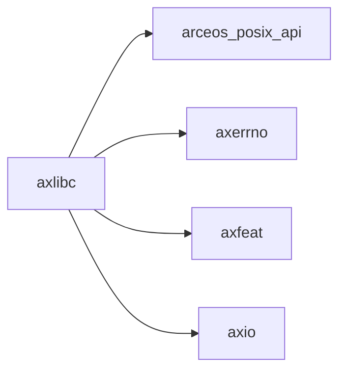

# `axlibc` 技术文档

> 路径：`os/arceos/ulib/axlibc`
> 类型：库 crate
> 分层：ArceOS 层 / ArceOS 用户库层
> 版本：`0.3.0-preview.3`
> 文档依据：当前仓库源码、`Cargo.toml` 与 未检测到 crate 层 README

`axlibc` 的核心定位是：ArceOS user program library for C apps

## 1. 架构设计分析
- 目录角色：ArceOS 用户库层
- crate 形态：库 crate
- 工作区位置：子工作区 `os/arceos`
- feature 视角：主要通过 `alloc`、`defplat`、`epoll`、`fd`、`fp-simd`、`fs`、`irq`、`multitask`、`myplat`、`net` 等（另有 4 个 feature） 控制编译期能力装配。
- 关键数据结构：可直接观察到的关键数据结构/对象包括 `MemoryControlBlock`、`CTRL_BLK_SIZE`。
- 设计重心：该 crate 位于应用接口边界，重点是把底层模块能力包装成更接近 Rust `std` / libc 语义的用户态或应用开发接口。

### 1.1 内部模块划分
- `utils`：通用工具函数和辅助类型
- `fd_ops`：内部子模块（按 feature: fd 条件启用）
- `fs`：文件系统、挂载或路径解析逻辑（按 feature: fs 条件启用）
- `io_mpx`：内部子模块（按 feature: select, epoll 条件启用）
- `malloc`：Provides the corresponding malloc(size_t) and free(size_t) when using the C user program. The normal malloc(size_t) and free(size_t) are provided by the library malloc.h, and sys_…（按 feature: alloc 条件启用）
- `net`：网络栈、socket 或协议适配（按 feature: net 条件启用）
- `pipe`：内部子模块（按 feature: pipe 条件启用）
- `pthread`：内部子模块（按 feature: multitask 条件启用）

### 1.2 核心算法/机制
- 内存分配器初始化、扩容或对象分配路径

## 2. 核心功能说明
- 功能定位：ArceOS user program library for C apps
- 对外接口：从源码可见的主要公开入口包括 `e`、`MemoryControlBlock`。
- 典型使用场景：面向应用开发者提供 `std`/libc 风格接口，是应用与底层 `arceos_api`/内核模块之间的主要边界层。
- 关键调用链示例：该 crate 没有单一固定的初始化链，常由应用按线程、时间、I/O、文件系统和网络等模块分别接入。

## 3. 依赖关系图谱


### 3.1 直接与间接依赖
- `arceos_posix_api`
- `axerrno`
- `axfeat`
- `axio`

### 3.2 间接本地依赖
- `arm_pl011`
- `arm_pl031`
- `axalloc`
- `axallocator`
- `axbacktrace`
- `axconfig`
- `axconfig-gen`
- `axconfig-macros`
- `axcpu`
- `axdisplay`
- `axdma`
- `axdriver`
- 另外还有 `57` 个同类项未在此展开

### 3.3 被依赖情况
- 当前未发现本仓库内其他 crate 对其存在直接本地依赖。

### 3.4 间接被依赖情况
- 当前未发现更多间接消费者，或该 crate 主要作为终端入口使用。

### 3.5 关键外部依赖
- `bindgen`

## 4. 开发指南
### 4.1 依赖配置
```toml
[dependencies]
axlibc = { workspace = true }

# 如果在仓库外独立验证，也可以显式绑定本地路径：
# axlibc = { path = "os/arceos/ulib/axlibc" }
```

### 4.2 初始化流程
1. 将该 crate 视作应用接口层，先明确是走 `axstd` 风格还是 libc/POSIX 风格接入。
2. 根据应用所需能力开启 feature，并确认与 `arceos_api`/系统镜像配置保持一致。
3. 通过最小应用或示例程序验证线程、时间、I/O、文件系统或网络接口的语义是否正确。

### 4.3 关键 API 使用提示
- 优先关注函数入口：`e`。
- 上下文/对象类型通常从 `MemoryControlBlock` 等结构开始。

## 5. 测试策略
### 5.1 当前仓库内的测试形态
- 当前 crate 目录中未发现显式 `tests/`/`benches/`/`fuzz/` 入口，更可能依赖上层系统集成测试或跨 crate 回归。

### 5.2 单元测试重点
- 建议覆盖 std/libc 风格包装层的语义映射、错误码转换和 feature 分支。

### 5.3 集成测试重点
- 建议用最小应用、示例程序和系统镜像运行验证线程、I/O、时间、文件系统和网络接口语义。

### 5.4 覆盖率要求
- 覆盖率建议：对外暴露的高层 API 需要稳定覆盖；与底层子系统交互的关键路径应至少有一条端到端验证。

## 6. 跨项目定位分析
### 6.1 ArceOS
`axlibc` 直接位于 `os/arceos/` 目录树中，是 ArceOS 工程本体的一部分，承担 ArceOS 用户库层。

### 6.2 StarryOS
当前未检测到 StarryOS 工程本体对 `axlibc` 的显式本地依赖，若参与该系统，通常经外部工具链、配置或更底层生态间接体现。

### 6.3 Axvisor
当前未检测到 Axvisor 工程本体对 `axlibc` 的显式本地依赖，若参与该系统，通常经外部工具链、配置或更底层生态间接体现。
