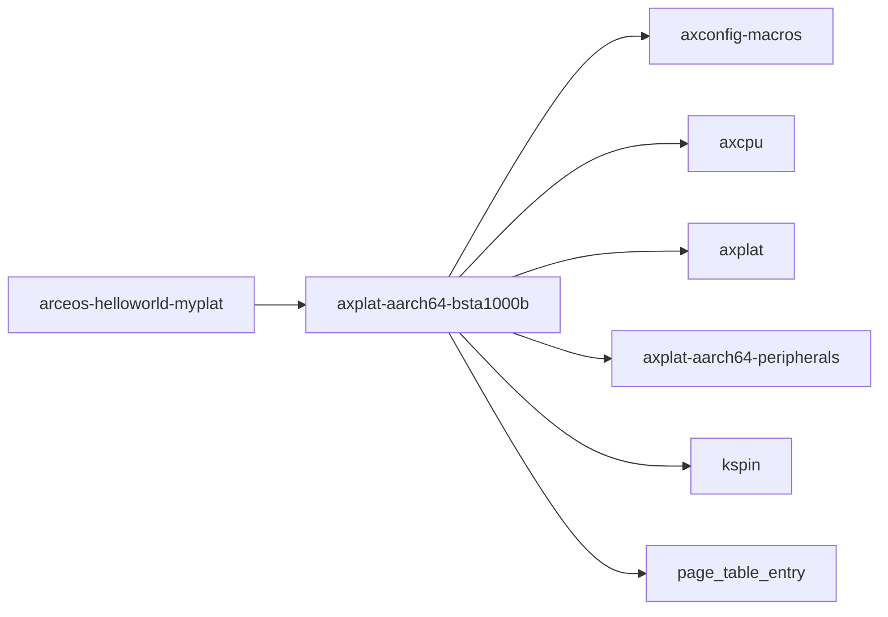

# `axplat-aarch64-bsta1000b` 技术文档

> 路径：`components/axplat_crates/platforms/axplat-aarch64-bsta1000b`
> 类型：库 crate
> 分层：组件层 / 可复用基础组件
> 版本：`0.3.1-pre.6`
> 文档依据：当前仓库源码、`Cargo.toml` 与 `components/axplat_crates/platforms/axplat-aarch64-bsta1000b/README.md`

`axplat-aarch64-bsta1000b` 的核心定位是：Implementation of `axplat` hardware abstraction layer for Black Sesame Technology A1000b SoC.

## 1. 架构设计分析
- 目录角色：可复用基础组件
- crate 形态：库 crate
- 工作区位置：子工作区 `components/axplat_crates`
- feature 视角：主要通过 `fp-simd`、`irq`、`rtc`、`smp` 控制编译期能力装配。
- 关键数据结构：可直接观察到的关键数据结构/对象包括 `ConsoleIfImpl`、`InitIfImpl`、`MemIfImpl`、`PowerImpl`、`FLAG_LE`、`FLAG_PAGE_SIZE_4K`、`FLAG_ANY_MEM`。
- 设计重心：该 crate 的重心通常是板级假设、条件编译矩阵和启动时序，阅读时应优先关注架构/平台绑定点。

### 1.1 内部模块划分
- `boot`：早期启动与引导协作逻辑
- `dw_apb_uart`：snps,dw-apb-uart serial driver
- `init`：初始化顺序与全局状态建立
- `mem`：物理/虚拟内存描述与地址转换
- `misc`：内部子模块
- `mp`：多核启动与 CPU 协同初始化（按 feature: smp 条件启用）
- `power`：内部子模块

### 1.2 核心算法/机制
- 该 crate 以平台初始化、板级寄存器配置和硬件能力接线为主，算法复杂度次于时序与寄存器语义正确性。
- 初始化顺序控制与全局状态建立

## 2. 核心功能说明
- 功能定位：Implementation of `axplat` hardware abstraction layer for Black Sesame Technology A1000b SoC.
- 对外接口：从源码可见的主要公开入口包括 `putchar`、`init_early`、`init_irq`、`reset_qspi`、`reset_cpu`、`do_reset`、`get_bootmode`、`start_secondary_cpu`、`ConsoleIfImpl`、`InitIfImpl` 等（另有 2 个公开入口）。
- 典型使用场景：承担架构/板级适配职责，为上层运行时提供启动、中断、时钟、串口、设备树和内存布局等基础能力。
- 关键调用链示例：按当前源码布局，常见入口/初始化链可概括为 `init_boot_page_table()` -> `init_early()` -> `init_irq()` -> `init_early_secondary()` -> `init_later()` -> ...。

## 3. 依赖关系图谱


### 3.1 直接与间接依赖
- `axconfig-macros`
- `axcpu`
- `axplat`
- `axplat-aarch64-peripherals`
- `kspin`
- `page_table_entry`

### 3.2 间接本地依赖
- `arm_pl011`
- `arm_pl031`
- `axbacktrace`
- `axconfig-gen`
- `axerrno`
- `axplat-macros`
- `crate_interface`
- `handler_table`
- `int_ratio`
- `kernel_guard`
- `lazyinit`
- `memory_addr`
- 另外还有 `3` 个同类项未在此展开

### 3.3 被依赖情况
- `arceos-helloworld-myplat`

### 3.4 间接被依赖情况
- 当前未发现更多间接消费者，或该 crate 主要作为终端入口使用。

### 3.5 关键外部依赖
- `dw_apb_uart`
- `log`

## 4. 开发指南
### 4.1 依赖配置
```toml
[dependencies]
axplat-aarch64-bsta1000b = { workspace = true }

# 如果在仓库外独立验证，也可以显式绑定本地路径：
# axplat-aarch64-bsta1000b = { path = "components/axplat_crates/platforms/axplat-aarch64-bsta1000b" }
```

### 4.2 初始化流程
1. 先确认目标架构、板型和外设假设，再检查 feature/cfg 是否能选中正确的平台实现。
2. 修改平台代码时优先验证启动、串口、中断、时钟和内存布局这些 bring-up 基线能力。
3. 若涉及设备树或 MMIO 基址变化，需同步验证上层驱动和运行时是否仍能正确接线。

### 4.3 关键 API 使用提示
- 优先关注函数入口：`putchar`、`init_early`、`init_irq`、`reset_qspi`、`reset_cpu`、`do_reset`、`get_bootmode`、`start_secondary_cpu`。
- 上下文/对象类型通常从 `ConsoleIfImpl`、`InitIfImpl`、`MemIfImpl`、`PowerImpl` 等结构开始。

## 5. 测试策略
### 5.1 当前仓库内的测试形态
- 当前 crate 目录中未发现显式 `tests/`/`benches/`/`fuzz/` 入口，更可能依赖上层系统集成测试或跨 crate 回归。

### 5.2 单元测试重点
- 若存在纯函数或配置辅助逻辑，可覆盖地址布局计算、设备树解析和平台参数选择分支。

### 5.3 集成测试重点
- 重点验证启动、串口、中断、时钟和内存布局等 bring-up 基线能力，必要时覆盖多板级/多架构。

### 5.4 覆盖率要求
- 覆盖率建议以平台场景覆盖为主：至少确保一条真实启动链贯通，并覆盖关键 cfg/feature 组合。

## 6. 跨项目定位分析
### 6.1 ArceOS
`axplat-aarch64-bsta1000b` 不在 ArceOS 目录内部，但被 `arceos-helloworld-myplat` 等 ArceOS crate 直接依赖，说明它是该系统的共享构件或底层服务。

### 6.2 StarryOS
当前未检测到 StarryOS 工程本体对 `axplat-aarch64-bsta1000b` 的显式本地依赖，若参与该系统，通常经外部工具链、配置或更底层生态间接体现。

### 6.3 Axvisor
当前未检测到 Axvisor 工程本体对 `axplat-aarch64-bsta1000b` 的显式本地依赖，若参与该系统，通常经外部工具链、配置或更底层生态间接体现。
