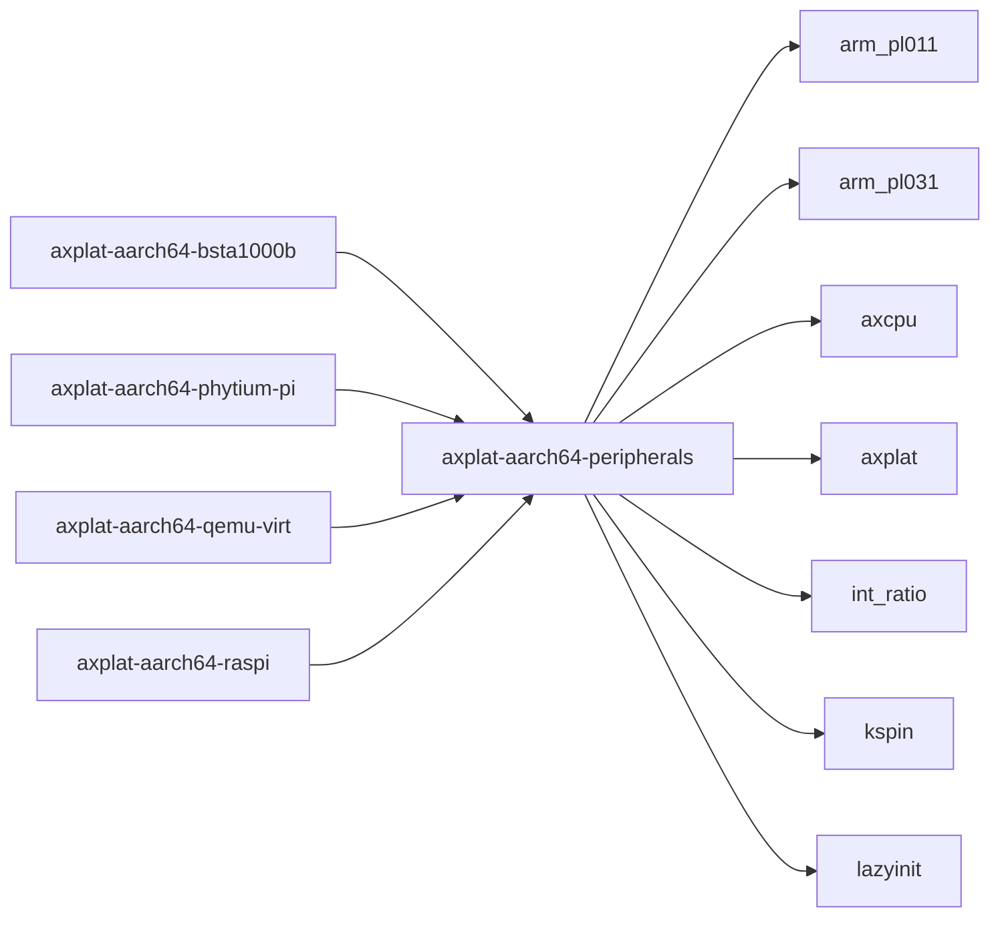

# `axplat-aarch64-peripherals` 技术文档

> 路径：`components/axplat_crates/platforms/axplat-aarch64-peripherals`
> 类型：库 crate
> 分层：组件层 / 可复用基础组件
> 版本：`0.3.1-pre.6`
> 文档依据：当前仓库源码、`Cargo.toml` 与 `components/axplat_crates/platforms/axplat-aarch64-peripherals/README.md`

`axplat-aarch64-peripherals` 的核心定位是：ARM64 common peripheral drivers with `axplat` compatibility

## 1. 架构设计分析
- 目录角色：可复用基础组件
- crate 形态：库 crate
- 工作区位置：子工作区 `components/axplat_crates`
- feature 视角：主要通过 `irq` 控制编译期能力装配。
- 关键数据结构：可直接观察到的关键数据结构/对象包括 `PsciError`、`MAX_IRQ_COUNT`、`GIC`、`TRAP_OP`。
- 设计重心：该 crate 的重心通常是板级假设、条件编译矩阵和启动时序，阅读时应优先关注架构/平台绑定点。

### 1.1 内部模块划分
- `generic_timer`：ARM Generic Timer
- `gic`：ARM Generic Interrupt Controller (GIC)（按 feature: irq 条件启用）
- `pl011`：PL011 UART
- `pl031`：PL031 Real Time Clock (RTC) driver
- `psci`：ARM Power State Coordination Interface

### 1.2 核心算法/机制
- 该 crate 以平台初始化、板级寄存器配置和硬件能力接线为主，算法复杂度次于时序与寄存器语义正确性。
- 定时器触发、截止时间维护和延迟队列
- 中断控制器状态编排与虚拟中断注入

## 2. 核心功能说明
- 功能定位：ARM64 common peripheral drivers with `axplat` compatibility
- 对外接口：从源码可见的主要公开入口包括 `current_ticks`、`ticks_to_nanos`、`nanos_to_ticks`、`set_oneshot_timer`、`init_early`、`enable_irqs`、`set_enable`、`register_handler`、`PsciError`。
- 典型使用场景：承担架构/板级适配职责，为上层运行时提供启动、中断、时钟、串口、设备树和内存布局等基础能力。
- 关键调用链示例：按当前源码布局，常见入口/初始化链可概括为 `init_early()` -> `register_handler()` -> `init_gic()` -> `init_gicc()` -> `register()`。

## 3. 依赖关系图谱


### 3.1 直接与间接依赖
- `arm_pl011`
- `arm_pl031`
- `axcpu`
- `axplat`
- `int_ratio`
- `kspin`
- `lazyinit`

### 3.2 间接本地依赖
- `axbacktrace`
- `axerrno`
- `axplat-macros`
- `crate_interface`
- `handler_table`
- `kernel_guard`
- `memory_addr`
- `page_table_entry`
- `page_table_multiarch`
- `percpu`
- `percpu_macros`

### 3.3 被依赖情况
- `axplat-aarch64-bsta1000b`
- `axplat-aarch64-phytium-pi`
- `axplat-aarch64-qemu-virt`
- `axplat-aarch64-raspi`

### 3.4 间接被依赖情况
- `arceos-affinity`
- `arceos-helloworld`
- `arceos-helloworld-myplat`
- `arceos-httpclient`
- `arceos-httpserver`
- `arceos-irq`
- `arceos-memtest`
- `arceos-parallel`
- `arceos-priority`
- `arceos-shell`
- `arceos-sleep`
- `arceos-wait-queue`
- 另外还有 `27` 个同类项未在此展开

### 3.5 关键外部依赖
- `aarch64-cpu`
- `arm-gic-driver`
- `log`
- `spin`

## 4. 开发指南
### 4.1 依赖配置
```toml
[dependencies]
axplat-aarch64-peripherals = { workspace = true }

# 如果在仓库外独立验证，也可以显式绑定本地路径：
# axplat-aarch64-peripherals = { path = "components/axplat_crates/platforms/axplat-aarch64-peripherals" }
```

### 4.2 初始化流程
1. 先确认目标架构、板型和外设假设，再检查 feature/cfg 是否能选中正确的平台实现。
2. 修改平台代码时优先验证启动、串口、中断、时钟和内存布局这些 bring-up 基线能力。
3. 若涉及设备树或 MMIO 基址变化，需同步验证上层驱动和运行时是否仍能正确接线。

### 4.3 关键 API 使用提示
- 优先关注函数入口：`current_ticks`、`ticks_to_nanos`、`nanos_to_ticks`、`set_oneshot_timer`、`init_early`、`enable_irqs`、`set_enable`、`register_handler` 等（另有 14 项）。

## 5. 测试策略
### 5.1 当前仓库内的测试形态
- 当前 crate 目录中未发现显式 `tests/`/`benches/`/`fuzz/` 入口，更可能依赖上层系统集成测试或跨 crate 回归。

### 5.2 单元测试重点
- 若存在纯函数或配置辅助逻辑，可覆盖地址布局计算、设备树解析和平台参数选择分支。

### 5.3 集成测试重点
- 重点验证启动、串口、中断、时钟和内存布局等 bring-up 基线能力，必要时覆盖多板级/多架构。

### 5.4 覆盖率要求
- 覆盖率建议以平台场景覆盖为主：至少确保一条真实启动链贯通，并覆盖关键 cfg/feature 组合。

## 6. 跨项目定位分析
### 6.1 ArceOS
`axplat-aarch64-peripherals` 主要通过 `arceos-affinity`、`arceos-helloworld`、`arceos-helloworld-myplat`、`arceos-httpclient`、`arceos-httpserver`、`arceos-irq` 等（另有 26 项） 等上层 crate 被 ArceOS 间接复用，通常处于更底层的公共依赖层。

### 6.2 StarryOS
`axplat-aarch64-peripherals` 主要通过 `starry-kernel`、`starryos`、`starryos-test` 等上层 crate 被 StarryOS 间接复用，通常处于更底层的公共依赖层。

### 6.3 Axvisor
`axplat-aarch64-peripherals` 主要通过 `axvisor` 等上层 crate 被 Axvisor 间接复用，通常处于更底层的公共依赖层。
