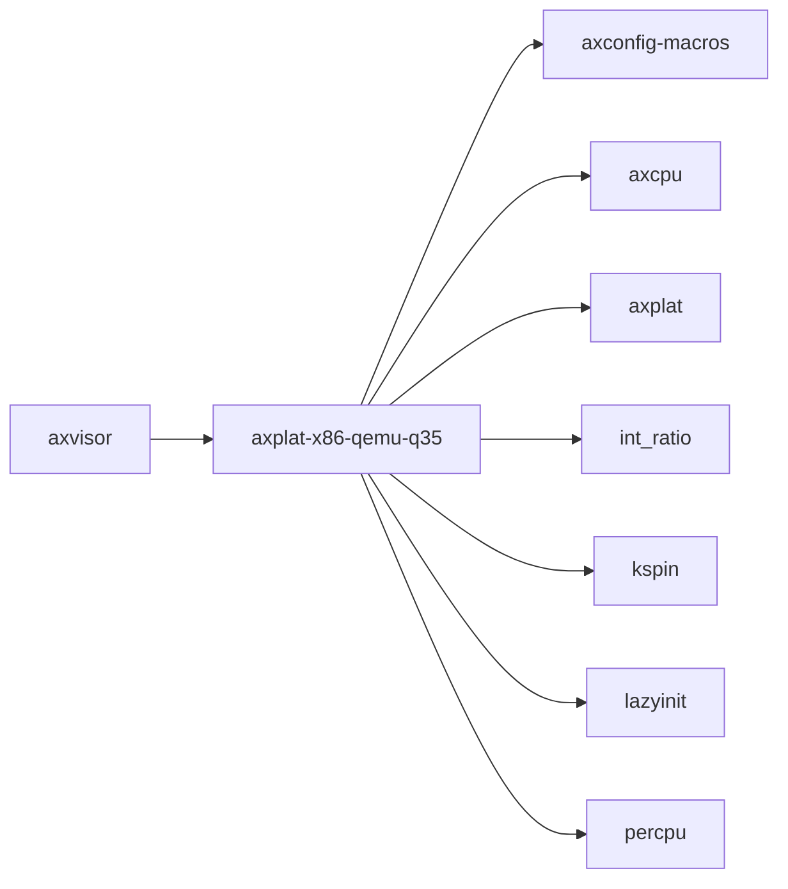

# `axplat-x86-qemu-q35` 技术文档

> 路径：`platform/x86-qemu-q35`
> 类型：库 crate
> 分层：平台层 / 平台/板级适配层
> 版本：`0.2.0`
> 文档依据：当前仓库源码、`Cargo.toml` 与 `platform/x86-qemu-q35/README.md`

`axplat-x86-qemu-q35` 的核心定位是：Hardware platform implementation for x86_64 QEMU Q35 chipset, supporting multiboot boot protocol

## 1. 架构设计分析
- 目录角色：平台/板级适配层
- crate 形态：库 crate
- 工作区位置：根工作区
- feature 视角：主要通过 `fp-simd`、`irq`、`reboot-on-system-off`、`rtc`、`smp` 控制编译期能力装配。
- 关键数据结构：可直接观察到的关键数据结构/对象包括 `IrqIfImpl`、`ConsoleIfImpl`、`InitIfImpl`、`MemIfImpl`、`PowerImpl`、`TimeIfImpl`、`PHYS_VIRT_OFFSET`、`BOOT_STACK_SIZE`、`TIMER_FREQUENCY`、`SMP`。
- 设计重心：该 crate 的重心通常是板级假设、条件编译矩阵和启动时序，阅读时应优先关注架构/平台绑定点。

### 1.1 内部模块划分
- `apic`：Advanced Programmable Interrupt Controller (APIC) support
- `boot`：Kernel booting using multiboot header
- `console`：Uart 16550 serial port
- `init`：初始化顺序与全局状态建立
- `mem`：Physical memory information
- `power`：Power management
- `time`：Time management. Currently, the TSC is used as the clock source
- `mp`：Multi-processor booting（按 feature: smp 条件启用）

### 1.2 核心算法/机制
- 该 crate 以平台初始化、板级寄存器配置和硬件能力接线为主，算法复杂度次于时序与寄存器语义正确性。
- 初始化顺序控制与全局状态建立

## 2. 核心功能说明
- 功能定位：Hardware platform implementation for x86_64 QEMU Q35 chipset, supporting multiboot boot protocol
- 对外接口：从源码可见的主要公开入口包括 `cpu_count`、`set_enable`、`local_apic`、`raw_apic_id`、`init_primary`、`init_secondary`、`putchar`、`getchar`、`IrqIfImpl`、`ConsoleIfImpl` 等（另有 4 个公开入口）。
- 典型使用场景：承担架构/板级适配职责，为上层运行时提供启动、中断、时钟、串口、设备树和内存布局等基础能力。
- 关键调用链示例：按当前源码布局，常见入口/初始化链可概括为 `init_primary()` -> `init_secondary()` -> `register()` -> `init()` -> `init_early()` -> ...。

## 3. 依赖关系图谱


### 3.1 直接与间接依赖
- `axconfig-macros`
- `axcpu`
- `axplat`
- `int_ratio`
- `kspin`
- `lazyinit`
- `percpu`

### 3.2 间接本地依赖
- `axbacktrace`
- `axconfig-gen`
- `axerrno`
- `axplat-macros`
- `crate_interface`
- `handler_table`
- `kernel_guard`
- `memory_addr`
- `page_table_entry`
- `page_table_multiarch`
- `percpu_macros`

### 3.3 被依赖情况
- `axvisor`

### 3.4 间接被依赖情况
- 当前未发现更多间接消费者，或该 crate 主要作为终端入口使用。

### 3.5 关键外部依赖
- `bitflags`
- `heapless`
- `log`
- `multiboot`
- `raw-cpuid`
- `uart_16550`
- `x2apic`
- `x86`
- `x86_64`
- `x86_rtc`

## 4. 开发指南
### 4.1 依赖配置
```toml
[dependencies]
axplat-x86-qemu-q35 = { workspace = true }

# 如果在仓库外独立验证，也可以显式绑定本地路径：
# axplat-x86-qemu-q35 = { path = "platform/x86-qemu-q35" }
```

### 4.2 初始化流程
1. 先确认目标架构、板型和外设假设，再检查 feature/cfg 是否能选中正确的平台实现。
2. 修改平台代码时优先验证启动、串口、中断、时钟和内存布局这些 bring-up 基线能力。
3. 若涉及设备树或 MMIO 基址变化，需同步验证上层驱动和运行时是否仍能正确接线。

### 4.3 关键 API 使用提示
- 优先关注函数入口：`cpu_count`、`set_enable`、`local_apic`、`raw_apic_id`、`init_primary`、`init_secondary`、`putchar`、`getchar` 等（另有 3 项）。
- 上下文/对象类型通常从 `IrqIfImpl`、`ConsoleIfImpl`、`InitIfImpl`、`MemIfImpl`、`PowerImpl`、`TimeIfImpl` 等结构开始。

## 5. 测试策略
### 5.1 当前仓库内的测试形态
- 当前 crate 目录中未发现显式 `tests/`/`benches/`/`fuzz/` 入口，更可能依赖上层系统集成测试或跨 crate 回归。

### 5.2 单元测试重点
- 若存在纯函数或配置辅助逻辑，可覆盖地址布局计算、设备树解析和平台参数选择分支。

### 5.3 集成测试重点
- 重点验证启动、串口、中断、时钟和内存布局等 bring-up 基线能力，必要时覆盖多板级/多架构。

### 5.4 覆盖率要求
- 覆盖率建议以平台场景覆盖为主：至少确保一条真实启动链贯通，并覆盖关键 cfg/feature 组合。

## 6. 跨项目定位分析
### 6.1 ArceOS
`axplat-x86-qemu-q35` 更偏 ArceOS 生态的基础设施或公共模块；当前未观察到 ArceOS 本体对其存在显式直接依赖。

### 6.2 StarryOS
当前未检测到 StarryOS 工程本体对 `axplat-x86-qemu-q35` 的显式本地依赖，若参与该系统，通常经外部工具链、配置或更底层生态间接体现。

### 6.3 Axvisor
`axplat-x86-qemu-q35` 不在 Axvisor 目录内部，但被 `axvisor` 等 Axvisor crate 直接依赖，说明它是该系统的共享构件或底层服务。
