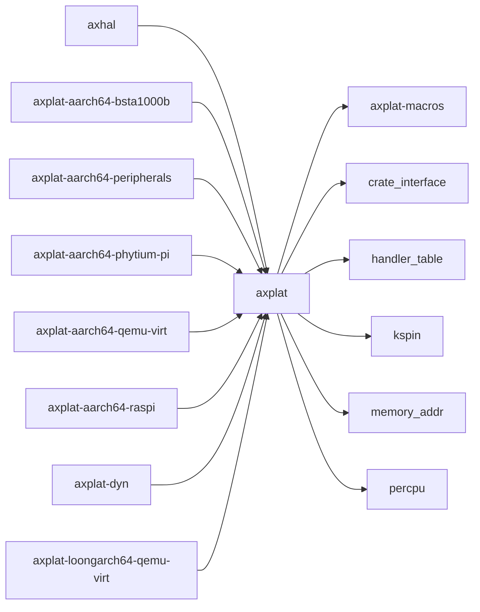

# `axplat` 技术文档

> 路径：`components/axplat_crates/axplat`
> 类型：库 crate
> 分层：组件层 / 可复用基础组件
> 版本：`0.3.1-pre.6`
> 文档依据：当前仓库源码、`Cargo.toml` 与 `components/axplat_crates/axplat/README.md`

`axplat` 的核心定位是：This crate provides a unified abstraction layer for diverse hardware platforms.

## 1. 架构设计分析
- 目录角色：可复用基础组件
- crate 形态：库 crate
- 工作区位置：子工作区 `components/axplat_crates`
- feature 视角：主要通过 `irq`、`smp` 控制编译期能力装配。
- 关键数据结构：可直接观察到的关键数据结构/对象包括 `EarlyConsole`、`MemRegionFlags`、`Aligned4K`、`PhysMemRegion`、`IpiTarget`、`IrqHandler`、`RawRange`、`Target`、`OverlapErr`、`CONSOLE_LOCK` 等（另有 2 个关键类型/对象）。
- 设计重心：该 crate 的重心通常是板级假设、条件编译矩阵和启动时序，阅读时应优先关注架构/平台绑定点。

### 1.1 内部模块划分
- `console`：Console input and output
- `init`：Platform initialization. Platform initialization interface
- `irq`：Interrupt request (IRQ) handling（按 feature: irq 条件启用）
- `mem`：Physical memory information
- `percpu`：CPU-local data structures and accessors
- `power`：Power management. Power management interface
- `time`：Time-related operations

### 1.2 核心算法/机制
- 该 crate 以平台初始化、板级寄存器配置和硬件能力接线为主，算法复杂度次于时序与寄存器语义正确性。
- 初始化顺序控制与全局状态建立
- 中断注册、派发和屏蔽控制

## 2. 核心功能说明
- 功能定位：This crate provides a unified abstraction layer for diverse hardware platforms.
- 对外接口：从源码可见的主要公开入口包括 `call_main`、`call_secondary_main`、`__simple_print`、`new`、`new_ram`、`new_mmio`、`new_reserved`、`total_ram_size`、`EarlyConsole`、`MemRegionFlags` 等（另有 7 个公开入口）。
- 典型使用场景：承担架构/板级适配职责，为上层运行时提供启动、中断、时钟、串口、设备树和内存布局等基础能力。
- 关键调用链示例：按当前源码布局，常见入口/初始化链可概括为 `init_early()` -> `init_early_secondary()` -> `init_later()` -> `init_later_secondary()` -> `register()` -> ...。

## 3. 依赖关系图谱


### 3.1 直接与间接依赖
- `axplat-macros`
- `crate_interface`
- `handler_table`
- `kspin`
- `memory_addr`
- `percpu`

### 3.2 间接本地依赖
- `kernel_guard`
- `percpu_macros`

### 3.3 被依赖情况
- `axhal`
- `axplat-aarch64-bsta1000b`
- `axplat-aarch64-peripherals`
- `axplat-aarch64-phytium-pi`
- `axplat-aarch64-qemu-virt`
- `axplat-aarch64-raspi`
- `axplat-dyn`
- `axplat-loongarch64-qemu-virt`
- `axplat-riscv64-qemu-virt`
- `axplat-x86-pc`
- `axplat-x86-qemu-q35`
- `axruntime`
- 另外还有 `3` 个同类项未在此展开

### 3.4 间接被依赖情况
- `arceos-affinity`
- `arceos-helloworld`
- `arceos-helloworld-myplat`
- `arceos-httpclient`
- `arceos-httpserver`
- `arceos-irq`
- `arceos-memtest`
- `arceos-parallel`
- `arceos-priority`
- `arceos-shell`
- `arceos-sleep`
- `arceos-wait-queue`
- 另外还有 `22` 个同类项未在此展开

### 3.5 关键外部依赖
- `bitflags`
- `const-str`

## 4. 开发指南
### 4.1 依赖配置
```toml
[dependencies]
axplat = { workspace = true }

# 如果在仓库外独立验证，也可以显式绑定本地路径：
# axplat = { path = "components/axplat_crates/axplat" }
```

### 4.2 初始化流程
1. 先确认目标架构、板型和外设假设，再检查 feature/cfg 是否能选中正确的平台实现。
2. 修改平台代码时优先验证启动、串口、中断、时钟和内存布局这些 bring-up 基线能力。
3. 若涉及设备树或 MMIO 基址变化，需同步验证上层驱动和运行时是否仍能正确接线。

### 4.3 关键 API 使用提示
- 优先关注函数入口：`call_main`、`call_secondary_main`、`__simple_print`、`new`、`new_ram`、`new_mmio`、`new_reserved`、`total_ram_size` 等（另有 12 项）。
- 上下文/对象类型通常从 `EarlyConsole`、`MemRegionFlags`、`Aligned4K`、`PhysMemRegion` 等结构开始。

## 5. 测试策略
### 5.1 当前仓库内的测试形态
- 存在单元测试/`#[cfg(test)]` 场景：`src/mem.rs`。

### 5.2 单元测试重点
- 若存在纯函数或配置辅助逻辑，可覆盖地址布局计算、设备树解析和平台参数选择分支。

### 5.3 集成测试重点
- 重点验证启动、串口、中断、时钟和内存布局等 bring-up 基线能力，必要时覆盖多板级/多架构。

### 5.4 覆盖率要求
- 覆盖率建议以平台场景覆盖为主：至少确保一条真实启动链贯通，并覆盖关键 cfg/feature 组合。

## 6. 跨项目定位分析
### 6.1 ArceOS
`axplat` 不在 ArceOS 目录内部，但被 `axhal`、`axruntime` 等 ArceOS crate 直接依赖，说明它是该系统的共享构件或底层服务。

### 6.2 StarryOS
`axplat` 主要通过 `starry-kernel`、`starryos`、`starryos-test` 等上层 crate 被 StarryOS 间接复用，通常处于更底层的公共依赖层。

### 6.3 Axvisor
`axplat` 主要通过 `axvisor` 等上层 crate 被 Axvisor 间接复用，通常处于更底层的公共依赖层。
