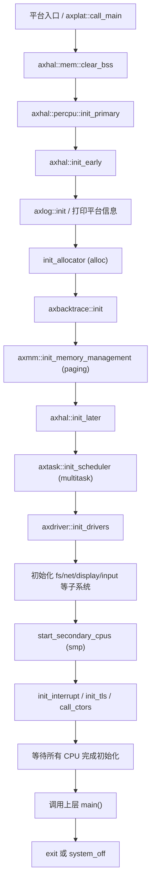
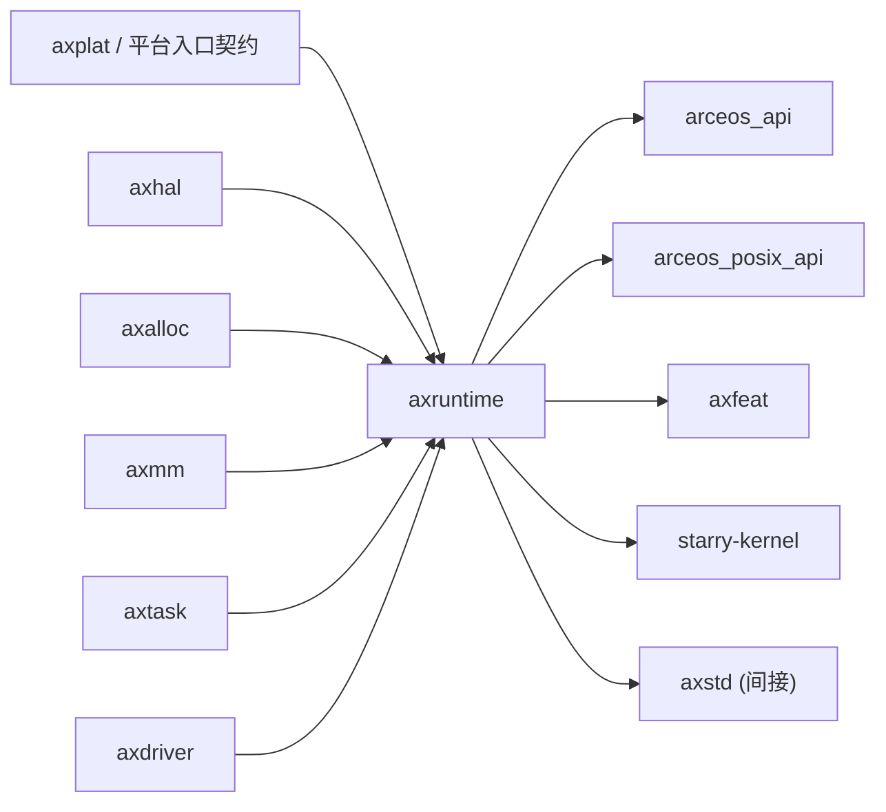

# `axruntime` 技术文档

> 路径：`os/arceos/modules/axruntime`
> 类型：库 crate
> 分层：ArceOS 层 / ArceOS 内核模块
> 版本：`0.3.0-preview.3`
> 文档依据：`Cargo.toml`、`src/lib.rs`、`src/mp.rs`、`src/lang_items.rs`、`src/klib.rs`

`axruntime` 是 ArceOS 的运行时编排核心。它不负责具体的硬件抽象、页表实现、调度算法或驱动协议，而是把 `axplat` 提供的平台入口、`axhal`/`axmm`/`axtask`/`axdriver` 等子系统初始化串成一条严格有序的 bring-up 主线，并在最终调用应用或内核镜像提供的 `main()` 之前建立完整的运行环境。

## 1. 架构设计分析
### 1.1 设计定位
`axruntime` 处在“平台入口”和“上层系统主体”之间：

- 向下，它通过 `#[axplat::main]` 和 `#[axplat::secondary_main]` 契约接住平台引导代码导入的主核/次核入口。
- 横向，它统一编排 `axhal`、`axalloc`、`axmm`、`axtask`、`axdriver`、`axfs*`、`axnet*`、`axdisplay`、`axinput` 等模块的初始化顺序。
- 向上，它把复杂的系统 bring-up 收敛为“只需提供 `main()`”这一入口模型，使应用、StarryOS 启动包和 Axvisor 主程序都能复用同一套预 `main` 运行时。

因此，`axruntime` 的核心价值不是某个单独算法，而是“初始化时序正确”“feature 组合一致”“主核与次核行为可收敛”这三件事。

### 1.2 内部模块划分
- `src/lib.rs`：运行时主流程所在文件。定义 `rust_main()`、日志后端 `LogIfImpl`、分配器/中断/TLS 初始化辅助函数，以及 `main()` 返回后的退出路径。
- `src/lang_items.rs`：裸机 panic 处理路径。负责打印 `PanicInfo`、可选 backtrace，并在 panic 后关机。
- `src/mp.rs`：SMP 扩展路径。包含次核启动栈、`start_secondary_cpus()` 和 `rust_main_secondary()`。
- `src/klib.rs`：`axklib::Klib` 的平台实现层，把 `iomap`、busy wait、IRQ 屏蔽等需求转发到 `axmm` 或 `axhal`。

### 1.3 关键数据结构与全局对象
- `INITED_CPUS`：记录已经完成初始化的 CPU 数量。主核在调用 `main()` 前会等待它达到 `axhal::cpu_num()`。
- `LogIfImpl`：`axlog::LogIf` 的实现，负责把日志写到 `axhal::console`，并在条件允许时返回当前 CPU ID 与任务 ID。
- `SECONDARY_BOOT_STACK`：从核启动使用的静态栈数组，仅在 `smp` 打开时进入构建。
- `ENTERED_CPUS`：从核 bring-up 同步计数器，用于确保从核启动过程可观测。
- `NEXT_DEADLINE`：在 `irq` 路径中维护下一次 one-shot timer 触发时间，配合 tick 和调度器使用。
- `KlibImpl`：`axklib` 的平台 glue，实现 `mem_iomap`、`time_busy_wait` 和可选 IRQ 屏蔽接口。

### 1.4 主核初始化主线
主核路径几乎全部集中在 `rust_main(cpu_id, arg)` 中，其顺序是 `axruntime` 最重要的设计约束：



按源码可进一步细化为：

1. 先清 `.bss`，建立 BSP 的 per-CPU 状态，再做 `axhal::init_early()`。
2. 初始化日志系统，并输出平台、内存区段、logo 和可选 RTC 时间信息。
3. 若启用 `alloc`，通过 `init_allocator()` 把 `axhal::mem::memory_regions()` 中的可用区域接入全局分配器。
4. 若启用 `paging`，调用 `axmm::init_memory_management()` 安装内核页表。
5. 完成 `axhal::init_later()` 后，开始初始化调度器、驱动聚合层以及依赖驱动的文件系统、网络、显示、输入等子系统。
6. 若启用 `smp`，启动次核；若启用 `irq`，注册定时器和可选 IPI 中断；若启用 `tls` 且未启用 `multitask`，建立 TLS。
7. 调用 `ctor_bare::call_ctors()` 后，主核增加 `INITED_CPUS` 计数，并等待所有核都达到初始化完成状态。
8. 最终执行上层 `main()`；若启用 `multitask`，返回后走 `axtask::exit(0)`，否则直接 `system_off()`。

### 1.5 次核初始化与 SMP 行为
`mp.rs` 中的 `rust_main_secondary()` 是次核 bring-up 的完整路径。与主核相比，它不会再次初始化全局分配器或全局驱动，而是重点完成：

- `axhal::percpu::init_secondary()`、`axhal::init_early_secondary()`、`axhal::init_later_secondary()`。
- 若启用 `paging`，安装与主核共享的内核页表。
- 若启用 `multitask`，执行 `axtask::init_scheduler_secondary()` 并最终进入 `axtask::run_idle()`。
- 若未启用 `multitask`，则在完成 IRQ/TLS 等初始化后进入 `wait_for_irqs()` 死循环。

这说明 `axruntime` 的 SMP 设计不是“每核重复完整 bring-up”，而是“主核完成全局资源初始化，从核补足本地运行时上下文”。

### 1.6 Feature 对实现路径的影响
- `alloc`：打开 `axalloc`，在运行时中引入全局堆初始化。
- `paging`：打开 `axmm` 和 `klib` 模块，使运行时在调用 `main()` 前安装内核页表。
- `hv`：在分配器初始化路径中为 `axalloc` 注入地址翻译器，服务虚拟化场景。
- `multitask`：引入 `axtask`，使 `main()` 返回路径变为 `axtask::exit`，并启用定时器 tick 到调度器的协作。
- `irq`：启用定时器 IRQ、可选 IPI 注册、周期 tick 以及中断开放。
- `ipi`：在 `irq` 基础上进一步接入跨核中断初始化。
- `smp`：编译 `mp.rs`，并增加次核 bring-up 主线。
- `tls`：在无多任务场景下为主线程或次核建立 TLS 区域。
- `plat-dyn`：影响 `.bss` 清零和动态平台装配方式，是 bring-up 行为的高风险 feature。

## 2. 核心功能说明
### 2.1 主要功能
- 提供主核入口 `rust_main()`，承接平台入口与上层 `main()` 之间的全部初始化编排。
- 提供次核入口 `rust_main_secondary()` 与 `start_secondary_cpus()`，完成 SMP bring-up。
- 为 `axlog` 提供运行时日志后端。
- 为 `axklib` 提供平台 glue，使更高层可通过统一接口访问 `iomap`、busy wait 和 IRQ 屏蔽。
- 提供裸机 panic 处理与关机路径。

### 2.2 关键 API 与典型使用场景
- `rust_main()`：只应由平台入口链调用，是整个 ArceOS 运行时的唯一主入口。
- `start_secondary_cpus()`：由主核在全局资源初始化完成后调用，启动所有 AP。
- `rust_main_secondary()`：只应由次核入口桥接代码调用，不应被普通模块直接触发。
- `KlibImpl`：供 `axklib` 和依赖 `axklib` 的代码复用底层平台操作。

更重要的是，普通上层 crate 通常**不会主动直接调用 `axruntime`**。对应用来说，接入方式往往只是定义 `main()`；对 StarryOS 和 Axvisor 来说，则是把系统主体挂到同一套运行时 bring-up 链上。

### 2.3 典型调用方式
对于 ArceOS 应用或镜像入口，最常见的“使用 `axruntime`”方式其实是隐式的：

```rust
#[no_mangle]
fn main() {
    // axruntime 已在到达这里之前完成平台、内存、驱动和调度初始化。
}
```

## 3. 依赖关系图谱


### 3.1 关键直接依赖
- `axhal`：提供硬件抽象、per-CPU、时间、中断、电源与平台初始化入口。
- `axalloc`：在 `alloc` feature 下负责全局堆。
- `axmm`：在 `paging` feature 下负责安装内核页表。
- `axtask`：在 `multitask` feature 下负责调度器与 tick 路径。
- `axdriver` 及其上层消费者：为文件系统、网络、显示、输入等子系统提供设备。
- `axlog`、`axbacktrace`、`ctor_bare`、`axklib`：分别服务日志、panic/backtrace、构造器与平台辅助接口。

### 3.2 关键直接消费者
- `arceos_api` / `axfeat`：通过 feature 聚合把运行时纳入最终镜像。
- `arceos_posix_api`：作为 POSIX 兼容 API 层，与 `axruntime` 共享 bring-up 结果。
- `starry-kernel`：显式依赖 `axruntime`，把 Linux 兼容内核主体挂到同一运行时模型上。
- `axstd`：通常不是直接依赖 `axruntime`，但会通过 `arceos_api` / `axfeat` 间接复用。

### 3.3 间接消费者
- `os/arceos/examples/*` 与 `test-suit/arceos/*` 中的大量应用、测试与样例。
- `starryos` 启动包与 `starryos-test`。
- `axvisor` 主程序，经由 `axstd` / `arceos_api` 共享同一套运行时栈。

## 4. 开发指南
### 4.1 依赖配置
```toml
[dependencies]
axruntime = { workspace = true }
```

但对绝大多数 ArceOS 应用来说，更常见的做法是依赖 `axstd`、`arceos_api` 或 `axfeat`，而不是直接把 `axruntime` 当普通库调用。

### 4.2 初始化与改动约束
1. 修改 `rust_main()` 时，应把它视为“系统启动级变更”，不能只从单模块角度评估影响。
2. 所有新增初始化步骤都必须明确放在 `axhal::init_early()` 之前、`axhal::init_later()` 之后，还是 `main()` 前最后阶段。
3. 涉及 `alloc`、`paging`、`irq`、`multitask`、`smp` 的改动，必须同时检查主核路径和次核路径是否保持一致。
4. 若引入新的 feature 门控逻辑，需要同步确认 `axfeat`、`arceos_api` 与上层入口包的 feature 传播是否一致。

### 4.3 关键接入示例
- 若要增加新的系统子系统初始化，推荐把它放在驱动聚合和中断初始化之间或之后，并明确它依赖哪些 feature。
- 若要接入新的 per-CPU bring-up 逻辑，应同时修改 `rust_main_secondary()` 和 `start_secondary_cpus()` 对应的同步点。
- 若要扩展平台辅助能力，可在 `klib.rs` 中为 `axklib::Klib` 增加桥接实现，但应避免让它承担上层策略逻辑。

## 5. 测试策略
### 5.1 当前测试形态
`axruntime` 本身几乎没有独立的 crate 内单元测试，验证重点天然落在系统级集成路径上。

### 5.2 单元测试重点
- `init_allocator()` 的内存区筛选与地址翻译逻辑。
- `LogIfImpl` 在初始化前后对 CPU ID / task ID 的判定。
- `plat-dyn`、`irq`、`tls`、`multitask` 等 feature 门控路径的编译正确性。

### 5.3 集成测试重点
- ArceOS 最小样例能否顺利进入 `main()`。
- `paging` + `multitask` + `irq` 组合下，主核和次核是否都能达到 `INITED_CPUS` 屏障。
- panic 路径是否能打印 backtrace 并关机。
- StarryOS 与 Axvisor 的入口包是否仍能复用同一 bring-up 主线。

### 5.4 覆盖率要求
- 对 `axruntime`，比“行覆盖率”更重要的是“启动链覆盖率”。
- 任何改变初始化顺序的改动，都至少应覆盖一条 ArceOS 正常启动路径和一条启用相关 feature 的系统级路径。
- 涉及 SMP、IRQ、paging、HV 的改动，应视为高风险变更，必须做多 feature 组合验证。

## 6. 跨项目定位分析
### 6.1 ArceOS
`axruntime` 是 ArceOS 的运行时总控。它把 `axhal`、`axalloc`、`axmm`、`axtask`、`axdriver` 等模块组织成一条统一 bring-up 主线，使应用只需提供 `main()` 即可运行。

### 6.2 StarryOS
StarryOS 并不重新实现一套裸机运行时，而是让 `starry-kernel` 和 `starryos` 复用 `axruntime` 的入口模型。因此在 StarryOS 中，`axruntime` 承担的是“Linux 兼容内核的底层 bring-up 框架”。

### 6.3 Axvisor
Axvisor 不直接把 `axruntime` 当作 hypervisor 专用 API 使用，但其主程序依然通过 `axstd` / `arceos_api` 共享相同的运行时栈。因此 `axruntime` 在 Axvisor 中扮演的是“宿主内核启动与环境建立的公共基座”，而不是单独的虚拟化策略层。
