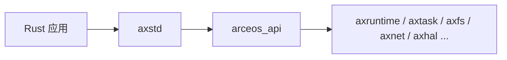
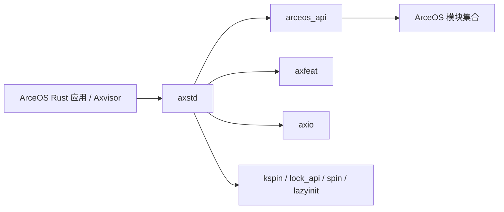

# `axstd` 技术文档

> 路径：`os/arceos/ulib/axstd`
> 类型：库 crate
> 分层：ArceOS 层 / Rust 应用标准库适配层
> 版本：`0.3.0-preview.3`
> 文档依据：`Cargo.toml`、`src/lib.rs`、`src/thread/mod.rs`、`src/thread/multi.rs`、`src/process.rs`、`src/fs/file.rs`、`src/net/tcp.rs`、`src/sync/mod.rs`、`os/arceos/api/arceos_api/src/lib.rs`、`os/axvisor/Cargo.toml`

`axstd` 是 ArceOS 面向 Rust 应用的 mini-std。它试图提供接近 Rust `std` 的开发体验，但实现路径不是“走 libc + 系统调用”，而是直接把 API 落到 `arceos_api` 及其背后的 ArceOS 模块上。因此它更像“Rust 侧的系统库适配层”，而不是 POSIX 兼容层。

## 1. 架构设计分析
### 1.1 设计定位
`axstd` 的核心定位可以概括为三句话：

- 对应用开发者，它提供熟悉的 `std` 风格模块树，例如 `io`、`thread`、`time`、`fs`、`net`。
- 对下层实现，它主要依赖 `arceos_api`，把 Rust 语义映射到 ArceOS 稳定 API。
- 对构建装配，它通过与 `axfeat` 同步的 feature 集，决定最终镜像编入哪些底层能力。

这使得 `axstd` 与 `axlibc`、`arceos_posix_api` 形成清晰分工：

- `axstd`：面向 Rust 代码的高层库接口
- `arceos_posix_api`：面向 POSIX 语义的 `sys_*` 实现层
- `axlibc`：面向 C ABI 的符号导出层

### 1.2 模块组织与真实落点
按 `src/lib.rs` 与子模块源码，`axstd` 的模块层次非常明确：

- 基础模块：`env`、`io`、`os`、`process`、`sync`、`thread`、`time`
- 可选模块：`fs`、`net`
- 辅助内容：`macros` 提供 `print!`/`println!` 等标准输出宏

每个模块背后都有比较直接的实现落点：

- `io::stdio` 直接调用 `arceos_api::stdio::ax_console_read_bytes` 和 `ax_console_write_bytes`
- `thread` 直接调用 `arceos_api::task::*`
- `time::Instant` 直接基于 `arceos_api::time::ax_wall_time`
- `fs::File`/`OpenOptions` 直接包裹 `arceos_api::fs::*`
- `net::TcpStream`/`TcpListener` 直接包裹 `arceos_api::net::*`

这说明 `axstd` 并没有实现一套独立的文件系统或网络栈，它主要承担“Rust 风格接口包装”。

### 1.3 线程、同步与 unikernel 语义
`axstd` 不是通用桌面/服务器 `std` 的一比一复刻，因为底层是 unikernel：

- `process::exit()` 实际调用 `arceos_api::sys::ax_terminate()`，含义是关机或终止整个系统，而不是退出单个进程。
- `thread::yield_now()`、`sleep()`、`exit()` 都直接走任务 API；未启用 `multitask` 时，`yield_now()` 与 `sleep()` 会退化到等待中断或 busy-wait 路径。
- `sync::Mutex` 在 `multitask` 打开时是基于 `AxRawMutex` 的睡眠锁；未打开时直接退化为 `kspin` 自旋锁。

这些行为都来自真实源码，而不是文档层的抽象承诺。

### 1.4 feature 传播关系
`axstd` 的 feature 基本镜像 `axfeat`，但会同时把一部分能力转发到 `arceos_api`：

- `alloc` 同时打开 `arceos_api/alloc`、`axfeat/alloc`、`axio/alloc`
- `multitask` 同时打开 `arceos_api/multitask` 和 `axfeat/multitask`
- `fs`、`net`、`display` 等上层能力同时驱动 `arceos_api` 与 `axfeat`

这意味着 `axstd` 既是 Rust 应用 API 层，也是 feature 装配入口。

## 2. 核心功能说明
### 2.1 主要功能
- 提供接近 Rust `std` 的应用开发接口。
- 把 ArceOS 稳定 API 包装成更自然的 Rust 类型和方法。
- 统一应用侧 feature 入口，避免应用直接依赖底层模块细节。
- 在必要时通过 `os::arceos` 暴露 escape hatch，让应用能下探到 `arceos_api` 或模块重导出。

### 2.2 典型调用链
`axstd` 的真实调用链大致如下：

例如：

- `thread::spawn()` 最终调用 `arceos_api::task::ax_spawn()`，默认栈大小来自 `arceos_api::config::TASK_STACK_SIZE`
- `fs::File::open()` 最终调用 `arceos_api::fs::ax_open_file()`
- `net::TcpStream::connect()` 最终调用 `arceos_api::net::ax_tcp_socket()` 和 `ax_tcp_connect()`

### 2.3 `os::arceos` 逃生口
`axstd::os::arceos` 会重新导出：

- `arceos_api` 作为 `api`
- `arceos_api::modules`

这不是 `axstd` 的主路径，而是为那些 std 风格 API 尚未覆盖的场景保留的下潜接口。正常开发应优先使用 `axstd` 自己的包装层。

### 2.4 与 `axlibc` / `arceos_posix_api` 的边界
这三个 crate 最容易被混淆，但职责其实很清楚：

- `axstd`：给 Rust 代码用，接口尽量像 `std`
- `arceos_posix_api`：给 POSIX 语义实现用，接口是 `sys_*`
- `axlibc`：给 C 代码和链接器用，接口是 `extern "C"` 符号

`axstd` 不设置 `errno`，也不导出 C ABI；它直接面向 Rust 调用者。

## 3. 依赖关系图谱

### 3.1 关键直接依赖
- `arceos_api`：最重要的实现落点，几乎所有高层能力都经由它下沉。
- `axfeat`：负责把应用 feature 传播到内核模块。
- `axio`：提供 I/O trait 基础。
- `kspin`、`lock_api`、`spin`、`lazyinit`：支撑同步与少量基础设施。

### 3.2 关键直接消费者
- `os/arceos/examples/*` 下的 Rust 样例。
- `test-suit/arceos/*` 下的大量集成测试。
- `os/axvisor` 的裸机侧主程序，当前直接依赖 `axstd` 提供运行时基础库。

### 3.3 非目标消费者
当前仓库中 StarryOS 并不把 `axstd` 当作主要开发接口；它更直接地依赖 ArceOS 模块和自身内核层逻辑。

## 4. 开发指南
### 4.1 什么时候应优先改 `axstd`
当你要给 Rust 应用暴露一个更自然的高层接口时，优先考虑在 `axstd` 增加包装层。例如：

- 为现有 `arceos_api` 能力补标准库风格的 Rust 类型封装
- 增加符合 Rust 习惯的错误返回、Builder 或 trait 实现
- 为已有文件、网络、线程能力补齐常用便利方法

如果底层还没有稳定能力入口，应先考虑补 `arceos_api`，再由 `axstd` 做包装。

### 4.2 修改时的关键约束
1. 保持 API 风格尽量贴近 Rust `std`，但不要伪造底层并不存在的语义。
2. 涉及 `process` 模块时，要明确 unikernel 没有真实进程隔离。
3. 涉及 `sync` 和 `thread` 时，要同时考虑 `multitask` 打开与关闭两条路径。
4. 新增 feature 时，通常需要同步确认 `axfeat` 与 `arceos_api` 的传播关系。
5. 若通过 `os::arceos::modules` 下探到底层模块，应把它视为例外，而不是常规设计。

### 4.3 开发建议
- 先设计稳定的 `arceos_api` 接口，再在 `axstd` 上层做 Rust 化包装。
- 优先提供类型安全的封装，而不是简单重导出裸句柄。
- 对 `fs`、`net`、`thread` 这类高层模块，优先补齐常见 trait 实现，如 `Read`、`Write`、`Seek`。

## 5. 测试策略
### 5.1 当前测试形态
`axstd` 本身没有独立 `tests/` 目录，当前验证主要依赖真实应用和测试套件：

- `os/arceos/examples/*`
- `test-suit/arceos/*`
- 复用 `axstd` 的 Axvisor 构建路径

### 5.2 建议重点覆盖
- `thread`：单任务与多任务两条路径
- `sync::Mutex`：`multitask` 打开/关闭的实现切换
- `process::exit()`：确认其系统级终止语义
- `fs`、`net`：至少各有一条端到端样例覆盖

### 5.3 集成测试建议
- `helloworld`：验证最小 `axstd` 路径
- `shell`：验证 `fs`
- `httpclient` / `httpserver`：验证 `net`
- `test-suit/arceos/task/*`：验证线程、睡眠、亲和性等行为

### 5.4 高风险改动
- 改动 `axstd` 与 `arceos_api` 的语义映射关系
- 改动 `process`、`thread`、`sync` 的 unikernel 约束
- 改动 feature 传播，导致上层应用 feature 与底层模块装配失配

## 6. 跨项目定位分析
### 6.1 ArceOS
`axstd` 是 ArceOS Rust 应用的主要开发入口。它把底层模块与稳定 API 收敛成更接近 Rust `std` 的接口，让应用通常无需直接触碰 `axruntime`、`axhal`、`axtask` 等模块。

### 6.2 StarryOS
当前仓库里 StarryOS 并不以 `axstd` 作为主要接口层，因此 `axstd` 在 StarryOS 中不是核心边界，而更像可选的 ArceOS 生态组件。

### 6.3 Axvisor
Axvisor 当前直接依赖 `axstd` 作为裸机侧公共库。这说明 `axstd` 的跨项目定位并不局限于“ArceOS 应用库”，它也能作为其他基于 ArceOS 运行时栈的 Rust 系统程序的基础库，但它依然不是 hypervisor 策略层本身。
