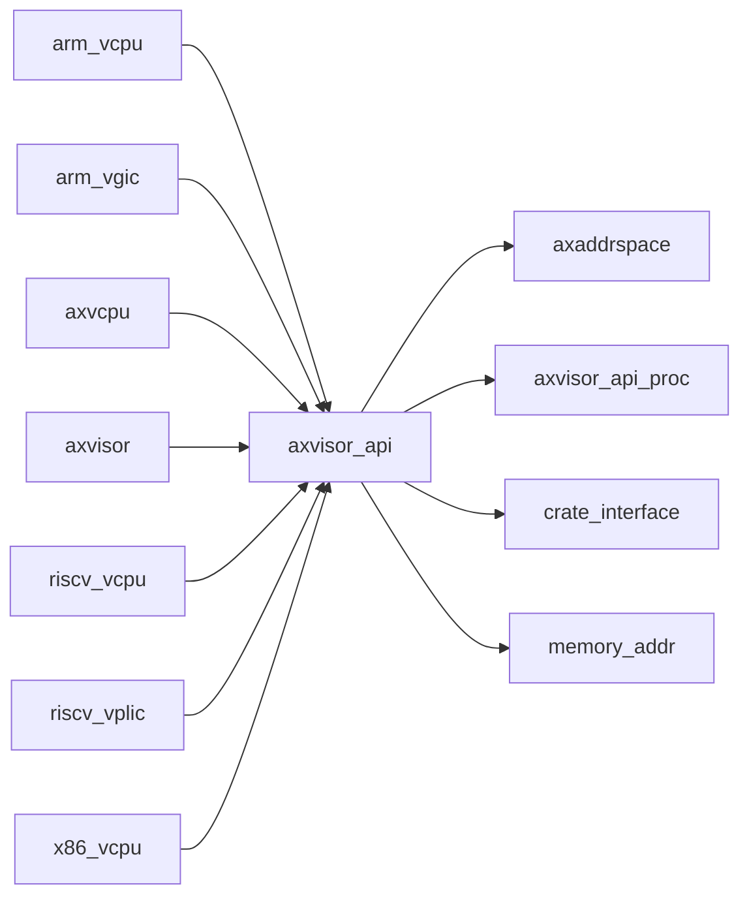

# `axvisor_api` 技术文档

> 路径：`components/axvisor_api`
> 类型：库 crate
> 分层：组件层 / 可复用基础组件
> 版本：`0.1.0`
> 文档依据：当前仓库源码、`Cargo.toml` 与 `components/axvisor_api/README.md`

`axvisor_api` 的核心定位是：Basic API for components of the Hypervisor on ArceOS

## 1. 架构设计分析
- 目录角色：可复用基础组件
- crate 形态：库 crate
- 工作区位置：子工作区 `components/axvisor_api`
- feature 视角：该 crate 没有显式声明额外 Cargo feature，功能边界主要由模块本身决定。
- 关键数据结构：可直接观察到的关键数据结构/对象包括 `AxMmHalApiImpl`、`PhysFrame`、`TimeValue`、`Nanos`、`Ticks`、`ALLOCATED`、`RETURNED_SUM`、`VA_PA_OFFSET`。
- 设计重心：该 crate 通常作为多个内核子系统共享的底层构件，重点在接口边界、数据结构和被上层复用的方式。

### 1.1 内部模块划分
- `test`：内部子模块（按条件编译启用）

### 1.2 核心算法/机制
- 该 crate 的实现主要围绕顶层模块分工展开，重点在子系统边界、trait/类型约束以及初始化流程。

## 2. 核心功能说明
- 功能定位：Basic API for components of the Hypervisor on ArceOS
- 对外接口：从源码可见的主要公开入口包括 `current_time_nanos`、`current_time`、`ticks_to_time`、`time_to_ticks`、`current_vm_vcpu_num`、`current_vm_active_vcpus`、`get_returned_sum`、`clear`、`AxMmHalApiImpl`。
- 典型使用场景：作为共享基础设施被多个 OS 子系统复用，常见场景包括同步、内存管理、设备抽象、接口桥接和虚拟化基础能力。
- 关键调用链示例：按当前源码布局，常见入口/初始化链可概括为 `alloc_frame()`。

## 3. 依赖关系图谱


### 3.1 直接与间接依赖
- `axaddrspace`
- `axvisor_api_proc`
- `crate_interface`
- `memory_addr`

### 3.2 间接本地依赖
- `axerrno`
- `lazyinit`
- `memory_set`
- `page_table_entry`
- `page_table_multiarch`

### 3.3 被依赖情况
- `arm_vcpu`
- `arm_vgic`
- `axvcpu`
- `axvisor`
- `riscv_vcpu`
- `riscv_vplic`
- `x86_vcpu`

### 3.4 间接被依赖情况
- `axdevice`
- `axvm`

### 3.5 关键外部依赖
- 当前依赖集合几乎完全来自仓库内本地 crate。

## 4. 开发指南
### 4.1 依赖配置
```toml
[dependencies]
axvisor_api = { workspace = true }

# 如果在仓库外独立验证，也可以显式绑定本地路径：
# axvisor_api = { path = "components/axvisor_api" }
```

### 4.2 初始化流程
1. 在 `Cargo.toml` 中接入该 crate，并根据需要开启相关 feature。
2. 若 crate 暴露初始化入口，优先调用 `init`/`new`/`build`/`start` 类函数建立上下文。
3. 在最小消费者路径上验证公开 API、错误分支与资源回收行为。

### 4.3 关键 API 使用提示
- 优先关注函数入口：`current_time_nanos`、`current_time`、`ticks_to_time`、`time_to_ticks`、`current_vm_vcpu_num`、`current_vm_active_vcpus`、`get_returned_sum`、`clear` 等（另有 2 项）。
- 上下文/对象类型通常从 `AxMmHalApiImpl` 等结构开始。

## 5. 测试策略
### 5.1 当前仓库内的测试形态
- 存在单元测试/`#[cfg(test)]` 场景：`src/lib.rs`。
- 存在示例程序：`examples/example.rs`，可作为冒烟验证入口。

### 5.2 单元测试重点
- 建议用单元测试覆盖公开 API、错误分支、边界条件以及并发/内存安全相关不变量。

### 5.3 集成测试重点
- 建议补充被 ArceOS/StarryOS/Axvisor 消费时的最小集成路径，确保接口语义与 feature 组合稳定。

### 5.4 覆盖率要求
- 覆盖率建议：核心算法与错误路径达到高覆盖，关键数据结构和边界条件应实现接近完整覆盖。

## 6. 跨项目定位分析
### 6.1 ArceOS
`axvisor_api` 更偏 ArceOS 生态的基础设施或公共模块；当前未观察到 ArceOS 本体对其存在显式直接依赖。

### 6.2 StarryOS
当前未检测到 StarryOS 工程本体对 `axvisor_api` 的显式本地依赖，若参与该系统，通常经外部工具链、配置或更底层生态间接体现。

### 6.3 Axvisor
`axvisor_api` 不在 Axvisor 目录内部，但被 `axvisor` 等 Axvisor crate 直接依赖，说明它是该系统的共享构件或底层服务。
