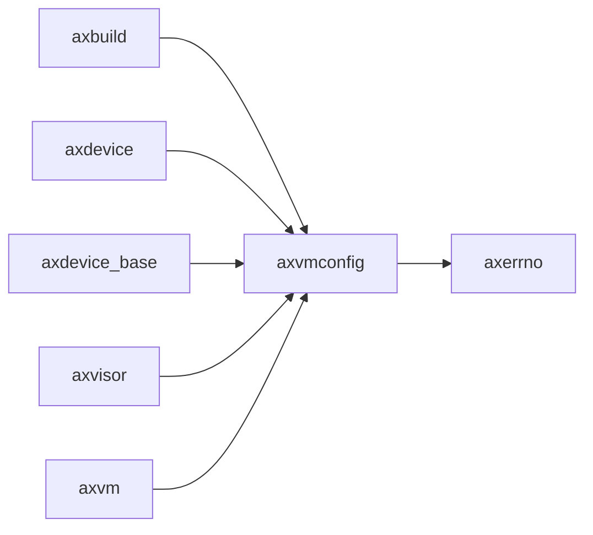

# `axvmconfig` 技术文档

> 路径：`components/axvmconfig`
> 类型：库 + 二进制混合 crate
> 分层：组件层 / 可复用基础组件
> 版本：`0.2.2`
> 文档依据：当前仓库源码、`Cargo.toml` 与 `components/axvmconfig/README.md`

`axvmconfig` 的核心定位是：A simple VM configuration tool for ArceOS-Hypervisor.

## 1. 架构设计分析
- 目录角色：可复用基础组件
- crate 形态：库 + 二进制混合 crate
- 工作区位置：根工作区
- feature 视角：主要通过 `std` 控制编译期能力装配。
- 关键数据结构：可直接观察到的关键数据结构/对象包括 `VmMemConfig`、`EmulatedDeviceConfig`、`PassThroughDeviceConfig`、`PassThroughAddressConfig`、`VMBaseConfig`、`VMKernelConfig`、`VMType`、`VmMemMappingType`、`EmulatedDeviceType`、`VMInterruptMode` 等（另有 2 个关键类型/对象）。
- 设计重心：该 crate 通常作为多个内核子系统共享的底层构件，重点在接口边界、数据结构和被上层复用的方式。

### 1.1 内部模块划分
- `test`：内部子模块（按条件编译启用）

### 1.2 核心算法/机制
- 静态配置建模、编译期注入或 TOML 解析

## 2. 核心功能说明
- 功能定位：A simple VM configuration tool for ArceOS-Hypervisor.
- 对外接口：从源码可见的主要公开入口包括 `removable`、`from_usize`、`from_toml`、`VmMemConfig`、`EmulatedDeviceConfig`、`PassThroughDeviceConfig`、`PassThroughAddressConfig`、`VMBaseConfig`、`VMKernelConfig`、`VMType` 等（另有 3 个公开入口）。
- 典型使用场景：作为共享基础设施被多个 OS 子系统复用，常见场景包括同步、内存管理、设备抽象、接口桥接和虚拟化基础能力。
- 关键调用链示例：该 crate 没有单一固定的初始化链，通常由上层调用者按 feature/trait 组合接入。

## 3. 依赖关系图谱


### 3.1 直接与间接依赖
- `axerrno`

### 3.2 间接本地依赖
- 未检测到额外的间接本地依赖，或依赖深度主要停留在第一层。

### 3.3 被依赖情况
- `axbuild`
- `axdevice`
- `axdevice_base`
- `axvisor`
- `axvm`

### 3.4 间接被依赖情况
- `arm_vcpu`
- `arm_vgic`
- `riscv_vplic`
- `tg-xtask`
- `x86_vcpu`

### 3.5 关键外部依赖
- `clap`
- `enumerable`
- `env_logger`
- `log`
- `schemars`
- `serde`
- `serde_repr`
- `toml`

## 4. 开发指南
### 4.1 依赖配置
```toml
[dependencies]
axvmconfig = { workspace = true }

# 如果在仓库外独立验证，也可以显式绑定本地路径：
# axvmconfig = { path = "components/axvmconfig" }
```

### 4.2 初始化流程
1. 在 `Cargo.toml` 中接入该 crate，并根据需要开启相关 feature。
2. 若 crate 暴露初始化入口，优先调用 `init`/`new`/`build`/`start` 类函数建立上下文。
3. 在最小消费者路径上验证公开 API、错误分支与资源回收行为。

### 4.3 关键 API 使用提示
- 优先关注函数入口：`removable`、`from_usize`、`from_toml`。
- 上下文/对象类型通常从 `VmMemConfig`、`EmulatedDeviceConfig`、`PassThroughDeviceConfig`、`PassThroughAddressConfig`、`VMBaseConfig`、`VMKernelConfig` 等（另有 2 项） 等结构开始。

## 5. 测试策略
### 5.1 当前仓库内的测试形态
- 存在单元测试/`#[cfg(test)]` 场景：`src/lib.rs`。

### 5.2 单元测试重点
- 建议用单元测试覆盖公开 API、错误分支、边界条件以及并发/内存安全相关不变量。

### 5.3 集成测试重点
- 建议补充被 ArceOS/StarryOS/Axvisor 消费时的最小集成路径，确保接口语义与 feature 组合稳定。

### 5.4 覆盖率要求
- 覆盖率建议：核心算法与错误路径达到高覆盖，关键数据结构和边界条件应实现接近完整覆盖。

## 6. 跨项目定位分析
### 6.1 ArceOS
`axvmconfig` 更偏 ArceOS 生态的基础设施或公共模块；当前未观察到 ArceOS 本体对其存在显式直接依赖。

### 6.2 StarryOS
当前未检测到 StarryOS 工程本体对 `axvmconfig` 的显式本地依赖，若参与该系统，通常经外部工具链、配置或更底层生态间接体现。

### 6.3 Axvisor
`axvmconfig` 不在 Axvisor 目录内部，但被 `axvisor` 等 Axvisor crate 直接依赖，说明它是该系统的共享构件或底层服务。
